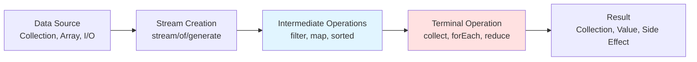
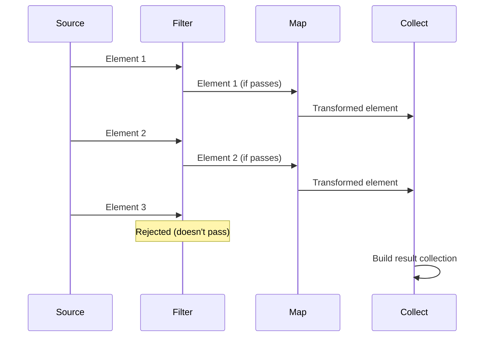

# Example Technical Document

This is a complete example document following all conventions from CLAUDE.md. Use this as a reference when writing new technical documents.

---

````markdown
---
title: Java Streams
category: Languages/Java
tags:
  - java
  - language-feature
  - functional-programming
  - java8
  - collections
difficulty: intermediate
status: evergreen
date-created: 2025-12-08
date-updated: 2026-01-13
sources:
  - https://docs.oracle.com/javase/8/docs/api/java/util/stream/Stream.html
  - https://www.oracle.com/technical-resources/articles/java/ma14-java-se-8-streams.html
---

# Java Streams

> [!summary]
> Streams provide a declarative way to process collections, enabling functional-style operations like map, filter, and reduce. Introduced in Java 8, they make code more concise and readable while supporting parallel processing for performance. Think of a stream as an assembly line where each operation transforms data as it flows through.

## Quick Reference

| Operation | Type | Description | Example |
|-----------|------|-------------|---------|
| `stream()` | Source | Create stream from collection | `list.stream()` |
| `filter(Predicate)` | Intermediate | Keep elements matching condition | `.filter(x -> x > 0)` |
| `map(Function)` | Intermediate | Transform each element | `.map(String::toUpperCase)` |
| `flatMap(Function)` | Intermediate | Flatten nested streams | `.flatMap(Collection::stream)` |
| `distinct()` | Intermediate | Remove duplicates | `.distinct()` |
| `sorted()` | Intermediate | Sort elements | `.sorted()` |
| `limit(n)` | Intermediate | Take first n elements | `.limit(10)` |
| `skip(n)` | Intermediate | Skip first n elements | `.skip(5)` |
| `collect(Collector)` | Terminal | Collect to collection | `.collect(Collectors.toList())` |
| `forEach(Consumer)` | Terminal | Perform action on each | `.forEach(System.out::println)` |
| `reduce(BinaryOperator)` | Terminal | Combine elements | `.reduce(0, Integer::sum)` |
| `count()` | Terminal | Count elements | `.count()` |
| `anyMatch(Predicate)` | Terminal | Check if any match | `.anyMatch(x -> x > 10)` |
| `allMatch(Predicate)` | Terminal | Check if all match | `.allMatch(x -> x > 0)` |
| `noneMatch(Predicate)` | Terminal | Check if none match | `.noneMatch(x -> x < 0)` |
| `findFirst()` | Terminal | Get first element | `.findFirst()` |
| `findAny()` | Terminal | Get any element | `.findAny()` |

## What Are Streams?

Before Java 8, processing collections required explicit loops:

```java
List<String> names = Arrays.asList("Alice", "Bob", "Charlie", "David");
List<String> filtered = new ArrayList<>();

for (String name : names) {
    if (name.length() > 4) {
        filtered.add(name.toUpperCase());
    }
}
```

**Streams** provide a declarative alternative — you describe *what* you want, not *how* to do it:

```java
List<String> filtered = names.stream()
    .filter(name -> name.length() > 4)
    .map(String::toUpperCase)
    .collect(Collectors.toList());
```

Introduced in Java 8, streams enable functional-style operations on sequences of elements. They're not data structures but views over data sources (collections, arrays, I/O channels).

## How Streams Work



**Key Concepts:**

1. **Source** — Where data comes from (collection, array, generator)
2. **Intermediate operations** — Transform or filter (lazy, chainable)
3. **Terminal operation** — Triggers execution and produces result
4. **Laziness** — Operations only execute when terminal operation is called
5. **Stateless vs stateful** — Most operations don't need to remember previous elements



## Practical Examples

### Basic Usage

```java
import java.util.*;
import java.util.stream.*;

public class StreamBasics {
    public static void main(String[] args) {
        List<Integer> numbers = Arrays.asList(1, 2, 3, 4, 5, 6, 7, 8, 9, 10);

        // Filter even numbers and collect to list
        List<Integer> evens = numbers.stream()
            .filter(n -> n % 2 == 0)
            .collect(Collectors.toList());

        System.out.println(evens);  // [2, 4, 6, 8, 10]

        // Calculate sum of squares
        int sumOfSquares = numbers.stream()
            .map(n -> n * n)
            .reduce(0, Integer::sum);

        System.out.println(sumOfSquares);  // 385
    }
}
```

**Key Points:**
- `stream()` creates a stream from the list
- `filter()` keeps only elements matching the predicate
- `map()` transforms each element
- `collect()` and `reduce()` are terminal operations that trigger execution

### Intermediate Example

```java
import java.util.*;
import java.util.stream.*;

public class UserProcessing {
    static class User {
        String name;
        int age;
        String city;

        User(String name, int age, String city) {
            this.name = name;
            this.age = age;
            this.city = city;
        }

        String getName() { return name; }
        int getAge() { return age; }
        String getCity() { return city; }
    }

    public static void main(String[] args) {
        List<User> users = Arrays.asList(
            new User("Alice", 25, "NYC"),
            new User("Bob", 30, "LA"),
            new User("Charlie", 35, "NYC"),
            new User("David", 28, "Chicago"),
            new User("Eve", 32, "NYC")
        );

        // Find names of users in NYC, aged 30+, sorted alphabetically
        List<String> nycSeniors = users.stream()
            .filter(user -> "NYC".equals(user.getCity()))  // Only NYC
            .filter(user -> user.getAge() >= 30)           // Aged 30+
            .map(User::getName)                             // Extract names
            .sorted()                                       // Sort alphabetically
            .collect(Collectors.toList());

        System.out.println(nycSeniors);  // [Charlie, Eve]

        // Group users by city
        Map<String, List<User>> usersByCity = users.stream()
            .collect(Collectors.groupingBy(User::getCity));

        System.out.println(usersByCity.keySet());  // [NYC, LA, Chicago]

        // Count users per city
        Map<String, Long> counts = users.stream()
            .collect(Collectors.groupingBy(User::getCity, Collectors.counting()));

        System.out.println(counts);  // {NYC=3, LA=1, Chicago=1}
    }
}
```

**Pattern Explanation:**
- Method references (`User::getName`) are shorthand for lambdas
- Chaining multiple `filter()` calls is more readable than complex conditions
- `Collectors.groupingBy()` enables SQL-like GROUP BY operations
- Streams integrate seamlessly with existing collections

### Advanced Usage

```java
import java.util.*;
import java.util.stream.*;

public class AdvancedStreams {
    public static void main(String[] args) {
        // Parallel stream for heavy computation
        List<Integer> largeList = IntStream.rangeClosed(1, 1_000_000)
            .boxed()
            .collect(Collectors.toList());

        long start = System.currentTimeMillis();

        // Sequential stream
        long sum = largeList.stream()
            .filter(n -> n % 2 == 0)
            .mapToLong(n -> (long) n * n)
            .sum();

        long sequential = System.currentTimeMillis() - start;
        System.out.println("Sequential: " + sequential + "ms, Sum: " + sum);

        start = System.currentTimeMillis();

        // Parallel stream (automatically uses multiple cores)
        sum = largeList.parallelStream()
            .filter(n -> n % 2 == 0)
            .mapToLong(n -> (long) n * n)
            .sum();

        long parallel = System.currentTimeMillis() - start;
        System.out.println("Parallel: " + parallel + "ms, Sum: " + sum);

        // FlatMap: Flatten nested structures
        List<List<Integer>> nestedList = Arrays.asList(
            Arrays.asList(1, 2, 3),
            Arrays.asList(4, 5),
            Arrays.asList(6, 7, 8, 9)
        );

        List<Integer> flattened = nestedList.stream()
            .flatMap(Collection::stream)  // Flatten List<List<Integer>> -> Stream<Integer>
            .collect(Collectors.toList());

        System.out.println(flattened);  // [1, 2, 3, 4, 5, 6, 7, 8, 9]

        // Custom collector: Join with custom format
        String formatted = IntStream.rangeClosed(1, 5)
            .mapToObj(String::valueOf)
            .collect(Collectors.joining(", ", "[", "]"));

        System.out.println(formatted);  // [1, 2, 3, 4, 5]

        // Infinite stream with limit
        List<Integer> fibonacci = Stream.iterate(new int[]{0, 1}, f -> new int[]{f[1], f[0] + f[1]})
            .limit(10)
            .map(f -> f[0])
            .collect(Collectors.toList());

        System.out.println(fibonacci);  // [0, 1, 1, 2, 3, 5, 8, 13, 21, 34]
    }
}
```

**Advanced Techniques:**
- **Parallel streams** automatically distribute work across cores
- **flatMap()** flattens nested collections or Optional values
- **Custom collectors** enable complex aggregations
- **Infinite streams** with `Stream.iterate()` or `Stream.generate()`
- **Primitive streams** (`IntStream`, `LongStream`, `DoubleStream`) avoid boxing overhead

## Common Patterns

> [!tip] Use Method References for Clarity
> When a lambda just calls a method, use method references for conciseness.

✅ **Good:**
```java
names.stream()
    .map(String::toUpperCase)
    .forEach(System.out::println);
```

❌ **Less clear:**
```java
names.stream()
    .map(name -> name.toUpperCase())
    .forEach(name -> System.out.println(name));
```

> [!tip] Chain Operations for Readability
> Break complex pipelines into multiple lines, one operation per line.

✅ **Good:**
```java
users.stream()
    .filter(user -> user.isActive())
    .filter(user -> user.getAge() >= 18)
    .map(User::getEmail)
    .distinct()
    .sorted()
    .collect(Collectors.toList());
```

❌ **Hard to read:**
```java
users.stream().filter(user -> user.isActive()).filter(user -> user.getAge() >= 18).map(User::getEmail).distinct().sorted().collect(Collectors.toList());
```

> [!warning] Don't Reuse Streams
> Streams can only be consumed once. Attempting to reuse throws IllegalStateException.

❌ **Bad:**
```java
Stream<String> stream = list.stream();
stream.forEach(System.out::println);
stream.count();  // IllegalStateException: stream has already been operated upon
```

✅ **Good:**
```java
list.stream().forEach(System.out::println);
long count = list.stream().count();  // Create new stream
```

> [!warning] Avoid Stateful Lambdas
> Lambdas in stream operations should be stateless and non-interfering.

❌ **Bad:**
```java
List<Integer> results = new ArrayList<>();
stream.filter(x -> {
    results.add(x);  // Side effect in filter!
    return x > 10;
});
```

✅ **Good:**
```java
List<Integer> results = stream
    .filter(x -> x > 10)
    .collect(Collectors.toList());
```

## Edge Cases & Gotchas

- **One-time use:** Streams can't be reused after a terminal operation. Create a new stream if needed.
- **Parallel stream ordering:** `parallelStream()` may not maintain encounter order unless using `forEachOrdered()`.
- **Exception handling:** Lambdas can't throw checked exceptions directly — wrap in unchecked or use helper methods.
- **Performance:** Streams have overhead — for small collections (<100 elements), traditional loops may be faster.
- **Short-circuit operations:** `findFirst()`, `findAny()`, `anyMatch()` stop processing as soon as result is determined.
- **Stateful operations:** `distinct()`, `sorted()`, `limit()`, `skip()` require maintaining state, which can impact parallel performance.
- **Null elements:** Streams don't handle nulls well — use `Objects.requireNonNull()` or filter nulls explicitly.
- **Primitive streams:** Use `IntStream`, `LongStream`, `DoubleStream` to avoid boxing/unboxing overhead for numeric operations.

## Related Topics

- [[Lambdas]] — Lambda expressions power stream operations
- [[Functional-Interfaces]] — Predicate, Function, Consumer used in streams
- [[Optional]] — Streams integrate with Optional for null safety
- [[Collections]] — Stream sources and collection destinations
- [[Languages/Java/_Index]] — Java features index

## References

- [Java Stream API Documentation](https://docs.oracle.com/javase/8/docs/api/java/util/stream/Stream.html)
- [Java SE 8 Streams Tutorial](https://www.oracle.com/technical-resources/articles/java/ma14-java-se-8-streams.html)
- Bloch, Joshua. *Effective Java*, 3rd ed. Item 45-48: Use streams judiciously
- [Stream Guide](https://winterbe.com/posts/2014/07/31/java8-stream-tutorial-examples/)
````

---

## What This Example Demonstrates

**Frontmatter:**
- Complete YAML with all required fields
- Hierarchical category path
- Multiple relevant tags
- Appropriate difficulty and status
- Creation and update dates
- Authoritative sources

**Document Structure:**
1. **Summary callout** — 3-5 sentences, explains what/why/when
2. **Quick Reference** — Table of common methods (appropriate for API-heavy topic)
3. **Theory sections** — "What Are Streams?" and "How Streams Work" with diagrams
4. **Practical Examples** — 3 examples with clear progression
5. **Common Patterns** — Tips and warnings with code examples
6. **Edge Cases** — Comprehensive list of gotchas
7. **Related Topics** — Cross-references with wiki-links
8. **References** — Mix of official docs, tutorials, and books

**Writing Style:**
- Clear, direct explanations
- Analogies ("assembly line")
- Educational tone without condescension
- Technical precision with correct terminology
- Conversational professionalism

**Visual Elements:**
- Mermaid flowchart for process flow
- Mermaid sequence diagram for operation execution
- Tables for API reference
- Code blocks with proper syntax highlighting
- Callouts for tips and warnings

**Code Examples:**
- All runnable with imports
- Comments explain key points
- Progression from simple to complex
- Real-world scenarios
- Both ✅ good and ❌ bad examples

**Best Practices:**
- Method references over lambdas
- One operation per line for readability
- Avoiding common mistakes explicitly documented