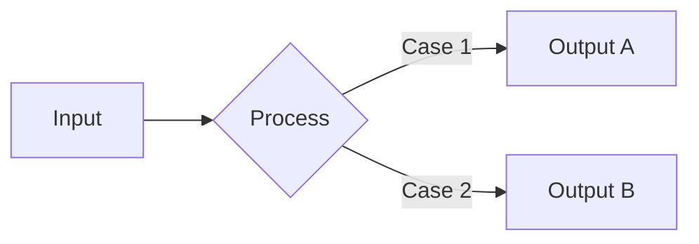
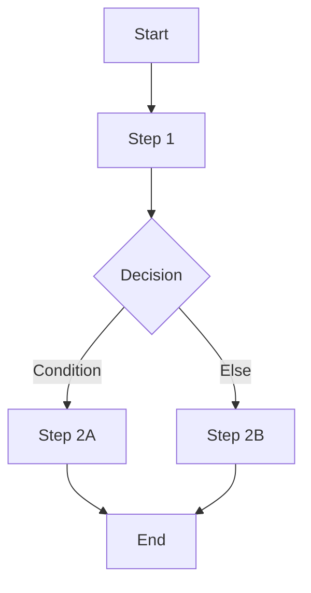
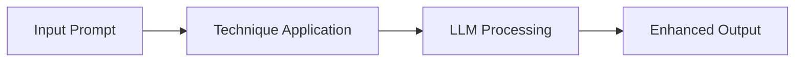
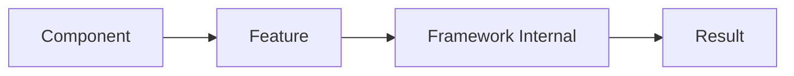

# Document Templates

Complete templates for different document types in the Obsidian knowledge base.

## Standard Technical Document Template

Use this template for language features, design patterns, algorithms, data structures, and general technical concepts.

````markdown
---
title: Topic Name
category: Category/Subcategory  # e.g., Languages/Java or Concepts/Algorithms
tags:
  - primary-tag
  - secondary-tag
  - feature-type-tag
difficulty: beginner  # beginner | intermediate | advanced
status: seed  # seed | growing | evergreen
date-created: YYYY-MM-DD
date-updated: YYYY-MM-DD
sources:
  - https://official-documentation-url
  - https://additional-reference
---

# Topic Name

> [!summary]
> One concise paragraph (3-5 sentences) explaining what the topic is, why it matters, and when to use it. This should give readers immediate value and context.

## Quick Reference

[Optional section — Include for reference-heavy topics like APIs, CLI tools, or complex libraries]

| Method/Command | Returns/Output | Description |
|----------------|----------------|-------------|
| `method()` | Type | What it does |
| `command --flag` | Output | What it does |

## What Is [Topic]?

[Clear definition and conceptual overview. Answer: "What problem does this solve?" and "Why does this exist?"]

[Include historical context if relevant, e.g., "Introduced in Java 8" or "Developed by Edsger Dijkstra in 1959"]

## How It Works

[Implementation details and design philosophy]



[Explain the diagram and key mechanisms]

## Practical Examples

### Basic Usage

[Simple "Hello World" level example introducing the core concept]

```language
// Minimal working example with inline comments
code_example();
```

**Explanation:**
- What this code does
- Key points to notice

### Intermediate Example

[Real-world pattern showing common use case]

```language
// More realistic scenario
function real_world_example() {
    // Step 1: Setup
    // Step 2: Process
    // Step 3: Return result
}
```

**Explanation:**
- When to use this pattern
- Trade-offs and considerations

### Advanced Usage

[Complex scenario with edge cases or combinations]

```language
// Advanced pattern combining multiple techniques
class AdvancedExample {
    // Sophisticated implementation
}
```

**Explanation:**
- Why this approach is needed
- Performance implications
- Alternative approaches

## Common Patterns

> [!tip] Best Practice Title
> Explanation of recommended approach and why it's preferred.

✅ **Good:**
```language
// Clean, recommended approach
recommended_pattern();
```

❌ **Bad:**
```language
// Anti-pattern to avoid
antipattern();
```

**Why:** Explanation of why one is better than the other.

> [!warning] Common Mistake
> Description of mistake developers frequently make.

[Include 2-3 patterns/tips/warnings]

## Edge Cases & Gotchas

- **Edge Case Name:** Description of the edge case and how to handle it
- **Thread Safety:** Thread safety considerations if applicable
- **Null Handling:** How nulls are handled or cause issues
- **Performance:** When performance degrades or special considerations
- **Memory Usage:** Memory implications if significant
- **Serialization:** Serialization quirks if applicable

[List 3-5 important gotchas]

## Related Topics

- [[Related-Topic-1]] — Brief description of relationship
- [[Related-Topic-2]] — Brief description of relationship
- [[Category/_Index]] — Link to category index

## References

- [Official Documentation](https://official-url)
- [Tutorial or Guide](https://tutorial-url)
- [Academic Paper](https://arxiv.org/...) (if applicable)
- Book: *Author. Title.* Edition. Publisher, Year. ISBN or Item Number.
````

## Index File Template

Use this template for category index files (`_Index.md`).

````markdown
---
title: Category Name Index
category: Category/Path
tags:
  - index
  - category-tag
date-created: YYYY-MM-DD
date-updated: YYYY-MM-DD
---

# Category Name

> [!summary]
> Overview paragraph (3-5 sentences) describing this category, its scope, and its learning value. Explain what topics are covered and why they matter.

## Overview

[2-3 paragraphs providing context about this category]

[Explain the organization of topics within this category]

## Learning Path

### Beginner

[Topics suitable for those new to this category]

- [[Topic-One]] — Brief description (1 sentence)
- [[Topic-Two]] — Brief description (1 sentence)
- [[Topic-Three]] — Brief description (1 sentence)

### Intermediate

[Topics requiring foundational knowledge]

- [[Topic-Four]] — Brief description (1 sentence)
- [[Topic-Five]] — Brief description (1 sentence)

### Advanced

[Complex topics for experienced learners]

- [[Topic-Six]] — Brief description (1 sentence)
- [[Topic-Seven]] — Brief description (1 sentence)

## Topics

### Subcategory Name

| Topic | Difficulty | Status | Description |
|-------|-----------|--------|-------------|
| [[Topic-A]] | Beginner | 🌳 Evergreen | Short description |
| [[Topic-B]] | Intermediate | 🌿 Growing | Short description |
| [[Topic-C]] | Advanced | 🌱 Seed | Short description |

### Another Subcategory

| Topic | Difficulty | Status | Description |
|-------|-----------|--------|-------------|
| [[Topic-D]] | Beginner | 🌳 Evergreen | Short description |

## Recently Updated

```dataview
TABLE date-updated as "Last Updated"
FROM "Category/Path"
SORT date-updated DESC
LIMIT 5
```

## Quick Reference

[Category-specific quick reference material — could be a table summarizing key concepts, a comparison chart, or a glossary]

| Concept | Key Points | When to Use |
|---------|-----------|-------------|
| Concept 1 | Summary | Use case |
| Concept 2 | Summary | Use case |

## Related Categories

- [[Other-Category/_Index]] — Relationship description
- [[Another-Category/_Index]] — Relationship description
````

## Algorithm/Data Structure Template

Specialized template for algorithms and data structures with emphasis on complexity analysis.

````markdown
---
title: Algorithm/Data Structure Name
category: Concepts/Algorithms  # or Concepts/Data-Structures
tags:
  - algorithm  # or data-structure
  - subcategory-tag
  - complexity-tag
difficulty: beginner  # or intermediate/advanced
status: seed
date-created: YYYY-MM-DD
date-updated: YYYY-MM-DD
sources:
  - https://source-url
---

# Algorithm/Data Structure Name

> [!summary]
> Concise explanation of what this algorithm/structure does, its key characteristic, and when to use it. Mention its primary advantage (e.g., "fastest for sorted data" or "minimal memory overhead").

## Quick Reference

### Time Complexity

| Operation | Best Case | Average Case | Worst Case |
|-----------|-----------|--------------|------------|
| Search | O(1) | O(log n) | O(n) |
| Insert | O(1) | O(log n) | O(n) |
| Delete | O(1) | O(log n) | O(n) |

### Space Complexity

- **Storage:** O(n)
- **Auxiliary:** O(log n)

## What Is [Name]?

[Definition and conceptual explanation]

[Historical context if notable: "Developed by X in year Y"]

## How It Works



[Explanation of the algorithm/structure mechanics]

[Visual representation using Mermaid for structure layout if applicable]

## Practical Examples

### Basic Implementation

```language
// Simple, educational implementation
function basic_implementation(data) {
    // Core algorithm logic with comments
}
```

**Complexity Analysis:**
- Time: O(?) — Explanation
- Space: O(?) — Explanation

### Optimized Implementation

```language
// Production-ready optimized version
function optimized_implementation(data) {
    // Optimizations explained in comments
}
```

**Improvements:**
- What was optimized
- Impact on complexity
- Trade-offs made

### Real-World Usage

```language
// Practical application example
function real_world_scenario(data) {
    // How it's actually used in production
}
```

## Performance Analysis

### Time Complexity

**Best Case: O(?)**
- Conditions when best case occurs
- Example scenario

**Average Case: O(?)**
- Expected performance
- Assumptions made

**Worst Case: O(?)**
- Conditions when worst case occurs
- How to avoid or mitigate

### Space Complexity

- **Input storage:** O(?)
- **Auxiliary space:** O(?)
- **Total:** O(?)

[Explain memory usage patterns]

### When to Use

- ✅ Ideal when: [conditions]
- ✅ Better than X when: [conditions]
- ⚠️ Consider alternatives when: [conditions]
- ❌ Avoid when: [conditions]

## Trade-offs

| Aspect | Advantage | Disadvantage |
|--------|-----------|--------------|
| Time | Fast for X | Slow for Y |
| Space | Low memory for Z | High memory for W |
| Implementation | Simple to code | Complex edge cases |

## Common Patterns

> [!tip] Optimization Technique
> How to optimize for common scenarios

> [!warning] Common Pitfall
> Mistake to avoid and why

## Edge Cases & Gotchas

- **Empty input:** How to handle
- **Single element:** Special case behavior
- **Duplicates:** How duplicates are treated
- **Sorted vs unsorted:** Impact on performance
- **Large datasets:** Scalability considerations

## Related Topics

- [[Related-Algorithm]] — Comparison or relationship
- [[Related-Data-Structure]] — Used together or alternative
- [[Big-O-Notation]] — Understanding complexity
- [[Concepts/Algorithms/_Index]] — Algorithm index

## References

- [Algorithm visualization](https://visualgo.net/...)
- [Academic paper](https://arxiv.org/...)
- Cormen, et al. *Introduction to Algorithms*, 3rd ed. Chapter X.
- [Wikipedia article](https://en.wikipedia.org/...)
````

## Prompting Technique Template

Specialized template for AI/LLM prompting techniques.

````markdown
---
title: Prompting Technique Name
category: Concepts/Prompting-Techniques
tags:
  - prompting
  - llm
  - technique-type
difficulty: beginner  # or intermediate/advanced
status: seed
date-created: YYYY-MM-DD
date-updated: YYYY-MM-DD
sources:
  - https://research-paper-url
  - https://documentation-url
---

# Prompting Technique Name

> [!summary]
> Concise explanation (3-5 sentences) of what this technique does, the problem it solves, and when to use it. Mention key benefits like improved accuracy, reasoning, or output quality.

## What Is [Technique Name]?

[Definition and conceptual overview]

[Research context: "First introduced in [Paper] by [Researchers] at [Institution]"]

## How It Works



[Explanation of the mechanism and why it improves results]

## When to Use

- ✅ **Ideal for:** [Specific use cases]
- ✅ **Better than alternatives when:** [Conditions]
- ⚠️ **Consider alternatives when:** [Conditions]
- ❌ **Not suitable for:** [Conditions]

## Practical Examples

### Basic Example

**Without technique:**
```
User: [Simple prompt]

LLM: [Suboptimal response]
```

**With technique:**
```
User: [Prompt using technique]

LLM: [Improved response]
```

**Analysis:**
- Why the technique improved the output
- Key differences in response quality

### Intermediate Example

**Task:** [More complex real-world scenario]

**Prompt:**
```
[Full prompt using the technique]
```

**Output:**
```
[Expected high-quality output]
```

**Explanation:**
- How the technique was applied
- Why it works for this scenario

### Advanced Example

**Complex Task:** [Challenging use case]

**Prompt:**
```
[Sophisticated prompt combining technique with other strategies]
```

**Output:**
```
[Detailed output demonstrating technique effectiveness]
```

**Explanation:**
- Advanced application patterns
- Combination with other techniques

## Best Practices

> [!tip] Optimization Tip
> How to get the most out of this technique

> [!tip] Combination Strategy
> Works well when combined with [Other Technique]

## Common Pitfalls

> [!warning] Common Mistake
> What developers often do wrong when using this technique

❌ **Bad:**
```
[Example of incorrect usage]
```

✅ **Good:**
```
[Example of correct usage]
```

## Variations

### Variation 1: [Name]
[Description and when to use]

### Variation 2: [Name]
[Description and when to use]

## Performance Considerations

- **Token usage:** Impact on context length
- **Response time:** Computational overhead
- **Accuracy improvement:** Measured benefits
- **Cost:** API usage implications

## Related Topics

- [[Related-Technique]] — Similar or complementary technique
- [[Another-Technique]] — Alternative approach
- [[Concepts/Prompting-Techniques/_Index]] — Prompting techniques index

## References

- [Research Paper](https://arxiv.org/...) — Original paper introducing technique
- [Model Documentation](https://docs.anthropic.com/...) — Official documentation
- [Blog Post](https://www.anthropic.com/...) — Practical guide
- [GitHub Examples](https://github.com/...) — Code examples
````

## Shell/CLI Tool Template

Specialized template for shell commands and CLI tools.

````markdown
---
title: Command/Tool Name
category: Languages/Shell
tags:
  - shell
  - cli
  - command-type
difficulty: beginner  # or intermediate/advanced
status: seed
date-created: YYYY-MM-DD
date-updated: YYYY-MM-DD
sources:
  - https://man-page-url
  - https://tool-documentation-url
---

# Command/Tool Name

> [!summary]
> Concise explanation (3-5 sentences) of what this command/tool does, its primary use case, and why it's useful. Mention common alternatives and when to use this over others.

## Quick Reference

### Common Flags

| Flag | Description | Example |
|------|-------------|---------|
| `-a` | What it does | `command -a file` |
| `-r` | What it does | `command -r dir/` |
| `--long` | What it does | `command --long input` |

### Common Patterns

```bash
# Pattern 1: Brief description
command pattern1

# Pattern 2: Brief description
command pattern2 | other_command

# Pattern 3: Brief description
command --flag "argument"
```

## What Is [Command]?

[Definition and purpose]

[Historical context if notable]

## How It Works

[Explanation of mechanics and common use cases]

## Practical Examples

### Basic Usage

```bash
# Simple, common use case
command input
```

**Output:**
```
expected output
```

**Explanation:**
- What happened
- Key points to notice

### Intermediate Example

```bash
# More complex real-world pattern
command --flag1 input | grep pattern | command2
```

**Output:**
```
expected output
```

**Explanation:**
- How the pipeline works
- When to use this pattern

### Advanced Usage

```bash
# Complex scenario with multiple flags and chaining
find . -name "*.txt" -exec command {} \; | \
  command2 --option | \
  command3 > output.txt
```

**Explanation:**
- Breaking down the complex command
- Performance considerations

## Common Patterns

> [!tip] Best Practice
> Recommended usage pattern and why

```bash
# Recommended approach
command --safe-flag input
```

> [!warning] Common Mistake
> What to avoid and why

❌ **Bad:**
```bash
# Dangerous or inefficient pattern
command unsafe_pattern
```

✅ **Good:**
```bash
# Safe and efficient pattern
command safe_pattern
```

## Flags & Options

### Essential Flags

- **`-a, --all`** — Description of what this does
- **`-v, --verbose`** — Description of what this does
- **`-r, --recursive`** — Description of what this does

### Advanced Options

- **`--complex-option=value`** — When and why to use
- **`--advanced-flag`** — Edge case handling

## Edge Cases & Gotchas

- **Special characters:** How to escape or quote
- **Large files:** Performance implications
- **Permissions:** Common permission errors
- **Cross-platform:** Differences between Linux/macOS/BSD
- **Edge case:** Specific scenario to watch for

## Related Topics

- [[Related-Command]] — Alternative or complementary command
- [[Shell-Scripting]] — Using in scripts
- [[Languages/Shell/_Index]] — Shell commands index

## References

- [Man page](https://linux.die.net/man/...)
- [Official documentation](https://tool-url)
- [Tutorial](https://tutorial-url)
````

## Framework/Library Feature Template

Template for framework-specific features (React, Spring, etc.).

````markdown
---
title: Framework Feature Name
category: Frameworks/FrameworkName
tags:
  - framework-name
  - feature-type
  - related-concept
difficulty: beginner  # or intermediate/advanced
status: seed
date-created: YYYY-MM-DD
date-updated: YYYY-MM-DD
sources:
  - https://official-documentation-url
  - https://additional-reference
---

# Framework Feature Name

> [!summary]
> Concise explanation (3-5 sentences) of what this feature does, the problem it solves in the framework context, and when to use it. Mention version introduced and key benefits.

## Quick Reference

### Key APIs/Methods

| API | Purpose | Common Usage |
|-----|---------|--------------|
| `api()` | What it does | When to use |
| `method()` | What it does | When to use |

## What Is [Feature]?

[Definition in framework context]

[Version info: "Introduced in Framework X.Y"]

## How It Works



[Explanation of mechanics within the framework]

## Practical Examples

### Basic Usage

```language
// Minimal working example
function basicExample() {
    // Framework-specific code
}
```

**When to use:** [Scenario description]

### Intermediate Example

```language
// Real-world pattern
function intermediateExample() {
    // More realistic implementation
}
```

**Pattern explanation:**
- Why this pattern is common
- Best practices applied

### Advanced Usage

```language
// Complex scenario with optimization
function advancedExample() {
    // Sophisticated implementation
}
```

**Advanced considerations:**
- Performance optimizations
- Edge case handling

## Common Patterns

> [!tip] Framework Best Practice
> Recommended pattern within this framework ecosystem

> [!warning] Framework Gotcha
> Common mistake specific to this framework

## Integration with Other Features

- **Feature A:** How they work together
- **Feature B:** Interaction patterns
- **Feature C:** Complementary use cases

## Edge Cases & Gotchas

- **Framework version:** Version-specific behaviors
- **Configuration:** Config gotchas
- **Performance:** Framework-specific performance considerations
- **Testing:** How to test code using this feature

## Related Topics

- [[Related-Framework-Feature]] — Related feature
- [[Frameworks/FrameworkName/_Index]] — Framework index
- [[Design-Pattern]] — Underlying pattern

## References

- [Official Documentation](https://framework.com/docs/...)
- [API Reference](https://framework.com/api/...)
- [GitHub Examples](https://github.com/...)
- [Community Guide](https://community-url)
````

## Template Selection Guide

Use this guide to choose the appropriate template:

| Document Type | Template to Use |
|--------------|-----------------|
| Language feature (Java, Python) | Standard Technical Document |
| Design pattern | Standard Technical Document |
| Algorithm | Algorithm/Data Structure Template |
| Data structure | Algorithm/Data Structure Template |
| Shell command/CLI tool | Shell/CLI Tool Template |
| Framework feature (React, Spring) | Framework/Library Feature Template |
| Prompting technique | Prompting Technique Template |
| Category index | Index File Template |

## Customization Guidelines

All templates can be adapted as needed:

1. **Optional sections can be omitted** if not applicable (e.g., "Thread Safety" for single-threaded topics)
2. **Additional sections can be added** for specialized topics (e.g., "Security Considerations" for auth features)
3. **Section order is flexible** but should maintain logical flow
4. **Always keep the 7 core sections** for standard documents:
   - Summary
   - Theory (What/How)
   - Quick Reference (optional)
   - Examples (3+)
   - Common Patterns
   - Edge Cases
   - Related Topics/References