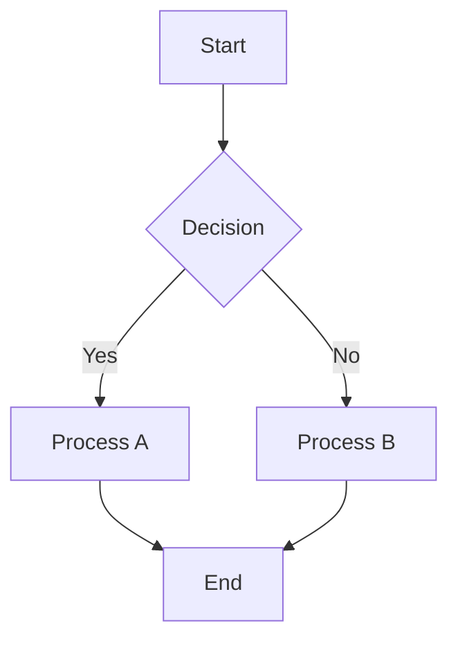
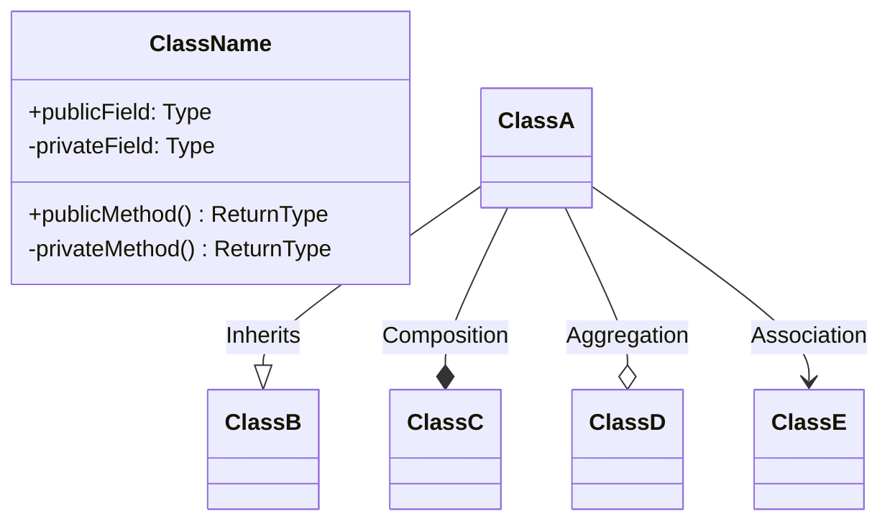
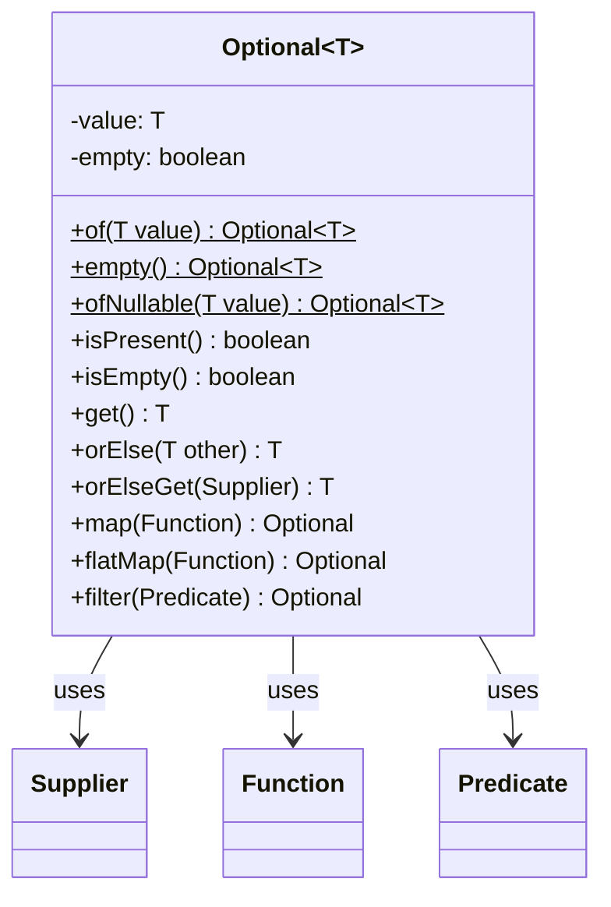
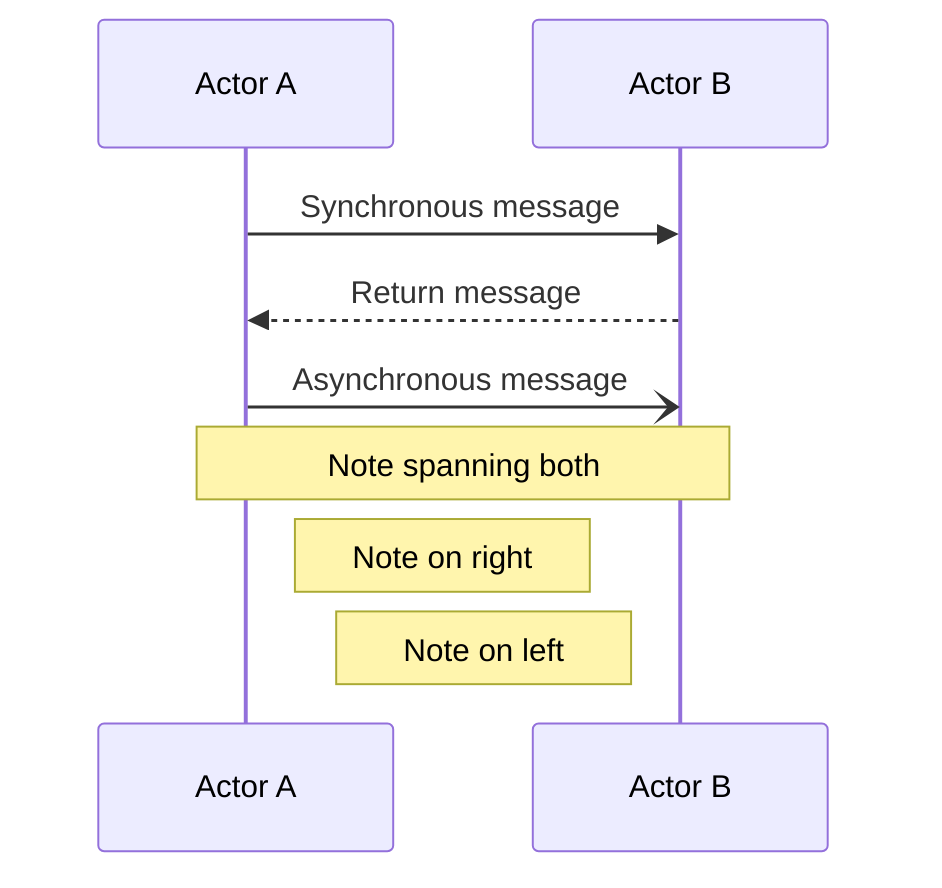
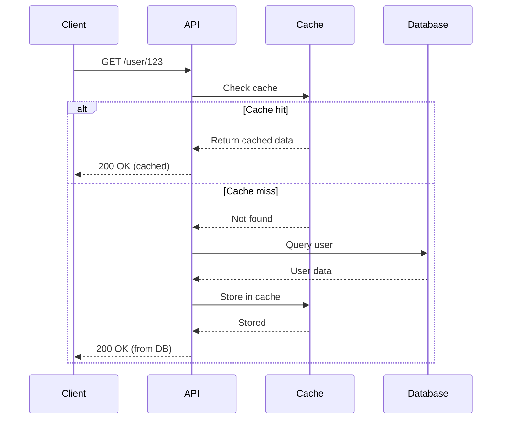
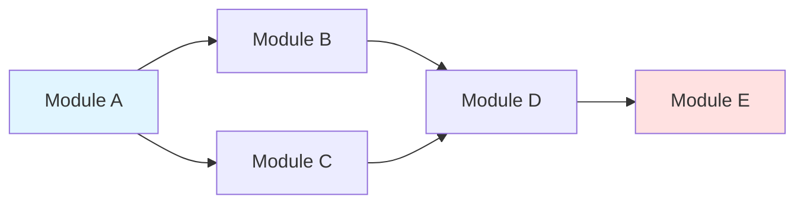
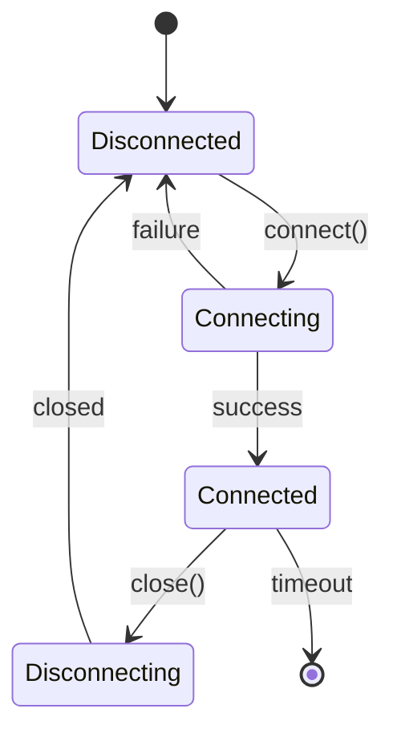
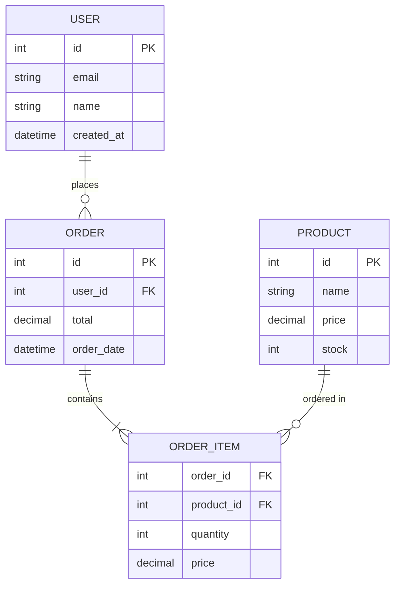
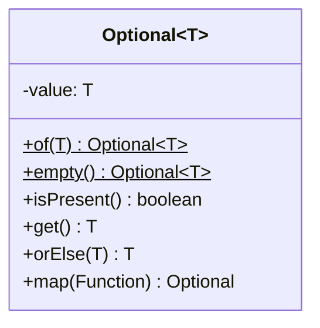

# Visual Elements Guide

Comprehensive guide for creating diagrams, tables, and mathematical notation in technical documentation.

## Mermaid Diagrams

Mermaid is a text-based diagramming tool that renders into visual diagrams in Obsidian. Use it for flowcharts, class diagrams, sequence diagrams, and more.

### Flowchart Diagrams

Use flowcharts for algorithms, process flows, and decision trees.

**Basic Syntax:**
````markdown

````

**Direction Options:**
- `TD` or `TB` — Top to bottom (default)
- `LR` — Left to right
- `RL` — Right to left
- `BT` — Bottom to top

**Node Shapes:**
- `[Text]` — Rectangle (process/statement)
- `(Text)` — Rounded rectangle (start/end)
- `{Text}` — Diamond (decision)
- `((Text))` — Circle (connector)
- `[[Text]]` — Subroutine shape
- `[(Text)]` — Cylindrical (database)
- `((Text))` — Double circle

**Example: Algorithm Flow:**
````markdown
```mermaid
flowchart TD
    Start([Start]) --> Input[Read Array]
    Input --> Init[Initialize: left = 0, right = n-1]
    Init --> Check{left <= right?}
    Check -->|No| NotFound[Return -1]
    Check -->|Yes| Mid[mid = left + right // 2]
    Mid --> Compare{array[mid] vs target}
    Compare -->|Equal| Found[Return mid]
    Compare -->|Less| Right[left = mid + 1]
    Compare -->|Greater| Left[right = mid - 1]
    Right --> Check
    Left --> Check
    Found --> End([End])
    NotFound --> End
```
````

### Class Diagrams

Use class diagrams for object-oriented concepts, data structures, and type relationships.

**Basic Syntax:**
````markdown

````

**Relationships:**
- `--|>` — Inheritance (extends/implements)
- `--*` — Composition (strong ownership)
- `--o` — Aggregation (weak ownership)
- `-->` — Association (uses)
- `--` — Simple connection

**Visibility Modifiers:**
- `+` — Public
- `-` — Private
- `#` — Protected
- `~` — Package/Internal

**Example: Optional Class:**
````markdown

````

### Sequence Diagrams

Use sequence diagrams for method calls, interaction flows, and communication patterns.

**Basic Syntax:**
````markdown

````

**Message Types:**
- `->>` — Solid arrow (synchronous)
- `-->>` — Dashed arrow (return)
- `-)` — Open arrow (asynchronous)
- `-x` — Cross arrow (message lost)

**Example: API Call Flow:**
````markdown

````

### Graph Diagrams

Use graphs for conceptual relationships and network structures.

**Example: Dependency Graph:**
````markdown

````

### State Diagrams

Use state diagrams for lifecycle, state machines, and transitions.

**Example: Connection States:**
````markdown

````

### Entity Relationship Diagrams

Use ER diagrams for database schemas and data models.

**Example: Database Schema:**
````markdown

````

### Mermaid Best Practices

1. **Keep diagrams focused** — One concept per diagram
2. **Use clear labels** — Descriptive names for nodes and edges
3. **Add notes** — Explain complex parts
4. **Choose appropriate direction** — LR for timelines, TD for hierarchies
5. **Limit complexity** — Max 10-15 nodes per diagram
6. **Style consistently** — Use similar shapes for similar concepts

## LaTeX Mathematical Notation

Use LaTeX for mathematical formulas, complexity analysis, and equations.

### Inline Math

Use single dollar signs for inline formulas:

```markdown
The time complexity is $O(n \log n)$ and space complexity is $O(n)$.

Binary search improves from $O(n)$ to $O(\log n)$.
```

### Block Math

Use double dollar signs for displayed equations:

```markdown
$$
\sum_{i=1}^{n} i = \frac{n(n+1)}{2}
$$

$$
T(n) = 2T(n/2) + O(n)
$$
```

### Common Complexity Notations

```markdown
- Constant: $O(1)$
- Logarithmic: $O(\log n)$
- Linear: $O(n)$
- Linearithmic: $O(n \log n)$
- Quadratic: $O(n^2)$
- Cubic: $O(n^3)$
- Exponential: $O(2^n)$
- Factorial: $O(n!)$
```

### Mathematical Operators

```markdown
- Addition: $a + b$
- Subtraction: $a - b$
- Multiplication: $a \times b$ or $a \cdot b$
- Division: $a \div b$ or $\frac{a}{b}$
- Exponentiation: $a^b$
- Square root: $\sqrt{a}$
- Nth root: $\sqrt[n]{a}$
- Summation: $\sum_{i=1}^{n} a_i$
- Product: $\prod_{i=1}^{n} a_i$
- Factorial: $n!$
- Modulo: $a \bmod b$
```

### Greek Letters

```markdown
- $\alpha$ (alpha), $\beta$ (beta), $\gamma$ (gamma), $\delta$ (delta)
- $\epsilon$ (epsilon), $\theta$ (theta), $\lambda$ (lambda)
- $\mu$ (mu), $\pi$ (pi), $\sigma$ (sigma), $\omega$ (omega)
- $\Theta$ (big-theta), $\Omega$ (big-omega)
```

### Common Algorithm Analysis Examples

**Recurrence Relations:**
```markdown
$$
T(n) = \begin{cases}
O(1) & \text{if } n \leq 1 \\
T(n-1) + O(n) & \text{if } n > 1
\end{cases}
$$

Solution: $T(n) = O(n^2)$
```

**Master Theorem:**
```markdown
For $T(n) = aT(n/b) + f(n)$:

$$
T(n) = \begin{cases}
O(n^{\log_b a}) & \text{if } f(n) = O(n^{\log_b a - \epsilon}) \\
O(n^{\log_b a} \log n) & \text{if } f(n) = \Theta(n^{\log_b a}) \\
O(f(n)) & \text{if } f(n) = \Omega(n^{\log_b a + \epsilon})
\end{cases}
$$
```

**Amortized Analysis:**
```markdown
$$
\text{Amortized cost} = \frac{\sum_{i=1}^{n} \text{cost}_i}{n}
$$
```

### LaTeX Best Practices

1. **Use block math for important formulas** — Makes them stand out
2. **Inline math for references** — When mentioning in text
3. **Explain notation** — Define variables after first use
4. **Keep it simple** — Use simplest notation that conveys meaning
5. **Align multi-line equations** — Use `\begin{align}...\end{align}` for multiple steps

## Markdown Tables

Tables organize information in a scannable format.

### Basic Table Syntax

```markdown
| Column 1 | Column 2 | Column 3 |
|----------|----------|----------|
| Value A  | Value B  | Value C  |
| Value D  | Value E  | Value F  |
```

### Alignment

```markdown
| Left-aligned | Center-aligned | Right-aligned |
|:-------------|:--------------:|--------------:|
| Text         | Text           | Text          |
| More         | More           | More          |
```

- `:---` — Left-aligned (default)
- `:---:` — Center-aligned
- `---:` — Right-aligned

### Method/API Reference Tables

```markdown
| Method | Parameters | Returns | Description |
|--------|-----------|---------|-------------|
| `of(T value)` | `value: T` (non-null) | `Optional<T>` | Creates Optional with value |
| `empty()` | None | `Optional<T>` | Creates empty Optional |
| `isPresent()` | None | `boolean` | True if value exists |
```

### Complexity Analysis Tables

```markdown
| Operation | Best Case | Average Case | Worst Case | Space |
|-----------|-----------|--------------|------------|-------|
| Access    | $O(1)$    | $O(1)$       | $O(1)$     | $O(n)$ |
| Search    | $O(1)$    | $O(n)$       | $O(n)$     | $O(1)$ |
| Insert    | $O(1)$    | $O(n)$       | $O(n)$     | $O(n)$ |
| Delete    | $O(1)$    | $O(n)$       | $O(n)$     | $O(1)$ |
```

### Comparison Tables

```markdown
| Feature | Option A | Option B | Option C |
|---------|----------|----------|----------|
| Performance | Fast | Medium | Slow |
| Memory | High | Medium | Low |
| Complexity | Simple | Moderate | Complex |
| Use Case | Real-time | General | Batch |
```

### CLI Flag Tables

```markdown
| Flag | Long Form | Description | Example |
|------|-----------|-------------|---------|
| `-a` | `--all` | Include hidden files | `ls -a` |
| `-l` | `--long` | Long format with details | `ls -l` |
| `-h` | `--human-readable` | Human-readable sizes | `ls -lh` |
```

### Table Best Practices

1. **Keep tables readable** — Max 5-6 columns for readability
2. **Use concise headers** — Short, descriptive column names
3. **Align appropriately** — Numbers right-aligned, text left-aligned
4. **Highlight important cells** — Use **bold** or `code` formatting
5. **Add context** — Explain table meaning before or after
6. **Break large tables** — Split into multiple focused tables

## Callouts (Obsidian-Specific)

Obsidian callouts highlight important information.

### Summary Callouts

Use at the document start:

```markdown
> [!summary]
> Concise overview (3-5 sentences) of the topic, why it matters, and when to use it.
```

### Tip Callouts

For best practices and recommendations:

```markdown
> [!tip] Best Practice Title
> Explanation of the recommended approach and why it's preferred. Include specific guidance on implementation.
```

### Warning Callouts

For common mistakes and gotchas:

```markdown
> [!warning] Common Mistake
> Description of what developers frequently do wrong, why it's problematic, and how to avoid it.
```

### Info Callouts

For additional context and clarification:

```markdown
> [!info] Additional Context
> Supplementary information that provides deeper understanding or clarifies edge cases.
```

### Example Callout

For extended examples:

```markdown
> [!example] Real-World Scenario
> Detailed walkthrough of a practical application with code and explanation.
```

### Note Callout

For general notes:

```markdown
> [!note]
> General observation or important point to remember.
```

### Callout Best Practices

1. **Use callouts sparingly** — 3-5 per document maximum
2. **Give descriptive titles** — After the callout type
3. **Keep focused** — One concept per callout
4. **Place strategically** — Near related content
5. **Use appropriate type** — Match callout type to content purpose

## Code Blocks

### Syntax Highlighting

Always specify the language:

````markdown
```java
public class Example {
    public static void main(String[] args) {
        System.out.println("Hello, World!");
    }
}
```

```python
def example():
    print("Hello, World!")
```

```bash
#!/bin/bash
echo "Hello, World!"
```

```javascript
function example() {
    console.log("Hello, World!");
}
```
````

### Code with Output

Show both code and its output:

````markdown
```bash
ls -lh
```

**Output:**
```
total 24K
-rw-r--r-- 1 user group 4.2K Jan 10 10:30 file1.txt
-rw-r--r-- 1 user group 8.1K Jan 10 11:45 file2.md
drwxr-xr-x 2 user group 4.0K Jan 10 09:15 directory/
```
````

### Inline Code

Use for methods, variables, commands, and short code references:

```markdown
Use the `Optional.of()` method to create an `Optional` with a non-null value.

Run `git status` to see the current state of your repository.

The `isPresent()` method returns a `boolean`.
```

### Code Comment Guidelines

```java
// Good: Explain WHY, not WHAT
// Cache miss: Query database and populate cache for subsequent requests
User user = database.query(userId);
cache.put(userId, user);

// Bad: Obvious comment
// Assign user to variable
User user = getUser();
```

## Visual Element Selection Guide

Choose the right visual element for your content:

| Content Type | Visual Element | Example Use Case |
|--------------|---------------|------------------|
| Algorithm logic | Flowchart (Mermaid) | Binary search flow |
| Class structure | Class diagram (Mermaid) | Optional API design |
| Method calls | Sequence diagram (Mermaid) | API request flow |
| State machine | State diagram (Mermaid) | Connection lifecycle |
| Data model | ER diagram (Mermaid) | Database schema |
| Dependencies | Graph (Mermaid) | Module relationships |
| Complexity | LaTeX inline math | $O(n \log n)$ |
| Formula | LaTeX block math | Recurrence relation |
| API reference | Markdown table | Method signatures |
| Comparisons | Markdown table | Feature comparison |
| Important tip | Callout (tip) | Best practice |
| Common mistake | Callout (warning) | Gotcha warning |
| Code example | Code block | Implementation |

## Accessibility Considerations

1. **Alt text for complex diagrams** — Add explanatory text after diagrams
2. **Color is not the only indicator** — Use shapes and labels in diagrams
3. **Table headers** — Always include header row
4. **Formula explanations** — Explain what variables represent
5. **Code comments** — Help all readers understand logic

## Examples by Document Type

### Algorithm Document Visuals

Combine flowchart, complexity table, and code:

````markdown
## How Binary Search Works

```mermaid
flowchart TD
    Start([Start: sorted array, target]) --> Init[left = 0, right = n-1]
    Init --> Check{left <= right?}
    Check -->|No| NotFound[Return -1]
    Check -->|Yes| Mid[mid = left + right // 2]
    Mid --> Compare{arr[mid] == target?}
    Compare -->|Yes| Found[Return mid]
    Compare -->|arr[mid] < target| Right[left = mid + 1]
    Compare -->|arr[mid] > target| Left[right = mid - 1]
    Right --> Check
    Left --> Check
```

### Complexity Analysis

| Case | Time Complexity | Explanation |
|------|----------------|-------------|
| Best | $O(1)$ | Target found at first midpoint |
| Average | $O(\log n)$ | Typical performance |
| Worst | $O(\log n)$ | Target not in array |

Space complexity: $O(1)$ (iterative) or $O(\log n)$ (recursive stack)
````

### Class/API Document Visuals

Combine class diagram, API table, and code:

````markdown
## Optional Class Structure



## API Quick Reference

| Method | Returns | Description |
|--------|---------|-------------|
| `Optional.of(value)` | `Optional<T>` | Creates with non-null value |
| `Optional.empty()` | `Optional<T>` | Creates empty Optional |
| `isPresent()` | `boolean` | Checks if value exists |
| `get()` | `T` | Gets value (throws if empty) |
| `orElse(T other)` | `T` | Returns value or default |
````

## Visual Element Checklist

Before finalizing a document:

- [ ] Complex concepts have Mermaid diagrams
- [ ] Algorithms have Big-O complexity notation (LaTeX)
- [ ] APIs/methods documented in tables
- [ ] All code blocks have language specified
- [ ] Important tips use callouts
- [ ] Common mistakes use warning callouts
- [ ] Tables are readable and well-formatted
- [ ] Diagrams are explained in text
- [ ] Math notation is explained
- [ ] Visual elements enhance understanding (not just decoration)