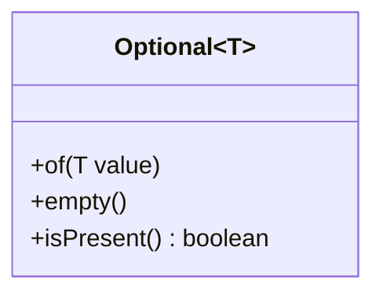
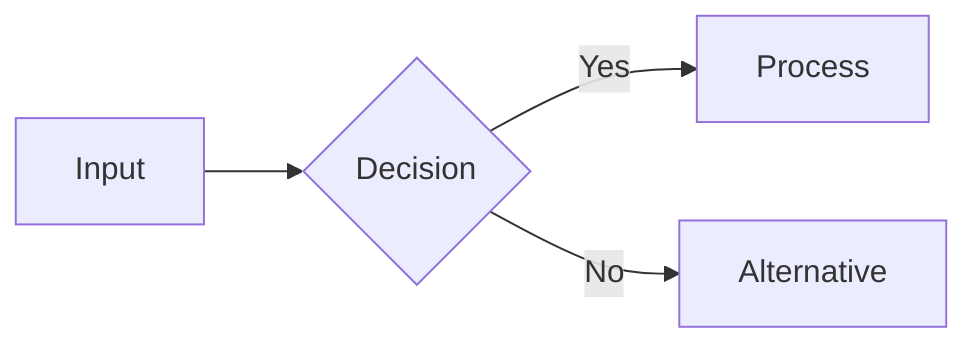

# CLAUDE.md - Knowledge Base Assistant Guide

This document provides guidance for AI assistants (particularly Claude) working with this Obsidian knowledge base vault. It documents conventions, structure, and standards to maintain consistency across all content.

## Vault Overview

This is a **personal technical learning and reference vault** focused on:
- Programming languages (Java, Python, Shell)
- Computer science fundamentals (Algorithms, Data Structures, Design Patterns)
- AI/LLM interaction (Prompting Techniques)
- Frameworks (React, Spring - emerging content)

**Purpose:** Interview preparation, technical reference, self-directed learning with structured progression paths.

## Directory Structure

```
knowledge-base/
├── Languages/              # Language-specific syntax, features, APIs
│   ├── Java/              # 16 documents covering core Java features
│   ├── Python/            # Python-specific content
│   └── Shell/             # Shell scripting and CLI tools
├── Frameworks/            # Framework-specific patterns and best practices
│   ├── React/
│   └── Spring/
├── Concepts/              # Language-agnostic computer science concepts
│   ├── Algorithms/        # Sorting, searching, optimization algorithms
│   ├── Data-Structures/   # Arrays, trees, graphs, hash tables
│   ├── Design-Patterns/   # GoF patterns, architectural patterns
│   └── Prompting-Techniques/  # LLM interaction strategies
├── Meta/                  # Vault documentation and templates
│   └── Templates/         # Reusable document templates
└── Notes/                 # Working notes (private/temporary)
```

**Key Rule:** Each category folder contains an `_Index.md` file for navigation and overview.

## File Naming Conventions

- **Format:** Title-Case-With-Hyphens.md
  - Examples: `Java-Annotations.md`, `Big-O-Notation.md`, `Chain-of-Thought.md`
- **Index files:** Always prefixed with underscore: `_Index.md` (sorts first in file lists)
- **No spaces** in filenames
- **Descriptive names** that clearly indicate the topic

## Frontmatter (YAML Metadata)

All documents must start with this frontmatter structure:

```yaml
---
title: Topic Name
category: Languages/Java  # Hierarchical path
tags:
  - primary-tag
  - secondary-tag
  - feature-type-tag
difficulty: beginner  # beginner | intermediate | advanced
status: seed  # seed | growing | evergreen
date-created: YYYY-MM-DD
date-updated: YYYY-MM-DD
sources:
  - https://official-documentation-url
  - https://additional-reference
---
```

**Status Definitions:**
- `seed` 🌱 — Basic outline, minimal content
- `growing` 🌿 — Substantial content, still expanding
- `evergreen` 🌳 — Complete, comprehensive, regularly maintained

**Difficulty Levels:**
- `beginner` — Foundational concepts, suitable for newcomers
- `intermediate` — Requires basic knowledge, real-world patterns
- `advanced` — Complex scenarios, edge cases, performance considerations

## Standard Document Structure

Every technical document follows this **7-section template**:

### 1. Summary Callout
```markdown
> [!summary]
> One concise paragraph (3-5 sentences) explaining what the topic is, why it matters, and when to use it. This should give readers immediate value and context.
```

### 2. Theory Section
- **"What Is [Topic]?"** — Clear definition and conceptual overview
- **"How It Works"** — Implementation details, design philosophy
- **Visual diagrams** — Use Mermaid for flowcharts, class diagrams, sequence diagrams

Example:
```markdown
## What Is Optional?

Optional is a container object introduced in Java 8...

## How It Works


```

### 3. Quick Reference (Optional, for reference-heavy topics)
- Lookup tables for methods, flags, options
- Complexity analysis tables
- Command syntax cheat sheets

### 4. Practical Examples (Minimum 3 examples)
```markdown
## Practical Examples

### Basic Usage
[Simple "Hello World" level example with explanation]

### Intermediate Example
[Real-world pattern showing common use case]

### Advanced Usage
[Complex scenario with edge cases or combinations]
```

**Code Requirements:**
- All code must be **runnable**, never pseudocode
- Use proper syntax highlighting: ` ```java`, ` ```python`, ` ```bash`
- Include comments explaining key steps
- Show realistic examples over toy problems

### 5. Common Patterns
```markdown
## Common Patterns

> [!tip] Best Practice
> Use descriptive explanation of what to do and why

✅ **Good:**
```java
// Clean, recommended approach
```

❌ **Bad:**
```java
// Anti-pattern to avoid
```
```

Use these callout types:
- `> [!tip]` — Best practices and recommendations
- `> [!warning]` — Common mistakes, gotchas, anti-patterns
- `> [!info]` — Additional context or clarification

### 6. Edge Cases & Gotchas
```markdown
## Edge Cases & Gotchas

- **Thread Safety:** Description of threading considerations
- **Null Handling:** How nulls are handled or cause issues
- **Performance:** When performance degrades
- **Serialization:** Serialization quirks if applicable
```

### 7. Related Topics & References
```markdown
## Related Topics

- [[Another-Topic]]
- [[Data-Structures/_Index]]
- [[Design-Pattern-Name]]

## References

- [Official Documentation](https://official-url)
- [Academic Paper](https://arxiv.org/...)
- Book: *Title* (ISBN or item number)
```

## Linking Conventions

**Internal Links:**
- Use wiki-link syntax: `[[Target-Document-Name]]`
- Link to index files: `[[Category/_Index]]`
- Always use exact filename (without .md extension)

**Cross-Referencing:**
- Every document should have a "Related Topics" section
- Index files should link to all documents in their category
- Create bidirectional relationships where relevant

## Visual Elements

### Mermaid Diagrams
Use Mermaid for technical diagrams:
```markdown

```

Common diagram types:
- `flowchart` — Process flows, algorithms
- `classDiagram` — Class relationships, inheritance
- `sequenceDiagram` — Method calls, interaction flows
- `graph` — Conceptual relationships

### Math Notation
Use LaTeX syntax for complexity and formulas:
- Inline: `$O(n \log n)$`
- Block: `$$\sum_{i=1}^{n} i = \frac{n(n+1)}{2}$$`

### Tables
Use markdown tables for comparisons:
```markdown
| Operation | Time Complexity | Space Complexity |
|-----------|----------------|------------------|
| Insert    | O(1)           | O(n)             |
| Search    | O(log n)       | O(1)             |
```

## Writing Style Guidelines

### Tone & Voice
- **Clear and direct** — Avoid unnecessary verbosity
- **Technically precise** — Use correct terminology
- **Educational but not condescending** — Explain the "why" not just "how"
- **Conversational professionalism** — Approachable but authoritative
- Use **analogies** for complex concepts (e.g., "Optional is like a box that's either empty or contains exactly one item")

### Code Examples Philosophy
1. **Progression:** Start simple, build to complex
2. **Practical:** Real-world scenarios over toy examples
3. **Runnable:** Every code snippet must be executable
4. **Commented:** Explain non-obvious logic
5. **Multiple variations:** Show language-specific approaches when applicable

### Content Completeness
- Minimum **3 code examples** per document
- Both **what to do** and **what NOT to do**
- **Performance considerations** for algorithms/data structures
- **Thread safety** considerations for Java features
- **Common pitfalls** documented explicitly

## Index File Structure

Index files (`_Index.md`) have a special structure:

```markdown
---
title: Category Name Index
category: Category/Path
tags: [index, category-tag]
---

> [!summary]
> Overview paragraph describing this category and its learning value

## Overview
Brief introduction to the category

## Learning Path

### Beginner
- [[Topic-One]] — Brief description
- [[Topic-Two]] — Brief description

### Intermediate
- [[Topic-Three]] — Brief description

### Advanced
- [[Topic-Four]] — Brief description

## Topics

### Subcategory Name
| Topic | Difficulty | Status | Description |
|-------|-----------|--------|-------------|
| [[Topic]] | Beginner | 🌳 Evergreen | Short description |

## Recently Updated
```dataview
TABLE date-updated as "Last Updated"
FROM "Category/Path"
SORT date-updated DESC
LIMIT 5
```

## Quick Reference
[Category-specific quick reference material]

## Related Categories
- [[Other-Category/_Index]]
```

## Dataview Integration

Index files use Dataview queries (Obsidian plugin) for dynamic content:

```markdown
```dataview
TABLE difficulty, status, date-updated
FROM "Languages/Java"
WHERE status = "evergreen"
SORT difficulty ASC
```
```

Common query patterns:
- Recent updates: `SORT date-updated DESC`
- By difficulty: `WHERE difficulty = "beginner"`
- By status: `WHERE status = "evergreen"`

## When Creating New Documents

1. **Choose the correct category** based on topic nature:
   - Language-specific feature → `Languages/[Language]/`
   - Framework-specific pattern → `Frameworks/[Framework]/`
   - Language-agnostic concept → `Concepts/[Subcategory]/`

2. **Use the standard template** from `Meta/Templates/`

3. **Fill complete frontmatter** with accurate metadata

4. **Follow the 7-section structure** (Summary, Theory, Quick Reference, Examples, Patterns, Edge Cases, Related Topics)

5. **Include minimum 3 code examples** with progression

6. **Add to the category index** with appropriate difficulty and status

7. **Cross-link related topics** bidirectionally

8. **Cite authoritative sources** in References section

9. **Start with `seed` status** and evolve to `growing` then `evergreen` as content matures

## When Updating Existing Documents

1. **Read the entire document first** before making changes
2. **Update `date-updated` in frontmatter**
3. **Maintain existing structure** and formatting
4. **Match the established tone** and writing style
5. **Preserve all working code examples** (only fix if broken)
6. **Add, don't remove** — Expand content rather than replacing
7. **Update status** if content maturity has changed (seed → growing → evergreen)
8. **Verify all internal links** still resolve correctly

## Content Standards Checklist

Before considering a document "complete" (evergreen status):

- [ ] Frontmatter complete and accurate
- [ ] Summary callout present and informative
- [ ] Theory section explains "what" and "why"
- [ ] Minimum 3 code examples (basic, intermediate, advanced)
- [ ] All code is runnable and properly formatted
- [ ] Common patterns section with tips and warnings
- [ ] Edge cases documented
- [ ] Related topics linked
- [ ] References cite authoritative sources
- [ ] Mermaid diagrams for complex concepts
- [ ] Cross-referenced from category index
- [ ] Writing style matches vault conventions

## Special Considerations

### Java Documents
- Include thread safety considerations
- Document since which Java version (e.g., "Introduced in Java 8")
- Show both imperative and functional approaches where applicable
- Cover serialization implications if relevant

### Algorithm/Data Structure Documents
- Include Big-O complexity analysis
- Provide visual diagrams (Mermaid)
- Show multiple implementation approaches
- Include practical use cases and trade-offs

### Prompting Techniques Documents
- Include real LLM conversation examples
- Show both input prompts and expected outputs
- Document when to use each technique
- Cite research papers (arXiv links)

## Maintenance Guidelines

- **Regular reviews:** Update date-updated when verifying content accuracy
- **Link maintenance:** Fix broken links immediately
- **Status progression:** Move documents from seed → growing → evergreen as they mature
- **Example updates:** Keep code examples compatible with current language/framework versions
- **Reference freshness:** Update links if official documentation moves
- **Index synchronization:** Ensure all documents appear in their category index

## Version Control

This vault uses git for version control:
- **Commit frequently** with descriptive messages
- **Reference file paths** in commit messages: "Update Languages/Java/Optional.md with advanced examples"
- **Atomic commits:** One logical change per commit
- **Never commit** the `.obsidian/` directory (except workspace.json if needed)

## Questions or Clarifications

If uncertain about:
- **Category placement** — Ask the user which category is most appropriate
- **Existing patterns** — Read 2-3 similar documents to understand conventions
- **Code accuracy** — Verify syntax and runnability before adding
- **Style decisions** — Default to matching existing documents in the same category

---

**Last Updated:** 2026-01-13
**Maintained By:** Knowledge base owner with AI assistance