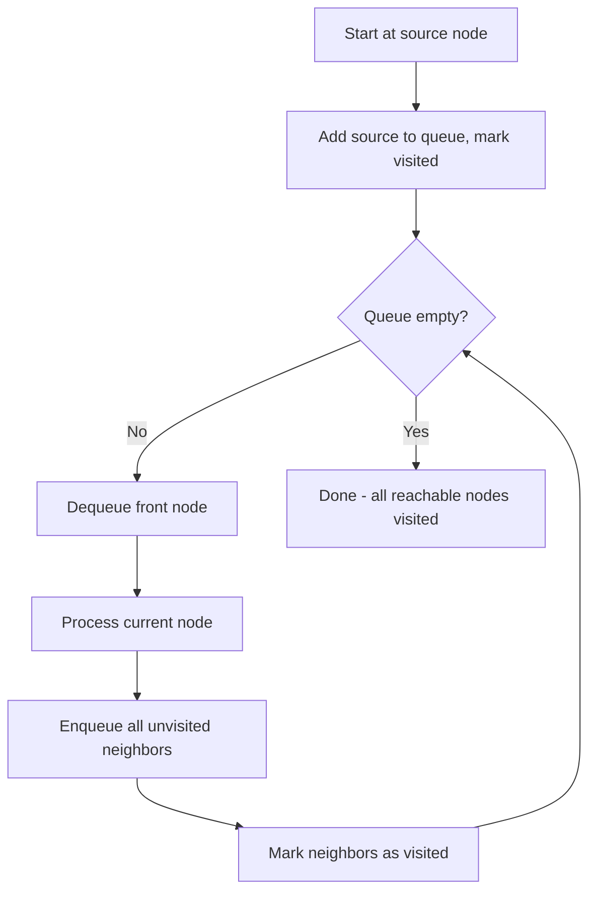

# Breadth-First Search (BFS)

> [!summary]
> Breadth-First Search is a graph traversal algorithm that explores nodes level by level, visiting all neighbors at the current depth before moving to nodes at the next depth level. BFS uses a queue to maintain traversal order and is optimal for finding the shortest path in unweighted graphs.

## Theory

### What Is Breadth-First Search?

BFS is a graph traversal algorithm that starts at a source node and explores all neighboring nodes at the present depth before moving on to nodes at the next depth level. Think of it like ripples spreading outward from a stone dropped in water—the wave reaches nearby points first, then spreads further.

The algorithm gets its name because it prioritizes **breadth** over depth—it explores all nodes at distance 1 before any node at distance 2.

**Key characteristics:**
- Explores nodes level by level (closest first)
- Uses a **queue** data structure (FIFO order)
- Guarantees shortest path in **unweighted** graphs
- Uses more memory than DFS for wide graphs

### How It Works



**Step-by-step process:**
1. Start at the source node, mark it visited, add to queue
2. Dequeue the front node
3. Visit all its unvisited neighbors, mark them visited, enqueue them
4. Repeat until queue is empty
5. All reachable nodes will have been visited in level order

### Time and Space Complexity

| Aspect | Complexity | Explanation |
|--------|------------|-------------|
| Time | $O(V + E)$ | Visit each vertex once, check each edge once |
| Space | $O(V)$ | Queue can hold up to V nodes (worst case: all nodes at one level) |

Where V = number of vertices, E = number of edges.

### BFS vs DFS Comparison

| Aspect | BFS | DFS |
|--------|-----|-----|
| Data Structure | Queue (FIFO) | Stack (LIFO) |
| Order | Level by level | Deep then backtrack |
| Shortest Path | Yes (unweighted) | No guarantee |
| Memory | Higher for wide graphs | Higher for deep graphs |
| Use When | Need shortest path, level order | Need to explore all paths, detect cycles |

## Practical Examples

### Basic Usage - BFS Traversal

```java
import java.util.*;

public class BFSBasic {
    private Map<Integer, List<Integer>> graph = new HashMap<>();
    
    public void addEdge(int from, int to) {
        graph.computeIfAbsent(from, k -> new ArrayList<>()).add(to);
        graph.computeIfAbsent(to, k -> new ArrayList<>()).add(from); // undirected
    }
    
    public List<Integer> bfs(int start) {
        List<Integer> result = new ArrayList<>();
        Set<Integer> visited = new HashSet<>();
        Queue<Integer> queue = new LinkedList<>();
        
        visited.add(start);
        queue.offer(start);
        
        while (!queue.isEmpty()) {
            int node = queue.poll();
            result.add(node);
            
            for (int neighbor : graph.getOrDefault(node, Collections.emptyList())) {
                if (!visited.contains(neighbor)) {
                    visited.add(neighbor);  // Mark visited when enqueuing!
                    queue.offer(neighbor);
                }
            }
        }
        
        return result;
    }
    
    public static void main(String[] args) {
        BFSBasic g = new BFSBasic();
        g.addEdge(0, 1);
        g.addEdge(0, 2);
        g.addEdge(1, 3);
        g.addEdge(1, 4);
        g.addEdge(2, 5);
        
        System.out.println("BFS traversal from node 0: " + g.bfs(0));
        // Output: [0, 1, 2, 3, 4, 5]
    }
}
```

```python
from collections import defaultdict, deque

class Graph:
    def __init__(self):
        self.graph = defaultdict(list)
    
    def add_edge(self, u, v):
        self.graph[u].append(v)
        self.graph[v].append(u)  # undirected graph
    
    def bfs(self, start):
        """BFS traversal returning list of visited nodes"""
        visited = {start}
        queue = deque([start])
        result = []
        
        while queue:
            node = queue.popleft()
            result.append(node)
            
            for neighbor in self.graph[node]:
                if neighbor not in visited:
                    visited.add(neighbor)  # Mark visited when enqueuing
                    queue.append(neighbor)
        
        return result

# Example usage
g = Graph()
g.add_edge(0, 1)
g.add_edge(0, 2)
g.add_edge(1, 3)
g.add_edge(1, 4)
g.add_edge(2, 5)

print("BFS traversal from node 0:", g.bfs(0))
# Output: [0, 1, 2, 3, 4, 5]
```

### Intermediate Example - Shortest Path in Unweighted Graph

```java
import java.util.*;

public class ShortestPath {
    private Map<Integer, List<Integer>> graph = new HashMap<>();
    
    public void addEdge(int from, int to) {
        graph.computeIfAbsent(from, k -> new ArrayList<>()).add(to);
        graph.computeIfAbsent(to, k -> new ArrayList<>()).add(from);
    }
    
    public List<Integer> shortestPath(int start, int end) {
        if (start == end) {
            return Arrays.asList(start);
        }
        
        Map<Integer, Integer> parent = new HashMap<>();
        Set<Integer> visited = new HashSet<>();
        Queue<Integer> queue = new LinkedList<>();
        
        visited.add(start);
        queue.offer(start);
        parent.put(start, null);
        
        while (!queue.isEmpty()) {
            int node = queue.poll();
            
            for (int neighbor : graph.getOrDefault(node, Collections.emptyList())) {
                if (!visited.contains(neighbor)) {
                    visited.add(neighbor);
                    parent.put(neighbor, node);
                    queue.offer(neighbor);
                    
                    // Found the target - reconstruct path
                    if (neighbor == end) {
                        return reconstructPath(parent, end);
                    }
                }
            }
        }
        
        return Collections.emptyList();  // No path exists
    }
    
    private List<Integer> reconstructPath(Map<Integer, Integer> parent, int end) {
        List<Integer> path = new ArrayList<>();
        Integer current = end;
        
        while (current != null) {
            path.add(current);
            current = parent.get(current);
        }
        
        Collections.reverse(path);
        return path;
    }
    
    public static void main(String[] args) {
        ShortestPath g = new ShortestPath();
        g.addEdge(0, 1);
        g.addEdge(0, 2);
        g.addEdge(1, 3);
        g.addEdge(2, 3);
        g.addEdge(3, 4);
        
        System.out.println("Shortest path 0 -> 4: " + g.shortestPath(0, 4));
        // Output: [0, 1, 3, 4] or [0, 2, 3, 4]
    }
}
```

```python
from collections import defaultdict, deque

def shortest_path(graph, start, end):
    """
    Find shortest path between start and end in unweighted graph.
    Returns the path as a list, or empty list if no path exists.
    """
    if start == end:
        return [start]
    
    visited = {start}
    queue = deque([start])
    parent = {start: None}
    
    while queue:
        node = queue.popleft()
        
        for neighbor in graph[node]:
            if neighbor not in visited:
                visited.add(neighbor)
                parent[neighbor] = node
                queue.append(neighbor)
                
                # Found target - reconstruct path
                if neighbor == end:
                    path = []
                    current = end
                    while current is not None:
                        path.append(current)
                        current = parent[current]
                    return path[::-1]  # Reverse to get start -> end
    
    return []  # No path exists

# Example usage
graph = defaultdict(list)
edges = [(0, 1), (0, 2), (1, 3), (2, 3), (3, 4)]
for u, v in edges:
    graph[u].append(v)
    graph[v].append(u)

print("Shortest path 0 -> 4:", shortest_path(graph, 0, 4))
# Output: [0, 1, 3, 4] or [0, 2, 3, 4]
```

### Advanced Usage - Level Order Traversal with Distances

```java
import java.util.*;

public class LevelOrderBFS {
    private Map<Integer, List<Integer>> graph = new HashMap<>();
    
    public void addEdge(int from, int to) {
        graph.computeIfAbsent(from, k -> new ArrayList<>()).add(to);
        graph.computeIfAbsent(to, k -> new ArrayList<>()).add(from);
    }
    
    public Map<Integer, Integer> getDistances(int start) {
        Map<Integer, Integer> distances = new HashMap<>();
        Queue<Integer> queue = new LinkedList<>();
        
        distances.put(start, 0);
        queue.offer(start);
        
        while (!queue.isEmpty()) {
            int node = queue.poll();
            int currentDist = distances.get(node);
            
            for (int neighbor : graph.getOrDefault(node, Collections.emptyList())) {
                if (!distances.containsKey(neighbor)) {
                    distances.put(neighbor, currentDist + 1);
                    queue.offer(neighbor);
                }
            }
        }
        
        return distances;
    }
    
    public List<List<Integer>> getLevels(int start) {
        List<List<Integer>> levels = new ArrayList<>();
        Set<Integer> visited = new HashSet<>();
        Queue<Integer> queue = new LinkedList<>();
        
        visited.add(start);
        queue.offer(start);
        
        while (!queue.isEmpty()) {
            int levelSize = queue.size();
            List<Integer> currentLevel = new ArrayList<>();
            
            // Process all nodes at current level
            for (int i = 0; i < levelSize; i++) {
                int node = queue.poll();
                currentLevel.add(node);
                
                for (int neighbor : graph.getOrDefault(node, Collections.emptyList())) {
                    if (!visited.contains(neighbor)) {
                        visited.add(neighbor);
                        queue.offer(neighbor);
                    }
                }
            }
            
            levels.add(currentLevel);
        }
        
        return levels;
    }
    
    public static void main(String[] args) {
        LevelOrderBFS g = new LevelOrderBFS();
        g.addEdge(0, 1);
        g.addEdge(0, 2);
        g.addEdge(1, 3);
        g.addEdge(1, 4);
        g.addEdge(2, 5);
        g.addEdge(2, 6);
        
        System.out.println("Distances from node 0: " + g.getDistances(0));
        System.out.println("Levels: " + g.getLevels(0));
        // Distances: {0=0, 1=1, 2=1, 3=2, 4=2, 5=2, 6=2}
        // Levels: [[0], [1, 2], [3, 4, 5, 6]]
    }
}
```

```python
from collections import defaultdict, deque

def bfs_with_levels(graph, start):
    """
    BFS that returns nodes organized by distance level from start.
    Also returns distance map for each node.
    """
    distances = {start: 0}
    levels = []
    queue = deque([start])
    
    while queue:
        level_size = len(queue)
        current_level = []
        
        for _ in range(level_size):
            node = queue.popleft()
            current_level.append(node)
            
            for neighbor in graph[node]:
                if neighbor not in distances:
                    distances[neighbor] = distances[node] + 1
                    queue.append(neighbor)
        
        levels.append(current_level)
    
    return levels, distances

# Example usage
graph = defaultdict(list)
edges = [(0, 1), (0, 2), (1, 3), (1, 4), (2, 5), (2, 6)]
for u, v in edges:
    graph[u].append(v)
    graph[v].append(u)

levels, distances = bfs_with_levels(graph, 0)
print(f"Levels: {levels}")
print(f"Distances: {distances}")
# Levels: [[0], [1, 2], [3, 4, 5, 6]]
# Distances: {0: 0, 1: 1, 2: 1, 3: 2, 4: 2, 5: 2, 6: 2}
```

### Advanced Usage - Multi-Source BFS (Rotten Oranges Problem)

```python
from collections import deque

def oranges_rotting(grid):
    """
    Classic BFS problem: Given a grid where 0=empty, 1=fresh orange, 2=rotten orange.
    Each minute, rotten oranges rot adjacent fresh oranges.
    Return minutes until all oranges rot, or -1 if impossible.
    """
    if not grid or not grid[0]:
        return 0
    
    rows, cols = len(grid), len(grid[0])
    queue = deque()
    fresh_count = 0
    
    # Find all initially rotten oranges and count fresh ones
    for r in range(rows):
        for c in range(cols):
            if grid[r][c] == 2:
                queue.append((r, c, 0))  # (row, col, time)
            elif grid[r][c] == 1:
                fresh_count += 1
    
    if fresh_count == 0:
        return 0
    
    directions = [(0, 1), (0, -1), (1, 0), (-1, 0)]
    max_time = 0
    
    while queue:
        row, col, time = queue.popleft()
        
        for dr, dc in directions:
            new_row, new_col = row + dr, col + dc
            
            # Check bounds and if fresh orange
            if (0 <= new_row < rows and 0 <= new_col < cols 
                and grid[new_row][new_col] == 1):
                
                grid[new_row][new_col] = 2  # Mark as rotten
                fresh_count -= 1
                max_time = max(max_time, time + 1)
                queue.append((new_row, new_col, time + 1))
    
    return max_time if fresh_count == 0 else -1

# Example
grid = [
    [2, 1, 1],
    [1, 1, 0],
    [0, 1, 1]
]
print(f"Minutes to rot all oranges: {oranges_rotting(grid)}")  # Output: 4
```

## Common Patterns

> [!tip] Mark Visited When Enqueuing, Not Dequeuing
> Always mark nodes as visited when you add them to the queue, not when you remove them. This prevents the same node from being added multiple times, which wastes memory and time.

> [!tip] Use Level-Size Technique for Level-Order Problems
> When you need to process nodes level by level (like finding minimum depth or level-order traversal), capture `queue.size()` at the start of each iteration and process exactly that many nodes.

> [!warning] BFS Only Finds Shortest Path in Unweighted Graphs
> BFS guarantees shortest path only when all edges have equal weight. For weighted graphs, you need [[Dijkstra's Algorithm]] or similar.

> [!warning] Don't Use BFS for Path Enumeration
> BFS finds ONE shortest path efficiently. If you need ALL paths or need to explore different path combinations, DFS with backtracking is more appropriate.

## Edge Cases & Gotchas

- **Disconnected graphs**: BFS from one node won't reach disconnected components. Use a loop to start BFS from all unvisited nodes if complete coverage is needed.
- **No path exists**: Always check if the destination was reached; don't assume a path exists.
- **Start equals end**: Handle `start == end` as a special case returning distance 0 or single-element path.
- **Bidirectional BFS**: For finding path between two specific nodes, starting BFS from both ends and meeting in the middle can be $O(\sqrt{n})$ faster.
- **Memory on wide graphs**: Unlike DFS, BFS must store all nodes at the current level. For very wide graphs (like social networks), this can be memory-intensive.

## Related Topics

- [[Depth-First-Search]] - Alternative traversal that explores deeply first
- [[Queues]] - Underlying data structure for BFS
- [[Dijkstra's Algorithm]] - BFS extension for weighted shortest paths
- [[Trees]] - BFS on trees gives level-order traversal
- [[Graphs]] - Understanding graph representations

## References

- [GeeksforGeeks - Breadth First Search](https://www.geeksforgeeks.org/breadth-first-search-or-bfs-for-a-graph/)
- [Programiz - BFS Algorithm](https://www.programiz.com/dsa/graph-bfs)
- [CS 225 UIUC - BFS & DFS](https://courses.grainger.illinois.edu/cs225/sp2025/resources/bfs-dfs/)
