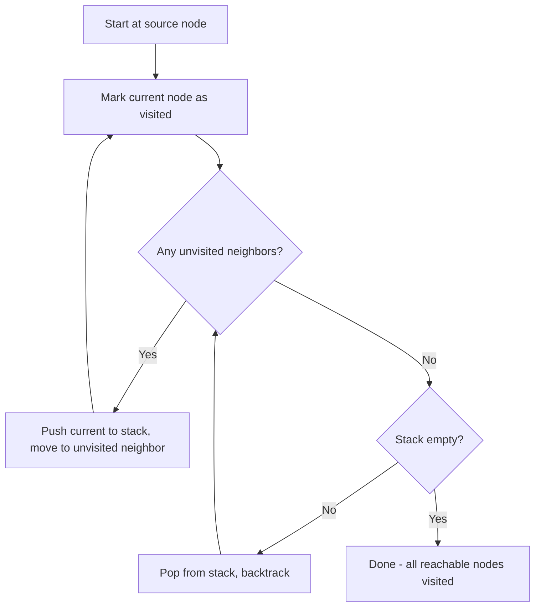

# Depth-First Search (DFS)

> [!summary]
> Depth-First Search is a graph traversal algorithm that explores as far as possible along each branch before backtracking. It's fundamental for solving problems like pathfinding, cycle detection, topological sorting, and maze generation. DFS uses a stack (either explicitly or via recursion) to track which nodes to visit next.

## Theory

### What Is Depth-First Search?

DFS is a graph traversal algorithm that starts at a given node and explores as deep as possible along each branch before backtracking. Think of it like navigating a maze: you go down one path until you hit a dead end, then backtrack to try another path.

The algorithm gets its name because it prioritizes **depth** over breadth—it goes deep into one subtree before exploring siblings.

**Key characteristics:**
- Explores one complete path before moving to another
- Uses a **stack** data structure (or recursion's call stack)
- Visits nodes in a "last-in, first-out" (LIFO) order
- Memory efficient for deep graphs

### How It Works



**Step-by-step process:**
1. Start at the source node, mark it as visited
2. Explore an unvisited adjacent node
3. Repeat step 2 for the new node (going deeper)
4. When no unvisited neighbors exist, backtrack to the previous node
5. Continue until all reachable nodes are visited

### Time and Space Complexity

| Aspect | Complexity | Explanation |
|--------|------------|-------------|
| Time | $O(V + E)$ | Visit each vertex once, check each edge once |
| Space | $O(V)$ | Stack can hold at most V nodes (worst case: linear graph) |

Where V = number of vertices, E = number of edges.

## Practical Examples

### Basic Usage - Recursive DFS

```java
import java.util.*;

public class DFSRecursive {
    private Map<Integer, List<Integer>> graph = new HashMap<>();
    private Set<Integer> visited = new HashSet<>();
    
    public void addEdge(int from, int to) {
        graph.computeIfAbsent(from, k -> new ArrayList<>()).add(to);
        graph.computeIfAbsent(to, k -> new ArrayList<>()).add(from); // undirected
    }
    
    public void dfs(int node) {
        // Mark current node as visited
        visited.add(node);
        System.out.print(node + " ");
        
        // Recursively visit all unvisited neighbors
        for (int neighbor : graph.getOrDefault(node, Collections.emptyList())) {
            if (!visited.contains(neighbor)) {
                dfs(neighbor);
            }
        }
    }
    
    public static void main(String[] args) {
        DFSRecursive g = new DFSRecursive();
        g.addEdge(0, 1);
        g.addEdge(0, 2);
        g.addEdge(1, 3);
        g.addEdge(1, 4);
        g.addEdge(2, 5);
        
        System.out.print("DFS traversal starting from node 0: ");
        g.dfs(0);  // Output: 0 1 3 4 2 5
    }
}
```

```python
from collections import defaultdict

class Graph:
    def __init__(self):
        self.graph = defaultdict(list)
        self.visited = set()
    
    def add_edge(self, u, v):
        self.graph[u].append(v)
        self.graph[v].append(u)  # undirected graph
    
    def dfs(self, node):
        """Recursive DFS traversal"""
        self.visited.add(node)
        print(node, end=" ")
        
        for neighbor in self.graph[node]:
            if neighbor not in self.visited:
                self.dfs(neighbor)

# Example usage
g = Graph()
g.add_edge(0, 1)
g.add_edge(0, 2)
g.add_edge(1, 3)
g.add_edge(1, 4)
g.add_edge(2, 5)

print("DFS traversal starting from node 0: ", end="")
g.dfs(0)  # Output: 0 1 3 4 2 5
```

### Intermediate Example - Iterative DFS with Stack

```java
import java.util.*;

public class DFSIterative {
    private Map<Integer, List<Integer>> graph = new HashMap<>();
    
    public void addEdge(int from, int to) {
        graph.computeIfAbsent(from, k -> new ArrayList<>()).add(to);
        graph.computeIfAbsent(to, k -> new ArrayList<>()).add(from);
    }
    
    public List<Integer> dfsIterative(int start) {
        List<Integer> result = new ArrayList<>();
        Set<Integer> visited = new HashSet<>();
        Stack<Integer> stack = new Stack<>();
        
        stack.push(start);
        
        while (!stack.isEmpty()) {
            int node = stack.pop();
            
            // Skip if already visited (handles duplicates in stack)
            if (visited.contains(node)) {
                continue;
            }
            
            visited.add(node);
            result.add(node);
            
            // Add neighbors to stack in reverse order for consistent traversal
            List<Integer> neighbors = graph.getOrDefault(node, Collections.emptyList());
            for (int i = neighbors.size() - 1; i >= 0; i--) {
                int neighbor = neighbors.get(i);
                if (!visited.contains(neighbor)) {
                    stack.push(neighbor);
                }
            }
        }
        
        return result;
    }
    
    public static void main(String[] args) {
        DFSIterative g = new DFSIterative();
        g.addEdge(0, 1);
        g.addEdge(0, 2);
        g.addEdge(1, 3);
        g.addEdge(1, 4);
        g.addEdge(2, 5);
        
        System.out.println("Iterative DFS: " + g.dfsIterative(0));
    }
}
```

```python
from collections import defaultdict

def dfs_iterative(graph, start):
    """Iterative DFS using explicit stack"""
    visited = set()
    result = []
    stack = [start]
    
    while stack:
        node = stack.pop()
        
        if node in visited:
            continue
            
        visited.add(node)
        result.append(node)
        
        # Add neighbors in reverse order for consistent left-to-right traversal
        for neighbor in reversed(graph[node]):
            if neighbor not in visited:
                stack.append(neighbor)
    
    return result

# Example usage
graph = defaultdict(list)
edges = [(0, 1), (0, 2), (1, 3), (1, 4), (2, 5)]
for u, v in edges:
    graph[u].append(v)
    graph[v].append(u)

print("Iterative DFS:", dfs_iterative(graph, 0))
```

### Advanced Usage - Cycle Detection in Directed Graph

```java
import java.util.*;

public class CycleDetection {
    private Map<Integer, List<Integer>> graph = new HashMap<>();
    
    public void addEdge(int from, int to) {
        graph.computeIfAbsent(from, k -> new ArrayList<>()).add(to);
    }
    
    public boolean hasCycle() {
        Set<Integer> visited = new HashSet<>();
        Set<Integer> recursionStack = new HashSet<>();
        
        // Check all nodes (graph may be disconnected)
        for (int node : graph.keySet()) {
            if (hasCycleDFS(node, visited, recursionStack)) {
                return true;
            }
        }
        return false;
    }
    
    private boolean hasCycleDFS(int node, Set<Integer> visited, Set<Integer> recStack) {
        // If node is in current recursion stack, we found a cycle
        if (recStack.contains(node)) {
            return true;
        }
        
        // If already fully explored, no cycle through this node
        if (visited.contains(node)) {
            return false;
        }
        
        visited.add(node);
        recStack.add(node);
        
        // Explore all neighbors
        for (int neighbor : graph.getOrDefault(node, Collections.emptyList())) {
            if (hasCycleDFS(neighbor, visited, recStack)) {
                return true;
            }
        }
        
        // Remove from recursion stack when backtracking
        recStack.remove(node);
        return false;
    }
    
    public static void main(String[] args) {
        CycleDetection g = new CycleDetection();
        g.addEdge(0, 1);
        g.addEdge(1, 2);
        g.addEdge(2, 0);  // Creates cycle: 0 -> 1 -> 2 -> 0
        
        System.out.println("Has cycle: " + g.hasCycle());  // true
    }
}
```

```python
from collections import defaultdict

class DirectedGraph:
    def __init__(self):
        self.graph = defaultdict(list)
    
    def add_edge(self, u, v):
        self.graph[u].append(v)
    
    def has_cycle(self):
        """Detect cycle using DFS with recursion stack tracking"""
        visited = set()
        rec_stack = set()  # Tracks nodes in current DFS path
        
        def dfs(node):
            if node in rec_stack:  # Back edge found = cycle
                return True
            if node in visited:  # Already explored, no cycle here
                return False
            
            visited.add(node)
            rec_stack.add(node)
            
            for neighbor in self.graph[node]:
                if dfs(neighbor):
                    return True
            
            rec_stack.remove(node)  # Backtrack
            return False
        
        # Check all nodes (handles disconnected graphs)
        for node in list(self.graph.keys()):
            if dfs(node):
                return True
        return False

# Example with cycle
g = DirectedGraph()
g.add_edge(0, 1)
g.add_edge(1, 2)
g.add_edge(2, 0)  # Creates cycle

print(f"Has cycle: {g.has_cycle()}")  # True
```

### Advanced Usage - Topological Sort

```python
from collections import defaultdict

def topological_sort(graph, num_nodes):
    """
    Topological sort using DFS (Kahn's algorithm alternative).
    Returns nodes in order such that for every edge u->v, u comes before v.
    """
    visited = set()
    result = []
    
    def dfs(node):
        visited.add(node)
        
        for neighbor in graph[node]:
            if neighbor not in visited:
                dfs(neighbor)
        
        # Add to result AFTER all descendants are processed
        result.append(node)
    
    # Visit all nodes
    for node in range(num_nodes):
        if node not in visited:
            dfs(node)
    
    # Reverse to get correct topological order
    return result[::-1]

# Example: Task dependencies
# 0 -> 1 -> 3
# 0 -> 2 -> 3
graph = defaultdict(list)
graph[0] = [1, 2]
graph[1] = [3]
graph[2] = [3]
graph[3] = []

print("Topological order:", topological_sort(graph, 4))
# Output: [0, 2, 1, 3] or [0, 1, 2, 3] (valid orderings)
```

## Common Patterns

> [!tip] Use Recursion for Cleaner Code
> Recursive DFS is often more intuitive and produces cleaner code. The call stack naturally handles backtracking. Use iterative DFS when you need to avoid stack overflow on very deep graphs or need more control over traversal.

> [!tip] Track Entry and Exit Times
> For advanced applications like finding strongly connected components or bridges, track when you enter and exit each node during DFS. This creates a "DFS tree" with useful properties.

> [!warning] Don't Forget the Visited Set
> Always track visited nodes to avoid infinite loops in cyclic graphs. For cycle detection specifically, you need TWO sets: `visited` (globally visited) and `recursionStack` (currently in path).

> [!warning] Recursive DFS Can Overflow
> For very deep graphs (thousands of levels), recursive DFS may cause stack overflow. Switch to iterative implementation with explicit stack for production code handling arbitrary input.

## Edge Cases & Gotchas

- **Disconnected graphs**: DFS from one node won't visit disconnected components. Loop through all nodes to ensure complete coverage.
- **Self-loops**: A node with an edge to itself. Handle by checking `if neighbor != current_node` or letting the visited set catch it.
- **Directed vs undirected**: For undirected graphs, add edges in both directions. Cycle detection logic differs between them.
- **Empty graph**: Handle gracefully—return empty result or indicate no traversal needed.
- **Single node**: Should return that node as the only visited node.

## Related Topics

- [[Breadth-First-Search]] - Alternative traversal that explores level by level
- [[Recursion]] - DFS naturally uses recursive structure
- [[Stacks]] - Underlying data structure for iterative DFS
- [[Trees]] - DFS on trees is simpler (no cycles to worry about)
- [[Graphs]] - Understanding graph representations (adjacency list/matrix)

## References

- [GeeksforGeeks - Depth First Search](https://www.geeksforgeeks.org/depth-first-search-or-dfs-for-a-graph/)
- [Programiz - DFS Algorithm](https://www.programiz.com/dsa/graph-dfs)
- [CS 225 UIUC - BFS & DFS](https://courses.grainger.illinois.edu/cs225/sp2025/resources/bfs-dfs/)
