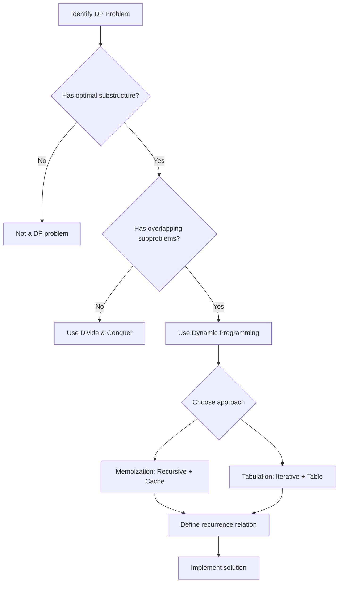

# Dynamic Programming

> [!summary]
> Dynamic Programming (DP) is an algorithmic technique for solving complex problems by breaking them down into simpler subproblems and storing the results to avoid redundant computation. It transforms exponential-time recursive solutions into polynomial-time solutions through careful caching. DP is essential for optimization problems in interviews and real-world applications.

## Theory

### What Is Dynamic Programming?

Dynamic Programming is an optimization technique that solves problems by:
1. **Breaking down** a complex problem into simpler overlapping subproblems
2. **Storing** the solutions to subproblems (avoiding recomputation)
3. **Building up** the final solution from stored results

The term "programming" here refers to a tabular method (like linear programming), not computer programming.

**Key insight**: If you find yourself solving the same subproblem multiple times, DP can help.

### When to Use Dynamic Programming

A problem is a good candidate for DP when it has these two properties:

**1. Optimal Substructure**
The optimal solution contains optimal solutions to its subproblems.

```
Example: Shortest path from A to C through B
If A→B→C is optimal, then A→B and B→C must also be optimal paths.
```

**2. Overlapping Subproblems**
The same subproblems are solved multiple times.

```
Example: Fibonacci(5)
         fib(5)
        /      \
     fib(4)   fib(3)    ← fib(3) computed twice!
     /   \    /    \
  fib(3) fib(2) fib(2) fib(1)
```

### Two Approaches: Memoization vs Tabulation

| Aspect | Memoization (Top-Down) | Tabulation (Bottom-Up) |
|--------|------------------------|------------------------|
| Direction | Start from main problem, recurse down | Start from smallest subproblem, build up |
| Implementation | Recursive + cache | Iterative + table |
| Subproblems solved | Only necessary ones (lazy) | All subproblems (eager) |
| Stack overflow risk | Yes (deep recursion) | No |
| Ease of writing | Often more intuitive | May require thinking about order |
| Space optimization | Harder | Easier (can often reduce to O(1)) |

### How It Works



### Time and Space Complexity

| Approach | Time | Space |
|----------|------|-------|
| Naive Recursion | Often $O(2^n)$ | $O(n)$ call stack |
| Memoization | $O(n \times \text{subproblems})$ | $O(n)$ cache + call stack |
| Tabulation | $O(n \times \text{subproblems})$ | $O(n)$ table (often optimizable) |

## Practical Examples

### Basic Usage - Fibonacci (Both Approaches)

The classic example: $F(n) = F(n-1) + F(n-2)$ with $F(0) = 0, F(1) = 1$

```java
public class Fibonacci {
    
    // Naive recursive - O(2^n) time, O(n) space
    public static int fibNaive(int n) {
        if (n <= 1) return n;
        return fibNaive(n - 1) + fibNaive(n - 2);
    }
    
    // Memoization (Top-Down) - O(n) time, O(n) space
    public static int fibMemo(int n, int[] memo) {
        if (n <= 1) return n;
        
        // Return cached result if exists
        if (memo[n] != 0) return memo[n];
        
        // Compute and cache
        memo[n] = fibMemo(n - 1, memo) + fibMemo(n - 2, memo);
        return memo[n];
    }
    
    // Tabulation (Bottom-Up) - O(n) time, O(n) space
    public static int fibTab(int n) {
        if (n <= 1) return n;
        
        int[] dp = new int[n + 1];
        dp[0] = 0;
        dp[1] = 1;
        
        for (int i = 2; i <= n; i++) {
            dp[i] = dp[i - 1] + dp[i - 2];
        }
        
        return dp[n];
    }
    
    // Space-Optimized Tabulation - O(n) time, O(1) space
    public static int fibOptimized(int n) {
        if (n <= 1) return n;
        
        int prev2 = 0, prev1 = 1;
        
        for (int i = 2; i <= n; i++) {
            int current = prev1 + prev2;
            prev2 = prev1;
            prev1 = current;
        }
        
        return prev1;
    }
    
    public static void main(String[] args) {
        int n = 10;
        System.out.println("Fib(" + n + ") = " + fibOptimized(n));  // 55
    }
}
```

```python
from functools import lru_cache

# Naive recursive - O(2^n) time
def fib_naive(n):
    if n <= 1:
        return n
    return fib_naive(n - 1) + fib_naive(n - 2)

# Memoization using decorator - O(n) time, O(n) space
@lru_cache(maxsize=None)
def fib_memo(n):
    if n <= 1:
        return n
    return fib_memo(n - 1) + fib_memo(n - 2)

# Manual memoization
def fib_memo_manual(n, memo=None):
    if memo is None:
        memo = {}
    
    if n <= 1:
        return n
    
    if n in memo:
        return memo[n]
    
    memo[n] = fib_memo_manual(n - 1, memo) + fib_memo_manual(n - 2, memo)
    return memo[n]

# Tabulation (Bottom-Up) - O(n) time, O(n) space
def fib_tab(n):
    if n <= 1:
        return n
    
    dp = [0] * (n + 1)
    dp[1] = 1
    
    for i in range(2, n + 1):
        dp[i] = dp[i - 1] + dp[i - 2]
    
    return dp[n]

# Space-Optimized - O(n) time, O(1) space
def fib_optimized(n):
    if n <= 1:
        return n
    
    prev2, prev1 = 0, 1
    
    for _ in range(2, n + 1):
        prev2, prev1 = prev1, prev1 + prev2
    
    return prev1

# Example usage
print(f"Fib(10) = {fib_optimized(10)}")  # 55
```

### Intermediate Example - Climbing Stairs

You can climb 1 or 2 steps at a time. How many distinct ways to reach the top?

```java
public class ClimbingStairs {
    
    // Recurrence: ways(n) = ways(n-1) + ways(n-2)
    // Base cases: ways(1) = 1, ways(2) = 2
    
    public int climbStairs(int n) {
        if (n <= 2) return n;
        
        // Space-optimized tabulation
        int prev2 = 1;  // ways to reach step 1
        int prev1 = 2;  // ways to reach step 2
        
        for (int i = 3; i <= n; i++) {
            int current = prev1 + prev2;
            prev2 = prev1;
            prev1 = current;
        }
        
        return prev1;
    }
    
    // Generalized: climb 1, 2, or 3 steps
    public int climbStairsK(int n, int k) {
        int[] dp = new int[n + 1];
        dp[0] = 1;  // 1 way to stay at ground
        
        for (int i = 1; i <= n; i++) {
            for (int j = 1; j <= k && j <= i; j++) {
                dp[i] += dp[i - j];
            }
        }
        
        return dp[n];
    }
}
```

```python
def climb_stairs(n):
    """
    Number of distinct ways to climb n stairs (1 or 2 steps at a time).
    Recurrence: dp[i] = dp[i-1] + dp[i-2]
    """
    if n <= 2:
        return n
    
    prev2, prev1 = 1, 2
    
    for _ in range(3, n + 1):
        prev2, prev1 = prev1, prev1 + prev2
    
    return prev1

def climb_stairs_k(n, k):
    """
    Generalized: can take 1 to k steps at a time.
    """
    dp = [0] * (n + 1)
    dp[0] = 1  # 1 way to stay at ground
    
    for i in range(1, n + 1):
        for j in range(1, min(k, i) + 1):
            dp[i] += dp[i - j]
    
    return dp[n]

print(f"Ways to climb 5 stairs: {climb_stairs(5)}")  # 8
print(f"Ways with 1-3 steps: {climb_stairs_k(5, 3)}")  # 13
```

### Intermediate Example - Coin Change (Minimum Coins)

Given coins of different denominations, find the minimum number of coins to make a target amount.

```java
import java.util.Arrays;

public class CoinChange {
    
    public int coinChange(int[] coins, int amount) {
        // dp[i] = minimum coins needed for amount i
        int[] dp = new int[amount + 1];
        Arrays.fill(dp, amount + 1);  // Initialize with impossible value
        dp[0] = 0;  // 0 coins needed for amount 0
        
        for (int i = 1; i <= amount; i++) {
            for (int coin : coins) {
                if (coin <= i && dp[i - coin] != amount + 1) {
                    dp[i] = Math.min(dp[i], dp[i - coin] + 1);
                }
            }
        }
        
        return dp[amount] > amount ? -1 : dp[amount];
    }
    
    public static void main(String[] args) {
        CoinChange cc = new CoinChange();
        int[] coins = {1, 2, 5};
        int amount = 11;
        System.out.println("Min coins for " + amount + ": " + cc.coinChange(coins, amount));
        // Output: 3 (5 + 5 + 1)
    }
}
```

```python
def coin_change(coins, amount):
    """
    Find minimum coins needed to make amount.
    Returns -1 if impossible.
    
    Recurrence: dp[i] = min(dp[i - coin] + 1) for each valid coin
    """
    # dp[i] = minimum coins for amount i
    dp = [float('inf')] * (amount + 1)
    dp[0] = 0
    
    for i in range(1, amount + 1):
        for coin in coins:
            if coin <= i and dp[i - coin] != float('inf'):
                dp[i] = min(dp[i], dp[i - coin] + 1)
    
    return dp[amount] if dp[amount] != float('inf') else -1

# Example
coins = [1, 2, 5]
amount = 11
print(f"Min coins for {amount}: {coin_change(coins, amount)}")  # 3 (5+5+1)
```

### Advanced Example - 0/1 Knapsack Problem

Given weights and values of items, maximize value within weight capacity.

```java
public class Knapsack {
    
    // 2D DP approach - O(n*W) time, O(n*W) space
    public int knapsack2D(int[] weights, int[] values, int capacity) {
        int n = weights.length;
        // dp[i][w] = max value using items 0..i-1 with capacity w
        int[][] dp = new int[n + 1][capacity + 1];
        
        for (int i = 1; i <= n; i++) {
            int weight = weights[i - 1];
            int value = values[i - 1];
            
            for (int w = 0; w <= capacity; w++) {
                // Don't take item i
                dp[i][w] = dp[i - 1][w];
                
                // Take item i (if it fits)
                if (weight <= w) {
                    dp[i][w] = Math.max(dp[i][w], dp[i - 1][w - weight] + value);
                }
            }
        }
        
        return dp[n][capacity];
    }
    
    // Space-optimized - O(n*W) time, O(W) space
    public int knapsack1D(int[] weights, int[] values, int capacity) {
        int[] dp = new int[capacity + 1];
        
        for (int i = 0; i < weights.length; i++) {
            // Traverse backwards to avoid using same item twice
            for (int w = capacity; w >= weights[i]; w--) {
                dp[w] = Math.max(dp[w], dp[w - weights[i]] + values[i]);
            }
        }
        
        return dp[capacity];
    }
    
    public static void main(String[] args) {
        Knapsack ks = new Knapsack();
        int[] weights = {1, 2, 3, 5};
        int[] values = {1, 6, 10, 16};
        int capacity = 7;
        
        System.out.println("Max value: " + ks.knapsack1D(weights, values, capacity));
        // Output: 22 (items with weights 2 and 5, values 6 and 16)
    }
}
```

```python
def knapsack_2d(weights, values, capacity):
    """
    0/1 Knapsack: maximize value within capacity.
    Each item can only be taken once.
    
    dp[i][w] = max value using items 0..i-1 with capacity w
    """
    n = len(weights)
    dp = [[0] * (capacity + 1) for _ in range(n + 1)]
    
    for i in range(1, n + 1):
        weight, value = weights[i - 1], values[i - 1]
        
        for w in range(capacity + 1):
            # Don't take item i
            dp[i][w] = dp[i - 1][w]
            
            # Take item i (if it fits)
            if weight <= w:
                dp[i][w] = max(dp[i][w], dp[i - 1][w - weight] + value)
    
    return dp[n][capacity]

def knapsack_1d(weights, values, capacity):
    """Space-optimized version using 1D array."""
    dp = [0] * (capacity + 1)
    
    for weight, value in zip(weights, values):
        # Traverse backwards to avoid using same item twice
        for w in range(capacity, weight - 1, -1):
            dp[w] = max(dp[w], dp[w - weight] + value)
    
    return dp[capacity]

# Example
weights = [1, 2, 3, 5]
values = [1, 6, 10, 16]
capacity = 7

print(f"Max value: {knapsack_1d(weights, values, capacity)}")  # 22
```

### Advanced Example - Longest Common Subsequence (LCS)

Find the length of the longest subsequence common to two strings.

```java
public class LCS {
    
    public int longestCommonSubsequence(String text1, String text2) {
        int m = text1.length(), n = text2.length();
        // dp[i][j] = LCS length of text1[0..i-1] and text2[0..j-1]
        int[][] dp = new int[m + 1][n + 1];
        
        for (int i = 1; i <= m; i++) {
            for (int j = 1; j <= n; j++) {
                if (text1.charAt(i - 1) == text2.charAt(j - 1)) {
                    // Characters match: extend LCS
                    dp[i][j] = dp[i - 1][j - 1] + 1;
                } else {
                    // Take best of excluding either character
                    dp[i][j] = Math.max(dp[i - 1][j], dp[i][j - 1]);
                }
            }
        }
        
        return dp[m][n];
    }
    
    // Reconstruct the actual LCS string
    public String getLCS(String text1, String text2) {
        int m = text1.length(), n = text2.length();
        int[][] dp = new int[m + 1][n + 1];
        
        // Fill DP table
        for (int i = 1; i <= m; i++) {
            for (int j = 1; j <= n; j++) {
                if (text1.charAt(i - 1) == text2.charAt(j - 1)) {
                    dp[i][j] = dp[i - 1][j - 1] + 1;
                } else {
                    dp[i][j] = Math.max(dp[i - 1][j], dp[i][j - 1]);
                }
            }
        }
        
        // Backtrack to find LCS
        StringBuilder lcs = new StringBuilder();
        int i = m, j = n;
        while (i > 0 && j > 0) {
            if (text1.charAt(i - 1) == text2.charAt(j - 1)) {
                lcs.append(text1.charAt(i - 1));
                i--; j--;
            } else if (dp[i - 1][j] > dp[i][j - 1]) {
                i--;
            } else {
                j--;
            }
        }
        
        return lcs.reverse().toString();
    }
    
    public static void main(String[] args) {
        LCS lcs = new LCS();
        String s1 = "abcde", s2 = "ace";
        System.out.println("LCS length: " + lcs.longestCommonSubsequence(s1, s2));  // 3
        System.out.println("LCS string: " + lcs.getLCS(s1, s2));  // "ace"
    }
}
```

```python
def longest_common_subsequence(text1, text2):
    """
    Find length of longest common subsequence.
    
    Recurrence:
    - If chars match: dp[i][j] = dp[i-1][j-1] + 1
    - Else: dp[i][j] = max(dp[i-1][j], dp[i][j-1])
    """
    m, n = len(text1), len(text2)
    dp = [[0] * (n + 1) for _ in range(m + 1)]
    
    for i in range(1, m + 1):
        for j in range(1, n + 1):
            if text1[i - 1] == text2[j - 1]:
                dp[i][j] = dp[i - 1][j - 1] + 1
            else:
                dp[i][j] = max(dp[i - 1][j], dp[i][j - 1])
    
    return dp[m][n]

def get_lcs_string(text1, text2):
    """Reconstruct the actual LCS string."""
    m, n = len(text1), len(text2)
    dp = [[0] * (n + 1) for _ in range(m + 1)]
    
    for i in range(1, m + 1):
        for j in range(1, n + 1):
            if text1[i - 1] == text2[j - 1]:
                dp[i][j] = dp[i - 1][j - 1] + 1
            else:
                dp[i][j] = max(dp[i - 1][j], dp[i][j - 1])
    
    # Backtrack
    lcs = []
    i, j = m, n
    while i > 0 and j > 0:
        if text1[i - 1] == text2[j - 1]:
            lcs.append(text1[i - 1])
            i -= 1
            j -= 1
        elif dp[i - 1][j] > dp[i][j - 1]:
            i -= 1
        else:
            j -= 1
    
    return ''.join(reversed(lcs))

# Example
s1, s2 = "abcde", "ace"
print(f"LCS length: {longest_common_subsequence(s1, s2)}")  # 3
print(f"LCS string: {get_lcs_string(s1, s2)}")  # "ace"
```

## Common Patterns

> [!tip] Start with Recurrence Relation
> Before coding, write the recurrence relation mathematically. For example:
> - Fibonacci: `F(n) = F(n-1) + F(n-2)`
> - Coin change: `dp[i] = min(dp[i], dp[i-coin] + 1)`
> This clarifies what state you need and how to transition.

> [!tip] Use @lru_cache in Python
> Python's `functools.lru_cache` decorator automatically memoizes functions. Just add `@lru_cache(maxsize=None)` above your recursive function for instant memoization.

> [!tip] Space Optimization Pattern
> If your DP only depends on the previous row (like Fibonacci, Knapsack), you can reduce O(n×m) space to O(m) by keeping only two rows, or even O(1) for 1D problems.

> [!warning] Don't Forget Base Cases
> Every DP solution needs explicit base cases. Missing or incorrect base cases cause wrong answers or infinite recursion. Always define what happens at the smallest subproblem.

> [!warning] Watch the Traversal Direction in 1D Optimization
> When optimizing 0/1 Knapsack to 1D, traverse **backwards** to avoid using the same item twice. For unbounded knapsack, traverse forwards. Getting this wrong gives incorrect results.

## Edge Cases & Gotchas

- **Empty input**: Handle empty arrays/strings as base cases (usually return 0)
- **Single element**: Often a special base case
- **Integer overflow**: For counting problems, results can be huge—use modulo if needed
- **Negative numbers**: Some DP problems (like max subarray) behave differently with negatives
- **Floating point**: Avoid if possible; use integers or fractions
- **Stack overflow**: Deep memoization can overflow—switch to tabulation for very large inputs

## DP Problem Categories

| Category | Examples | Key Insight |
|----------|----------|-------------|
| Linear | Fibonacci, Climbing Stairs, House Robber | `dp[i]` depends on `dp[i-1]`, `dp[i-2]` |
| Grid | Unique Paths, Min Path Sum | `dp[i][j]` depends on `dp[i-1][j]`, `dp[i][j-1]` |
| String | LCS, Edit Distance, Palindrome | Two-pointer state `dp[i][j]` |
| Knapsack | 0/1 Knapsack, Coin Change, Subset Sum | Take or skip each item |
| Interval | Matrix Chain, Burst Balloons | `dp[i][j]` = best for range `[i,j]` |
| Tree | House Robber III, Tree Diameter | Postorder DFS + memoization |

## Related Topics

- [[Recursion]] - Foundation for memoization approach
- [[Big-O-Notation]] - Understanding DP complexity improvements
- [[Depth-First-Search]] - Tree DP often uses DFS
- [[Greedy-Algorithms]] - When local optimal = global optimal (no DP needed)
- [[Divide-and-Conquer]] - Similar but subproblems don't overlap

## References

- [GeeksforGeeks - Dynamic Programming](https://www.geeksforgeeks.org/dynamic-programming/)
- [AlgoMap - Dynamic Programming](https://algomap.io/lessons/dynamic-programming)
- [MIT 6.006 - Dynamic Programming](https://ocw.mit.edu/courses/6-006-introduction-to-algorithms-spring-2020/)
- [Tabulation vs Memoization - GeeksforGeeks](https://www.geeksforgeeks.org/tabulation-vs-memoization/)
