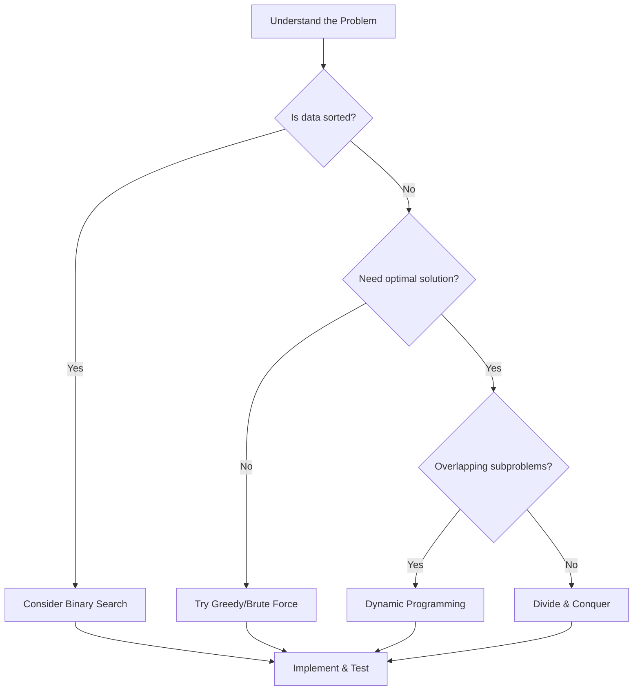

# Algorithms

> [!summary]
> An algorithm is a step-by-step procedure for solving a problem. Understanding algorithms is essential for writing efficient code, passing technical interviews, and solving complex problems. This section covers fundamental algorithms that every programmer should know.

## Prerequisites

Before diving in:
- [[Big-O-Notation]] — How we measure algorithm efficiency
- [[Data-Structures/_Index]] — Algorithms operate on data structures

## Algorithm Categories

### Searching

Finding elements in data structures:

| Algorithm | Time | Space | Use Case |
|-----------|------|-------|----------|
| [[Linear-Search]] | $O(n)$ | $O(1)$ | Unsorted data |
| [[Binary-Search]] | $O(\log n)$ | $O(1)$ | Sorted data |
| [[Depth-First-Search]] | $O(V + E)$ | $O(V)$ | Graph/tree traversal |
| [[Breadth-First-Search]] | $O(V + E)$ | $O(V)$ | Shortest path (unweighted) |

### Sorting

Organizing data in order:

| Algorithm | Best | Average | Worst | Space | Stable |
|-----------|------|---------|-------|-------|--------|
| [[Bubble-Sort]] | $O(n)$ | $O(n^2)$ | $O(n^2)$ | $O(1)$ | Yes |
| [[Selection-Sort]] | $O(n^2)$ | $O(n^2)$ | $O(n^2)$ | $O(1)$ | No |
| [[Insertion-Sort]] | $O(n)$ | $O(n^2)$ | $O(n^2)$ | $O(1)$ | Yes |
| [[Merge-Sort]] | $O(n \log n)$ | $O(n \log n)$ | $O(n \log n)$ | $O(n)$ | Yes |
| [[Quick-Sort]] | $O(n \log n)$ | $O(n \log n)$ | $O(n^2)$ | $O(\log n)$ | No |
| [[Heap-Sort]] | $O(n \log n)$ | $O(n \log n)$ | $O(n \log n)$ | $O(1)$ | No |

See [[Sorting-Algorithms]] for comprehensive comparison.

### Recursion & Divide and Conquer

Breaking problems into smaller subproblems:

- [[Recursion]] — Foundation for many algorithms
- [[Divide-and-Conquer]] — Split, solve, combine
- [[Backtracking]] — Explore all possibilities, prune invalid paths

### Dynamic Programming

Optimization through caching subproblem solutions:

- [[Dynamic-Programming]] — Complete guide with memoization and tabulation
- [[Longest-Common-Subsequence]] — Classic string DP
- [[Knapsack-Problems]] — Selection optimization

### Graph Algorithms

Traversing and analyzing graphs:

- [[Depth-First-Search]] — Depth-First Search
- [[Breadth-First-Search]] — Breadth-First Search
- [[Dijkstra]] — Shortest path (weighted)
- [[Topological-Sort]] — Ordering dependencies
- [[Union-Find]] — Connected components

### Greedy Algorithms

Making locally optimal choices:

- [[Greedy-Algorithms]] — When local optimal = global optimal
- [[Interval-Scheduling]] — Activity selection
- [[Huffman-Coding]] — Optimal prefix codes

## Fundamental Techniques

### Two Pointers
```python
# Opposite ends
left, right = 0, len(arr) - 1
while left < right:
    # process arr[left], arr[right]

# Same direction (fast/slow)
slow = fast = 0
while fast < len(arr):
    # move at different speeds
```

### Sliding Window
```python
# Fixed window
window_sum = sum(arr[:k])
for i in range(k, len(arr)):
    window_sum += arr[i] - arr[i-k]

# Variable window
left = 0
for right in range(len(arr)):
    # expand window
    while condition:
        # shrink from left
        left += 1
```

### Binary Search Template
```python
left, right = 0, len(arr) - 1
while left <= right:
    mid = (left + right) // 2
    if arr[mid] == target:
        return mid
    elif arr[mid] < target:
        left = mid + 1
    else:
        right = mid - 1
```

### BFS Template
```python
from collections import deque

queue = deque([start])
visited = {start}

while queue:
    node = queue.popleft()
    for neighbor in graph[node]:
        if neighbor not in visited:
            visited.add(neighbor)
            queue.append(neighbor)
```

### DFS Template
```python
def dfs(node, visited):
    if node in visited:
        return
    visited.add(node)
    
    for neighbor in graph[node]:
        dfs(neighbor, visited)
```

## Problem-Solving Strategy



## Learning Path

**Beginner:**
1. [[Recursion]] — Master this first!
2. [[Binary-Search]] — Logarithmic searching
3. [[Sorting-Algorithms]] — Understand the basics

**Intermediate:**
4. [[Depth-First-Search]] and [[Breadth-First-Search]] — Graph traversal
5. [[Two-Pointers]] — Array manipulation
6. [[Sliding-Window]] — Subarray problems

**Advanced:**
7. [[Dynamic-Programming]] — Optimization
8. [[Backtracking]] — Exhaustive search
9. [[Graph-Algorithms]] — Complex relationships

## Complexity Cheat Sheet

| Algorithm | Time | Space |
|-----------|------|-------|
| Binary Search | $O(\log n)$ | $O(1)$ |
| Merge Sort | $O(n \log n)$ | $O(n)$ |
| Quick Sort | $O(n \log n)$ avg | $O(\log n)$ |
| BFS/DFS | $O(V + E)$ | $O(V)$ |
| Dijkstra | $O((V + E) \log V)$ | $O(V)$ |
| DP (typical) | $O(n^2)$ or $O(n \cdot m)$ | $O(n)$ or $O(n \cdot m)$ |

## Common Interview Patterns

| Pattern | Problems | Technique |
|---------|----------|-----------|
| "Find target in sorted" | Search, Square root | Binary Search |
| "Subarray/substring" | Max sum, Longest | Sliding Window |
| "All pairs" | Two Sum, Palindrome | Two Pointers |
| "Traverse graph/tree" | Path finding, Levels | BFS/DFS |
| "Optimization" | Knapsack, Coins | DP |
| "All combinations" | Permutations, Subsets | Backtracking |

## See Also

- [[Data-Structures/_Index]] — What algorithms operate on
- [[Design-Patterns/_Index]] — Higher-level code organization
- [[Big-O-Notation]] — Measuring efficiency

## References

- [MIT 6.006 - Introduction to Algorithms](https://ocw.mit.edu/courses/6-006-introduction-to-algorithms-spring-2020/)
- [Visualgo](https://visualgo.net/) — Algorithm visualizations
- [CLRS - Introduction to Algorithms](https://mitpress.mit.edu/9780262046305/introduction-to-algorithms/) (The textbook)


---

## By Status

### 🌱 Seeds (need expansion)
```dataview
LIST FROM "Concepts/Algorithms" WHERE status = "seed" AND file.name != "_Index"
```

### 🌿 Growing
```dataview
LIST FROM "Concepts/Algorithms" WHERE status = "growing" AND file.name != "_Index"
```

### 🌳 Evergreen (comprehensive)
```dataview
LIST FROM "Concepts/Algorithms" WHERE status = "evergreen" AND file.name != "_Index"
```

---

## 📊 All Documents (Auto-Generated)

```dataview
TABLE 
    difficulty AS "Level",
    dateformat(date-updated, "yyyy-MM-dd") AS "Updated"
FROM "Concepts/Algorithms"
WHERE file.name != "_Index"
SORT choice(difficulty = "beginner", 1, choice(difficulty = "intermediate", 2, 3)) ASC, file.name ASC
```

## 📈 Documents by Difficulty

### Beginner
```dataview
LIST
FROM "Concepts/Algorithms"
WHERE difficulty = "beginner" AND file.name != "_Index"
SORT file.name ASC
```

### Intermediate
```dataview
LIST
FROM "Concepts/Algorithms"
WHERE difficulty = "intermediate" AND file.name != "_Index"
SORT file.name ASC
```

### Advanced
```dataview
LIST
FROM "Concepts/Algorithms"
WHERE difficulty = "advanced" AND file.name != "_Index"
SORT file.name ASC
```

## 🏷️ By Category

### Searching
```dataview
LIST
FROM "Concepts/Algorithms"
WHERE contains(tags, "searching") AND file.name != "_Index"
```

### Sorting
```dataview
LIST
FROM "Concepts/Algorithms"
WHERE contains(tags, "sorting") AND file.name != "_Index"
```

### Graph Algorithms
```dataview
LIST
FROM "Concepts/Algorithms"
WHERE contains(tags, "graphs") AND file.name != "_Index"
```

## 🕐 Recently Updated

```dataview
TABLE dateformat(date-updated, "yyyy-MM-dd") AS "Last Updated"
FROM "Concepts/Algorithms"
WHERE file.name != "_Index"
SORT date-updated DESC
LIMIT 5
```
