# Big-O Notation

> [!summary]
> Big-O notation describes how an algorithm's runtime or space requirements grow as input size increases. It's the universal language for discussing algorithm efficiency and is essential for technical interviews, choosing data structures, and writing scalable code.

## Theory

### What Is Big-O?

Big-O notation measures the **worst-case** upper bound of an algorithm's growth rate. It answers: "As input grows toward infinity, how does performance scale?"

We care about Big-O because:
- **Scalability** — An $O(n^2)$ algorithm might be fine for 100 items but unusable for 1 million
- **Comparisons** — Objectively compare different approaches
- **Interviews** — Every technical interview asks about complexity
- **Trade-offs** — Balance time vs. space requirements

### How It Works

Big-O ignores:
- **Constants** — $O(2n)$ simplifies to $O(n)$
- **Lower-order terms** — $O(n^2 + n)$ simplifies to $O(n^2)$

We only care about the **dominant term** as $n \to \infty$.

```
O(500)          → O(1)       (constant)
O(3n + 5)       → O(n)       (linear)
O(n² + 1000n)   → O(n²)      (quadratic)
O(2ⁿ + n³)      → O(2ⁿ)      (exponential dominates)
```

## Common Complexities (Best to Worst)

```mermaid
graph LR
    A["O(1)"] --> B["O(log n)"]
    B --> C["O(n)"]
    C --> D["O(n log n)"]
    D --> E["O(n²)"]
    E --> F["O(2ⁿ)"]
    F --> G["O(n!)"]
    
    style A fill:#22c55e
    style B fill:#84cc16
    style C fill:#eab308
    style D fill:#f97316
    style E fill:#ef4444
    style F fill:#dc2626
    style G fill:#991b1b
```



| Big-O         | Name         | Example             | 10 items | 100 items | 1000 items |
| ------------- | ------------ | ------------------- | -------- | --------- | ---------- |
| $O(1)$        | Constant     | Array index access  | 1        | 1         | 1          |
| $O(\log n)$   | Logarithmic  | Binary search       | 3        | 7         | 10         |
| $O(n)$        | Linear       | Loop through array  | 10       | 100       | 1,000      |
| $O(n \log n)$ | Linearithmic | Merge sort          | 33       | 664       | 9,966      |
| $O(n^2)$      | Quadratic    | Nested loops        | 100      | 10,000    | 1,000,000  |
| $O(2^n)$      | Exponential  | Recursive fibonacci | 1,024    | 10³⁰      | 🔥💀🔥     |
| $O(n!)$       | Factorial    | Permutations        | 3.6M     | 🔥💀🔥    | 🔥💀🔥     |

> [!warning] The Exponential Wall
> $O(2^n)$ and $O(n!)$ algorithms become unusable very quickly. An $O(2^n)$ algorithm with $n=50$ would take longer than the age of the universe on the fastest computer.

## Practical Examples

### O(1) — Constant Time

Operations that don't depend on input size:

```java
// Array access by index - always one operation
int getFirst(int[] arr) {
    return arr[0];  // O(1)
}

// HashMap lookup - one hash calculation
String getValue(Map<String, String> map, String key) {
    return map.get(key);  // O(1) average
}

// Math operations
int add(int a, int b) {
    return a + b;  // O(1)
}
```

### O(log n) — Logarithmic Time

Each step eliminates half the remaining input:

```java
// Binary search - halves search space each iteration
int binarySearch(int[] arr, int target) {
    int left = 0, right = arr.length - 1;
    
    while (left <= right) {                    // O(log n) iterations
        int mid = left + (right - left) / 2;
        
        if (arr[mid] == target) return mid;
        else if (arr[mid] < target) left = mid + 1;
        else right = mid - 1;
    }
    return -1;
}
```

> [!tip] Spotting O(log n)
> If you're **halving** the problem each step (or dividing by any constant), it's logarithmic. Binary search, balanced BST operations, and binary exponentiation are classic examples.

### O(n) — Linear Time

Process each element once:

```java
// Find maximum - must check every element
int findMax(int[] arr) {
    int max = arr[0];
    for (int num : arr) {          // O(n) - one pass
        if (num > max) max = num;
    }
    return max;
}

// Sum all elements
int sum(int[] arr) {
    int total = 0;
    for (int num : arr) {          // O(n)
        total += num;
    }
    return total;
}
```

### O(n log n) — Linearithmic Time

Divide-and-conquer algorithms:

```java
// Merge sort - divide in half (log n), merge all elements (n)
void mergeSort(int[] arr, int left, int right) {
    if (left < right) {
        int mid = (left + right) / 2;
        mergeSort(arr, left, mid);      // T(n/2)
        mergeSort(arr, mid + 1, right); // T(n/2)
        merge(arr, left, mid, right);   // O(n)
    }
}
// Total: O(n log n)
```

> [!info] The Sorting Barrier
> $O(n \log n)$ is the theoretical lower bound for comparison-based sorting. Merge sort, quicksort (average), and heapsort all achieve this.

### O(n²) — Quadratic Time

Nested loops over the input:

```java
// Check all pairs - nested loops
boolean hasDuplicate(int[] arr) {
    for (int i = 0; i < arr.length; i++) {           // O(n)
        for (int j = i + 1; j < arr.length; j++) {   // O(n)
            if (arr[i] == arr[j]) return true;
        }
    }
    return false;
}
// Total: O(n × n) = O(n²)

// Bubble sort - classic O(n²) example
void bubbleSort(int[] arr) {
    for (int i = 0; i < arr.length; i++) {           // O(n)
        for (int j = 0; j < arr.length - i - 1; j++) { // O(n)
            if (arr[j] > arr[j + 1]) {
                swap(arr, j, j + 1);
            }
        }
    }
}
```

> [!warning] O(n²) Doesn't Scale
> Quadratic algorithms become painfully slow:
> - 1,000 items: 1 million operations
> - 10,000 items: 100 million operations
> - 100,000 items: 10 billion operations
> 
> Always look for $O(n)$ or $O(n \log n)$ alternatives.

### O(2ⁿ) — Exponential Time

Each step doubles the work:

```java
// Naive recursive Fibonacci - DON'T DO THIS!
int fib(int n) {
    if (n <= 1) return n;
    return fib(n - 1) + fib(n - 2);  // Two recursive calls = O(2ⁿ)
}

// fib(50) would take YEARS to compute

// Better: O(n) with memoization
int fibMemo(int n, int[] memo) {
    if (n <= 1) return n;
    if (memo[n] != 0) return memo[n];
    memo[n] = fibMemo(n - 1, memo) + fibMemo(n - 2, memo);
    return memo[n];
}
```

### Python Examples

```python
# O(1) - Constant
def get_first(lst: list) -> any:
    return lst[0]  # Direct access

# O(n) - Linear
def find_max(lst: list[int]) -> int:
    max_val = lst[0]
    for num in lst:  # Visit each element once
        if num > max_val:
            max_val = num
    return max_val

# O(n²) - Quadratic
def has_duplicate_naive(lst: list) -> bool:
    for i in range(len(lst)):           # O(n)
        for j in range(i + 1, len(lst)): # O(n)
            if lst[i] == lst[j]:
                return True
    return False

# O(n) - Linear (using hash set)
def has_duplicate_optimal(lst: list) -> bool:
    seen = set()
    for item in lst:        # O(n)
        if item in seen:    # O(1) average
            return True
        seen.add(item)      # O(1) average
    return False
```

## Space Complexity

Big-O also measures memory usage:

```java
// O(1) space - only using fixed variables
int sum(int[] arr) {
    int total = 0;  // One variable regardless of input size
    for (int num : arr) {
        total += num;
    }
    return total;
}

// O(n) space - creating new array proportional to input
int[] double(int[] arr) {
    int[] result = new int[arr.length];  // New array of size n
    for (int i = 0; i < arr.length; i++) {
        result[i] = arr[i] * 2;
    }
    return result;
}

// O(n) space - recursive call stack
int factorial(int n) {
    if (n <= 1) return 1;
    return n * factorial(n - 1);  // n stack frames
}
```

## Analyzing Your Code

### Step-by-Step Process

1. **Identify the input** — What is $n$?
2. **Count operations** — How many times does each line run?
3. **Find the dominant term** — Drop constants and lower terms
4. **Consider worst case** — What input causes maximum operations?

### Example Analysis

```java
void mystery(int[] arr) {
    int n = arr.length;
    
    // Part 1: Single loop
    for (int i = 0; i < n; i++) {        // Runs n times
        System.out.println(arr[i]);       // O(1) each
    }
    // Part 1 total: O(n)
    
    // Part 2: Nested loop
    for (int i = 0; i < n; i++) {        // Runs n times
        for (int j = 0; j < n; j++) {    // Runs n times each
            System.out.println(i + j);    // O(1) each
        }
    }
    // Part 2 total: O(n²)
    
    // Part 3: Independent loop
    for (int k = 0; k < 1000; k++) {     // Runs 1000 times (constant!)
        System.out.println(k);
    }
    // Part 3 total: O(1)
}
// Overall: O(n) + O(n²) + O(1) = O(n²)
```

## Common Patterns Cheat Sheet

| Pattern | Complexity | Example |
|---------|------------|---------|
| Single loop | $O(n)$ | `for i in range(n)` |
| Nested loops (independent) | $O(n \times m)$ | Two arrays |
| Nested loops (same array) | $O(n^2)$ | All pairs |
| Loop with halving | $O(\log n)$ | `while n > 0: n //= 2` |
| Loop calling O(n) function | $O(n^2)$ | `for i: linear_search()` |
| Divide and conquer | $O(n \log n)$ | Merge sort |
| Recursion (branching) | $O(2^n)$ | Naive Fibonacci |
| Hash table operations | $O(1)$ average | `dict[key]` |

## Common Mistakes

> [!warning] Hidden Loops
> Some operations hide loops:
> ```python
> # This is O(n), not O(1)!
> if item in my_list:  # Linear search
>     pass
> 
> # This IS O(1) average
> if item in my_set:   # Hash lookup
>     pass
> ```

> [!warning] String Concatenation
> In many languages, string concatenation in a loop is $O(n^2)$:
> ```python
> # O(n²) - creates new string each iteration
> result = ""
> for char in chars:
>     result += char
> 
> # O(n) - use join
> result = "".join(chars)
> ```

## Related Topics

- [[Arrays]] — $O(1)$ access, $O(n)$ search
- [[Hash-Tables]] — $O(1)$ average operations
- [[Binary-Search]] — $O(\log n)$ searching
- [[Sorting-Algorithms]] — Compare $O(n^2)$ vs $O(n \log n)$
- [[Recursion]] — Analyzing recursive complexity

## References

- [Big-O Cheat Sheet](https://www.bigocheatsheet.com/)
- [Khan Academy - Asymptotic Notation](https://www.khanacademy.org/computing/computer-science/algorithms/asymptotic-notation)
- [MIT 6.006 - Introduction to Algorithms](https://ocw.mit.edu/courses/6-006-introduction-to-algorithms-spring-2020/)
