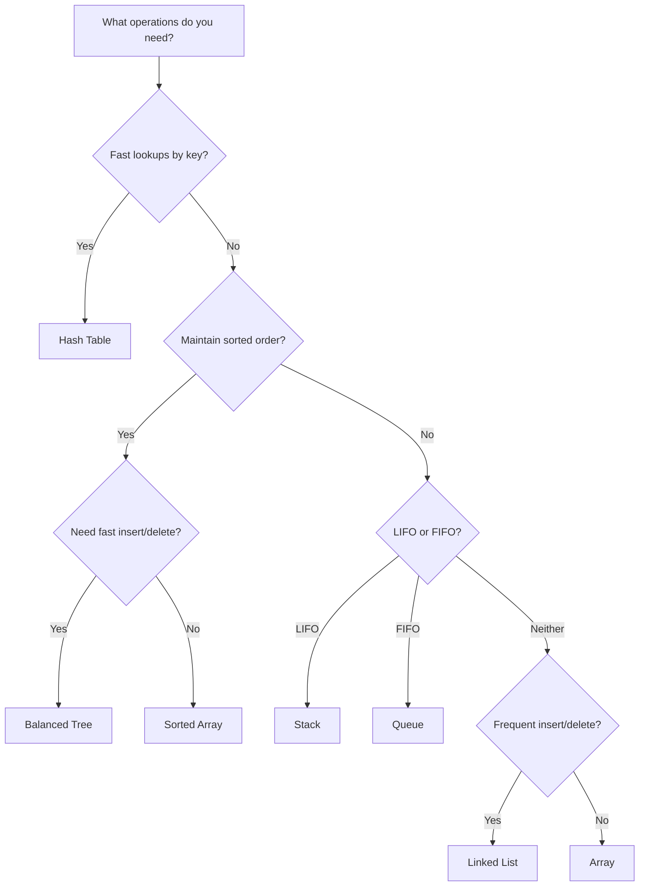

# Data Structures

> [!summary]
> Data structures are specialized formats for organizing, storing, and accessing data. Choosing the right data structure is often the difference between a solution that works and one that works *efficiently*. Understanding these fundamentals is essential for writing performant code and succeeding in technical interviews.

## Why Data Structures Matter

Every program manipulates data. The structure you choose determines:
- **Time complexity** — How fast operations complete
- **Space complexity** — How much memory is used
- **Code clarity** — How easy the solution is to understand
- **Scalability** — How well it handles growth

> [!tip] The Right Tool for the Job
> There's no "best" data structure—only the best one for your specific use case. A hash table is $O(1)$ for lookups but unordered. A tree is $O(\log n)$ but maintains order. Know the trade-offs.

## Prerequisites

Before diving into specific structures, understand:
- [[Big-O-Notation]] — How we measure efficiency (READ THIS FIRST!)

## Linear Data Structures

Data arranged in sequential order:

| Structure | Access | Search | Insert | Delete | Use Case |
|-----------|--------|--------|--------|--------|----------|
| [[Arrays]] | $O(1)$ | $O(n)$ | $O(n)$ | $O(n)$ | Fixed-size, indexed access |
| [[Linked-Lists]] | $O(n)$ | $O(n)$ | $O(1)$ | $O(1)$ | Frequent insertions/deletions |
| [[Stacks]] | $O(n)$ | $O(n)$ | $O(1)$ | $O(1)$ | LIFO: undo, parsing, recursion |
| [[Queues]] | $O(n)$ | $O(n)$ | $O(1)$ | $O(1)$ | FIFO: scheduling, BFS |

## Associative Data Structures

Data organized for fast key-based access:

| Structure | Search | Insert | Delete | Use Case |
|-----------|--------|--------|--------|----------|
| [[Hash-Tables]] | $O(1)$* | $O(1)$* | $O(1)$* | Fast lookups, caching, counting |
| [[Sets]] | $O(1)$* | $O(1)$* | $O(1)$* | Unique elements, membership tests |

*Average case; worst case is $O(n)$

## Hierarchical Data Structures

Data organized in parent-child relationships:

| Structure | Search | Insert | Delete | Use Case |
|-----------|--------|--------|--------|----------|
| [[Trees]] | $O(\log n)$* | $O(\log n)$* | $O(\log n)$* | Hierarchies, sorted data |
| [[Binary-Search-Trees]] | $O(\log n)$* | $O(\log n)$* | $O(\log n)$* | Ordered data, range queries |
| [[Heaps]] | $O(n)$ | $O(\log n)$ | $O(\log n)$ | Priority queues, scheduling |
| [[Tries]] | $O(m)$ | $O(m)$ | $O(m)$ | Autocomplete, spell check (m = key length) |

*Balanced trees; unbalanced can degrade to $O(n)$

## Graph Data Structures

Data with complex relationships:

- [[Graphs]] — Nodes connected by edges (social networks, maps)
- [[Adjacency-Matrix]] — 2D array representation
- [[Adjacency-List]] — Array of linked lists representation

## Choosing the Right Structure



## Common Interview Patterns

| Problem Type | Go-To Structure |
|--------------|-----------------|
| "Find duplicates" | Hash Set |
| "Count occurrences" | Hash Map |
| "Undo/redo" | Stack |
| "Level-order traversal" | Queue |
| "Find k-th largest" | Heap |
| "Autocomplete" | Trie |
| "Shortest path" | Graph + BFS/Dijkstra |

## Learning Path

**Beginner:**
1. [[Big-O-Notation]] — Start here!
2. [[Arrays]] — The foundation
3. [[Linked-Lists]] — Dynamic alternative
4. [[Stacks]] and [[Queues]] — Restricted access patterns

**Intermediate:**
5. [[Hash-Tables]] — The workhorse
6. [[Trees]] — Hierarchical thinking
7. [[Heaps]] — Priority management

**Advanced:**
8. [[Graphs]] — Complex relationships
9. [[Tries]] — String optimization
10. [[Advanced-Trees]] — AVL, Red-Black, B-Trees

## See Also

- [[Algorithms/_Index]] — How to manipulate these structures
- [[Design-Patterns/_Index]] — Higher-level organization patterns
- [[Time-Complexity]] — Detailed analysis techniques

## References

- [Visualgo](https://visualgo.net/) — Animated visualizations of data structures
- [Big-O Cheat Sheet](https://www.bigocheatsheet.com/) — Quick complexity reference
- [MIT OpenCourseWare - Introduction to Algorithms](https://ocw.mit.edu/courses/6-006-introduction-to-algorithms-spring-2020/)


---

## By Status

### 🌱 Seeds (need expansion)
```dataview
LIST FROM "Concepts/Data-Structures" WHERE status = "seed" AND file.name != "_Index"
```

### 🌿 Growing
```dataview
LIST FROM "Concepts/Data-Structures" WHERE status = "growing" AND file.name != "_Index"
```

### 🌳 Evergreen (comprehensive)
```dataview
LIST FROM "Concepts/Data-Structures" WHERE status = "evergreen" AND file.name != "_Index"
```

---

## 📊 All Documents (Auto-Generated)

```dataview
TABLE 
    difficulty AS "Level",
    dateformat(date-updated, "yyyy-MM-dd") AS "Updated"
FROM "Concepts/Data-Structures"
WHERE file.name != "_Index"
SORT choice(difficulty = "beginner", 1, choice(difficulty = "intermediate", 2, 3)) ASC, file.name ASC
```

## 📈 Documents by Difficulty

### Beginner
```dataview
LIST
FROM "Concepts/Data-Structures"
WHERE difficulty = "beginner" AND file.name != "_Index"
SORT file.name ASC
```

### Intermediate
```dataview
LIST
FROM "Concepts/Data-Structures"
WHERE difficulty = "intermediate" AND file.name != "_Index"
SORT file.name ASC
```

### Advanced
```dataview
LIST
FROM "Concepts/Data-Structures"
WHERE difficulty = "advanced" AND file.name != "_Index"
SORT file.name ASC
```

## 🕐 Recently Updated

```dataview
TABLE dateformat(date-updated, "yyyy-MM-dd") AS "Last Updated"
FROM "Concepts/Data-Structures"
WHERE file.name != "_Index"
SORT date-updated DESC
LIMIT 5
```
