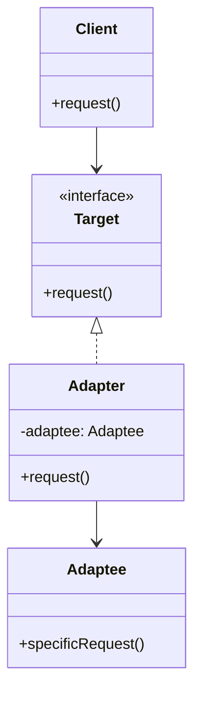

# Adapter Pattern

> [!summary]
> The Adapter pattern allows incompatible interfaces to work together. It acts as a wrapper that translates calls from one interface to another—like a power adapter that lets your laptop plug into foreign outlets. Essential for integrating third-party libraries, legacy code, or systems with different interfaces.

## Theory

### What Is the Adapter Pattern?

Adapter is a **structural design pattern** that converts the interface of a class into another interface that clients expect. It enables classes to work together that couldn't otherwise due to incompatible interfaces.

**Real-world analogies:**
- Power plug adapters (US ↔ EU)
- USB adapters (USB-C to HDMI)
- Language translators
- File format converters

### How It Works



**Participants:**
- **Target** — Interface the client expects
- **Adaptee** — Existing class with incompatible interface
- **Adapter** — Translates Target interface to Adaptee calls
- **Client** — Works with objects through Target interface

### Two Variants

| Type | Description | Language Support |
|------|-------------|------------------|
| **Object Adapter** | Uses composition (holds reference) | All languages |
| **Class Adapter** | Uses inheritance (extends both) | Multiple inheritance only |

## Practical Examples

### Object Adapter (Java)

```java
// Existing interface client uses
interface MediaPlayer {
    void play(String audioType, String fileName);
}

// New interface from third-party library (incompatible)
interface AdvancedMediaPlayer {
    void playVlc(String fileName);
    void playMp4(String fileName);
}

// Concrete implementation of advanced player
class VlcPlayer implements AdvancedMediaPlayer {
    @Override
    public void playVlc(String fileName) {
        System.out.println("Playing VLC file: " + fileName);
    }
    
    @Override
    public void playMp4(String fileName) {
        // Do nothing
    }
}

class Mp4Player implements AdvancedMediaPlayer {
    @Override
    public void playVlc(String fileName) {
        // Do nothing
    }
    
    @Override
    public void playMp4(String fileName) {
        System.out.println("Playing MP4 file: " + fileName);
    }
}

// Adapter - bridges MediaPlayer to AdvancedMediaPlayer
class MediaAdapter implements MediaPlayer {
    private AdvancedMediaPlayer advancedPlayer;
    
    public MediaAdapter(String audioType) {
        if (audioType.equalsIgnoreCase("vlc")) {
            advancedPlayer = new VlcPlayer();
        } else if (audioType.equalsIgnoreCase("mp4")) {
            advancedPlayer = new Mp4Player();
        }
    }
    
    @Override
    public void play(String audioType, String fileName) {
        if (audioType.equalsIgnoreCase("vlc")) {
            advancedPlayer.playVlc(fileName);
        } else if (audioType.equalsIgnoreCase("mp4")) {
            advancedPlayer.playMp4(fileName);
        }
    }
}

// Client
class AudioPlayer implements MediaPlayer {
    private MediaAdapter mediaAdapter;
    
    @Override
    public void play(String audioType, String fileName) {
        // Built-in support
        if (audioType.equalsIgnoreCase("mp3")) {
            System.out.println("Playing MP3 file: " + fileName);
        }
        // Delegating to adapter for other formats
        else if (audioType.equalsIgnoreCase("vlc") || 
                 audioType.equalsIgnoreCase("mp4")) {
            mediaAdapter = new MediaAdapter(audioType);
            mediaAdapter.play(audioType, fileName);
        }
        else {
            System.out.println("Unsupported format: " + audioType);
        }
    }
}

// Usage
AudioPlayer player = new AudioPlayer();
player.play("mp3", "song.mp3");    // Built-in
player.play("vlc", "movie.vlc");  // Via adapter
player.play("mp4", "video.mp4"); // Via adapter
```

### Python Adapter

```python
from abc import ABC, abstractmethod


# Target interface (what client expects)
class Target(ABC):
    @abstractmethod
    def request(self) -> str:
        pass


# Adaptee (incompatible interface)
class Adaptee:
    def specific_request(self) -> str:
        return ".eetpadA eht fo roivaheb laicepS"


# Object Adapter
class Adapter(Target):
    def __init__(self, adaptee: Adaptee):
        self._adaptee = adaptee
    
    def request(self) -> str:
        # Translate the call and transform the result
        return self._adaptee.specific_request()[::-1]  # Reverse string


# Client code
def client_code(target: Target) -> None:
    print(target.request())


# Usage
adaptee = Adaptee()
print(f"Adaptee (incompatible): {adaptee.specific_request()}")

adapter = Adapter(adaptee)
print(f"Adapter (compatible): ", end="")
client_code(adapter)

# Output:
# Adaptee (incompatible): .eetpadA eht fo roivaheb laicepS
# Adapter (compatible): Special behavior of the Adaptee.
```

### Third-Party Library Integration

```java
// Your application's interface
interface PaymentProcessor {
    boolean processPayment(String cardNumber, double amount);
    boolean refundPayment(String transactionId);
}

// Third-party library with different interface
class StripeAPI {
    public String createCharge(Map<String, Object> params) {
        // Stripe-specific implementation
        return "ch_" + UUID.randomUUID().toString();
    }
    
    public boolean createRefund(String chargeId, long amountCents) {
        // Stripe-specific implementation
        return true;
    }
}

// Adapter
class StripePaymentAdapter implements PaymentProcessor {
    private final StripeAPI stripeApi;
    
    public StripePaymentAdapter(StripeAPI stripeApi) {
        this.stripeApi = stripeApi;
    }
    
    @Override
    public boolean processPayment(String cardNumber, double amount) {
        // Translate to Stripe's expected format
        Map<String, Object> params = new HashMap<>();
        params.put("amount", (long)(amount * 100));  // Stripe uses cents
        params.put("currency", "usd");
        params.put("source", cardNumber);
        
        String chargeId = stripeApi.createCharge(params);
        return chargeId != null;
    }
    
    @Override
    public boolean refundPayment(String transactionId) {
        // Stripe expects charge ID and amount in cents
        return stripeApi.createRefund(transactionId, 0);  // Full refund
    }
}

// Usage - your code uses your interface
PaymentProcessor processor = new StripePaymentAdapter(new StripeAPI());
processor.processPayment("4242424242424242", 99.99);
```

### Data Format Adapter

```python
import json
import xml.etree.ElementTree as ET
from abc import ABC, abstractmethod
from typing import Dict, Any


# Target interface - your app works with dicts
class DataParser(ABC):
    @abstractmethod
    def parse(self, data: str) -> Dict[str, Any]:
        pass
    
    @abstractmethod
    def serialize(self, data: Dict[str, Any]) -> str:
        pass


# JSON - already compatible
class JsonParser(DataParser):
    def parse(self, data: str) -> Dict[str, Any]:
        return json.loads(data)
    
    def serialize(self, data: Dict[str, Any]) -> str:
        return json.dumps(data)


# Legacy XML system (Adaptee)
class LegacyXmlProcessor:
    def read_xml(self, xml_string: str) -> ET.Element:
        return ET.fromstring(xml_string)
    
    def write_xml(self, element: ET.Element) -> str:
        return ET.tostring(element, encoding='unicode')


# Adapter for XML
class XmlAdapter(DataParser):
    def __init__(self, xml_processor: LegacyXmlProcessor):
        self._processor = xml_processor
    
    def parse(self, data: str) -> Dict[str, Any]:
        root = self._processor.read_xml(data)
        return self._xml_to_dict(root)
    
    def serialize(self, data: Dict[str, Any]) -> str:
        root = self._dict_to_xml(data)
        return self._processor.write_xml(root)
    
    def _xml_to_dict(self, element: ET.Element) -> Dict[str, Any]:
        result = {}
        for child in element:
            if len(child) == 0:
                result[child.tag] = child.text
            else:
                result[child.tag] = self._xml_to_dict(child)
        return result
    
    def _dict_to_xml(self, data: Dict[str, Any], root_name: str = "root") -> ET.Element:
        root = ET.Element(root_name)
        for key, value in data.items():
            child = ET.SubElement(root, key)
            if isinstance(value, dict):
                for sub_elem in self._dict_to_xml(value, key):
                    child.append(sub_elem)
            else:
                child.text = str(value)
        return root


# Client code works with DataParser interface
def process_data(parser: DataParser, data: str) -> None:
    parsed = parser.parse(data)
    print(f"Parsed: {parsed}")
    serialized = parser.serialize(parsed)
    print(f"Serialized: {serialized}")


# Usage
json_data = '{"name": "John", "age": 30}'
xml_data = '<root><name>John</name><age>30</age></root>'

json_parser = JsonParser()
xml_parser = XmlAdapter(LegacyXmlProcessor())

process_data(json_parser, json_data)
process_data(xml_parser, xml_data)
```

### Duck Typing Adapter (Python)

```python
# In Python, you often don't need formal adapters
# due to duck typing - just add the expected methods!

class LegacyPrinter:
    def print_document(self, text: str):
        print(f"LEGACY: {text}")


class ModernPrinter:
    def output(self, content: str):
        print(f"MODERN: {content}")


# Function expecting 'output' method
def send_to_printer(printer, message: str):
    printer.output(message)


# Simple adapter via wrapper
class PrinterAdapter:
    def __init__(self, legacy_printer: LegacyPrinter):
        self._printer = legacy_printer
    
    def output(self, content: str):
        self._printer.print_document(content)


# Usage
modern = ModernPrinter()
legacy = PrinterAdapter(LegacyPrinter())

send_to_printer(modern, "Hello!")  # Works directly
send_to_printer(legacy, "World!")  # Works via adapter
```

## Common Patterns

> [!tip] When to Use Adapter
> - Integrating third-party libraries
> - Working with legacy code
> - Creating reusable classes for future use
> - Making incompatible classes work together

> [!tip] Adapter vs Facade
> - **Adapter**: Makes one interface match another expected interface
> - **Facade**: Simplifies complex subsystem into single interface
> 
> Adapter is 1:1 interface translation; Facade is many:1 simplification.

> [!warning] Don't Over-Adapt
> If you're writing many adapters between your own classes, it might indicate a design problem. Consider refactoring the interfaces instead.

## Edge Cases & Gotchas

- **Multiple adaptees** — May need multiple adapters or a composite adapter
- **Bi-directional adaptation** — Sometimes need adapters in both directions
- **State management** — Adapter shouldn't add state; keep it pure translation
- **Exception handling** — Translate exceptions from adaptee to expected types

## Related Topics

- [[Facade]] - Simplifies interface; Adapter converts interface
- [[Decorator]] - Same interface, adds behavior; Adapter changes interface
- [[Bridge]] - Separates abstraction from implementation
- [[Proxy]] - Same interface, controls access

## References

- [Refactoring Guru - Adapter](https://refactoring.guru/design-patterns/adapter)
- [Baeldung - Adapter Pattern](https://www.baeldung.com/java-adapter-pattern)
- [Head First Design Patterns](https://www.oreilly.com/library/view/head-first-design/0596007124/) - Chapter 7
