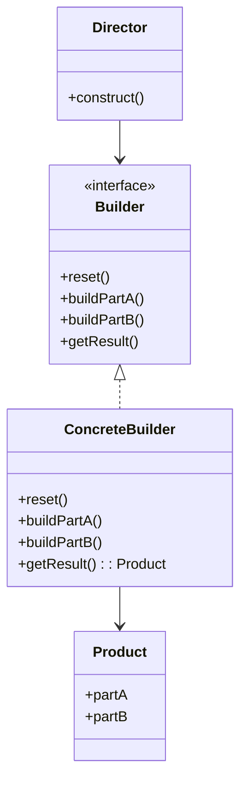

# Builder Pattern

> [!summary]
> The Builder pattern separates the construction of a complex object from its representation, allowing the same construction process to create different representations. It's perfect for objects with many optional parameters, avoiding "telescoping constructors" and providing a fluent, readable API.

## Theory

### What Is the Builder Pattern?

Builder is a **creational design pattern** that constructs complex objects step by step. Instead of a constructor with many parameters, you use method chaining to set properties incrementally.

**Problems it solves:**
- Telescoping constructor anti-pattern (many constructor overloads)
- Objects with many optional parameters
- Need for immutable objects with complex initialization
- Different representations from same construction process

### How It Works



**Participants:**
- **Builder** — Interface declaring construction steps
- **ConcreteBuilder** — Implements steps, tracks the product
- **Product** — The complex object being built
- **Director** (optional) — Defines construction order

## Practical Examples

### Classic Builder (Java)

```java
public class User {
    // Required parameters
    private final String firstName;
    private final String lastName;
    
    // Optional parameters
    private final int age;
    private final String phone;
    private final String address;
    private final String email;
    
    private User(UserBuilder builder) {
        this.firstName = builder.firstName;
        this.lastName = builder.lastName;
        this.age = builder.age;
        this.phone = builder.phone;
        this.address = builder.address;
        this.email = builder.email;
    }
    
    // Getters only - immutable object
    public String getFirstName() { return firstName; }
    public String getLastName() { return lastName; }
    public int getAge() { return age; }
    public String getPhone() { return phone; }
    public String getAddress() { return address; }
    public String getEmail() { return email; }
    
    public static class UserBuilder {
        // Required
        private final String firstName;
        private final String lastName;
        
        // Optional - defaults
        private int age = 0;
        private String phone = "";
        private String address = "";
        private String email = "";
        
        public UserBuilder(String firstName, String lastName) {
            this.firstName = firstName;
            this.lastName = lastName;
        }
        
        public UserBuilder age(int age) {
            this.age = age;
            return this;
        }
        
        public UserBuilder phone(String phone) {
            this.phone = phone;
            return this;
        }
        
        public UserBuilder address(String address) {
            this.address = address;
            return this;
        }
        
        public UserBuilder email(String email) {
            this.email = email;
            return this;
        }
        
        public User build() {
            // Validation can go here
            return new User(this);
        }
    }
}

// Usage - clean and readable!
User user = new User.UserBuilder("John", "Doe")
    .age(30)
    .email("john@example.com")
    .phone("123-456-7890")
    .build();
```

### Lombok @Builder (Java - Modern)

```java
import lombok.Builder;
import lombok.Getter;

@Getter
@Builder
public class User {
    private final String firstName;
    private final String lastName;
    
    @Builder.Default
    private int age = 0;
    
    private String phone;
    private String address;
    private String email;
}

// Usage - same fluent API, zero boilerplate
User user = User.builder()
    .firstName("John")
    .lastName("Doe")
    .age(30)
    .email("john@example.com")
    .build();
```

### Python Builder with Dataclass

```python
from dataclasses import dataclass, field
from typing import Optional


@dataclass
class HttpRequest:
    """Immutable HTTP request built with builder pattern."""
    method: str
    url: str
    headers: dict = field(default_factory=dict)
    body: Optional[str] = None
    timeout: int = 30
    retry_count: int = 3


class HttpRequestBuilder:
    def __init__(self, method: str, url: str):
        self._method = method
        self._url = url
        self._headers = {}
        self._body = None
        self._timeout = 30
        self._retry_count = 3
    
    def header(self, key: str, value: str) -> 'HttpRequestBuilder':
        self._headers[key] = value
        return self
    
    def body(self, body: str) -> 'HttpRequestBuilder':
        self._body = body
        return self
    
    def timeout(self, seconds: int) -> 'HttpRequestBuilder':
        self._timeout = seconds
        return self
    
    def retry(self, count: int) -> 'HttpRequestBuilder':
        self._retry_count = count
        return self
    
    def build(self) -> HttpRequest:
        return HttpRequest(
            method=self._method,
            url=self._url,
            headers=self._headers,
            body=self._body,
            timeout=self._timeout,
            retry_count=self._retry_count
        )


# Usage
request = (HttpRequestBuilder("POST", "https://api.example.com/users")
    .header("Content-Type", "application/json")
    .header("Authorization", "Bearer token123")
    .body('{"name": "John"}')
    .timeout(60)
    .build())
```

### Builder with Director (Complex Construction)

```java
// Product
public class House {
    private int windows;
    private int doors;
    private int rooms;
    private boolean hasGarage;
    private boolean hasSwimmingPool;
    private boolean hasGarden;
    
    // Setters called by builder
    public void setWindows(int windows) { this.windows = windows; }
    public void setDoors(int doors) { this.doors = doors; }
    // ... other setters
}

// Builder interface
public interface HouseBuilder {
    void reset();
    void buildWalls();
    void buildRoof();
    void buildWindows(int count);
    void buildDoors(int count);
    void buildGarage();
    void buildSwimmingPool();
    void buildGarden();
    House getResult();
}

// Concrete builder
public class ModernHouseBuilder implements HouseBuilder {
    private House house;
    
    public void reset() { this.house = new House(); }
    public void buildWalls() { /* modern wall style */ }
    public void buildRoof() { /* flat roof */ }
    public void buildWindows(int count) { house.setWindows(count); }
    // ... other implementations
    
    public House getResult() { return house; }
}

// Director - knows construction recipes
public class ConstructionDirector {
    private HouseBuilder builder;
    
    public void setBuilder(HouseBuilder builder) {
        this.builder = builder;
    }
    
    // Predefined construction configurations
    public void buildMinimalHouse() {
        builder.reset();
        builder.buildWalls();
        builder.buildRoof();
        builder.buildWindows(4);
        builder.buildDoors(1);
    }
    
    public void buildLuxuryHouse() {
        builder.reset();
        builder.buildWalls();
        builder.buildRoof();
        builder.buildWindows(20);
        builder.buildDoors(5);
        builder.buildGarage();
        builder.buildSwimmingPool();
        builder.buildGarden();
    }
}

// Usage
ConstructionDirector director = new ConstructionDirector();
ModernHouseBuilder builder = new ModernHouseBuilder();

director.setBuilder(builder);
director.buildLuxuryHouse();
House luxuryHouse = builder.getResult();
```

### Fluent Query Builder

```python
class QueryBuilder:
    """SQL query builder with fluent interface."""
    
    def __init__(self):
        self._select = ["*"]
        self._from = None
        self._where = []
        self._order_by = []
        self._limit = None
        self._offset = None
    
    def select(self, *columns: str) -> 'QueryBuilder':
        self._select = list(columns)
        return self
    
    def from_table(self, table: str) -> 'QueryBuilder':
        self._from = table
        return self
    
    def where(self, condition: str) -> 'QueryBuilder':
        self._where.append(condition)
        return self
    
    def order_by(self, column: str, direction: str = "ASC") -> 'QueryBuilder':
        self._order_by.append(f"{column} {direction}")
        return self
    
    def limit(self, count: int) -> 'QueryBuilder':
        self._limit = count
        return self
    
    def offset(self, count: int) -> 'QueryBuilder':
        self._offset = count
        return self
    
    def build(self) -> str:
        if not self._from:
            raise ValueError("FROM clause is required")
        
        query = f"SELECT {', '.join(self._select)} FROM {self._from}"
        
        if self._where:
            query += f" WHERE {' AND '.join(self._where)}"
        
        if self._order_by:
            query += f" ORDER BY {', '.join(self._order_by)}"
        
        if self._limit:
            query += f" LIMIT {self._limit}"
        
        if self._offset:
            query += f" OFFSET {self._offset}"
        
        return query


# Usage
query = (QueryBuilder()
    .select("id", "name", "email")
    .from_table("users")
    .where("active = true")
    .where("created_at > '2024-01-01'")
    .order_by("created_at", "DESC")
    .limit(10)
    .offset(20)
    .build())

# SELECT id, name, email FROM users 
# WHERE active = true AND created_at > '2024-01-01' 
# ORDER BY created_at DESC LIMIT 10 OFFSET 20
```

## Common Patterns

> [!tip] When to Use Builder
> - Objects with 4+ constructor parameters
> - Many optional parameters with sensible defaults
> - Need for immutable objects
> - Construction process has multiple steps
> - Same construction process should create different representations

> [!tip] Builder vs Factory
> - **Factory**: Creates objects in one step, chooses type
> - **Builder**: Creates objects step by step, configures same type
> 
> Use Factory when you need different types; Builder when you need same type with different configurations.

> [!warning] Don't Overuse
> Simple objects with 2-3 required parameters don't need Builder. A regular constructor is simpler and clearer.

## Edge Cases & Gotchas

- **Validation timing** — Validate in `build()`, not in individual setters
- **Thread safety** — Builders are typically not thread-safe; don't share across threads
- **Required fields** — Make required fields constructor parameters of the builder
- **Partial building** — Builder should be reusable; call `reset()` or create new builder

## Related Topics

- [[Factory]] - Creates different types; Builder configures same type
- [[Singleton]] - Builder can create singleton-like objects
- [[Fluent-Interface]] - Builder is a common fluent interface application
- [[Prototype]] - Alternative when object cloning is easier than building

## References

- [Refactoring Guru - Builder](https://refactoring.guru/design-patterns/builder)
- [Baeldung - Builder Pattern](https://www.baeldung.com/java-builder-pattern)
- [Effective Java, 3rd Ed.](https://www.oreilly.com/library/view/effective-java/9780134686097/) - Item 2
