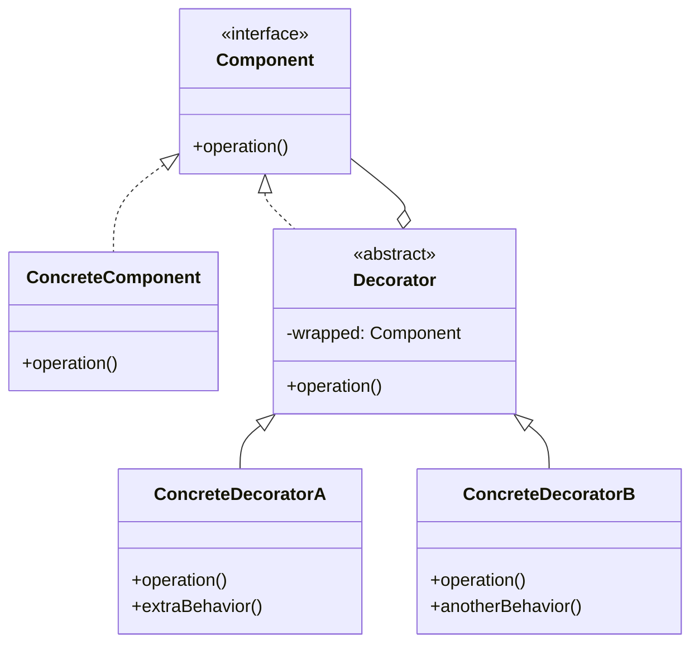

# Decorator Pattern

> [!summary]
> The Decorator pattern attaches additional responsibilities to an object dynamically. Decorators provide a flexible alternative to subclassing for extending functionality—you can wrap an object multiple times, combining behaviors at runtime rather than compile time.

## Theory

### What Is the Decorator Pattern?

Decorator is a **structural design pattern** that lets you add new behaviors to objects by placing them inside wrapper objects (decorators). Each decorator has the same interface as the object it wraps, allowing unlimited nesting.

**Problems it solves:**
- Need to add behaviors without modifying existing code
- Want to combine behaviors dynamically
- Avoid class explosion from multiple inheritance
- Need runtime flexibility (vs compile-time subclassing)

### How It Works



**Key insight:** Decorators and the original component share the same interface. A decorator holds a reference to a component (which could be another decorator), enabling stacking.

## Practical Examples

### Coffee Shop (Classic Example)

```java
// Component interface
interface Coffee {
    String getDescription();
    double getCost();
}

// Concrete component
class SimpleCoffee implements Coffee {
    @Override
    public String getDescription() {
        return "Simple Coffee";
    }
    
    @Override
    public double getCost() {
        return 2.00;
    }
}

// Base decorator
abstract class CoffeeDecorator implements Coffee {
    protected Coffee coffee;
    
    public CoffeeDecorator(Coffee coffee) {
        this.coffee = coffee;
    }
    
    @Override
    public String getDescription() {
        return coffee.getDescription();
    }
    
    @Override
    public double getCost() {
        return coffee.getCost();
    }
}

// Concrete decorators
class MilkDecorator extends CoffeeDecorator {
    public MilkDecorator(Coffee coffee) {
        super(coffee);
    }
    
    @Override
    public String getDescription() {
        return coffee.getDescription() + ", Milk";
    }
    
    @Override
    public double getCost() {
        return coffee.getCost() + 0.50;
    }
}

class SugarDecorator extends CoffeeDecorator {
    public SugarDecorator(Coffee coffee) {
        super(coffee);
    }
    
    @Override
    public String getDescription() {
        return coffee.getDescription() + ", Sugar";
    }
    
    @Override
    public double getCost() {
        return coffee.getCost() + 0.25;
    }
}

class WhipDecorator extends CoffeeDecorator {
    public WhipDecorator(Coffee coffee) {
        super(coffee);
    }
    
    @Override
    public String getDescription() {
        return coffee.getDescription() + ", Whip";
    }
    
    @Override
    public double getCost() {
        return coffee.getCost() + 0.75;
    }
}

// Usage - stack decorators!
Coffee coffee = new SimpleCoffee();
System.out.println(coffee.getDescription() + " $" + coffee.getCost());
// Simple Coffee $2.0

coffee = new MilkDecorator(coffee);
coffee = new SugarDecorator(coffee);
coffee = new WhipDecorator(coffee);
System.out.println(coffee.getDescription() + " $" + coffee.getCost());
// Simple Coffee, Milk, Sugar, Whip $3.5
```

### Python Decorators (Built-in Language Feature)

```python
from functools import wraps
import time
from typing import Callable, Any


# Python decorator syntax - actually uses decorator pattern!
def timer(func: Callable) -> Callable:
    """Measure execution time of a function."""
    @wraps(func)
    def wrapper(*args, **kwargs) -> Any:
        start = time.perf_counter()
        result = func(*args, **kwargs)
        end = time.perf_counter()
        print(f"{func.__name__} took {end - start:.4f} seconds")
        return result
    return wrapper


def retry(max_attempts: int = 3):
    """Retry function on failure."""
    def decorator(func: Callable) -> Callable:
        @wraps(func)
        def wrapper(*args, **kwargs) -> Any:
            for attempt in range(max_attempts):
                try:
                    return func(*args, **kwargs)
                except Exception as e:
                    if attempt == max_attempts - 1:
                        raise
                    print(f"Attempt {attempt + 1} failed: {e}")
        return wrapper
    return decorator


def cache(func: Callable) -> Callable:
    """Simple memoization decorator."""
    memo = {}
    
    @wraps(func)
    def wrapper(*args) -> Any:
        if args not in memo:
            memo[args] = func(*args)
        return memo[args]
    return wrapper


# Stack multiple decorators!
@timer
@retry(max_attempts=3)
@cache
def fetch_data(url: str) -> str:
    # Simulated API call
    import random
    if random.random() < 0.3:
        raise ConnectionError("Network error")
    return f"Data from {url}"


# Usage
result = fetch_data("https://api.example.com")
```

### I/O Streams (Real-World Java)

```java
// Java I/O is a classic decorator pattern example!
import java.io.*;

// Without decorators - limited functionality
FileInputStream fis = new FileInputStream("file.txt");

// With decorators - add capabilities
InputStream input = new BufferedInputStream(      // Add buffering
    new GZIPInputStream(                          // Add decompression
        new FileInputStream("data.txt.gz")        // Base stream
    )
);

// Each decorator adds functionality:
// - FileInputStream: reads bytes from file
// - GZIPInputStream: decompresses gzip format
// - BufferedInputStream: adds buffering for performance

// Reading is transparent - same interface
int data = input.read();
```

### Data Pipeline Decorator

```python
from abc import ABC, abstractmethod
from typing import List, Any
import json


class DataProcessor(ABC):
    """Component interface for data processing."""
    
    @abstractmethod
    def process(self, data: Any) -> Any:
        pass


class RawDataProcessor(DataProcessor):
    """Concrete component - basic processing."""
    
    def process(self, data: Any) -> Any:
        return data


class ProcessorDecorator(DataProcessor):
    """Base decorator."""
    
    def __init__(self, processor: DataProcessor):
        self._processor = processor
    
    def process(self, data: Any) -> Any:
        return self._processor.process(data)


class ValidationDecorator(ProcessorDecorator):
    """Validates data isn't empty."""
    
    def process(self, data: Any) -> Any:
        if not data:
            raise ValueError("Data cannot be empty")
        return super().process(data)


class NormalizationDecorator(ProcessorDecorator):
    """Normalizes string data."""
    
    def process(self, data: Any) -> Any:
        if isinstance(data, str):
            data = data.strip().lower()
        elif isinstance(data, list):
            data = [x.strip().lower() if isinstance(x, str) else x for x in data]
        return super().process(data)


class JsonParsingDecorator(ProcessorDecorator):
    """Parses JSON string to dict."""
    
    def process(self, data: Any) -> Any:
        if isinstance(data, str):
            try:
                data = json.loads(data)
            except json.JSONDecodeError:
                pass  # Not JSON, pass through
        return super().process(data)


class LoggingDecorator(ProcessorDecorator):
    """Logs data transformations."""
    
    def process(self, data: Any) -> Any:
        print(f"Processing: {type(data).__name__}")
        result = super().process(data)
        print(f"Result: {type(result).__name__}")
        return result


# Build processing pipeline
processor = LoggingDecorator(
    ValidationDecorator(
        NormalizationDecorator(
            JsonParsingDecorator(
                RawDataProcessor()
            )
        )
    )
)

# Process data through the pipeline
result = processor.process('{"name": "  JOHN  ", "age": 30}')
# Logs: Processing: str -> Result: dict
# result = {"name": "  john  ", "age": 30}
```

### HTTP Middleware Pattern

```java
// Decorator pattern in web frameworks
interface HttpHandler {
    Response handle(Request request);
}

// Concrete handler
class ApiHandler implements HttpHandler {
    @Override
    public Response handle(Request request) {
        return new Response(200, "OK");
    }
}

// Decorator (middleware)
abstract class HttpMiddleware implements HttpHandler {
    protected HttpHandler next;
    
    public HttpMiddleware(HttpHandler next) {
        this.next = next;
    }
}

class AuthMiddleware extends HttpMiddleware {
    public AuthMiddleware(HttpHandler next) { super(next); }
    
    @Override
    public Response handle(Request request) {
        if (!isAuthenticated(request)) {
            return new Response(401, "Unauthorized");
        }
        return next.handle(request);
    }
    
    private boolean isAuthenticated(Request request) {
        return request.getHeader("Authorization") != null;
    }
}

class LoggingMiddleware extends HttpMiddleware {
    public LoggingMiddleware(HttpHandler next) { super(next); }
    
    @Override
    public Response handle(Request request) {
        System.out.println("Request: " + request.getPath());
        Response response = next.handle(request);
        System.out.println("Response: " + response.getStatus());
        return response;
    }
}

class RateLimitMiddleware extends HttpMiddleware {
    public RateLimitMiddleware(HttpHandler next) { super(next); }
    
    @Override
    public Response handle(Request request) {
        if (isRateLimited(request)) {
            return new Response(429, "Too Many Requests");
        }
        return next.handle(request);
    }
    
    private boolean isRateLimited(Request request) { /* ... */ return false; }
}

// Build middleware stack
HttpHandler handler = new LoggingMiddleware(
    new AuthMiddleware(
        new RateLimitMiddleware(
            new ApiHandler()
        )
    )
);

// Request flows through: Logging → Auth → RateLimit → API
Response response = handler.handle(request);
```

## Common Patterns

> [!tip] Decorator vs Inheritance
> - **Inheritance**: Static, compile-time, single parent
> - **Decorator**: Dynamic, runtime, unlimited stacking
> 
> Prefer decorators when behaviors need to be combined flexibly.

> [!tip] Same Interface is Key
> The power of decorator comes from sharing the interface with the wrapped component. This allows unlimited nesting and clients don't need to know about decorators.

> [!warning] Order Matters
> The order decorators are applied affects behavior:
> ```java
> // These produce different results!
> new A(new B(component))  // B runs first, then A
> new B(new A(component))  // A runs first, then B
> ```

## Edge Cases & Gotchas

- **Identity checks fail** — Decorated object is not `==` to original
- **Type checks fail** — `instanceof` may not work as expected
- **Lots of small classes** — Many decorators can clutter codebase
- **Removing decorators is hard** — Once wrapped, unwrapping is tricky

## Related Topics

- [[Adapter]] - Changes interface; Decorator keeps interface
- [[Proxy]] - Controls access; Decorator adds behavior
- [[Composite]] - Tree structure; can be combined with Decorator
- [[Strategy]] - Decorator adds behavior; Strategy swaps algorithm

## References

- [Refactoring Guru - Decorator](https://refactoring.guru/design-patterns/decorator)
- [Baeldung - Decorator Pattern](https://www.baeldung.com/java-decorator-pattern)
- [Java I/O Streams](https://docs.oracle.com/javase/tutorial/essential/io/streams.html) - Classic decorator example
