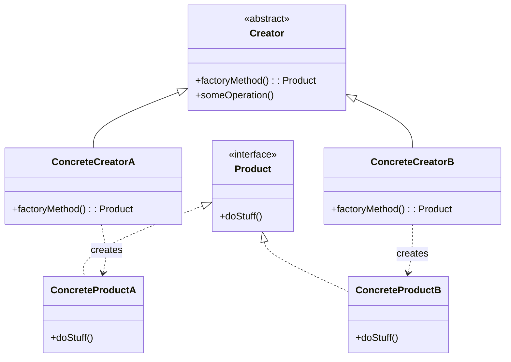

# Factory Pattern

> [!summary]
> The Factory pattern defines an interface for creating objects but lets subclasses or methods decide which class to instantiate. It promotes loose coupling by eliminating the need to bind application-specific classes into your code—you work with interfaces, and the factory handles the concrete implementations.

## Theory

### What Is the Factory Pattern?

Factory is a **creational design pattern** that provides an interface for creating objects without specifying their concrete classes. There are two main variants:

1. **Factory Method** — Defines a method in a base class that subclasses override to create specific objects
2. **Simple Factory** — A single class with a method that creates objects based on input parameters (technically not a GoF pattern, but widely used)

The pattern solves several problems:
- Decouples object creation from usage
- Makes code more flexible and easier to extend
- Centralizes creation logic in one place
- Enables runtime decisions about which class to instantiate

### How It Works



**Key participants:**
- **Product** — Interface defining what objects the factory creates
- **ConcreteProduct** — Specific implementations of the product
- **Creator** — Declares the factory method returning a Product
- **ConcreteCreator** — Overrides factory method to return a ConcreteProduct

## Practical Examples

### Simple Factory (Java)

```java
// Product interface
public interface Notification {
    void send(String message);
}

// Concrete products
public class EmailNotification implements Notification {
    @Override
    public void send(String message) {
        System.out.println("Sending email: " + message);
    }
}

public class SMSNotification implements Notification {
    @Override
    public void send(String message) {
        System.out.println("Sending SMS: " + message);
    }
}

public class PushNotification implements Notification {
    @Override
    public void send(String message) {
        System.out.println("Sending push notification: " + message);
    }
}

// Simple Factory
public class NotificationFactory {
    public static Notification createNotification(String type) {
        return switch (type.toLowerCase()) {
            case "email" -> new EmailNotification();
            case "sms" -> new SMSNotification();
            case "push" -> new PushNotification();
            default -> throw new IllegalArgumentException("Unknown type: " + type);
        };
    }
}

// Usage
Notification notification = NotificationFactory.createNotification("email");
notification.send("Hello, World!");
```

### Factory Method (Java)

```java
// Product interface
public interface Document {
    void open();
    void save();
    String getExtension();
}

// Concrete products
public class PDFDocument implements Document {
    @Override
    public void open() { System.out.println("Opening PDF document"); }
    
    @Override
    public void save() { System.out.println("Saving PDF document"); }
    
    @Override
    public String getExtension() { return ".pdf"; }
}

public class WordDocument implements Document {
    @Override
    public void open() { System.out.println("Opening Word document"); }
    
    @Override
    public void save() { System.out.println("Saving Word document"); }
    
    @Override
    public String getExtension() { return ".docx"; }
}

// Creator abstract class
public abstract class Application {
    // Factory method - subclasses decide what to create
    protected abstract Document createDocument();
    
    // Template method using the factory method
    public void newDocument() {
        Document doc = createDocument();
        doc.open();
        System.out.println("Created new " + doc.getExtension() + " file");
    }
}

// Concrete creators
public class PDFApplication extends Application {
    @Override
    protected Document createDocument() {
        return new PDFDocument();
    }
}

public class WordApplication extends Application {
    @Override
    protected Document createDocument() {
        return new WordDocument();
    }
}

// Usage
Application app = new PDFApplication();
app.newDocument();  // Creates and opens a PDF
```

### Python Factory with Registry (Advanced)

```python
from abc import ABC, abstractmethod
from typing import Dict, Type, Callable


class PaymentProcessor(ABC):
    """Abstract product"""
    
    @abstractmethod
    def process(self, amount: float) -> str:
        pass


class CreditCardProcessor(PaymentProcessor):
    def process(self, amount: float) -> str:
        return f"Processing ${amount:.2f} via Credit Card"


class PayPalProcessor(PaymentProcessor):
    def process(self, amount: float) -> str:
        return f"Processing ${amount:.2f} via PayPal"


class CryptoProcessor(PaymentProcessor):
    def process(self, amount: float) -> str:
        return f"Processing ${amount:.2f} via Cryptocurrency"


class PaymentFactory:
    """
    Factory with self-registering products.
    New payment methods can register themselves without modifying factory code.
    """
    _processors: Dict[str, Type[PaymentProcessor]] = {}
    
    @classmethod
    def register(cls, name: str) -> Callable:
        """Decorator to register new processors"""
        def decorator(processor_class: Type[PaymentProcessor]) -> Type[PaymentProcessor]:
            cls._processors[name.lower()] = processor_class
            return processor_class
        return decorator
    
    @classmethod
    def create(cls, payment_type: str) -> PaymentProcessor:
        processor_class = cls._processors.get(payment_type.lower())
        if not processor_class:
            available = ", ".join(cls._processors.keys())
            raise ValueError(f"Unknown payment type: {payment_type}. Available: {available}")
        return processor_class()
    
    @classmethod
    def available_processors(cls) -> list[str]:
        return list(cls._processors.keys())


# Register processors (could be in separate files)
PaymentFactory.register("credit_card")(CreditCardProcessor)
PaymentFactory.register("paypal")(PayPalProcessor)
PaymentFactory.register("crypto")(CryptoProcessor)


# Usage
processor = PaymentFactory.create("paypal")
print(processor.process(99.99))  # Processing $99.99 via PayPal

print(PaymentFactory.available_processors())  # ['credit_card', 'paypal', 'crypto']
```

### Parameterized Factory with Dependency Injection

```java
public class DatabaseConnectionFactory {
    private final Map<String, Supplier<Connection>> connectionSuppliers;
    
    public DatabaseConnectionFactory() {
        connectionSuppliers = new HashMap<>();
        connectionSuppliers.put("mysql", this::createMySQLConnection);
        connectionSuppliers.put("postgres", this::createPostgresConnection);
        connectionSuppliers.put("sqlite", this::createSQLiteConnection);
    }
    
    public Connection createConnection(String dbType, String connectionString) {
        Supplier<Connection> supplier = connectionSuppliers.get(dbType.toLowerCase());
        if (supplier == null) {
            throw new IllegalArgumentException("Unsupported database: " + dbType);
        }
        return supplier.get();
    }
    
    // Individual creation methods can have complex logic
    private Connection createMySQLConnection() {
        // MySQL-specific initialization
        return new MySQLConnection();
    }
    
    private Connection createPostgresConnection() {
        // Postgres-specific initialization  
        return new PostgresConnection();
    }
    
    private Connection createSQLiteConnection() {
        return new SQLiteConnection();
    }
}
```

## Common Patterns

> [!tip] Use Factory When Object Creation Is Complex
> If creating an object requires configuration, validation, or choosing between implementations, encapsulate that logic in a factory. This keeps client code clean.

> [!tip] Combine with Configuration
> Factories work well with configuration files or environment variables to determine which concrete class to instantiate:
> ```java
> String dbType = config.get("database.type"); // "mysql"
> Connection conn = factory.createConnection(dbType);
> ```

> [!warning] Don't Overuse Simple Factories
> If you're just wrapping a constructor with no additional logic, a factory adds unnecessary indirection. Use factories when there's actual benefit—complex creation, multiple implementations, or decoupling needs.

## Edge Cases & Gotchas

- **Explosion of classes** — Each new product type may require new factory subclasses. Consider Simple Factory or parameterized approaches for simpler cases.
- **Testing factories** — Factories should be injectable. Avoid static factory methods when testability matters.
- **Circular dependencies** — Factories creating objects that need the factory can cause issues. Use [[Dependency-Injection]] frameworks to manage this.
- **Null returns** — Decide whether to return `null`, throw exceptions, or return a [[Null-Object]] for unknown types.

## Related Topics

- [[Abstract-Factory]] - Creates families of related objects
- [[Builder]] - Constructs complex objects step by step
- [[Singleton]] - Often used with Factory for managing single instances
- [[Dependency-Injection]] - Modern alternative using containers/frameworks
- [[Strategy]] - Factory can create strategy objects at runtime

## References

- [Refactoring Guru - Factory Method](https://refactoring.guru/design-patterns/factory-method)
- [Baeldung - Factory Pattern in Java](https://www.baeldung.com/java-factory-pattern)
- [Head First Design Patterns](https://www.oreilly.com/library/view/head-first-design/0596007124/) - Chapter 4
