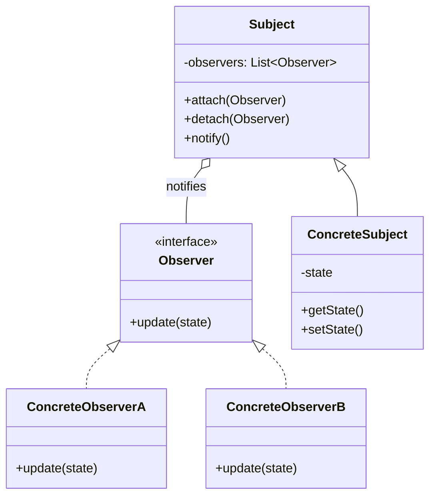

# Observer Pattern

> [!summary]
> The Observer pattern defines a one-to-many dependency between objects so that when one object (the subject) changes state, all its dependents (observers) are notified and updated automatically. It's the foundation of event-driven programming, reactive systems, and the publish-subscribe model.

## Theory

### What Is the Observer Pattern?

Observer is a **behavioral design pattern** that establishes a subscription mechanism to notify multiple objects about events happening to the object they're observing. It solves the problem of keeping multiple objects in sync without tight coupling.

**Key concepts:**
- **Subject (Publisher)** — Maintains a list of observers and notifies them of state changes
- **Observer (Subscriber)** — Defines an interface for receiving updates
- **Loose coupling** — Subject doesn't need to know concrete observer types

Common use cases:
- GUI event handling (button clicks, input changes)
- Real-time data feeds (stock prices, sensor data)
- Model-View separation in MVC/MVVM
- Distributed event systems
- Reactive programming (RxJS, Project Reactor)

### How It Works



**Notification flow:**
1. Subject's state changes
2. Subject calls `notify()`
3. Each registered observer's `update()` method is called
4. Observers react to the change

## Practical Examples

### Basic Observer (Java)

```java
import java.util.ArrayList;
import java.util.List;

// Observer interface
interface Observer {
    void update(String message);
}

// Subject interface
interface Subject {
    void attach(Observer observer);
    void detach(Observer observer);
    void notifyObservers();
}

// Concrete Subject - News Agency
class NewsAgency implements Subject {
    private final List<Observer> observers = new ArrayList<>();
    private String latestNews;
    
    @Override
    public void attach(Observer observer) {
        observers.add(observer);
    }
    
    @Override
    public void detach(Observer observer) {
        observers.remove(observer);
    }
    
    @Override
    public void notifyObservers() {
        for (Observer observer : observers) {
            observer.update(latestNews);
        }
    }
    
    public void publishNews(String news) {
        this.latestNews = news;
        notifyObservers();
    }
}

// Concrete Observers
class NewsChannel implements Observer {
    private final String name;
    
    public NewsChannel(String name) {
        this.name = name;
    }
    
    @Override
    public void update(String news) {
        System.out.println(name + " received: " + news);
    }
}

// Usage
NewsAgency agency = new NewsAgency();

NewsChannel cnn = new NewsChannel("CNN");
NewsChannel bbc = new NewsChannel("BBC");

agency.attach(cnn);
agency.attach(bbc);

agency.publishNews("Breaking: Observer pattern explained!");
// Output:
// CNN received: Breaking: Observer pattern explained!
// BBC received: Breaking: Observer pattern explained!

agency.detach(bbc);
agency.publishNews("Update: BBC unsubscribed");
// Output:
// CNN received: Update: BBC unsubscribed
```

### Event System with Typed Events (Java)

```java
import java.util.*;
import java.util.function.Consumer;

// Generic event system supporting multiple event types
class EventBus {
    private final Map<Class<?>, List<Consumer<?>>> listeners = new HashMap<>();
    
    public <T> void subscribe(Class<T> eventType, Consumer<T> listener) {
        listeners.computeIfAbsent(eventType, k -> new ArrayList<>()).add(listener);
    }
    
    public <T> void unsubscribe(Class<T> eventType, Consumer<T> listener) {
        List<Consumer<?>> eventListeners = listeners.get(eventType);
        if (eventListeners != null) {
            eventListeners.remove(listener);
        }
    }
    
    @SuppressWarnings("unchecked")
    public <T> void publish(T event) {
        List<Consumer<?>> eventListeners = listeners.get(event.getClass());
        if (eventListeners != null) {
            for (Consumer<?> listener : eventListeners) {
                ((Consumer<T>) listener).accept(event);
            }
        }
    }
}

// Event classes
record UserCreatedEvent(String userId, String email) {}
record OrderPlacedEvent(String orderId, double amount) {}

// Usage
EventBus bus = new EventBus();

// Subscribe to events
bus.subscribe(UserCreatedEvent.class, event -> 
    System.out.println("Send welcome email to: " + event.email()));

bus.subscribe(UserCreatedEvent.class, event -> 
    System.out.println("Initialize user profile for: " + event.userId()));

bus.subscribe(OrderPlacedEvent.class, event -> 
    System.out.println("Process payment: $" + event.amount()));

// Publish events
bus.publish(new UserCreatedEvent("u123", "user@example.com"));
bus.publish(new OrderPlacedEvent("o456", 99.99));
```

### Python Observer with Decorators (Advanced)

```python
from typing import Callable, Dict, List, Any
from dataclasses import dataclass
from enum import Enum, auto


class EventType(Enum):
    PRICE_UPDATE = auto()
    TRADE_EXECUTED = auto()
    MARKET_OPEN = auto()
    MARKET_CLOSE = auto()


@dataclass
class Event:
    type: EventType
    data: Dict[str, Any]


class EventEmitter:
    """
    Observable class with decorator-based subscription.
    Supports both sync and async observers.
    """
    
    def __init__(self):
        self._listeners: Dict[EventType, List[Callable]] = {}
    
    def on(self, event_type: EventType) -> Callable:
        """Decorator to register an event handler"""
        def decorator(func: Callable) -> Callable:
            if event_type not in self._listeners:
                self._listeners[event_type] = []
            self._listeners[event_type].append(func)
            return func
        return decorator
    
    def off(self, event_type: EventType, func: Callable) -> None:
        """Unregister an event handler"""
        if event_type in self._listeners:
            self._listeners[event_type].remove(func)
    
    def emit(self, event: Event) -> None:
        """Notify all listeners of an event"""
        listeners = self._listeners.get(event.type, [])
        for listener in listeners:
            try:
                listener(event)
            except Exception as e:
                print(f"Error in listener: {e}")
    
    def once(self, event_type: EventType) -> Callable:
        """Decorator for one-time event handlers"""
        def decorator(func: Callable) -> Callable:
            def wrapper(event: Event) -> None:
                func(event)
                self.off(event_type, wrapper)
            
            if event_type not in self._listeners:
                self._listeners[event_type] = []
            self._listeners[event_type].append(wrapper)
            return func
        return decorator


# Usage
market = EventEmitter()


@market.on(EventType.PRICE_UPDATE)
def log_price(event: Event):
    print(f"Price update: {event.data['symbol']} = ${event.data['price']}")


@market.on(EventType.PRICE_UPDATE)
def check_alerts(event: Event):
    if event.data['price'] > 100:
        print(f"ALERT: {event.data['symbol']} exceeded $100!")


@market.once(EventType.MARKET_OPEN)
def opening_bell(event: Event):
    print(f"Market opened at {event.data['time']}")


# Emit events
market.emit(Event(EventType.MARKET_OPEN, {"time": "09:30"}))
market.emit(Event(EventType.PRICE_UPDATE, {"symbol": "AAPL", "price": 150.00}))
market.emit(Event(EventType.MARKET_OPEN, {"time": "09:31"}))  # Won't trigger - once() removed it
```

### Property Change Observer (JavaBeans Style)

```java
import java.beans.PropertyChangeListener;
import java.beans.PropertyChangeSupport;

class ObservableUser {
    private final PropertyChangeSupport pcs = new PropertyChangeSupport(this);
    private String name;
    private int age;
    
    public void addPropertyChangeListener(PropertyChangeListener listener) {
        pcs.addPropertyChangeListener(listener);
    }
    
    public void removePropertyChangeListener(PropertyChangeListener listener) {
        pcs.removePropertyChangeListener(listener);
    }
    
    public void setName(String name) {
        String oldValue = this.name;
        this.name = name;
        pcs.firePropertyChange("name", oldValue, name);
    }
    
    public void setAge(int age) {
        int oldValue = this.age;
        this.age = age;
        pcs.firePropertyChange("age", oldValue, age);
    }
    
    public String getName() { return name; }
    public int getAge() { return age; }
}

// Usage
ObservableUser user = new ObservableUser();

user.addPropertyChangeListener(evt -> {
    System.out.printf("Property '%s' changed: %s -> %s%n",
        evt.getPropertyName(), evt.getOldValue(), evt.getNewValue());
});

user.setName("Alice");  // Property 'name' changed: null -> Alice
user.setAge(30);        // Property 'age' changed: 0 -> 30
```

## Common Patterns

> [!tip] Push vs Pull Model
> **Push**: Subject sends data with notification (`update(data)`)
> **Pull**: Subject notifies, observer queries for data (`update()` then `subject.getState()`)
> Push is simpler; Pull gives observers more control over what data they need.

> [!tip] Weak References for Observers
> In languages with manual memory management or to prevent memory leaks, store observers as weak references. This allows garbage collection if the observer is no longer needed elsewhere.

> [!warning] Notification Order
> Don't rely on observers being notified in a specific order. If order matters, use a priority queue or chain of responsibility instead.

> [!warning] Cascading Updates
> Observer A updating state that triggers Observer B can cause infinite loops or performance issues. Consider batching notifications or using dirty flags.

## Edge Cases & Gotchas

- **Memory leaks** — Forgetting to detach observers keeps them alive. Use weak references or ensure proper cleanup.
- **Thread safety** — Concurrent modification of observer list during notification causes `ConcurrentModificationException`. Copy the list before iterating or use concurrent collections.
- **Exception handling** — One observer throwing shouldn't prevent others from being notified. Wrap each notification in try-catch.
- **Performance** — Many observers or frequent notifications can be slow. Consider throttling, debouncing, or batching.
- **Stale notifications** — Observers might receive outdated data if state changes rapidly. Include version/timestamp in events.

## Related Topics

- [[Publish-Subscribe]] - Decoupled variant with message broker/channel
- [[Mediator]] - Centralizes complex communications between objects
- [[Event-Sourcing]] - Stores state changes as sequence of events
- [[Strategy]] - Observers can use different strategies for handling updates
- [[Reactive-Programming]] - Modern evolution (RxJS, Project Reactor)

## References

- [Refactoring Guru - Observer](https://refactoring.guru/design-patterns/observer)
- [Baeldung - Observer Pattern in Java](https://www.baeldung.com/java-observer-pattern)
- [ReactiveX Documentation](http://reactivex.io/) - Modern reactive observer implementations
