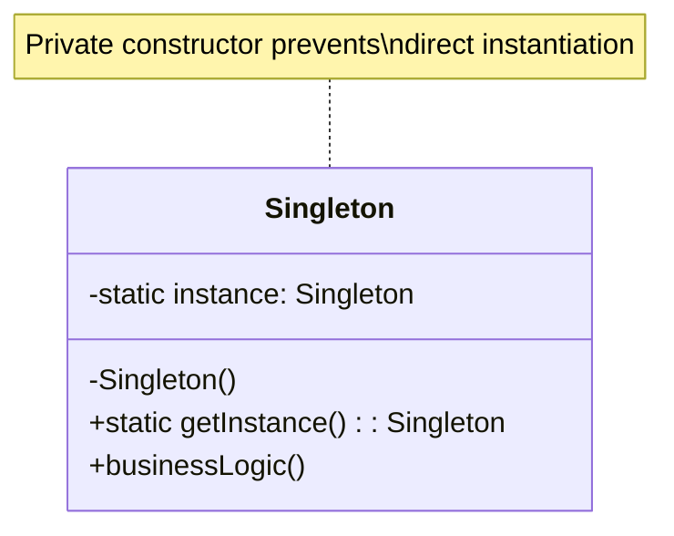

# Singleton Pattern

> [!summary]
> The Singleton pattern ensures a class has only one instance and provides a global point of access to it. Use it when exactly one object is needed to coordinate actions across the system—such as configuration managers, connection pools, or logging services.

## Theory

### What Is Singleton?

Singleton is a **creational design pattern** that restricts instantiation of a class to a single object. It solves two problems:

1. **Ensures a single instance** — Only one object of the class can exist
2. **Provides global access** — That instance is accessible from anywhere in the application

Common use cases include:
- Database connection pools
- Configuration/settings managers
- Logging services
- Hardware interface access (printers, GPUs)
- Caches and registries

### How It Works



The pattern works through three mechanisms:

1. **Private constructor** — Prevents external instantiation with `new`
2. **Static instance field** — Holds the single instance
3. **Static accessor method** — Creates instance on first call, returns existing instance thereafter

## Practical Examples

### Basic Usage (Java)

```java
public class Singleton {
    // Static field to hold the single instance
    private static Singleton instance;
    
    // Private constructor - cannot be called from outside
    private Singleton() {
        // Initialization code
    }
    
    // Public accessor - creates instance if needed
    public static Singleton getInstance() {
        if (instance == null) {
            instance = new Singleton();
        }
        return instance;
    }
    
    public void doSomething() {
        System.out.println("Singleton is working");
    }
}

// Usage
Singleton s1 = Singleton.getInstance();
Singleton s2 = Singleton.getInstance();
System.out.println(s1 == s2);  // true - same instance
```

### Thread-Safe Singleton (Java)

```java
public class ThreadSafeSingleton {
    // volatile ensures visibility across threads
    private static volatile ThreadSafeSingleton instance;
    
    private ThreadSafeSingleton() {}
    
    // Double-checked locking for thread safety with minimal overhead
    public static ThreadSafeSingleton getInstance() {
        if (instance == null) {
            synchronized (ThreadSafeSingleton.class) {
                if (instance == null) {
                    instance = new ThreadSafeSingleton();
                }
            }
        }
        return instance;
    }
}
```

### Python Singleton with Metaclass (Advanced)

```python
class SingletonMeta(type):
    """
    Metaclass that creates a Singleton instance.
    Thread-safe implementation using __call__.
    """
    _instances = {}
    
    def __call__(cls, *args, **kwargs):
        if cls not in cls._instances:
            instance = super().__call__(*args, **kwargs)
            cls._instances[cls] = instance
        return cls._instances[cls]


class Database(metaclass=SingletonMeta):
    def __init__(self):
        # This only runs once, even if Database() called multiple times
        self.connection = self._connect()
    
    def _connect(self):
        print("Establishing database connection...")
        return "connection_object"
    
    def query(self, sql: str):
        return f"Executing: {sql}"


# Usage
db1 = Database()  # Prints: Establishing database connection...
db2 = Database()  # No print - returns existing instance

print(db1 is db2)  # True
print(db1.query("SELECT * FROM users"))
```

### Enum Singleton (Java - Recommended)

```java
// The most robust Java singleton implementation
// Handles serialization, reflection attacks, and thread safety automatically
public enum ConfigManager {
    INSTANCE;
    
    private String configPath;
    private Properties properties;
    
    ConfigManager() {
        this.configPath = "/etc/app/config.properties";
        this.properties = loadProperties();
    }
    
    private Properties loadProperties() {
        Properties props = new Properties();
        // Load from file...
        return props;
    }
    
    public String get(String key) {
        return properties.getProperty(key);
    }
    
    public void set(String key, String value) {
        properties.setProperty(key, value);
    }
}

// Usage
String dbHost = ConfigManager.INSTANCE.get("db.host");
```

## Common Patterns

> [!tip] Use Enum for Java Singletons
> The enum approach (shown above) is considered the best practice in Java. It's concise, handles serialization correctly, and is guaranteed thread-safe by the JVM.

> [!tip] Lazy vs Eager Initialization
> **Lazy**: Instance created on first `getInstance()` call. Saves memory if never used.
> **Eager**: Instance created at class load time. Simpler, always thread-safe.
> Choose lazy when instantiation is expensive; eager when simplicity matters.

> [!warning] Avoid Singleton Abuse
> Singleton is often overused. Before using it, ask: "Does this *really* need to be a single instance?" Often, [[Dependency-Injection]] is a better approach that improves testability.

## Edge Cases & Gotchas

- **Testing difficulties** — Singletons carry state between tests. Use dependency injection or provide a `reset()` method for testing.
- **Hidden dependencies** — Code using `getInstance()` has an implicit dependency that's not visible in constructors/method signatures.
- **Multithreading issues** — Basic implementation is not thread-safe. Use double-checked locking, enum, or eager initialization.
- **Serialization breaks singleton** — Deserializing creates a new instance. Implement `readResolve()` in Java or use enum.
- **Reflection attacks** — Reflection can call private constructors. Enum-based singletons prevent this.
- **Classloader issues** — Multiple classloaders can create multiple "singletons" in Java EE environments.

> [!warning] The Singleton Controversy
> Many developers consider Singleton an anti-pattern because it introduces global state and makes testing difficult. Modern frameworks like Spring manage object lifecycles through [[Dependency-Injection]], which provides singleton-like behavior with better testability.

## Related Topics

- [[Factory]] - Often used with Singleton to manage object creation
- [[Dependency-Injection]] - Modern alternative for managing object lifecycles
- [[Multiton]] - Variation that manages a map of named instances
- [[Object-Pool]] - Related pattern for managing reusable object instances

## References

- [Refactoring Guru - Singleton](https://refactoring.guru/design-patterns/singleton)
- [DigitalOcean - Java Singleton Best Practices](https://www.digitalocean.com/community/tutorials/java-singleton-design-pattern-best-practices-examples)
- [Effective Java, 3rd Ed.](https://www.oreilly.com/library/view/effective-java/9780134686097/) - Item 3: Enforce the singleton property
