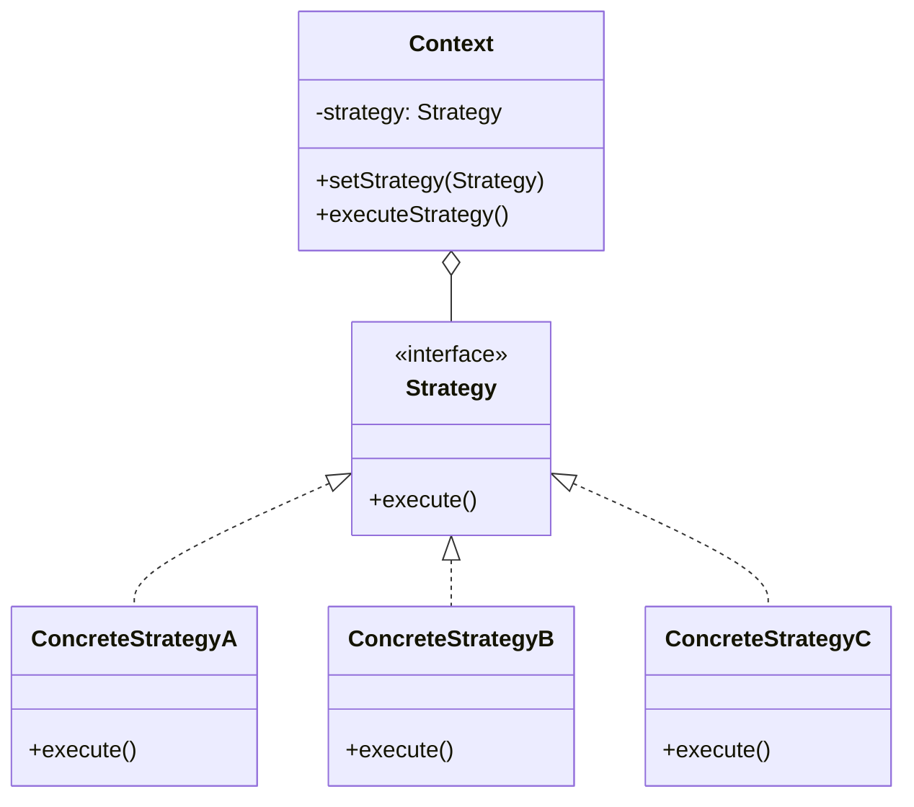

# Strategy Pattern

> [!summary]
> The Strategy pattern defines a family of algorithms, encapsulates each one, and makes them interchangeable. It lets the algorithm vary independently from clients that use it. This promotes the Open/Closed Principle—you can add new strategies without modifying existing code.

## Theory

### What Is the Strategy Pattern?

Strategy is a **behavioral design pattern** that enables selecting an algorithm at runtime. Instead of implementing multiple versions of an algorithm directly in a class, you define separate strategy classes and switch between them as needed.

**Key benefits:**
- **Runtime flexibility** — Change behavior without code changes
- **Open/Closed Principle** — Add new strategies without modifying context
- **Eliminates conditionals** — Replaces if/else or switch with polymorphism
- **Testability** — Strategies can be tested in isolation

Common use cases:
- Payment processing (credit card, PayPal, crypto)
- Compression algorithms (zip, gzip, bzip2)
- Sorting strategies (quicksort, mergesort, heapsort)
- Validation rules
- Pricing/discount calculations
- Authentication methods

### How It Works



**Participants:**
- **Strategy** — Interface declaring the algorithm method
- **ConcreteStrategy** — Implements the algorithm
- **Context** — Maintains reference to strategy, delegates work to it

## Practical Examples

### Basic Strategy (Java)

```java
// Strategy interface
interface PaymentStrategy {
    void pay(double amount);
    boolean validate();
}

// Concrete strategies
class CreditCardPayment implements PaymentStrategy {
    private final String cardNumber;
    private final String cvv;
    
    public CreditCardPayment(String cardNumber, String cvv) {
        this.cardNumber = cardNumber;
        this.cvv = cvv;
    }
    
    @Override
    public boolean validate() {
        return cardNumber.length() == 16 && cvv.length() == 3;
    }
    
    @Override
    public void pay(double amount) {
        System.out.printf("Paid $%.2f using Credit Card ending in %s%n", 
            amount, cardNumber.substring(12));
    }
}

class PayPalPayment implements PaymentStrategy {
    private final String email;
    
    public PayPalPayment(String email) {
        this.email = email;
    }
    
    @Override
    public boolean validate() {
        return email.contains("@");
    }
    
    @Override
    public void pay(double amount) {
        System.out.printf("Paid $%.2f using PayPal account %s%n", amount, email);
    }
}

class CryptoPayment implements PaymentStrategy {
    private final String walletAddress;
    
    public CryptoPayment(String walletAddress) {
        this.walletAddress = walletAddress;
    }
    
    @Override
    public boolean validate() {
        return walletAddress.startsWith("0x") && walletAddress.length() == 42;
    }
    
    @Override
    public void pay(double amount) {
        System.out.printf("Paid $%.2f in crypto to wallet %s...%n", 
            amount, walletAddress.substring(0, 10));
    }
}

// Context
class ShoppingCart {
    private PaymentStrategy paymentStrategy;
    private double total;
    
    public void addItem(double price) {
        this.total += price;
    }
    
    public void setPaymentStrategy(PaymentStrategy strategy) {
        this.paymentStrategy = strategy;
    }
    
    public void checkout() {
        if (paymentStrategy == null) {
            throw new IllegalStateException("Payment strategy not set");
        }
        if (!paymentStrategy.validate()) {
            throw new IllegalArgumentException("Invalid payment details");
        }
        paymentStrategy.pay(total);
        total = 0;
    }
}

// Usage
ShoppingCart cart = new ShoppingCart();
cart.addItem(100.00);
cart.addItem(50.00);

// Pay with credit card
cart.setPaymentStrategy(new CreditCardPayment("1234567890123456", "123"));
cart.checkout();  // Paid $150.00 using Credit Card ending in 3456

// Different purchase, different payment
cart.addItem(75.00);
cart.setPaymentStrategy(new PayPalPayment("user@example.com"));
cart.checkout();  // Paid $75.00 using PayPal account user@example.com
```

### Strategy with Lambdas (Java 8+)

```java
import java.util.function.Function;

// Functional interface as strategy
@FunctionalInterface
interface DiscountStrategy {
    double apply(double price);
}

class PricingService {
    // Predefined strategies as static fields
    public static final DiscountStrategy NO_DISCOUNT = price -> price;
    public static final DiscountStrategy SUMMER_SALE = price -> price * 0.8;
    public static final DiscountStrategy VIP_DISCOUNT = price -> price * 0.7;
    public static final DiscountStrategy CLEARANCE = price -> price * 0.5;
    
    // Composable strategies
    public static DiscountStrategy percentOff(double percent) {
        return price -> price * (1 - percent / 100);
    }
    
    public static DiscountStrategy flatOff(double amount) {
        return price -> Math.max(0, price - amount);
    }
    
    private DiscountStrategy currentStrategy = NO_DISCOUNT;
    
    public void setDiscount(DiscountStrategy strategy) {
        this.currentStrategy = strategy;
    }
    
    public double calculatePrice(double basePrice) {
        return currentStrategy.apply(basePrice);
    }
}

// Usage
PricingService pricing = new PricingService();

pricing.setDiscount(PricingService.SUMMER_SALE);
System.out.println(pricing.calculatePrice(100));  // 80.0

pricing.setDiscount(PricingService.percentOff(15));
System.out.println(pricing.calculatePrice(100));  // 85.0

// Inline lambda strategy
pricing.setDiscount(price -> price > 50 ? price * 0.9 : price);
System.out.println(pricing.calculatePrice(100));  // 90.0
System.out.println(pricing.calculatePrice(30));   // 30.0
```

### Python Strategy with Protocol (Advanced)

```python
from typing import Protocol, List
from dataclasses import dataclass
from abc import abstractmethod


# Strategy protocol (structural typing)
class CompressionStrategy(Protocol):
    def compress(self, data: bytes) -> bytes: ...
    def decompress(self, data: bytes) -> bytes: ...
    
    @property
    def extension(self) -> str: ...


# Concrete strategies
class ZipCompression:
    import zlib
    
    @property
    def extension(self) -> str:
        return ".zip"
    
    def compress(self, data: bytes) -> bytes:
        import zlib
        return zlib.compress(data)
    
    def decompress(self, data: bytes) -> bytes:
        import zlib
        return zlib.decompress(data)


class GzipCompression:
    @property
    def extension(self) -> str:
        return ".gz"
    
    def compress(self, data: bytes) -> bytes:
        import gzip
        return gzip.compress(data)
    
    def decompress(self, data: bytes) -> bytes:
        import gzip
        return gzip.decompress(data)


class NoCompression:
    """Null object pattern - does nothing"""
    
    @property
    def extension(self) -> str:
        return ""
    
    def compress(self, data: bytes) -> bytes:
        return data
    
    def decompress(self, data: bytes) -> bytes:
        return data


# Context
@dataclass
class FileArchiver:
    strategy: CompressionStrategy
    
    def archive(self, filename: str, data: bytes) -> tuple[str, bytes]:
        """Compress data and return new filename with compressed data."""
        compressed = self.strategy.compress(data)
        new_filename = filename + self.strategy.extension
        
        ratio = len(compressed) / len(data) * 100 if data else 100
        print(f"Compressed {filename}: {len(data)} -> {len(compressed)} bytes ({ratio:.1f}%)")
        
        return new_filename, compressed
    
    def extract(self, data: bytes) -> bytes:
        """Decompress data."""
        return self.strategy.decompress(data)


# Usage
data = b"Hello, World! " * 1000  # Repetitive data compresses well

archiver = FileArchiver(strategy=ZipCompression())
name, compressed = archiver.archive("data.txt", data)
# Compressed data.txt: 14000 -> 65 bytes (0.5%)

archiver.strategy = GzipCompression()
name, compressed = archiver.archive("data.txt", data)
# Compressed data.txt: 14000 -> 48 bytes (0.3%)

archiver.strategy = NoCompression()
name, compressed = archiver.archive("data.txt", data)
# Compressed data.txt: 14000 -> 14000 bytes (100.0%)
```

### Strategy Selection with Factory

```java
import java.util.Map;
import java.util.HashMap;
import java.util.function.Supplier;

// Combine Strategy with Factory for runtime selection
class SortStrategyFactory {
    private static final Map<String, Supplier<SortStrategy>> strategies = new HashMap<>();
    
    static {
        strategies.put("quick", QuickSort::new);
        strategies.put("merge", MergeSort::new);
        strategies.put("heap", HeapSort::new);
        strategies.put("insertion", InsertionSort::new);
    }
    
    public static SortStrategy create(String name) {
        Supplier<SortStrategy> supplier = strategies.get(name.toLowerCase());
        if (supplier == null) {
            throw new IllegalArgumentException("Unknown sort: " + name);
        }
        return supplier.get();
    }
    
    // Auto-select based on data characteristics
    public static SortStrategy autoSelect(int[] data) {
        if (data.length < 50) {
            return new InsertionSort();  // Fast for small arrays
        } else if (isNearlySorted(data)) {
            return new InsertionSort();  // O(n) for nearly sorted
        } else {
            return new QuickSort();      // Best general-purpose
        }
    }
    
    private static boolean isNearlySorted(int[] data) {
        int inversions = 0;
        for (int i = 0; i < data.length - 1; i++) {
            if (data[i] > data[i + 1]) inversions++;
        }
        return inversions < data.length * 0.1;
    }
}
```

## Common Patterns

> [!tip] Use Lambdas for Simple Strategies
> In Java 8+ or Python, single-method strategies can be lambdas. This reduces boilerplate while maintaining the pattern's benefits.
> ```java
> // Instead of a class
> pricing.setDiscount(price -> price * 0.9);
> ```

> [!tip] Combine with Factory
> Use a [[Factory]] to select strategies based on configuration, user input, or runtime conditions. This keeps selection logic centralized.

> [!warning] Don't Overengineer
> If you only have two algorithms and they're unlikely to change, a simple if/else might be clearer than a full Strategy implementation. Apply the pattern when you actually need the flexibility.

## Edge Cases & Gotchas

- **Strategy state** — Strategies should generally be stateless. If they need context, pass it as a method parameter rather than storing it.
- **Null strategy** — Use the [[Null-Object]] pattern (like `NoCompression` above) instead of null checks.
- **Strategy explosion** — Many strategies can be hard to manage. Consider combining with [[Factory]] or using configuration-driven approaches.
- **Performance** — Virtual dispatch has minor overhead. For performance-critical hot paths, measure before optimizing.

## Related Topics

- [[Factory]] - Create strategies dynamically based on conditions
- [[State]] - Similar structure, but State changes itself; Strategy is set externally
- [[Template-Method]] - Defines algorithm skeleton; strategies swap entire algorithms
- [[Decorator]] - Adds behavior; Strategy replaces behavior
- [[Command]] - Encapsulates request; Strategy encapsulates algorithm

## References

- [Refactoring Guru - Strategy](https://refactoring.guru/design-patterns/strategy)
- [Baeldung - Strategy Pattern in Java](https://www.baeldung.com/java-strategy-pattern)
- [Head First Design Patterns](https://www.oreilly.com/library/view/head-first-design/0596007124/) - Chapter 1
