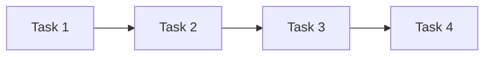
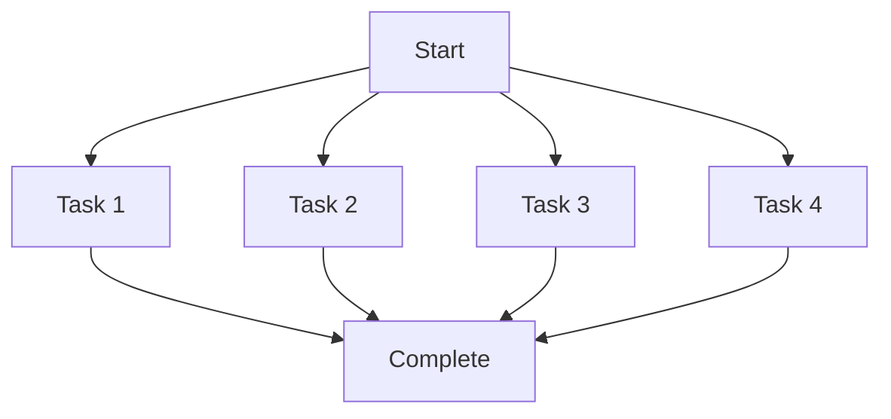

> [!summary]
> Master advanced Claude Code techniques for power users. Learn about parallel task execution, specialized agent usage, context optimization, undocumented features, and expert-level workflows that multiply your productivity. These techniques go beyond the basics to unlock Claude Code's full potential.

## What Are Advanced Techniques?

Advanced techniques are patterns and features that:

- **Aren't obvious** — Require deep understanding of how Claude Code works
- **Multiply productivity** — 10x improvements through clever usage
- **Require experience** — Build on solid fundamentals
- **Are rarely documented** — Discovered through experimentation
- **Have trade-offs** — Power comes with complexity

**Prerequisites:** Before diving into advanced techniques, master [[Prompt-Engineering-for-Claude-Code]], [[Context-Management-Strategies]], and [[Safety-Practices-for-AI-Coding]].

## Parallel Task Execution

### Concept: Concurrent Operations

Claude Code can execute multiple independent operations simultaneously.

**Sequential (slow):**

Total time: T1 + T2 + T3 + T4

**Parallel (fast):**

Total time: max(T1, T2, T3, T4)

### Pattern: Explicit Parallel Requests

> [!tip] Request Parallel Execution
> Explicitly tell Claude to perform operations in parallel.

```
"In parallel:
 1. Read src/components/Header.tsx
 2. Read src/components/Footer.tsx
 3. Read src/styles/globals.css
 4. Search for 'authentication' in src/
 5. Search for 'authorization' in src/

Then summarize what you found about auth implementation."
```

Claude will execute all 5 operations simultaneously, dramatically reducing wait time.

### Pattern: Parallel File Operations

```
"Update these files in parallel:

File 1: src/components/Header.tsx
- Change logo path from /old-logo.png to /new-logo.png

File 2: src/components/Footer.tsx
- Update copyright year to 2026

File 3: src/pages/Home.tsx
- Change hero title to 'Welcome to Our Platform'

These are independent changes with no dependencies."
```

### Pattern: Parallel Searches

When exploring unfamiliar codebase:

```
"Search the codebase in parallel for these patterns:
 1. How API endpoints are defined (search for 'router', 'app.get', 'app.post')
 2. How database queries are made (search for 'prisma', 'query', 'findMany')
 3. How authentication is handled (search for 'auth', 'jwt', 'token')
 4. How errors are handled (search for 'catch', 'error', 'throw')

Execute all searches simultaneously and give me a summary of each."
```

### When NOT to Use Parallel

Avoid parallel execution when:

❌ **Operations have dependencies** — Task 2 needs output from Task 1
❌ **Order matters** — Sequential logic or state changes
❌ **Shared resources** — Multiple tasks modifying the same file
❌ **Testing required between steps** — Need to validate before continuing

## Agent Usage Mastery

### Specialized Agents Overview

Claude Code has specialized agents for different tasks:

| Agent | Use Case | When to Use |
|-------|----------|-------------|
| **Explore** | Codebase navigation | Understanding structure, finding patterns |
| **Plan** | Implementation planning | Complex features requiring design |
| **Bash** | Command execution | Git, build, test operations |
| **General-purpose** | Multi-step tasks | Complex research or multi-file operations |

### Pattern: Explore Agent for Codebase Understanding

> [!tip] Use Explore for Large-Scale Discovery
> Don't search manually—let Explore agent handle it.

❌ **Manual (inefficient):**
```
You: "Search for API endpoints"
[Reviews results]
You: "Now search for database models"
[Reviews results]
You: "Now search for authentication"
[Reviews results]
[...continues for 20 turns]
```

✅ **Explore Agent (efficient):**
```
"Use the Explore agent with 'very thorough' level to map out:
 - How API endpoints are structured
 - Where database models are defined
 - How authentication flows work
 - How errors are handled globally

I need a comprehensive understanding of the architecture."
```

The Explore agent works autonomously, investigating thoroughly and delivering a complete report.

### Pattern: Plan Agent for Complex Features

Before implementing complex features:

```
"Use the Plan agent to design the implementation for:

Feature: Real-time notification system with WebSockets

Requirements:
- Backend: Express + Socket.io
- Frontend: React hooks for socket connection
- Database: Persist notifications in PostgreSQL
- Auth: JWT-based socket authentication
- UI: Toast notifications + notification center

I want a detailed plan with:
- Files to create/modify
- Implementation steps
- Dependencies and risks
- Testing strategy

Only plan, don't implement yet."
```

The Plan agent will explore your codebase, understand patterns, and create a comprehensive implementation plan.

### Pattern: Background Agents

Run long-running agents in background:

```
"Run the Explore agent in background to audit the entire codebase for:
 - Security vulnerabilities (hardcoded secrets, SQL injection risks)
 - Performance issues (N+1 queries, missing indexes)
 - Code quality issues (unused code, duplicate logic)

I'll continue working while this runs."
```

Check progress with:
```
"Check on the background Explore agent's progress"
```

## Context Optimization Tricks

### Technique 1: Context Compression

Compress large amounts of information into summaries:

```
[After exploring 20 files]

"Summarize the authentication system in 5 bullet points covering:
 - Token generation and storage
 - Validation flow
 - Protected route handling
 - Error scenarios
 - Key files involved

This will be our shared context going forward."
```

Now that summary serves as efficient context instead of 20 files.

### Technique 2: Reference Points

Create bookmarks in long conversations:

```
"Bookmark this state:
 - Current branch: feature/auth-refactor
 - Last working commit: a1b2c3d
 - Files modified: auth.ts, middleware.ts
 - Next step: Add JWT refresh logic

If we get confused later, we can reference this bookmark."
```

### Technique 3: Progressive Disclosure

Reveal complexity only when needed:

```
Turn 1: "I need to refactor authentication"
Turn 2: [After Claude asks] "We're using JWT with email/password"
Turn 3: [After Claude asks] "Tokens in httpOnly cookies"
Turn 4: [After Claude asks] "Backend is Express, frontend is React"
```

Each turn adds just enough context for the next question.

### Technique 4: Scoped Reading

Read only relevant portions:

```
"Read src/services/auth.ts but focus on:
 - The login function (around line 45)
 - Any helper functions it calls
 - Skip the registration and password reset functions

I only need to understand login flow."
```

## Undocumented Features & Tricks

### Trick 1: Model Selection Per Request

For simple, straightforward tasks, suggest faster models:

```
"This is a simple task (fixing typo). You can use Haiku if available
 to respond faster and save costs."
```

For complex tasks, stay with Sonnet:

```
"This is complex architecture work. Use Sonnet for best results."
```

### Trick 2: Forced Tool Selection

Guide which tools Claude should use:

```
"Use the Read tool to read these 5 files in parallel (not Bash with cat).
 This will be more efficient."
```

### Trick 3: Dry Run Mode

Preview operations without execution:

```
"Dry run mode: Show me all the commands you would run for this git workflow,
 but don't execute any of them yet. I want to review the plan."
```

### Trick 4: Explicit Reasoning

Request detailed reasoning for complex decisions:

```
"Before implementing the caching strategy, explain your reasoning:
 - Why you chose this approach over alternatives
 - What trade-offs you're making
 - What assumptions you're operating under

This helps me validate the approach."
```

### Trick 5: Chained Agents

Use agent output as input to another agent:

```
"First, use Explore agent to find all API endpoints.
 Then, use Plan agent to design a comprehensive testing strategy for those endpoints.
 Execute them in sequence."
```

## Expert Workflows

### Workflow 1: The Surgical Change

For precise modifications in large files:

```
Step 1: "Read src/api/users.ts lines 100-150 only"
Step 2: "Within that section, find the password validation logic"
Step 3: "Change the minimum length from 6 to 8 characters"
Step 4: "Show me only the diff of what changed"
```

Minimizes context usage and change surface area.

### Workflow 2: The Parallel Investigation

When debugging unknown issues:

```
"Investigate this bug in parallel:

Thread 1: Search codebase for error message 'Cannot read property...'
Thread 2: Check recent commits that touched user.ts
Thread 3: Review the user authentication flow
Thread 4: Look for similar issues in comments/TODOs

Synthesize findings and suggest root cause."
```

### Workflow 3: The Staged Rollout

For risky changes:

```
Phase 1: "Create feature flag for new auth system (default: off)"
Phase 2: "Implement new auth behind feature flag"
Phase 3: "Add A/B test to route 10% of users to new auth"
Phase 4: "After I validate, update flag to route 100%"
Phase 5: "Remove old auth code and feature flag"

Pause between phases for my validation."
```

### Workflow 4: The Documentation Generation

Auto-generate docs during implementation:

```
"As you implement each function, also:
 1. Add JSDoc comments explaining purpose and params
 2. Add usage examples in comments
 3. Update the README section for this module
 4. Add entries to API.md

Do this as you go, not as a separate step at the end."
```

### Workflow 5: The Test-First Development

```
"We're doing TDD. For each feature:
 1. First write failing tests
 2. Show me the tests
 3. After I approve, implement the feature
 4. Run tests to verify
 5. Refactor if needed

Work in this loop for the entire authentication system."
```

## Performance Optimization

### Optimization 1: Minimize File Reads

```
❌ Read entire file multiple times:
"Read auth.ts"
[Makes change]
"Read auth.ts again to verify"
[Makes another change]
```

✅ Read once, hold in context:
"Read auth.ts and hold it in context. We'll make multiple changes to it."
```

### Optimization 2: Batch Operations

```
❌ One at a time:
"Fix typo in Header.tsx"
"Fix typo in Footer.tsx"
"Fix typo in Home.tsx"
```

✅ Batch:
"Fix typos in these files (all have 'recieve' → 'receive'):
 - src/components/Header.tsx:line 23
 - src/components/Footer.tsx:line 45
 - src/pages/Home.tsx:line 67

Execute in parallel."
```

### Optimization 3: Incremental Builds

For large codebases:

```
"As you make changes to the codebase:
 - Run TypeScript type checking incrementally
 - Only lint modified files
 - Run only relevant tests (not full suite)

This will keep feedback loops fast."
```

### Optimization 4: Smart Caching

```
"We'll be working on the API layer for a while.
 Read these files once and keep in context:
 - src/api/routes.ts
 - src/middleware/auth.ts
 - src/utils/validation.ts

I'll reference them multiple times."
```

## Edge Cases & Power User Gotchas

### Gotcha 1: Parallel Overwrites

**Problem:** Parallel operations modify same file, causing conflicts.

```
❌ Conflict:
"In parallel:
 - Add feature A to utils.ts
 - Add feature B to utils.ts"

Result: One overwrites the other
```

✅ Sequential for same file:
"First add feature A to utils.ts, then add feature B to the same file."
```

### Gotcha 2: Agent Overhead

**Problem:** Using agents for simple tasks adds latency.

```
❌ Overkill:
"Use Explore agent to find the Header component"
[Agent spins up, takes 10 seconds]
```

✅ Direct:
"Search for 'Header' in src/components/"
[Instant result]
```

**Rule:** Use agents for complex, multi-step work. Use direct tools for simple queries.

### Gotcha 3: Context Exhaustion

**Problem:** Aggressive parallel reading fills context window.

```
❌ Too much:
"Read all 50 files in src/ in parallel"
Result: Context window full, can't do actual work
```

✅ Selective:
"Read the 5 main files (routes, auth, middleware, db, config) in parallel.
 We'll read others as needed."
```

### Gotcha 4: Over-Planning

**Problem:** Spending more time planning than implementing.

```
❌ Analysis paralysis:
"Use Plan agent to design this feature"
[Spends 10 minutes planning]
"Actually, can you revise the plan to consider..."
[Another 10 minutes]
[Feature could have been implemented already]
```

✅ Balanced:
"Quick 2-minute plan, then implement. We'll adjust as we go."
```

## Measuring Advanced Technique Mastery

You've mastered advanced techniques when:

✅ You naturally think in parallel operations
✅ You choose the right agent for each task
✅ Context management is second nature
✅ Conversations are highly efficient (few wasted turns)
✅ You discover your own advanced patterns
✅ You can explain trade-offs of different approaches
✅ Complex features are implemented quickly and correctly

## Quick Reference: Advanced Patterns

| Scenario | Technique | Example |
|----------|-----------|---------|
| Multiple independent files | Parallel operations | "Update Header, Footer, Sidebar in parallel" |
| Large codebase exploration | Explore agent | "Use Explore to map authentication flow" |
| Complex feature planning | Plan agent | "Plan implementation for real-time notifications" |
| Precise modification | Scoped reading | "Read lines 100-150 only" |
| Long conversation | Context compression | "Summarize last 10 turns in 3 bullets" |
| Unknown codebase | Parallel searches | "Search for auth, api, db patterns in parallel" |
| Simple typo fix | Minimal context | "Fix typo in Header.tsx:23" |
| Risky change | Staged rollout | "Feature flag → 10% → 100% → remove old code" |

## Advanced Safety Considerations

Even advanced techniques need safety:

> [!warning] Power Requires Responsibility
> Advanced techniques can cause problems faster. Always:
> - Preview before parallel destructive operations
> - Validate agent outputs before using as input to other agents
> - Set boundaries even for sophisticated requests
> - Test parallel changes don't conflict
> - Have rollback strategy for complex workflows

## Experimentation Mindset

> [!tip] Discover Your Own Techniques
> Advanced techniques come from experimentation:
> - Try unusual combinations
> - Push boundaries safely
> - Document what works
> - Share discoveries
> - Learn from failures

The best advanced techniques are ones you discover for your specific workflow.

## Related Topics

- [[Prompt-Engineering-for-Claude-Code]] — Foundation techniques
- [[Context-Management-Strategies]] — Context optimization builds on this
- [[Claude-Code-Best-Practices]] — Overall best practices hub
- [[Chain-of-Thought]] — How Claude reasons

## References

- [Claude Code Advanced Usage](https://github.com/anthropics/claude-code)
- [Anthropic API Documentation](https://docs.anthropic.com/en/docs/)
- [Agent Systems Design](https://www.anthropic.com/research)
- [Parallel Tool Execution Patterns](https://docs.anthropic.com/en/docs/build-with-claude/tool-use)