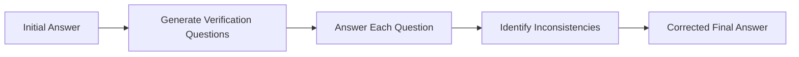

# Chain-of-Verification (CoVe)

> [!summary]
> The model generates an answer, creates verification questions to expose errors, answers them, then refines its original response. This self-checking process increases accuracy from ~60% to ~92% on complex technical queries.

## Theory

### What Is Chain-of-Verification?

CoVe is a four-step self-verification protocol developed by Google's research team. The model:

1. Produces an initial answer
2. Generates questions that would reveal errors
3. Answers those verification questions
4. Corrects the original response based on findings

This catches hallucinations before they reach the user.

### How It Works



The verification questions target factual claims, logical steps, and assumptions. When answers contradict the original response, the model revises accordingly.

## Practical Examples

### Template

```
Task: [your question]

Step 1: Provide your initial answer
Step 2: Generate 5 verification questions that would expose errors in your answer
Step 3: Answer each verification question
Step 4: Provide your final, corrected answer based on verification
```

### Basic Usage

```
Task: Explain how transformers handle long-context windows

Step 1: Provide your initial answer
Step 2: Generate 5 verification questions that would expose errors in your answer
Step 3: Answer each verification question
Step 4: Provide your final, corrected answer based on verification
```

### Advanced Usage

```
Task: Is migrating our PostgreSQL database to a distributed architecture worth the complexity for 50M daily transactions?

Step 1: Provide your initial answer with specific recommendations
Step 2: Generate 5 verification questions covering:
   - Accuracy of technical claims
   - Validity of assumptions about scale
   - Completeness of tradeoff analysis
   - Correctness of cost estimates
   - Soundness of timeline projections
Step 3: Answer each verification question with evidence
Step 4: Provide your final, corrected answer based on verification
```

## Common Patterns

> [!tip] Target Specific Claim Types
> Good verification questions target: numerical claims, causal relationships, technical specifications, and comparative statements.

> [!tip] Use Domain-Specific Verification
> For medical queries, verification might check drug interactions. For legal queries, it might verify jurisdiction applicability. Tailor verification to the domain.

> [!warning] Verification Has Limits
> The model verifies against its own knowledge. If that knowledge is wrong, verification won't catch it. Use this for reasoning errors, not knowledge gaps.

## Edge Cases & Gotchas

- **Circular verification** — The model might verify claims using the same flawed reasoning. Look for independent verification paths.
- **Overconfidence in corrections** — Sometimes the "corrected" answer introduces new errors. Consider a second verification pass for critical queries.
- **Time cost** — CoVe takes longer than direct answers. Reserve it for high-stakes queries where accuracy matters.
- **Question quality varies** — Weak verification questions miss errors. Explicitly request questions that target factual claims and logical steps.

## Related Topics

- [[Confidence-Weighted-Prompting]] - Another accuracy-focused technique
- [[Iterative-Refinement-Loop]] - Multi-pass improvement without self-questioning
- [[Structured-Thinking-Protocol]] - Structured reasoning before answering

## References

- [Chain-of-Verification Paper (arXiv)](https://arxiv.org/abs/2309.11495)
- [Google Research Blog](https://research.google/)
