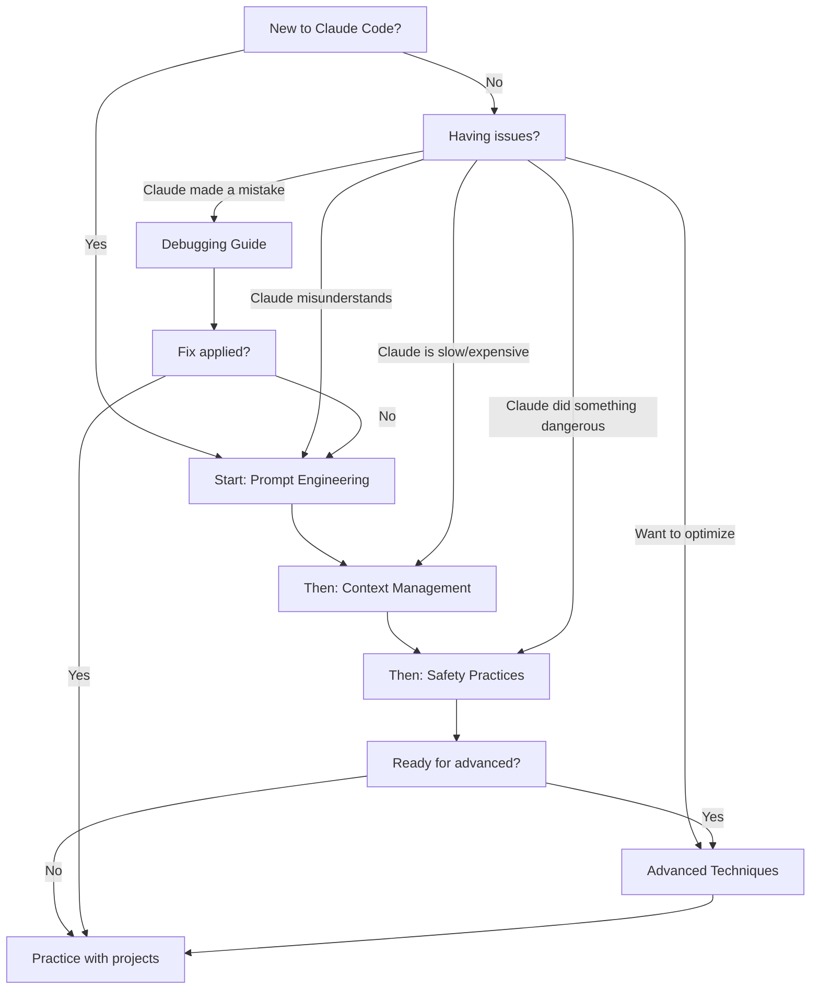

> [!summary]
> A comprehensive guide to working effectively with Claude Code, debunking common myths and establishing best practices that prevent poor outcomes. This hub document links to focused guides covering prompt engineering, context management, safety practices, debugging strategies, and advanced techniques for getting consistently excellent results from AI-assisted coding.

## What Is Claude Code?

Claude Code is Anthropic's official CLI tool that provides an interactive coding environment powered by Claude (specifically Claude Sonnet 4.5). Unlike general-purpose chat interfaces, Claude Code is purpose-built for software development with:

- **Context-aware file operations** — Read, edit, write files with understanding of codebase structure
- **Tool integration** — Bash commands, git operations, web search, documentation lookup
- **Agentic workflows** — Autonomous task execution with planning and validation
- **Session persistence** — Maintains conversation context across interactions

**Common Misconception:** "Claude is performing worse now" often stems from poor prompting practices, not model degradation. Understanding how to work effectively with Claude Code eliminates 90% of frustration.

## Why Best Practices Matter

Bad habits lead to bad outcomes:

❌ **Vague requests** → Claude guesses wrong and implements the opposite of what you wanted
❌ **No context provided** → Claude edits the wrong files or misunderstands requirements
❌ **Unclear boundaries** → Claude runs destructive commands (`rm -rf .`) thinking it's helping
❌ **Mismatched expectations** → You expect mind-reading, Claude expects clear instructions

✅ **Clear communication** → Claude understands exactly what you need
✅ **Proper context** → Claude makes informed decisions with full information
✅ **Explicit safety** → Claude validates dangerous operations before execution
✅ **Realistic expectations** → You get professional, reliable results consistently

## The Best Practices Series

This guide is organized into focused documents covering each aspect of effective Claude Code usage:

### 1. [[Prompt-Engineering-for-Claude-Code]]
**For all users** — Learn to write clear, effective requests that get consistently good results.

Topics covered:
- Request structure and clarity
- Providing necessary context upfront
- Specifying vs. letting Claude decide
- Multi-step vs. iterative approaches
- Common anti-patterns and fixes

**Key Insight:** Claude isn't "dumb" — it's responding to what you literally asked for, not what you meant. Learn to close that gap.

### 2. [[Context-Management-Strategies]]
**For all users** — Master how Claude uses context and how to provide exactly what it needs.

Topics covered:
- How Claude's context window works
- What to include (and exclude) in requests
- File reading strategies
- When to start fresh vs. continue conversations
- Memory and context limits

**Key Insight:** More context ≠ better results. Relevant context = better results. Learn the difference.

### 3. [[Safety-Practices-for-AI-Coding]]
**Critical for all users** — Prevent destructive operations and establish safe workflows.

Topics covered:
- Why `rm -rf .` happens and how to prevent it
- Permission patterns and validation
- Git safety protocols
- Dangerous command recognition
- Sandboxing and testing strategies

**Key Insight:** Claude doesn't know what's dangerous in your context. You must establish boundaries explicitly.

### 4. [[Debugging-Claude-Code-Outputs]]
**For intermediate+ users** — Handle mistakes, misunderstandings, and unexpected results.

Topics covered:
- Common failure modes and diagnostics
- How to course-correct mid-task
- Reading and understanding Claude's reasoning
- When to start over vs. iterate
- Getting "unstuck" from bad paths

**Key Insight:** Claude can get confused, but it's also excellent at self-correction when given clear feedback.

### 5. [[Advanced-Claude-Code-Techniques]]
**For power users** — Obscure tips, optimization patterns, and expert-level workflows.

Topics covered:
- Parallel task execution
- Effective agent usage
- Hook-based automation
- Context optimization tricks
- Performance patterns
- Undocumented features and edge cases

**Key Insight:** Claude Code has powerful features most users never discover. Master these for 10x productivity.

## Quick Start: Five Rules for Success

If you only remember five things:

> [!tip] Rule 1: Be Specific
> "Add authentication" is vague. "Add JWT-based authentication with email/password login, using bcrypt for hashing, storing tokens in httpOnly cookies" is actionable.

> [!tip] Rule 2: Provide Context Upfront
> Don't make Claude hunt for information. Say "I'm using React 18 with TypeScript and Tailwind" at the start, not after the third failed attempt.

> [!tip] Rule 3: Verify Before Executing
> For destructive operations, explicitly say "show me the plan first" or "ask for confirmation before deleting anything."

> [!tip] Rule 4: Iterate in Public
> Don't just say "that's wrong." Explain *why* it's wrong and *what* you actually need. Claude learns from your feedback.

> [!tip] Rule 5: Use the Right Tool
> Claude has specialized agents (explore, plan, test-runner). Use them instead of making Claude do everything in the main conversation.

## Common Myths Debunked

### Myth: "The new model is worse"

**Reality:** Model quality is consistent. What changes:
- Your expectations rise as you use it more
- You try more complex tasks over time
- You develop bad habits that compound
- You forget to adapt prompting to new features

**Test it:** Take a request that "used to work" and add specificity. 90% of the time, it works perfectly.

### Myth: "Claude deleted my files randomly"

**Reality:** Claude did exactly what you asked for, but you didn't realize the implications.

Common causes:
- Saying "clean up" without specifying what
- Asking to "remove unused files" without defining "unused"
- Requesting "start fresh" in a context where that means deleting things
- Not reading the plan before approving execution

**Fix:** Be explicit about boundaries. Say "identify unused files but don't delete anything without showing me the list first."

### Myth: "I shouldn't have to explain so much"

**Reality:** You're not explaining to Claude, you're providing specification.

Would you tell a human developer "add auth" with no details? No — you'd explain:
- What kind of authentication
- What data to collect
- Where to store tokens
- How to handle errors
- What the UI should look like

Claude needs the same information. It's not "dumb" — you're just underspecifying.

### Myth: "Claude forgets things too quickly"

**Reality:** Claude has a massive context window (200k tokens) but you might be:
- Putting irrelevant information early that gets deprioritized
- Not re-stating critical requirements in complex conversations
- Expecting Claude to infer implicit requirements

**Fix:** Restate key requirements when switching topics. Use the todo list feature to track requirements explicitly.

## When to Read Each Guide

## Measuring Success

You know you're doing it right when:

✅ **First attempts succeed** — Claude rarely needs clarification or rework
✅ **Predictable results** — You know what Claude will do before it does it
✅ **Fast iterations** — Less back-and-forth, more productive forward progress
✅ **Safe operations** — No scary moments or accidental deletions
✅ **Confidence** — You trust Claude with complex multi-file operations

You need to improve if:

❌ **Constant clarifications** — Claude always asks follow-up questions
❌ **Surprising behavior** — Claude does things you didn't expect
❌ **Frequent rollbacks** — You often undo what Claude did
❌ **Fear of mistakes** — You're nervous about letting Claude edit files
❌ **Frustration** — You're blaming the model instead of the process

## Getting Help

If you're stuck after reading these guides:

1. **Check the specific guide** — Each document has detailed troubleshooting
2. **Review your prompt** — 80% of issues are in the request itself
3. **Read CLAUDE.md** — Understand how this knowledge base works
4. **Experiment** — Try different phrasings and observe results
5. **Report bugs** — Genuine issues should be reported to https://github.com/anthropics/claude-code/issues

## Contributing

Found a best practice not covered here? Got a gotcha that surprised you?

This is a living document series. To add content:
1. Identify which guide it belongs in (or if it needs a new guide)
2. Follow the vault's documentation standards (see [[../../Meta/Documentation-Standards]])
3. Include concrete examples and real scenarios
4. Update this hub document to reference new content

## Related Topics

- [[Chain-of-Thought]] — Foundational prompting technique
- [[Few-Shot-Prompting]] — Providing examples to guide behavior
- [[Meta/Documentation-Standards]] — How to contribute to this vault

## References

- [Anthropic Claude Documentation](https://docs.anthropic.com/en/docs/)
- [Claude Code GitHub Repository](https://github.com/anthropics/claude-code)
- [Anthropic Prompt Engineering Guide](https://docs.anthropic.com/en/docs/build-with-claude/prompt-engineering/overview)
- [Claude Code CLI Documentation](https://docs.anthropic.com/en/docs/build-with-claude/claude-code)