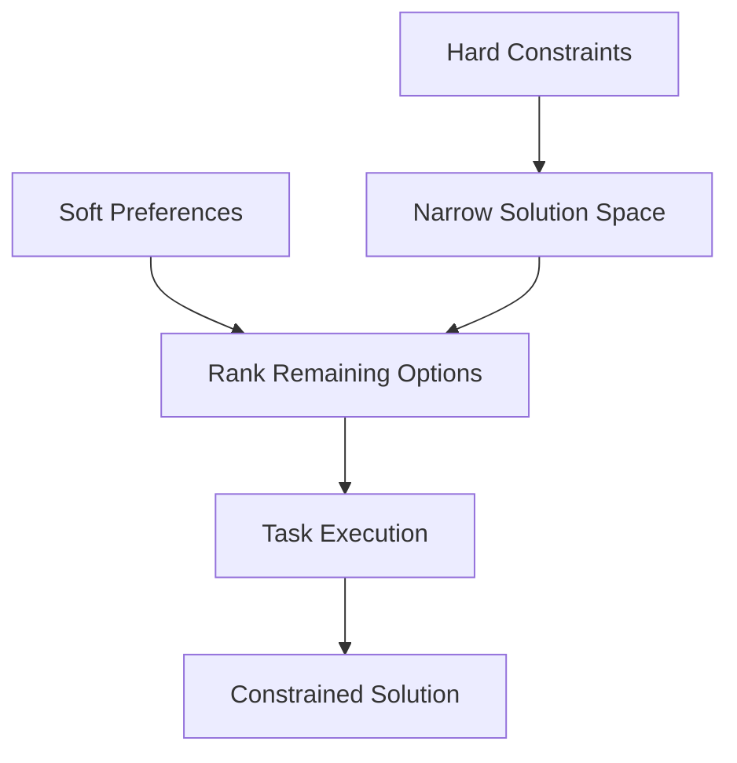

# Constraint-First Prompting

> [!summary]
> State hard constraints and soft preferences before the task. Google Brain researchers found this prevents technically correct but practically useless answers by forcing the model to work within real-world limitations from the start.

## Theory

### What Is Constraint-First Prompting?

This technique inverts the typical prompt structure:

1. **HARD CONSTRAINTS** — Absolute requirements that cannot be violated
2. **SOFT PREFERENCES** — Optimization goals to pursue when possible
3. **TASK** — The actual request
4. **CONFIRMATION** — Ask the model to acknowledge constraints before proceeding

Leading with constraints frames the entire solution space before the model starts generating.

### How It Works



Constraints eliminate infeasible solutions; preferences rank the feasible ones.

## Practical Examples

### Template

```
HARD CONSTRAINTS (cannot be violated):
- [constraint 1]
- [constraint 2]
- [constraint 3]

SOFT PREFERENCES (optimize for these):
- [preference 1]
- [preference 2]

TASK: [your actual request]

Confirm you understand all constraints before proceeding.
```

### Basic Usage

```
HARD CONSTRAINTS (cannot be violated):
- Must be written in Rust
- Cannot use any external dependencies
- Must compile on stable Rust 1.75+
- Maximum binary size: 5MB

SOFT PREFERENCES (optimize for these):
- Fast compilation time
- Minimal memory allocation

TASK: Write a CLI tool that parses 10GB CSV files and outputs JSON with schema validation

Confirm you understand all constraints before proceeding.
```

### Advanced Usage

```
HARD CONSTRAINTS (cannot be violated):
- Must run on AWS Lambda with 512MB memory limit
- Cold start must be under 500ms
- Must handle 1000 concurrent requests
- Zero external network calls during execution
- Must pass SOC 2 audit requirements
- All data encrypted at rest and in transit

SOFT PREFERENCES (optimize for these, in priority order):
1. Minimize P99 latency
2. Reduce Lambda costs
3. Simplify debugging and observability
4. Enable easy local development

TASK: Design a real-time pricing engine that applies dynamic discounts based on user segment, cart contents, and inventory levels.

Before providing the solution:
1. Confirm each hard constraint is understood
2. Flag any constraints that may conflict
3. Note if any constraint requires clarification
```

## Common Patterns

> [!tip] Separate Hard from Soft
> Hard constraints are pass/fail. Soft preferences are better/worse. Mixing them creates confusion about what's negotiable.

> [!tip] Prioritize Soft Preferences
> When soft preferences conflict (fast vs. cheap), priority order resolves the tradeoff. Unordered preferences get arbitrary resolution.

> [!warning] Verify Constraint Understanding
> "Confirm you understand" catches misinterpretation before the model generates a solution. Cheaper to clarify upfront than to regenerate.

## Edge Cases & Gotchas

- **Infeasible constraint sets** — Sometimes hard constraints conflict. The model should flag this rather than silently compromise one.
- **Hidden constraints** — Unstated constraints (budget, timeline, team skills) lead to impractical solutions. List everything relevant.
- **Over-constraining** — Too many hard constraints may eliminate all solutions. Start with true hard constraints; soften others to preferences.
- **Constraint scope** — "Must be fast" is a preference, not a constraint. "Must respond in under 100ms" is a constraint. Be specific.

## Related Topics

- [[Role-Based-Constraint-Prompting]] - Combines roles with constraints
- [[Context-Injection-with-Boundaries]] - Context constraints for RAG
- [[Structured-Thinking-Protocol]] - Analyze constraints before solving

## References

- [Google Research](https://research.google/)
- [Constrained Text Generation](https://arxiv.org/abs/2109.05093)
