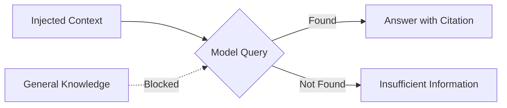

# Context Injection with Boundaries

> [!summary]
> Inject large context blocks with explicit rules about what the model can and cannot use. Boundaries prevent the model from mixing injected facts with general knowledge, eliminating hallucinations when working with proprietary systems.

## Theory

### What Is Context Injection with Boundaries?

Anthropic engineers developed this for RAG (Retrieval-Augmented Generation) workflows. The technique:

1. Clearly labels injected context
2. Restricts the model to only that context
3. Requires explicit admission when context is insufficient
4. Mandates citations to specific sections

This creates a closed-world assumption: if it's not in the context, the answer doesn't exist.

### How It Works



The boundaries prevent the model from "filling in" missing information with plausible-sounding but incorrect details.

## Practical Examples

### Template

```
[CONTEXT]
[paste your documentation, code, research paper]

[FOCUS]
Only use information from CONTEXT to answer. If the answer isn't in CONTEXT, say "Insufficient information in provided context."

[TASK]
[your specific question]

[CONSTRAINTS]
- Cite specific sections when referencing CONTEXT
- Do not use general knowledge outside CONTEXT
- If multiple interpretations exist, list all
```

### Basic Usage

```
[CONTEXT]
<paste your company's 50-page API documentation>

[FOCUS]
Only use information from CONTEXT to answer. If the answer isn't in CONTEXT, say "Insufficient information in provided context."

[TASK]
How do I implement rate limiting with retry logic for the /users endpoint?

[CONSTRAINTS]
- Cite specific sections when referencing CONTEXT
- Do not use general knowledge outside CONTEXT
- If multiple interpretations exist, list all
```

### Advanced Usage

```
[CONTEXT]
<paste internal architecture document, ~100 pages>

[FOCUS]
Answer only from CONTEXT. For any claim, cite the section number or page. If CONTEXT is silent on a topic, explicitly state: "CONTEXT does not address [topic]."

[TASK]
Design a migration plan from our current auth system to the new SSO provider.

[CONSTRAINTS]
- Every technical claim must cite a CONTEXT section
- Flag any gaps where CONTEXT lacks needed information
- If CONTEXT shows multiple valid approaches, present all with tradeoffs
- Separate "from CONTEXT" facts from "requires clarification" items
- Do not infer or extrapolate beyond explicit CONTEXT statements

[OUTPUT FORMAT]
1. Summary of relevant CONTEXT sections
2. Migration plan with citations
3. Gaps requiring additional documentation
4. Questions that CONTEXT does not answer
```

## Common Patterns

> [!tip] Require Explicit Gap Identification
> "Flag what's missing" is more useful than silent gaps. If the model must call out insufficient information, you know what documentation to add.

> [!tip] Use Section Labels in Context
> Label your context: "## Section 2.3: Authentication" makes citations precise. Unlabeled context produces vague references.

> [!warning] Context Window Limits
> Large documents may exceed context limits. Chunk strategically—include relevant sections, not entire documents.

## Edge Cases & Gotchas

- **Implicit knowledge leakage** — Models sometimes use general knowledge while appearing to cite context. Verify citations manually for critical applications.
- **Paraphrase confusion** — If context uses different terminology than the question, the model might miss relevant sections. Include synonyms in your query.
- **Overly literal interpretation** — "Not in context" might mean the exact phrase isn't there, even if the concept is. Ask about concepts, not just keywords.
- **Context quality matters** — Boundaries can't fix bad documentation. Garbage in, garbage out.

## Related Topics

- [[Chain-of-Verification]] - Verify answers against the injected context
- [[Constraint-First-Prompting]] - Explicit constraints complement context boundaries
- [[Structured-Thinking-Protocol]] - Structured analysis of contextual information

## References

- [Anthropic RAG Best Practices](https://docs.anthropic.com/claude/docs/prompt-engineering)
- [Retrieval-Augmented Generation Paper](https://arxiv.org/abs/2005.11401)
