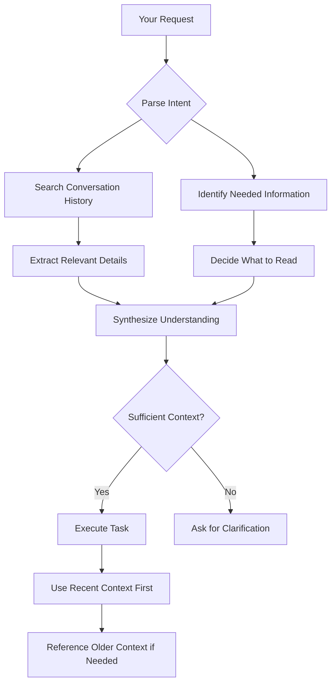

> [!summary]
> Master how Claude Code uses context to make decisions. Learn what information to provide, when to provide it, and how to manage conversation length effectively. Discover why more context doesn't always mean better results and how to optimize for quality over quantity.

## What Is Context in Claude Code?

Context is all the information Claude has available when processing your request:

1. **System instructions** — Built-in prompts defining Claude Code's behavior
2. **Conversation history** — Everything said and done in the current session
3. **Tool results** — File contents, command outputs, search results
4. **User input** — Your current request

Claude has a **200,000 token context window** (~150,000 words or ~600 pages of text). This seems massive, but it fills quickly with:
- Large files (a 1000-line file = ~3000-5000 tokens)
- Command outputs (test results, build logs)
- Previous conversation turns
- Tool call results

**Key Insight:** Claude can hold a lot, but attention isn't uniform. Recent information and your direct input get more weight than distant conversation history.

## How Claude Uses Context



**Important patterns:**

1. **Recency bias** — Recent messages matter more than old ones
2. **Explicit > Implicit** — Directly stated info beats inferred info
3. **Structured > Unstructured** — Clear requirements beat scattered details
4. **Relevant > Comprehensive** — Targeted context beats exhaustive context

## The Goldilocks Principle

### Too Little Context

**Problem:** Claude makes assumptions or guesses wrong.

❌ **Example:**
```
You: "Add error handling to the API"
Claude: "Which API? I see 15 different endpoints."
```

Claude has to ask clarifying questions, wasting turns.

**Symptoms:**
- Frequent clarification requests
- Claude editing wrong files
- Implementations that miss the mark
- You saying "no, not that one" repeatedly

### Too Much Context

**Problem:** Claude gets overwhelmed or distracted by irrelevant information.

❌ **Example:**
```
You: "I'm building an app using React, TypeScript, Next.js 14, Tailwind,
     Prisma, PostgreSQL, deployed on Vercel, using GitHub Actions for CI/CD,
     with Jest for testing, ESLint for linting, Prettier for formatting,
     Husky for git hooks, and we follow the Airbnb style guide...

     [500 more words]

     ...so can you fix the typo in Header.tsx line 23?"
```

Claude spends tokens processing irrelevant details about your entire stack when it just needs to fix a typo.

**Symptoms:**
- Slow responses (processing time)
- Higher costs (more tokens used)
- Claude mentioning irrelevant details
- Context window fills quickly
- Losing track of earlier conversation

### Just Right Context

**Balance:** Provide exactly what Claude needs for the current task, no more, no less.

✅ **Example:**
```
You: "Fix the typo in src/components/Header.tsx line 23.
     It says 'Helo' and should be 'Hello'."
```

Simple fix, simple context. No need for stack details.

✅ **Example (complex task):**
```
You: "Add JWT authentication to the /api/auth/login endpoint.

Context:
- Using Next.js 14 App Router (src/app/api/auth/)
- Database: Prisma with PostgreSQL
- Current code: src/app/api/auth/login/route.ts
- Password hashing: bcrypt (already set up)

Requirements:
- Generate JWT with user id and role
- Return token in response body
- Token expires in 24 hours
- Use 'JWT_SECRET' from .env"
```

Specific task-relevant context. No mention of unrelated tools.

## Practical Examples

### Basic Usage: Single File Edit

**Scenario:** Fixing a bug in one file.

❌ **Too much:**
```
I'm working on a large e-commerce platform with React frontend and Node backend.
We use Redux for state, Express for API, MongoDB for database, and Docker for
deployment. The frontend has 50+ components and the backend has 30+ routes.
[Continues for 10 paragraphs...]

There's a bug in ProductCard.tsx.
```

✅ **Just right:**
```
There's a bug in src/components/ProductCard.tsx line 45.
The price isn't displaying correctly—it shows "$NaN" for some products.

The issue is likely in the price calculation or formatting.
Can you identify and fix it?
```

### Intermediate Example: Multi-File Feature

**Scenario:** Adding a feature that spans several files.

✅ **Good approach:**
```
I need to add a "favorites" feature where users can save products.

Context:
- Next.js 14 with TypeScript
- Auth: JWT tokens with user ID in payload
- Database: Prisma with PostgreSQL
- Current user model: id, email, name, createdAt

Implementation needed:
1. Database: Add Favorite model (userId, productId, createdAt)
2. API: POST /api/favorites (add favorite)
3. API: DELETE /api/favorites/:id (remove favorite)
4. API: GET /api/favorites (list user's favorites)
5. Frontend: Heart icon on product cards (toggle favorite)

Files to create/modify:
- prisma/schema.prisma (add Favorite model)
- src/app/api/favorites/ (new API routes)
- src/components/ProductCard.tsx (add heart icon)

Pattern to follow:
- Look at src/app/api/cart/ for similar CRUD API structure
- Use the auth middleware pattern from src/middleware/auth.ts
```

This provides:
- Clear goal
- Necessary technical details
- File locations
- Existing patterns to follow

### Advanced Usage: Working with Large Codebase

**Scenario:** Making changes to unfamiliar codebase.

**Phase 1: Exploration**
```
I need to understand how authentication currently works in this codebase.

Search for:
- JWT token generation
- Auth middleware
- User login/registration
- Protected routes

Show me the main files involved and how they connect.
```

**Phase 2: After Exploration**
```
Thanks! Now I understand the flow. I need to add OAuth2 support alongside
the existing JWT system.

Based on what you found:
- Keep the existing JWT logic in src/services/auth.ts
- Add OAuth handlers in src/services/oauth.ts (new file)
- Update src/middleware/auth.ts to accept both JWT and OAuth tokens
- Add OAuth routes to src/routes/auth.ts

Requirements:
- Support Google and GitHub OAuth
- Store OAuth tokens in database (add fields to User model)
- Maintain backward compatibility with existing JWT users
```

This two-phase approach:
1. Lets Claude explore and report back
2. Uses findings to craft targeted implementation request

## Common Patterns

### Pattern 1: Incremental Context Building

> [!tip] Start Broad, Then Narrow
> Begin with high-level context, add specifics as needed.

```
Turn 1: "I'm building a notification system using WebSockets."
Turn 2: "Great plan! For the backend, we're using Express with Socket.io already installed."
Turn 3: "For notifications, use the toast pattern from react-hot-toast like we do in Header.tsx"
```

Each turn adds specificity without overwhelming initially.

### Pattern 2: Context Checkpoints

> [!tip] Restate Key Details in Long Conversations
> Every 5-10 turns, restate critical requirements.

```
Turn 1-5: [Discussing database schema]
Turn 6-10: [Implementing backend API]
Turn 11: "Now for the frontend. As a reminder, we're using Next.js 14 with App Router
          and Tailwind. The notifications should appear as toasts in the top-right..."
```

This prevents Claude from "forgetting" early details buried in conversation history.

### Pattern 3: Explicit Scope Management

> [!tip] Define What's In and Out of Scope
> Explicitly state boundaries to prevent scope creep.

```
"Add user profile editing with these fields: name, email, avatar.

In scope:
- Edit form with validation
- Update API endpoint
- Avatar upload (max 2MB)

Out of scope:
- Password change (separate feature)
- Email verification (already exists)
- Delete account (future work)

Focus only on the in-scope items."
```

### Pattern 4: Reference Points

> [!tip] Point to Existing Patterns
> Reference existing code instead of describing patterns.

```
"Add error handling following the same pattern used in
 src/api/users.ts lines 45-60."
```

This is more efficient than explaining the pattern in words. Claude can read the file and match the style.

## Edge Cases & Gotchas

### Gotcha 1: The Hidden File Problem

**Problem:** Claude needs to see file contents to make good decisions, but you haven't explicitly told it to read.

**Example:**
```
You: "Update the login function to hash passwords"
Claude: "Sure! [makes changes without seeing current implementation]"
Result: Breaks existing code because Claude didn't know implementation details
```

**Fix:** Be explicit about reading.
```
"Read src/services/auth.ts and update the login function to hash passwords
 using bcrypt. Keep the existing error handling and validation logic."
```

Or let Claude decide:
```
"Update the login function in src/services/auth.ts to hash passwords.
 Read the file first to understand the current implementation."
```

### Gotcha 2: Stale Context Assumptions

**Problem:** Earlier conversation details become outdated but Claude references them.

**Example:**
```
Turn 1: "We're using Redux" [You mention early on]
[20 turns pass, you switch to Zustand]
Turn 25: "Add state management for notifications"
Claude: [Implements Redux because that's what you said initially]
```

**Fix:** Update context explicitly.
```
Turn 25: "Add state management for notifications.

Note: We've migrated from Redux to Zustand since earlier in this conversation.
Use Zustand patterns like in src/store/userStore.ts"
```

### Gotcha 3: Implicit Files

**Problem:** You reference files ambiguously or expect Claude to guess locations.

**Example:**
```
You: "Update the auth logic"
Claude: "I see auth code in 5 different places. Which one?"
```

**Fix:** Use full paths.
```
"Update the auth logic in src/services/auth.ts (specifically the login function)"
```

### Gotcha 4: Context Pollution

**Problem:** Failed attempts or debugging discussions pollute context with misinformation.

**Example:**
```
Turn 1-10: [Trying approach A, doesn't work]
Turn 11-15: [Debugging, lots of incorrect theories]
Turn 16: "Let's start fresh with approach B"
Claude: [Still influenced by earlier failed attempts and wrong theories]
```

**Fix:** Start a new conversation.
```
"Let's start a new session. Here's a clean summary of what we need..."
```

Or explicitly dismiss old context:
```
"Disregard everything before this message. Here's the correct approach..."
```

## Managing Long Conversations

### When to Start Fresh

Start a new conversation when:

✅ **Task is complete** — Finished implementing a feature, moving to unrelated work
✅ **Context is polluted** — Multiple failed attempts, lots of debugging noise
✅ **Direction changed** — Initial approach abandoned, trying something different
✅ **Too much history** — 50+ messages, conversation is sluggish
✅ **Unrelated work** — Previous task was about frontend, now doing backend

### When to Continue

Continue the conversation when:

✅ **Iterating on same task** — Refining, fixing bugs, adding related features
✅ **Context is valuable** — Claude's understanding of codebase is useful
✅ **Sequential work** — Building on previous changes logically
✅ **Performance is fine** — No slowdown, context window not stressed

### Conversation Hygiene

> [!tip] Keep Conversations Focused
> One conversation = one logical unit of work.

**Good conversation scopes:**
- Implementing a complete feature (authentication system)
- Debugging and fixing a specific bug
- Refactoring a module
- Adding tests for a component

**Bad conversation scopes:**
- "Everything I do today"
- Multiple unrelated bugs
- Feature work + debugging + refactoring
- Jumping between frontend and backend randomly

## Optimization Techniques

### Technique 1: Lazy Loading Context

Don't frontload everything. Provide context as needed.

❌ **Frontload everything:**
```
[Sends 10 files worth of code]
"I might need to change something in one of these files"
```

✅ **Lazy load:**
```
"I need to add a validation function. First, check where validation
 currently happens (search for 'validate' in src/). Then we'll decide
 where to add the new function."
```

### Technique 2: Context Summaries

After exploration, ask for a summary:

```
You: [Claude explores codebase]
You: "Summarize the authentication flow you found in 3-4 bullet points"
Claude: [Provides concise summary]
You: "Perfect. Now update step 2 to use JWT instead of sessions"
```

Summaries compress information efficiently.

### Technique 3: Use Task Agents

For exploration or research, use specialized agents:

```
You: "Use the Explore agent to map out how errors are handled across the codebase"
[Explore agent runs and returns findings]
You: [Now has compressed, relevant context for your change]
```

Agents handle context-heavy work without polluting main conversation.

### Technique 4: Strategic File Reading

Be selective about what Claude reads:

```
"Read src/services/auth.ts (just the login function, lines 45-80).
 I only need to modify password handling."
```

vs.

```
"Read all files in src/" [Wastes tokens on irrelevant files]
```

## Measuring Context Efficiency

Your context management is good when:

✅ Claude rarely asks for clarification about missing info
✅ Responses are fast (not processing excessive context)
✅ Claude doesn't reference outdated or irrelevant details
✅ You can continue conversations 20+ turns without confusion
✅ Conversation history stays relevant and focused

Your context needs improvement if:

❌ Claude frequently asks "which file?" or "what do you mean?"
❌ Responses are slow, taking 10+ seconds
❌ Claude mentions things you said 30 turns ago that are no longer relevant
❌ You have to restart conversations every 5-10 turns
❌ Claude seems "confused" or references wrong information

## Advanced: Context Debugging

If Claude seems confused, diagnose the issue:

**Check 1: What does Claude think is true?**
```
"What technology stack do you understand we're using right now?"
```

**Check 2: What files has Claude seen?**
```
"List the files you've read in this conversation and what you learned from each."
```

**Check 3: What's the current task?**
```
"Summarize what you understand the current task to be."
```

These questions reveal misalignment between your understanding and Claude's.

## Related Topics

- [[Prompt-Engineering-for-Claude-Code]] — Writing effective requests
- [[Chain-of-Thought]] — How Claude reasons through problems
- [[Claude-Code-Best-Practices]] — Overall best practices hub
- [[Advanced-Claude-Code-Techniques]] — Optimization patterns

## References

- [Claude Context Window Documentation](https://docs.anthropic.com/en/docs/)
- [Prompt Engineering for Context](https://docs.anthropic.com/en/docs/build-with-claude/prompt-engineering/overview)
- [Working with Large Codebases](https://github.com/anthropics/claude-code)