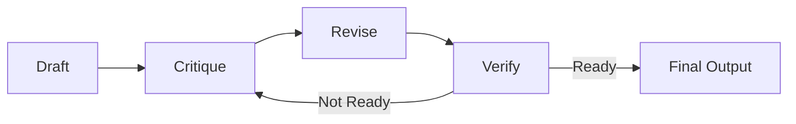

# Iterative Refinement Loop

> [!summary]
> Chain prompts to refine outputs through multiple passes: draft, critique, rewrite, verify. Single-pass outputs rarely achieve production quality; this structured iteration reaches 90%+ quality by forcing self-criticism and improvement.

## Theory

### What Is Iterative Refinement?

OpenAI's research team uses multi-pass refinement for complex outputs. The process:

1. **ITERATION 1** — Create initial draft
2. **ITERATION 2** — Identify weaknesses and gaps
3. **ITERATION 3** — Rewrite addressing all issues
4. **ITERATION 4** — Final review for production-readiness

Each pass builds on the previous, with explicit critique driving improvement.

### How It Works



The critique phase is critical—it prevents the model from declaring early drafts "good enough."

## Practical Examples

### Template

```
[ITERATION 1]
Create a [draft/outline/initial version] of [task]

[ITERATION 2]
Review the above output. Identify 3 weaknesses or gaps.

[ITERATION 3]
Rewrite the output addressing all identified weaknesses.

[ITERATION 4]
Final review: Is this production-ready? If not, what's missing?
```

### Basic Usage

```
[ITERATION 1]
Create a draft sales email for reaching out to engineering VPs at Series B startups about our CI/CD optimization tool

[ITERATION 2]
Review the above output. Identify 3 weaknesses or gaps.

[ITERATION 3]
Rewrite the output addressing all identified weaknesses.

[ITERATION 4]
Final review: Is this production-ready? If not, what's missing?
```

### Advanced Usage

```
[ITERATION 1]
Draft a technical RFC for migrating our monolithic authentication service to a distributed architecture. Include: problem statement, proposed solution, alternatives considered, migration plan, rollback strategy.

[ITERATION 2]
Review the RFC critically:
- Identify 3 technical weaknesses or unstated assumptions
- Find 2 gaps in the migration plan
- Note any missing stakeholder concerns
- Check for unclear or ambiguous sections

[ITERATION 3]
Rewrite the RFC addressing every issue from Iteration 2. For each fix, briefly note what changed.

[ITERATION 4]
Final review checklist:
- [ ] Problem statement is specific and measurable
- [ ] Solution addresses root cause, not symptoms
- [ ] Alternatives have fair evaluation
- [ ] Migration has concrete steps with owners
- [ ] Rollback is tested and documented
- [ ] Risks are identified with mitigations

If any box is unchecked, specify what's missing.
```

## Common Patterns

> [!tip] Specify Critique Categories
> "Identify weaknesses" is vague. "Identify weaknesses in: technical accuracy, completeness, clarity, actionability" produces better critique.

> [!tip] Require Specific Fixes
> In ITERATION 3, require the model to note what changed. This prevents superficial rewrites that don't address the critique.

> [!warning] Diminishing Returns
> Beyond 3-4 iterations, improvements become marginal. If still not production-ready after 4 passes, the problem is likely the requirements, not the execution.

## Edge Cases & Gotchas

- **Self-congratulatory critique** — The model might praise its own work instead of finding real issues. Require a minimum number of weaknesses.
- **Cosmetic fixes** — Rewrites might change wording without addressing substance. Require explanations of what each fix addresses.
- **Scope creep** — Each iteration might add features. Keep original requirements visible to prevent drift.
- **Token cost** — Multiple iterations consume more tokens. Balance quality needs against cost constraints.

## Related Topics

- [[Chain-of-Verification]] - Verification focus instead of general refinement
- [[Structured-Thinking-Protocol]] - Structured thinking before drafting
- [[Meta-Prompting]] - Generate the refinement criteria automatically

## References

- [OpenAI Research](https://openai.com/research)
- [Self-Refine: Iterative Refinement with Self-Feedback](https://arxiv.org/abs/2303.17651)
