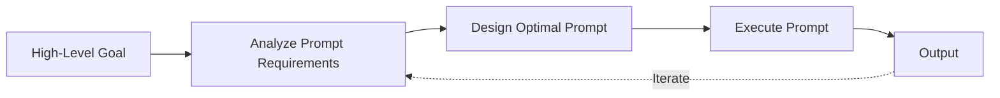

# Meta-Prompting

> [!summary]
> Ask the AI to design the optimal prompt for your goal, then execute it. OpenAI's red team uses this technique to find edge cases and achieve better results than human-written prompts. This is prompt engineering delegated to the model itself.

## Theory

### What Is Meta-Prompting?

Meta-prompting inverts the typical workflow:

1. Describe your high-level goal
2. Ask the model to analyze what makes a perfect prompt for that goal
3. Have the model write that prompt
4. Execute the generated prompt
5. Optionally iterate

The model often writes better prompts than humans because it understands its own processing patterns.

### How It Works



The meta-prompt considers: specificity, context needs, constraint clarity, output format, and example requirements.

## Practical Examples

### Template

```
I need to accomplish: [high-level goal]

Your task:
1. Analyze what would make the PERFECT prompt for this goal
2. Consider: specificity, context, constraints, output format, examples needed
3. Write that perfect prompt
4. Then execute it and provide the output

[GOAL]: [your actual objective]
```

### Basic Usage

```
I need to accomplish: Build a Python script that scrapes Twitter threads, converts them to blog posts with proper formatting, and auto-generates SEO meta descriptions

Your task:
1. Analyze what would make the PERFECT prompt for this goal
2. Consider: specificity, context, constraints, output format, examples needed
3. Write that perfect prompt
4. Then execute it and provide the output

[GOAL]: Twitter thread to blog post converter with SEO optimization
```

### Advanced Usage

```
I need to accomplish: Design a complete authentication system for a fintech application that handles millions of users, must be SOC 2 compliant, and needs to support multiple auth methods.

Your task:

PHASE 1 - PROMPT ENGINEERING:
1. Analyze what information a perfect prompt would need:
   - What context about the existing system is critical?
   - What constraints must be explicit?
   - What output format would be most useful?
   - What examples or anti-examples would help?
   - What edge cases should the prompt address?

2. Write the perfect prompt, including:
   - System context sections
   - Explicit requirements and constraints
   - Output structure
   - Verification criteria

3. Critique your own prompt:
   - What ambiguities remain?
   - What assumptions are unstated?
   - How could the prompt produce bad output?

4. Revise the prompt based on critique

PHASE 2 - EXECUTION:
5. Execute your refined prompt
6. Verify output meets the stated criteria

[GOAL]: Production-ready authentication architecture for fintech
```

## Common Patterns

> [!tip] Require Prompt Critique
> Ask the model to critique its own generated prompt before execution. This catches issues before they affect output.

> [!tip] Save Generated Prompts
> Good meta-generated prompts are reusable. Save them for similar future tasks.

> [!warning] Iteration Often Needed
> First meta-prompt may miss context you assumed. Review the generated prompt and add missing context before execution.

## Edge Cases & Gotchas

- **Prompt bloat** — Generated prompts can be verbose. Ask for concise prompts that preserve essential elements.
- **Self-reinforcing patterns** — The model may generate prompts that play to its strengths while avoiding weaknesses. Compare against manually crafted prompts.
- **Missing domain context** — The model can't know your specific codebase, team, or constraints. Provide this context in the goal description.
- **Recursion limits** — Meta-meta-prompting (asking the model to design a prompt for designing prompts) has diminishing returns. One meta-layer usually suffices.

## When to Use Meta-Prompting

| Situation | Use Meta-Prompting? |
|-----------|-------------------|
| Complex, multi-faceted task | Yes |
| Unfamiliar domain | Yes |
| Repeatable task needing optimization | Yes |
| Simple, well-defined task | No - direct prompt faster |
| Time-critical response needed | No - adds latency |

## Related Topics

- [[Role-Based-Constraint-Prompting]] - Meta-prompting can generate role definitions
- [[Iterative-Refinement-Loop]] - Apply iteration to meta-generated prompts
- [[Structured-Thinking-Protocol]] - Structure for the prompt design phase

## References

- [OpenAI Red Team](https://openai.com/research)
- [Large Language Models as Optimizers](https://arxiv.org/abs/2309.03409)
