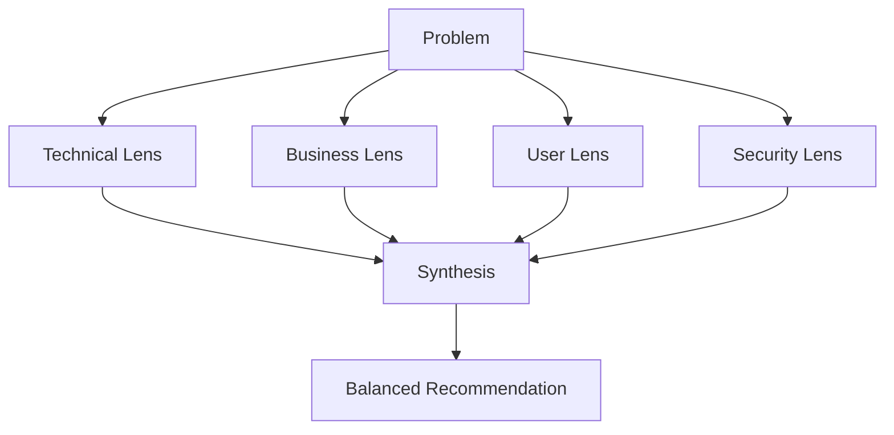

 comp
# Multi-Perspective Prompting

> [!summary]
> Analyze problems from multiple defined viewpoints—technical, business, user, security—then synthesize into a balanced recommendation. Anthropic's Constitutional AI research shows this reduces bias and produces strategic thinking instead of surface-level advice.

## Theory

### What Is Multi-Perspective Prompting?

This technique forces analysis through multiple lenses before reaching conclusions:

1. Define 3-5 distinct perspectives relevant to the problem
2. Analyze from each perspective independently
3. Synthesize findings into a unified recommendation
4. Explicitly state tradeoffs between perspectives

Single-perspective answers miss critical considerations. Multi-perspective analysis surfaces conflicts and tradeoffs.

### How It Works



Each perspective may reach different conclusions. The synthesis acknowledges tensions rather than hiding them.

## Practical Examples

### Template

```
Analyze [topic/problem] from these perspectives:

[PERSPECTIVE 1: Technical Feasibility]
[specific lens]

[PERSPECTIVE 2: Business Impact]
[specific lens]

[PERSPECTIVE 3: User Experience]
[specific lens]

[PERSPECTIVE 4: Risk/Security]
[specific lens]

SYNTHESIS:
Integrate all perspectives into a final recommendation with trade-offs clearly stated.
```

### Basic Usage

```
Analyze whether we should migrate from Postgres to DynamoDB from these perspectives:

[PERSPECTIVE 1: Technical Feasibility]
Engineering complexity, timeline, data migration risks

[PERSPECTIVE 2: Business Impact]
Cost implications, team velocity, vendor lock-in

[PERSPECTIVE 3: User Experience]
Latency changes, feature implications, downtime requirements

[PERSPECTIVE 4: Risk/Security]
Data consistency guarantees, backup procedures, compliance

SYNTHESIS:
Integrate all perspectives into a final recommendation with trade-offs clearly stated.
```

### Advanced Usage

```
Analyze the decision to build vs. buy a customer data platform:

[PERSPECTIVE 1: Technical Architecture]
- Integration complexity with existing systems
- Scalability to 100M+ customer records
- Real-time vs. batch processing requirements
- Data model flexibility

[PERSPECTIVE 2: Financial Analysis]
- Build: engineering cost, maintenance burden, opportunity cost
- Buy: licensing, implementation services, long-term TCO
- Break-even timeline

[PERSPECTIVE 3: Product & User Impact]
- Time to value for marketing team
- Customization needs vs. vendor capabilities
- Learning curve and adoption risk

[PERSPECTIVE 4: Strategic & Competitive]
- Core competency considerations
- Vendor dependency and negotiating leverage
- Future M&A implications
- Competitive differentiation potential

[PERSPECTIVE 5: Risk & Compliance]
- Data residency requirements
- Vendor security certifications
- Business continuity concerns

SYNTHESIS:
- Rank perspectives by importance for this specific decision
- Identify where perspectives align
- Highlight irreconcilable tensions
- Provide recommendation with confidence level
- Specify what additional data would change the analysis
```

## Common Patterns

> [!tip] Choose Perspectives Relevant to Stakeholders
> Technical for engineering, business for executives, UX for product. Match perspectives to the actual decision-makers.

> [!tip] Require Explicit Conflicts
> "Where do perspectives disagree?" is more valuable than false harmony. Tradeoffs should be visible.

> [!warning] Avoid Perspective Bleed
> Each perspective should be analyzed independently first. Premature synthesis waters down distinct viewpoints.

## Edge Cases & Gotchas

- **Too many perspectives** — Beyond 5-6 perspectives, analysis becomes unfocused. Pick the most relevant ones.
- **Uneven depth** — The model may analyze some perspectives thoroughly and others superficially. Request equal treatment.
- **False consensus** — Synthesis might paper over real conflicts. Require explicit "irreconcilable tensions" section.
- **Missing perspectives** — The obvious ones (tech, business) might crowd out important ones (ethics, accessibility). Consider what's commonly overlooked.

## Related Topics

- [[Structured-Thinking-Protocol]] - Structured analysis within each perspective
- [[Confidence-Weighted-Prompting]] - Rate confidence per perspective
- [[Chain-of-Verification]] - Verify claims made in each perspective

## References

- [Anthropic Constitutional AI](https://www.anthropic.com/research)
- [Multi-Stakeholder Decision Making](https://hbr.org/)
