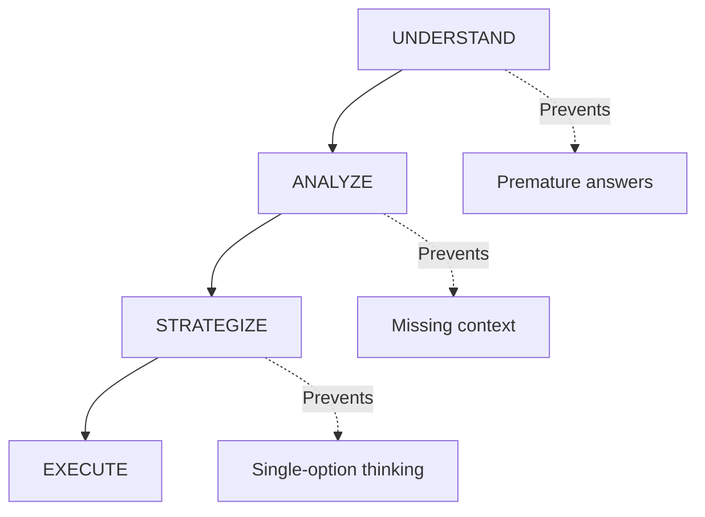

# Structured Thinking Protocol

> [!summary]
> Force the model to think in explicit layers—understand, analyze, strategize, execute—before responding. This prevents shallow answers that regurgitate best practices without considering context.

## Theory

### What Is Structured Thinking Protocol?

This technique mandates a four-phase reasoning process:

1. **UNDERSTAND** — Restate the problem; identify what's actually being asked
2. **ANALYZE** — Break into components; note assumptions and constraints
3. **STRATEGIZE** — Outline approaches; evaluate tradeoffs
4. **EXECUTE** — Provide the answer with reasoning

The structure prevents the model from jumping to conclusions.

### How It Works

Each phase builds on the previous one. Understanding must precede analysis. Analysis informs strategy. Strategy guides execution. Skipping phases produces shallow answers.



## Practical Examples

### Template

```
Before answering, complete these steps:

[UNDERSTAND]
- Restate the problem in your own words
- Identify what's actually being asked

[ANALYZE]
- Break down into sub-components
- Note any assumptions or constraints

[STRATEGIZE]
- Outline 2-3 potential approaches
- Evaluate trade-offs

[EXECUTE]
- Provide your final answer
- Explain your reasoning

Question: [your question]
```

### Basic Usage

```
Before answering, complete these steps:

[UNDERSTAND]
- Restate the problem in your own words
- Identify what's actually being asked

[ANALYZE]
- Break down into sub-components
- Note any assumptions or constraints

[STRATEGIZE]
- Outline 2-3 potential approaches
- Evaluate trade-offs

[EXECUTE]
- Provide your final answer
- Explain your reasoning

Question: Should I use microservices or monolith for a 5-person startup building a B2B SaaS with 1000 expected users in year one?
```

### Advanced Usage

```
Before answering, complete these steps:

[UNDERSTAND]
- Restate the core technical challenge
- Identify success criteria and failure modes
- Clarify any ambiguous requirements

[ANALYZE]
- Map system components and dependencies
- Identify bottlenecks and scaling limits
- Note security and compliance constraints
- List assumptions about traffic patterns

[STRATEGIZE]
- Propose 3 architectural approaches
- For each: estimate complexity, cost, timeline
- Identify risks and mitigation strategies
- Recommend based on stated constraints

[EXECUTE]
- Provide detailed implementation plan
- Include specific technologies and configurations
- Add monitoring and rollback procedures

Question: Design a real-time notification system that must deliver 1M+ push notifications within 30 seconds of a triggering event, with 99.9% delivery guarantee.
```

## Common Patterns

> [!tip] Customize Phases for Domain
> For code reviews: UNDERSTAND (intent), ANALYZE (implementation), CRITIQUE (issues), RECOMMEND (fixes). Adapt the structure to your use case.

> [!tip] Require Explicit Tradeoffs
> In STRATEGIZE, always ask for tradeoffs. This prevents the model from presenting one option as obviously correct.

> [!warning] Don't Skip to Execute
> If you only need a quick answer, this technique adds overhead. Use it for complex decisions where reasoning quality matters.

## Edge Cases & Gotchas

- **Verbose output** — The structured format produces longer responses. Trim if needed, but don't sacrifice the reasoning steps.
- **Performative analysis** — The model might go through the motions without genuine analysis. Look for specific, contextual insights rather than generic statements.
- **Constraint conflicts** — ANALYZE might reveal that stated requirements conflict. This is valuable—it surfaces problems early.
- **Strategy paralysis** — Sometimes 2-3 approaches are genuinely equivalent. Accept "it depends on X" as a valid answer.

## Related Topics

- [[Chain-of-Verification]] - Self-verification after structured thinking
- [[Multi-Perspective-Prompting]] - Multiple viewpoints during analysis
- [[Role-Based-Constraint-Prompting]] - Add expert persona to structured thinking

## References

- [OpenAI Research](https://openai.com/research)
- [Chain-of-Thought Prompting](https://arxiv.org/abs/2201.11903)
