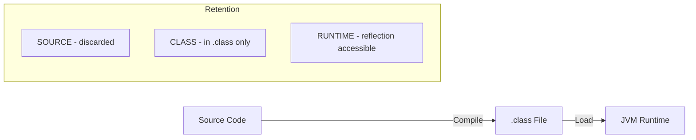

# Java Annotations

> [!summary]
> Annotations are a form of metadata that provide data about a program but are not part of the program itself. They have no direct effect on the operation of the code they annotate, but can be used by the compiler, at runtime via reflection, or by external tools for code generation, validation, and configuration.

## Theory

### What Are Annotations?

Annotations were introduced in Java 5 (J2SE 5.0) as a way to add metadata to Java source code. They serve as a standardized way to embed supplemental information in your code that can be processed by the compiler, development tools, or runtime environments.

**Key purposes:**
- **Information for the compiler** — Detect errors or suppress warnings
- **Compile-time processing** — Generate code, XML files, or other artifacts
- **Runtime processing** — Examine annotations via reflection for behavior modification

Annotations replace older mechanisms like marker interfaces, XML configuration files, and naming conventions with a more expressive, type-safe approach.

### How They Work

Annotations are defined using the `@interface` keyword (not to be confused with regular interfaces). When you apply an annotation to a code element, the Java compiler stores the annotation data in the compiled `.class` file. Depending on the annotation's **retention policy**, this data may be:

- **SOURCE** — Discarded after compilation (e.g., `@Override`)
- **CLASS** — Retained in `.class` file but not available at runtime (default)
- **RUNTIME** — Available via reflection at runtime (e.g., `@Deprecated`)



## Practical Examples

### Basic Usage

Using built-in annotations for compiler hints:

```java
public class BasicAnnotationExample {

    @Override  // Tells compiler to verify this method overrides a superclass method
    public String toString() {
        return "BasicAnnotationExample instance";
    }

    @Deprecated(since = "2.0", forRemoval = true)  // Marks method as obsolete
    public void oldMethod() {
        // Legacy code
    }

    @SuppressWarnings("unchecked")  // Suppresses specific compiler warnings
    public void methodWithRawTypes() {
        List rawList = new ArrayList();  // Raw type warning suppressed
        rawList.add("item");
    }
}
```

### Intermediate Example

Creating and using a custom annotation with runtime processing:

```java
import java.lang.annotation.*;
import java.lang.reflect.Method;

// Define a custom annotation
@Retention(RetentionPolicy.RUNTIME)  // Available at runtime
@Target(ElementType.METHOD)           // Can only be applied to methods
public @interface TestCase {
    String description() default "";
    int priority() default 1;
}

// Apply the annotation
public class UserService {

    @TestCase(description = "Validates user creation", priority = 1)
    public User createUser(String name, String email) {
        // Implementation
        return new User(name, email);
    }

    @TestCase(description = "Checks duplicate email handling", priority = 2)
    public boolean isEmailTaken(String email) {
        // Implementation
        return false;
    }
}

// Process annotations at runtime
public class TestRunner {
    public static void main(String[] args) {
        for (Method method : UserService.class.getDeclaredMethods()) {
            if (method.isAnnotationPresent(TestCase.class)) {
                TestCase tc = method.getAnnotation(TestCase.class);
                System.out.printf("Test: %s (Priority: %d) - %s%n",
                    method.getName(), tc.priority(), tc.description());
            }
        }
    }
}
```

### Advanced Usage

Creating a validation framework with repeatable annotations and meta-annotations:

```java
import java.lang.annotation.*;
import java.lang.reflect.Field;

// Meta-annotation to make @Constraint repeatable
@Retention(RetentionPolicy.RUNTIME)
@Target(ElementType.FIELD)
@Repeatable(Constraints.class)
public @interface Constraint {
    String type();  // "notNull", "minLength", "maxLength", "pattern"
    String value() default "";
    String message() default "Validation failed";
}

// Container annotation for repeatable @Constraint
@Retention(RetentionPolicy.RUNTIME)
@Target(ElementType.FIELD)
public @interface Constraints {
    Constraint[] value();
}

// Apply multiple constraints to a single field
public class RegistrationForm {

    @Constraint(type = "notNull", message = "Username is required")
    @Constraint(type = "minLength", value = "3", message = "Username must be at least 3 characters")
    @Constraint(type = "maxLength", value = "20", message = "Username cannot exceed 20 characters")
    @Constraint(type = "pattern", value = "^[a-zA-Z0-9_]+$", message = "Username can only contain letters, numbers, and underscores")
    private String username;

    @Constraint(type = "notNull", message = "Email is required")
    @Constraint(type = "pattern", value = "^[\\w.-]+@[\\w.-]+\\.\\w{2,}$", message = "Invalid email format")
    private String email;
}

// Validation processor
public class Validator {
    public static List<String> validate(Object obj) throws IllegalAccessException {
        List<String> errors = new ArrayList<>();

        for (Field field : obj.getClass().getDeclaredFields()) {
            field.setAccessible(true);
            Object value = field.get(obj);

            for (Constraint c : field.getAnnotationsByType(Constraint.class)) {
                if (!isValid(value, c)) {
                    errors.add(c.message());
                }
            }
        }
        return errors;
    }

    private static boolean isValid(Object value, Constraint c) {
        return switch (c.type()) {
            case "notNull" -> value != null;
            case "minLength" -> value != null && value.toString().length() >= Integer.parseInt(c.value());
            case "maxLength" -> value == null || value.toString().length() <= Integer.parseInt(c.value());
            case "pattern" -> value != null && value.toString().matches(c.value());
            default -> true;
        };
    }
}
```

## Common Patterns

> [!tip] Best Practice: Use Meta-Annotations for Clarity
> When creating custom annotations, always specify `@Retention` and `@Target`. This makes your annotation's behavior explicit and prevents misuse. Without `@Target`, annotations can be applied anywhere, which often leads to confusion.

> [!tip] Best Practice: Provide Sensible Defaults
> Always use `default` values for annotation elements when there's a reasonable default. This reduces boilerplate for common use cases while still allowing customization.

> [!warning] Common Mistake: Forgetting Runtime Retention
> If you plan to read annotations via reflection at runtime, you **must** use `@Retention(RetentionPolicy.RUNTIME)`. The default retention is `CLASS`, which discards annotations before runtime. This is one of the most common annotation bugs.

```java
// ❌ Won't work at runtime - uses default CLASS retention
public @interface MyAnnotation { }

// ✅ Available at runtime
@Retention(RetentionPolicy.RUNTIME)
public @interface MyAnnotation { }
```

> [!warning] Common Mistake: Mutable Annotation Values
> Annotation element types are restricted to primitives, String, Class, enums, annotations, and arrays of these types. You cannot use arbitrary objects, collections, or mutable types.

## Edge Cases & Gotchas

- **Annotation inheritance** — By default, annotations are NOT inherited by subclasses. Use `@Inherited` meta-annotation if you need subclass inheritance (only works on class-level annotations).

- **Array elements with single value** — When an annotation element is an array type and you provide a single value, you can omit the braces: `@SuppressWarnings("unchecked")` instead of `@SuppressWarnings({"unchecked"})`.

- **`value()` shorthand** — If an annotation has a single element named `value`, you can omit the element name: `@MyAnnotation("data")` instead of `@MyAnnotation(value = "data")`.

- **Type annotations (Java 8+)** — Annotations can be applied to type uses, not just declarations: `@NonNull String`, `List<@Valid User>`, `(@Readonly Object) obj`. These require `@Target(ElementType.TYPE_USE)`.

- **Repeatable annotations (Java 8+)** — To apply the same annotation multiple times, the annotation must be marked with `@Repeatable` and have a container annotation defined.

## Related Topics

- [[Reflection]] — The mechanism used to read annotations at runtime
- [[Generics]] — Often used together with annotations for type-safe processing
- [[Design-Patterns/Decorator]] — Annotations provide a declarative alternative to decorator pattern
- [[Spring-Beans]] — Framework that heavily uses annotations for dependency injection
- [[Lombok]] — Library that uses compile-time annotation processing for code generation

## References

- [Oracle Java Tutorials: Annotations](https://docs.oracle.com/javase/tutorial/java/annotations/)
- [Java SE Annotations Guide](https://docs.oracle.com/javase/8/docs/technotes/guides/language/annotations.html)
- [java.lang.annotation Package API](https://docs.oracle.com/javase/8/docs/api/java/lang/annotation/package-summary.html)
