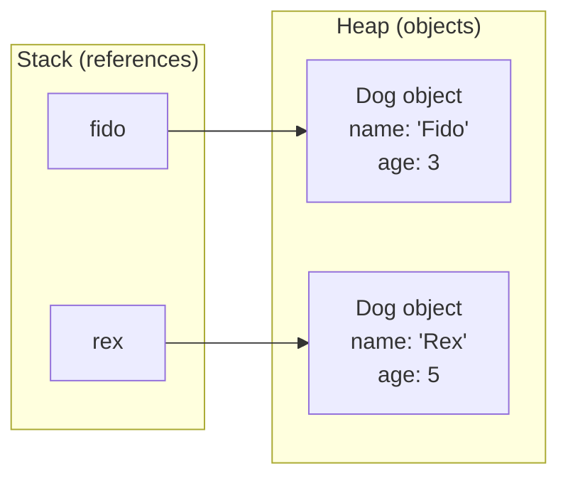

# Java Classes and Objects

> [!summary]
> A **class** is a blueprint for creating objects — it defines what data (fields) and behaviors (methods) objects of that type will have. An **object** is an instance of a class — a concrete thing in memory with actual values. Everything in Java revolves around classes: your code lives in classes, your data is stored in objects, and you solve problems by designing classes that model your domain.

## Quick Reference

| Term | Meaning | Example |
|------|---------|---------|
| **Class** | Blueprint/template | `class Dog { }` |
| **Object** | Instance of a class | `new Dog()` |
| **Field** | Data/state (variable in class) | `String name;` |
| **Method** | Behavior/action | `void bark() { }` |
| **Constructor** | Special method to create objects | `Dog(String name) { }` |
| **`this`** | Reference to current object | `this.name = name;` |
| **`new`** | Creates an object | `Dog d = new Dog();` |
| **`static`** | Belongs to class, not instance | `static int count;` |
| **`final`** | Cannot be changed/overridden | `final int MAX = 100;` |

## Theory

### Classes as Blueprints

Think of a class like an architectural blueprint:
- The blueprint defines rooms, dimensions, features
- Each house built from the blueprint is an **object**
- Each house has the same structure but different contents (paint color, furniture)

```java
// Blueprint (class)
class Dog {
    String name;    // Every dog HAS a name
    int age;        // Every dog HAS an age

    void bark() {   // Every dog CAN bark
        System.out.println(name + " says Woof!");
    }
}

// Objects (instances)
Dog fido = new Dog();    // One specific dog
fido.name = "Fido";
fido.age = 3;

Dog rex = new Dog();     // Another specific dog
rex.name = "Rex";
rex.age = 5;

fido.bark();  // "Fido says Woof!"
rex.bark();   // "Rex says Woof!"
```

### Memory Model



- **Stack**: Holds references (variables that point to objects)
- **Heap**: Holds actual objects (the data)
- Multiple references can point to the same object

## Practical Examples

### Basic Class Structure

```java
public class Person {
    // ============ FIELDS (state/data) ============
    private String name;        // Instance field — each Person has their own
    private int age;
    private static int count;   // Static field — shared by ALL Persons

    // ============ CONSTRUCTORS ============
    // Default constructor (no parameters)
    public Person() {
        this.name = "Unknown";
        this.age = 0;
        count++;
    }

    // Parameterized constructor
    public Person(String name, int age) {
        this.name = name;        // 'this' distinguishes field from parameter
        this.age = age;
        count++;
    }

    // Constructor chaining
    public Person(String name) {
        this(name, 0);           // Calls the two-parameter constructor
    }

    // ============ METHODS (behavior) ============
    // Instance method — operates on this object's data
    public void introduce() {
        System.out.println("Hi, I'm " + name + ", " + age + " years old.");
    }

    // Method with parameters and return value
    public boolean isOlderThan(Person other) {
        return this.age > other.age;
    }

    // Static method — belongs to class, not instances
    public static int getCount() {
        return count;
    }

    // ============ GETTERS AND SETTERS ============
    public String getName() {
        return name;
    }

    public void setName(String name) {
        this.name = name;
    }

    public int getAge() {
        return age;
    }

    public void setAge(int age) {
        if (age >= 0) {          // Validation logic
            this.age = age;
        }
    }
}

// Usage
public class Main {
    public static void main(String[] args) {
        Person alice = new Person("Alice", 30);
        Person bob = new Person("Bob", 25);
        Person unknown = new Person();

        alice.introduce();       // "Hi, I'm Alice, 30 years old."
        bob.introduce();         // "Hi, I'm Bob, 25 years old."

        System.out.println(alice.isOlderThan(bob));  // true

        System.out.println(Person.getCount());       // 3 (static method)
    }
}
```

### Access Modifiers

Control who can see and use your class members:

```java
public class AccessExample {
    public String publicField;       // Anyone can access
    protected String protectedField; // Same package + subclasses
    String packageField;             // Same package only (default)
    private String privateField;     // Only this class

    // Typical pattern: private fields, public methods
    private int balance;

    public int getBalance() {
        return balance;
    }

    public void deposit(int amount) {
        if (amount > 0) {
            balance += amount;
        }
    }
}
```

| Modifier | Same Class | Same Package | Subclass | World |
|----------|------------|--------------|----------|-------|
| `public` | ✅ | ✅ | ✅ | ✅ |
| `protected` | ✅ | ✅ | ✅ | ❌ |
| (default) | ✅ | ✅ | ❌ | ❌ |
| `private` | ✅ | ❌ | ❌ | ❌ |

### Static vs Instance Members

```java
public class Counter {
    // Static: ONE copy shared by all instances
    private static int totalCount = 0;

    // Instance: EACH object has its own copy
    private int myCount = 0;

    public Counter() {
        totalCount++;  // Increments the shared counter
    }

    public void increment() {
        myCount++;     // Increments THIS object's counter
        totalCount++;  // Also increments shared counter
    }

    public int getMyCount() {
        return myCount;
    }

    // Static method — can only access static members
    public static int getTotalCount() {
        return totalCount;
        // return myCount;  // ERROR! Can't access instance field from static
    }
}

// Usage
Counter c1 = new Counter();  // totalCount = 1
Counter c2 = new Counter();  // totalCount = 2

c1.increment();              // c1.myCount = 1, totalCount = 3
c1.increment();              // c1.myCount = 2, totalCount = 4
c2.increment();              // c2.myCount = 1, totalCount = 5

System.out.println(c1.getMyCount());      // 2
System.out.println(c2.getMyCount());      // 1
System.out.println(Counter.getTotalCount()); // 5
```

### Records (Java 16+) — Concise Data Classes

For simple data-holding classes, records eliminate boilerplate:

```java
// Traditional class — lots of boilerplate
public class PersonOld {
    private final String name;
    private final int age;

    public PersonOld(String name, int age) {
        this.name = name;
        this.age = age;
    }

    public String getName() { return name; }
    public int getAge() { return age; }

    @Override
    public boolean equals(Object o) { /* ... */ }
    @Override
    public int hashCode() { /* ... */ }
    @Override
    public String toString() { /* ... */ }
}

// Record — compiler generates constructor, getters, equals, hashCode, toString
public record Person(String name, int age) {
    // That's it! Everything above is auto-generated

    // Can add validation in "compact constructor"
    public Person {
        if (age < 0) throw new IllegalArgumentException("Age cannot be negative");
    }

    // Can add methods
    public String greeting() {
        return "Hi, I'm " + name;
    }
}

// Usage
Person p = new Person("Alice", 30);
System.out.println(p.name());     // "Alice" (accessor, not getName())
System.out.println(p.age());      // 30
System.out.println(p);            // Person[name=Alice, age=30]
```

### Nested and Inner Classes

```java
public class Outer {
    private String outerField = "outer";

    // Static nested class — doesn't need Outer instance
    public static class StaticNested {
        void method() {
            // Cannot access outerField — no Outer instance
            System.out.println("Static nested class");
        }
    }

    // Inner class — tied to Outer instance
    public class Inner {
        void method() {
            // CAN access outerField — has implicit reference to Outer
            System.out.println("Inner class: " + outerField);
        }
    }

    // Local class — defined inside a method
    public void someMethod() {
        class LocalClass {
            void method() {
                System.out.println("Local class: " + outerField);
            }
        }
        new LocalClass().method();
    }
}

// Usage
Outer.StaticNested sn = new Outer.StaticNested();  // No Outer needed

Outer outer = new Outer();
Outer.Inner inner = outer.new Inner();  // Needs Outer instance
```

## Common Patterns

> [!tip] Encapsulation: Private Fields, Public Methods
> Hide internal state, expose controlled access:
> ```java
> // ❌ Public field — anyone can set invalid values
> public int age;
>
> // ✅ Private field with validation in setter
> private int age;
> public void setAge(int age) {
>     if (age >= 0 && age <= 150) {
>         this.age = age;
>     }
> }
> ```

> [!tip] Use `this` to Disambiguate
> When parameter name matches field name:
> ```java
> public void setName(String name) {
>     this.name = name;  // this.name is field, name is parameter
> }
> ```

> [!tip] Prefer Records for Data Transfer Objects
> If a class just holds data with no behavior, use a record:
> ```java
> // ✅ Clean and concise
> record UserDTO(Long id, String email, String name) {}
>
> // Instead of 50+ lines of boilerplate
> ```

> [!warning] Avoid Public Fields
> ```java
> // ❌ Exposes implementation, can't add validation later
> public class User {
>     public String email;
> }
>
> // ✅ Can evolve implementation without breaking callers
> public class User {
>     private String email;
>     public String getEmail() { return email; }
>     public void setEmail(String email) {
>         // Can add validation, logging, etc.
>         this.email = email.toLowerCase();
>     }
> }
> ```

> [!warning] Static Methods Can't Access Instance Data
> ```java
> public static void printName() {
>     System.out.println(name);  // ERROR! Can't access instance field
> }
> ```

## Edge Cases & Gotchas

- **Default constructor disappears** — If you define ANY constructor, Java no longer provides the default no-arg constructor. Define it explicitly if needed.

- **`this()` and `super()` must be first** — Constructor chaining calls must be the first statement.

- **null references** — `Dog d = null; d.bark();` throws `NullPointerException`. Always check or use Optional.

- **Object equality** — `==` compares references (are they the same object?), `.equals()` compares values. Override `equals()` and `hashCode()` together.

- **Immutability** — Make fields `final` and don't provide setters for immutable classes. Records are immutable by default.

- **Memory leaks** — Inner classes hold implicit reference to outer class. Can prevent garbage collection.

## Related Topics

- [[Methods]] — Detailed method syntax, overloading, varargs
- [[Interfaces]] — Contracts that classes implement
- [[Inheritance]] — Extending classes, `super` keyword *(coming soon)*
- [[Enums]] — Special class for fixed set of constants
- [[Access-Modifiers]] — Detailed visibility rules *(coming soon)*

## References

- [Oracle Tutorial: Classes](https://docs.oracle.com/javase/tutorial/java/javaOO/classes.html)
- [Oracle Tutorial: Objects](https://docs.oracle.com/javase/tutorial/java/javaOO/objects.html)
- [Java Records (JEP 395)](https://openjdk.org/jeps/395)
