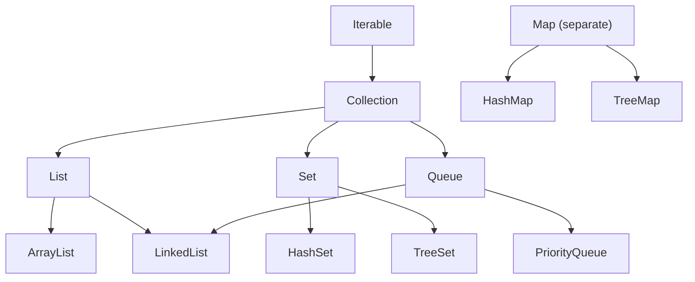

# Java Collections Framework

> [!summary]
> The **Collections Framework** is Java's unified architecture for storing and manipulating groups of objects. It provides interfaces (`List`, `Set`, `Map`, `Queue`) and implementations (`ArrayList`, `HashSet`, `HashMap`) for every common data structure need. Instead of implementing your own linked list or hash table, you use these battle-tested, optimized implementations.

## Quick Reference

### When to Use What

| Need | Interface | Implementation | Example |
|------|-----------|----------------|---------|
| Ordered, indexed, duplicates OK | `List` | `ArrayList` | Shopping cart items |
| Ordered, frequent insert/delete | `List` | `LinkedList` | Undo history |
| No duplicates | `Set` | `HashSet` | Unique usernames |
| No duplicates, sorted | `Set` | `TreeSet` | Leaderboard rankings |
| Key-value pairs | `Map` | `HashMap` | User settings |
| Key-value, sorted keys | `Map` | `TreeMap` | Sorted dictionary |
| FIFO queue | `Queue` | `LinkedList` | Task queue |
| Priority-based | `Queue` | `PriorityQueue` | Job scheduler |

### Common Operations

| Operation | List | Set | Map |
|-----------|------|-----|-----|
| Add | `add(e)`, `add(i, e)` | `add(e)` | `put(k, v)` |
| Get | `get(i)` | ❌ | `get(k)` |
| Remove | `remove(i)`, `remove(e)` | `remove(e)` | `remove(k)` |
| Contains | `contains(e)` | `contains(e)` | `containsKey(k)` |
| Size | `size()` | `size()` | `size()` |
| Is empty | `isEmpty()` | `isEmpty()` | `isEmpty()` |
| Clear | `clear()` | `clear()` | `clear()` |

## Theory

### Collection Hierarchy



**Key insight:** Program to interfaces (`List`, `Set`, `Map`), not implementations (`ArrayList`, `HashSet`). This lets you swap implementations without changing other code.

## Practical Examples

### List — Ordered, Indexed Collection

```java
import java.util.*;

public class ListExamples {
    public static void main(String[] args) {
        // Create lists
        List<String> arrayList = new ArrayList<>();  // Most common
        List<String> linkedList = new LinkedList<>(); // Better for frequent insert/delete
        List<String> immutable = List.of("a", "b", "c");  // Immutable (Java 9+)

        // Add elements
        List<String> names = new ArrayList<>();
        names.add("Alice");           // Add at end
        names.add("Bob");
        names.add(1, "Charlie");      // Add at index 1
        // names = [Alice, Charlie, Bob]

        // Access elements
        String first = names.get(0);   // "Alice"
        int bobIndex = names.indexOf("Bob");  // 2
        int size = names.size();       // 3

        // Modify elements
        names.set(0, "Alicia");        // Replace at index
        names.remove(1);               // Remove by index
        names.remove("Bob");           // Remove by value

        // Check contents
        boolean hasAlicia = names.contains("Alicia");  // true
        boolean empty = names.isEmpty();  // false

        // Iterate
        for (String name : names) {
            System.out.println(name);
        }

        // With index
        for (int i = 0; i < names.size(); i++) {
            System.out.println(i + ": " + names.get(i));
        }

        // Stream (Java 8+)
        names.stream()
            .filter(n -> n.startsWith("A"))
            .forEach(System.out::println);

        // Bulk operations
        List<String> others = Arrays.asList("Dave", "Eve");
        names.addAll(others);          // Add all from another collection
        names.removeAll(others);       // Remove all that exist in other

        // Sorting
        Collections.sort(names);       // Natural order
        names.sort(Comparator.reverseOrder());  // Custom comparator

        // Sublist (view, not copy!)
        List<String> sub = names.subList(0, 2);

        // Convert to array
        String[] array = names.toArray(new String[0]);
    }
}
```

### Set — No Duplicates

```java
import java.util.*;

public class SetExamples {
    public static void main(String[] args) {
        // HashSet — fast (O(1)), unordered
        Set<String> hashSet = new HashSet<>();

        // TreeSet — sorted, slower (O(log n))
        Set<String> treeSet = new TreeSet<>();

        // LinkedHashSet — insertion order preserved
        Set<String> linkedSet = new LinkedHashSet<>();

        // Immutable (Java 9+)
        Set<String> immutable = Set.of("a", "b", "c");

        // Add elements — duplicates ignored
        Set<String> emails = new HashSet<>();
        emails.add("alice@example.com");
        emails.add("bob@example.com");
        emails.add("alice@example.com");  // Ignored! Already exists
        System.out.println(emails.size());  // 2

        // Check membership — O(1) for HashSet!
        boolean hasAlice = emails.contains("alice@example.com");  // true

        // Remove
        emails.remove("bob@example.com");

        // Set operations
        Set<Integer> a = new HashSet<>(Arrays.asList(1, 2, 3, 4));
        Set<Integer> b = new HashSet<>(Arrays.asList(3, 4, 5, 6));

        // Union: elements in either set
        Set<Integer> union = new HashSet<>(a);
        union.addAll(b);  // [1, 2, 3, 4, 5, 6]

        // Intersection: elements in both sets
        Set<Integer> intersection = new HashSet<>(a);
        intersection.retainAll(b);  // [3, 4]

        // Difference: elements in a but not in b
        Set<Integer> difference = new HashSet<>(a);
        difference.removeAll(b);  // [1, 2]

        // TreeSet maintains order
        Set<String> sorted = new TreeSet<>();
        sorted.add("Banana");
        sorted.add("Apple");
        sorted.add("Cherry");
        System.out.println(sorted);  // [Apple, Banana, Cherry]

        // TreeSet additional methods
        TreeSet<Integer> numbers = new TreeSet<>(Arrays.asList(1, 3, 5, 7, 9));
        System.out.println(numbers.first());    // 1
        System.out.println(numbers.last());     // 9
        System.out.println(numbers.lower(5));   // 3 (largest < 5)
        System.out.println(numbers.higher(5));  // 7 (smallest > 5)
        System.out.println(numbers.headSet(5)); // [1, 3] (elements < 5)
        System.out.println(numbers.tailSet(5)); // [5, 7, 9] (elements >= 5)
    }
}
```

### Map — Key-Value Pairs

```java
import java.util.*;

public class MapExamples {
    public static void main(String[] args) {
        // HashMap — fast (O(1)), unordered
        Map<String, Integer> hashMap = new HashMap<>();

        // TreeMap — sorted by keys
        Map<String, Integer> treeMap = new TreeMap<>();

        // LinkedHashMap — insertion order preserved
        Map<String, Integer> linkedMap = new LinkedHashMap<>();

        // Immutable (Java 9+)
        Map<String, Integer> immutable = Map.of("a", 1, "b", 2);

        // Put and get
        Map<String, Integer> ages = new HashMap<>();
        ages.put("Alice", 30);
        ages.put("Bob", 25);
        ages.put("Alice", 31);  // Updates existing key!

        Integer aliceAge = ages.get("Alice");     // 31
        Integer unknown = ages.get("Unknown");    // null

        // Safe get with default
        Integer age = ages.getOrDefault("Unknown", 0);  // 0

        // Check existence
        boolean hasAlice = ages.containsKey("Alice");   // true
        boolean has30 = ages.containsValue(30);         // false (was updated to 31)

        // Remove
        ages.remove("Bob");
        ages.remove("Alice", 30);  // Only removes if value matches — doesn't remove (31 != 30)

        // Iterate keys
        for (String name : ages.keySet()) {
            System.out.println(name);
        }

        // Iterate values
        for (Integer a : ages.values()) {
            System.out.println(a);
        }

        // Iterate entries (most common)
        for (Map.Entry<String, Integer> entry : ages.entrySet()) {
            System.out.println(entry.getKey() + ": " + entry.getValue());
        }

        // forEach (Java 8+)
        ages.forEach((name, a) -> System.out.println(name + " is " + a));

        // Compute if absent — useful for caching
        Map<String, List<String>> groups = new HashMap<>();
        groups.computeIfAbsent("admins", k -> new ArrayList<>()).add("Alice");
        groups.computeIfAbsent("admins", k -> new ArrayList<>()).add("Bob");
        // admins -> [Alice, Bob]

        // Merge — combine values
        Map<String, Integer> counts = new HashMap<>();
        counts.merge("apple", 1, Integer::sum);  // apple -> 1
        counts.merge("apple", 1, Integer::sum);  // apple -> 2
        counts.merge("banana", 1, Integer::sum); // banana -> 1

        // putIfAbsent — only put if key doesn't exist
        ages.putIfAbsent("Charlie", 35);  // Added
        ages.putIfAbsent("Alice", 99);    // Ignored — Alice exists
    }
}
```

### Queue — FIFO Processing

```java
import java.util.*;

public class QueueExamples {
    public static void main(String[] args) {
        // LinkedList as Queue
        Queue<String> queue = new LinkedList<>();

        // PriorityQueue — elements ordered by priority
        Queue<Integer> priorityQueue = new PriorityQueue<>();

        // Add to queue
        queue.add("First");    // Throws if full (bounded queues)
        queue.offer("Second"); // Returns false if full (preferred)
        queue.offer("Third");

        // Peek at front (without removing)
        String front = queue.peek();    // "First" (or null if empty)
        String frontE = queue.element(); // "First" (throws if empty)

        // Remove from front
        String removed = queue.poll();  // "First" (or null if empty)
        String removedE = queue.remove(); // "Second" (throws if empty)

        // Process queue
        while (!queue.isEmpty()) {
            System.out.println("Processing: " + queue.poll());
        }

        // PriorityQueue — smallest first by default
        PriorityQueue<Integer> pq = new PriorityQueue<>();
        pq.offer(5);
        pq.offer(1);
        pq.offer(3);

        while (!pq.isEmpty()) {
            System.out.println(pq.poll());  // 1, 3, 5 (sorted order)
        }

        // Custom priority (largest first)
        PriorityQueue<Integer> maxHeap = new PriorityQueue<>(Comparator.reverseOrder());

        // Priority with objects
        PriorityQueue<Task> tasks = new PriorityQueue<>(
            Comparator.comparingInt(Task::getPriority)
        );
    }
}

record Task(String name, int priority) {
    public int getPriority() { return priority; }
}
```

### Creating Collections — Factory Methods (Java 9+)

```java
import java.util.*;

public class FactoryMethods {
    public static void main(String[] args) {
        // Immutable collections — can't add/remove/modify!
        List<String> list = List.of("a", "b", "c");
        Set<Integer> set = Set.of(1, 2, 3);
        Map<String, Integer> map = Map.of(
            "one", 1,
            "two", 2,
            "three", 3
        );

        // For more than 10 map entries
        Map<String, Integer> bigMap = Map.ofEntries(
            Map.entry("one", 1),
            Map.entry("two", 2),
            Map.entry("three", 3)
            // ... more entries
        );

        // list.add("d");  // UnsupportedOperationException!

        // Mutable copies
        List<String> mutableList = new ArrayList<>(List.of("a", "b", "c"));
        mutableList.add("d");  // OK

        // Arrays.asList — fixed size, mutable elements
        List<String> fromArray = Arrays.asList("a", "b", "c");
        fromArray.set(0, "z");  // OK — can modify elements
        // fromArray.add("d");  // UnsupportedOperationException — can't resize!

        // Empty collections
        List<String> emptyList = Collections.emptyList();
        Set<String> emptySet = Collections.emptySet();
        Map<String, String> emptyMap = Collections.emptyMap();

        // Single element
        List<String> singleton = Collections.singletonList("only");
        Set<String> singleSet = Collections.singleton("only");
        Map<String, String> singleMap = Collections.singletonMap("key", "value");
    }
}
```

## Common Patterns

> [!tip] Choose the Right Implementation
> | Situation | Use |
> |-----------|-----|
> | General purpose list | `ArrayList` |
> | Frequent insert/remove in middle | `LinkedList` |
> | Fast lookup, no order needed | `HashSet` / `HashMap` |
> | Need sorted order | `TreeSet` / `TreeMap` |
> | Preserve insertion order | `LinkedHashSet` / `LinkedHashMap` |

> [!tip] Program to Interface
> ```java
> // ✅ Flexible — can swap ArrayList for LinkedList easily
> List<String> names = new ArrayList<>();
>
> // ❌ Locked to implementation
> ArrayList<String> names = new ArrayList<>();
> ```

> [!tip] Initialize with Known Size
> ```java
> // ✅ Avoids resizing overhead
> List<String> names = new ArrayList<>(1000);
> Map<String, Integer> map = new HashMap<>(1000);
>
> // ❌ Default size, may resize multiple times
> List<String> names = new ArrayList<>();
> ```

> [!warning] ConcurrentModificationException
> Don't modify a collection while iterating:
> ```java
> // ❌ Throws ConcurrentModificationException
> for (String name : names) {
>     if (name.startsWith("A")) {
>         names.remove(name);
>     }
> }
>
> // ✅ Use Iterator.remove()
> Iterator<String> it = names.iterator();
> while (it.hasNext()) {
>     if (it.next().startsWith("A")) {
>         it.remove();
>     }
> }
>
> // ✅ Or use removeIf (Java 8+)
> names.removeIf(name -> name.startsWith("A"));
> ```

> [!warning] Null Handling
> ```java
> // HashMap allows one null key and null values
> Map<String, String> hashMap = new HashMap<>();
> hashMap.put(null, "value");  // OK
> hashMap.put("key", null);    // OK
>
> // TreeMap does NOT allow null keys (needs comparison)
> Map<String, String> treeMap = new TreeMap<>();
> // treeMap.put(null, "value");  // NullPointerException!
>
> // HashSet allows one null
> Set<String> hashSet = new HashSet<>();
> hashSet.add(null);  // OK
> ```

## Performance Comparison

| Operation | ArrayList | LinkedList | HashSet | TreeSet | HashMap | TreeMap |
|-----------|-----------|------------|---------|---------|---------|---------|
| Add | O(1)* | O(1) | O(1) | O(log n) | O(1) | O(log n) |
| Get by index | O(1) | O(n) | - | - | - | - |
| Get by key | - | - | O(1) | O(log n) | O(1) | O(log n) |
| Contains | O(n) | O(n) | O(1) | O(log n) | O(1) | O(log n) |
| Remove | O(n) | O(1)** | O(1) | O(log n) | O(1) | O(log n) |

*Amortized — occasional resize is O(n)
**O(1) if you have the node reference, O(n) to find it

## Edge Cases & Gotchas

- **equals() and hashCode()** — Objects in HashSet/HashMap need proper `equals()` and `hashCode()`. Without them, lookups fail.

- **Comparable for TreeSet/TreeMap** — Elements must implement `Comparable` or provide a `Comparator`.

- **List.of() with arrays** — `List.of(array)` creates a list with ONE element (the array), not list of array elements. Use `Arrays.asList()` or `List.of(array[0], array[1], ...)`.

- **subList() is a view** — Changes to sublist affect original list. It's not a copy!

- **Collections.unmodifiableList()** — Creates unmodifiable view, but if original changes, view sees changes too.

## Related Topics

- [[Generics]] — Collections are generic: `List<String>`, `Map<K,V>`
- [[Streams-API]] — Process collections declaratively
- [[Iterators]] — Low-level collection traversal *(coming soon)*
- [[Concurrent-Collections]] — Thread-safe collections *(coming soon)*

## References

- [Oracle Tutorial: Collections](https://docs.oracle.com/javase/tutorial/collections/)
- [Java Collections Framework Overview](https://docs.oracle.com/javase/8/docs/technotes/guides/collections/overview.html)
- [Big-O Cheat Sheet](https://www.bigocheatsheet.com/)
