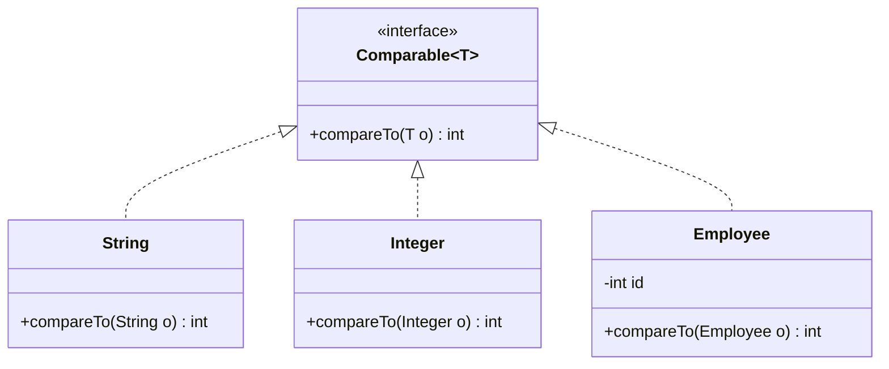
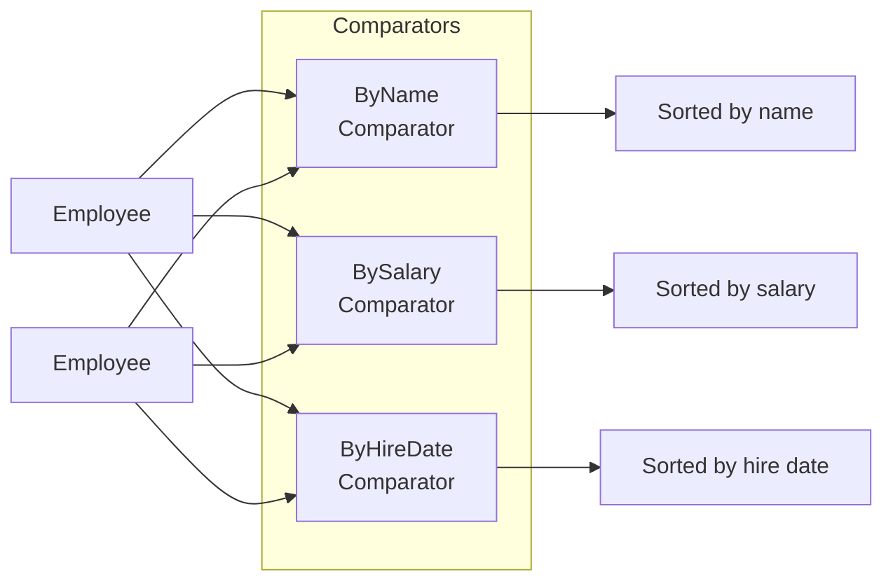

# Comparators and Comparable

> [!summary]
> When you need to sort custom objects, Java needs to know *how* to compare them. **Comparable** defines a "natural" ordering built into the class itself (`this.compareTo(other)`). **Comparator** defines external ordering strategies — you can have many different comparators for the same class. Use Comparable for the obvious default sort; use Comparator for alternative sorts or when you can't modify the class.

## Quick Reference

| Interface | Package | Method | Where Defined | Use When |
|-----------|---------|--------|---------------|----------|
| `Comparable<T>` | `java.lang` | `compareTo(T o)` | In the class itself | One natural ordering |
| `Comparator<T>` | `java.util` | `compare(T o1, T o2)` | External class/lambda | Multiple orderings |

**Return value convention:**
- **Negative** → first object comes before
- **Zero** → objects are equal
- **Positive** → first object comes after

```java
// Easy to remember: a.compareTo(b) → (a - b) conceptually
// a < b → negative, a == b → zero, a > b → positive
```

## Theory

### Comparable: Natural Ordering



The class itself knows how to compare instances:
```java
String a = "apple";
String b = "banana";
a.compareTo(b);  // Negative — "apple" < "banana" alphabetically
```

### Comparator: External Ordering



The same objects, different sort orders — Comparator is separate from the class.

## Practical Examples

### Implementing Comparable

```java
public class Employee implements Comparable<Employee> {
    private int id;
    private String name;
    private double salary;

    public Employee(int id, String name, double salary) {
        this.id = id;
        this.name = name;
        this.salary = salary;
    }

    // Natural ordering: by ID
    @Override
    public int compareTo(Employee other) {
        return Integer.compare(this.id, other.id);
        // Or: return this.id - other.id; (but beware overflow!)
    }

    // Getters...
    public int getId() { return id; }
    public String getName() { return name; }
    public double getSalary() { return salary; }

    @Override
    public String toString() {
        return String.format("Employee{id=%d, name='%s', salary=%.2f}",
            id, name, salary);
    }
}

// Usage
List<Employee> employees = new ArrayList<>();
employees.add(new Employee(3, "Charlie", 50000));
employees.add(new Employee(1, "Alice", 75000));
employees.add(new Employee(2, "Bob", 60000));

Collections.sort(employees);  // Uses compareTo automatically
// Now sorted by ID: Alice(1), Bob(2), Charlie(3)

// Works with TreeSet too
TreeSet<Employee> sorted = new TreeSet<>(employees);
```

### Creating Comparators

```java
public class EmployeeComparators {

    // Traditional anonymous class (pre-Java 8)
    public static final Comparator<Employee> BY_NAME_OLD =
        new Comparator<Employee>() {
            @Override
            public int compare(Employee e1, Employee e2) {
                return e1.getName().compareTo(e2.getName());
            }
        };

    // Lambda (Java 8+) — much cleaner!
    public static final Comparator<Employee> BY_NAME =
        (e1, e2) -> e1.getName().compareTo(e2.getName());

    // Method reference with Comparator.comparing (best!)
    public static final Comparator<Employee> BY_NAME_CLEAN =
        Comparator.comparing(Employee::getName);

    public static final Comparator<Employee> BY_SALARY =
        Comparator.comparing(Employee::getSalary);

    public static final Comparator<Employee> BY_SALARY_DESC =
        Comparator.comparing(Employee::getSalary).reversed();

    // Chained comparators: by salary, then by name
    public static final Comparator<Employee> BY_SALARY_THEN_NAME =
        Comparator.comparing(Employee::getSalary)
                  .thenComparing(Employee::getName);
}

// Usage
List<Employee> employees = getEmployees();

// Sort by name
Collections.sort(employees, EmployeeComparators.BY_NAME);
// Or with List.sort (Java 8+)
employees.sort(EmployeeComparators.BY_NAME);

// Sort by salary descending
employees.sort(EmployeeComparators.BY_SALARY_DESC);

// Inline comparator
employees.sort((e1, e2) -> e1.getName().compareTo(e2.getName()));

// Using Comparator.comparing inline
employees.sort(Comparator.comparing(Employee::getSalary));
```

### Comparator Factory Methods (Java 8+)

```java
import java.util.Comparator;

public class ComparatorFactoryExamples {
    public static void main(String[] args) {
        List<Employee> employees = getEmployees();

        // comparing — extract key and compare
        employees.sort(Comparator.comparing(Employee::getName));
        employees.sort(Comparator.comparing(Employee::getSalary));

        // comparingInt/Long/Double — avoid boxing
        employees.sort(Comparator.comparingInt(Employee::getId));
        employees.sort(Comparator.comparingDouble(Employee::getSalary));

        // reversed — flip the order
        employees.sort(Comparator.comparing(Employee::getName).reversed());

        // thenComparing — secondary sort
        employees.sort(
            Comparator.comparing(Employee::getSalary)
                      .thenComparing(Employee::getName)
        );

        // thenComparingInt — avoid boxing for secondary
        employees.sort(
            Comparator.comparing(Employee::getName)
                      .thenComparingInt(Employee::getId)
        );

        // nullsFirst / nullsLast — handle nulls gracefully
        employees.sort(
            Comparator.comparing(Employee::getName,
                                 Comparator.nullsFirst(String::compareTo))
        );

        // Alternative: nullsLast wrapping the whole comparator
        employees.sort(
            Comparator.nullsLast(Comparator.comparing(Employee::getName))
        );

        // naturalOrder / reverseOrder — for Comparable types
        List<String> names = List.of("Charlie", "Alice", "Bob");
        names.sort(Comparator.naturalOrder());   // A, B, C
        names.sort(Comparator.reverseOrder());   // C, B, A
    }
}
```

### Sorting Different Collections

```java
public class SortingCollections {
    public static void main(String[] args) {
        // ArrayList
        List<String> names = new ArrayList<>(List.of("Charlie", "Alice", "Bob"));
        Collections.sort(names);  // Natural order
        names.sort(Comparator.reverseOrder());  // Java 8+ List.sort

        // Array
        String[] nameArray = {"Charlie", "Alice", "Bob"};
        Arrays.sort(nameArray);  // Natural order
        Arrays.sort(nameArray, Comparator.reverseOrder());

        // TreeSet — always sorted (uses Comparable or Comparator)
        TreeSet<String> sortedSet = new TreeSet<>(names);  // Natural order

        // TreeSet with custom comparator
        TreeSet<String> reversedSet = new TreeSet<>(Comparator.reverseOrder());
        reversedSet.addAll(names);

        // TreeMap — keys always sorted
        TreeMap<String, Integer> sortedMap = new TreeMap<>();
        sortedMap.put("Charlie", 3);
        sortedMap.put("Alice", 1);
        sortedMap.put("Bob", 2);
        // Keys iterated in order: Alice, Bob, Charlie

        // PriorityQueue — min-heap by default
        PriorityQueue<Integer> minHeap = new PriorityQueue<>();
        PriorityQueue<Integer> maxHeap = new PriorityQueue<>(Comparator.reverseOrder());

        // Stream.sorted
        List<Employee> sorted = employees.stream()
            .sorted(Comparator.comparing(Employee::getSalary))
            .collect(Collectors.toList());

        // Finding min/max
        Optional<Employee> highestPaid = employees.stream()
            .max(Comparator.comparing(Employee::getSalary));

        Employee lowestPaid = Collections.min(employees,
            Comparator.comparing(Employee::getSalary));
    }
}
```

### Handling Nulls

```java
public class NullSafeComparators {
    public static void main(String[] args) {
        List<Employee> employees = new ArrayList<>();
        employees.add(new Employee(1, "Alice", 50000));
        employees.add(new Employee(2, null, 60000));  // null name!
        employees.add(new Employee(3, "Charlie", 55000));

        // ❌ NPE when comparing null names
        // employees.sort(Comparator.comparing(Employee::getName));

        // ✅ nullsFirst — nulls come before non-nulls
        employees.sort(
            Comparator.comparing(Employee::getName, Comparator.nullsFirst(String::compareTo))
        );
        // Order: null, Alice, Charlie

        // ✅ nullsLast — nulls come after non-nulls
        employees.sort(
            Comparator.comparing(Employee::getName, Comparator.nullsLast(String::compareTo))
        );
        // Order: Alice, Charlie, null

        // ✅ naturalOrder() for Comparable types
        employees.sort(
            Comparator.comparing(Employee::getName,
                                 Comparator.nullsFirst(Comparator.naturalOrder()))
        );

        // Handle null objects in the list itself
        List<Employee> withNulls = Arrays.asList(
            new Employee(1, "Alice", 50000),
            null,
            new Employee(3, "Charlie", 55000)
        );

        withNulls.sort(
            Comparator.nullsLast(Comparator.comparing(Employee::getName))
        );
    }
}
```

### Custom Multi-Field Comparison

```java
public class Person implements Comparable<Person> {
    private String lastName;
    private String firstName;
    private int age;

    // Compare by: lastName → firstName → age (youngest first)
    @Override
    public int compareTo(Person other) {
        int lastNameCmp = this.lastName.compareTo(other.lastName);
        if (lastNameCmp != 0) return lastNameCmp;

        int firstNameCmp = this.firstName.compareTo(other.firstName);
        if (firstNameCmp != 0) return firstNameCmp;

        return Integer.compare(this.age, other.age);
    }

    // Equivalent using Comparator chains
    public static final Comparator<Person> FULL_ORDER =
        Comparator.comparing(Person::getLastName)
                  .thenComparing(Person::getFirstName)
                  .thenComparingInt(Person::getAge);

    // Getters...
    public String getLastName() { return lastName; }
    public String getFirstName() { return firstName; }
    public int getAge() { return age; }
}
```

### Case-Insensitive and Custom String Comparison

```java
public class StringComparisonExamples {
    public static void main(String[] args) {
        List<String> names = Arrays.asList("charlie", "Alice", "BOB");

        // Case-sensitive (default)
        names.sort(Comparator.naturalOrder());
        // [Alice, BOB, charlie] — uppercase before lowercase!

        // Case-insensitive
        names.sort(String.CASE_INSENSITIVE_ORDER);
        // [Alice, BOB, charlie] or [Alice, charlie, BOB] — stable within same letters

        // Case-insensitive with Comparator.comparing
        names.sort(Comparator.comparing(String::toLowerCase));

        // Numeric string sorting
        List<String> versions = Arrays.asList("v2", "v10", "v1", "v20");
        versions.sort(Comparator.naturalOrder());
        // [v1, v10, v2, v20] — wrong! Lexicographic

        // Extract number and sort numerically
        versions.sort(Comparator.comparingInt(
            s -> Integer.parseInt(s.substring(1))
        ));
        // [v1, v2, v10, v20] — correct!
    }
}
```

## Common Patterns

> [!tip] Use Comparator.comparing() Instead of Lambdas
> ```java
> // ❌ Verbose lambda
> employees.sort((e1, e2) -> e1.getName().compareTo(e2.getName()));
>
> // ✅ Clean and readable
> employees.sort(Comparator.comparing(Employee::getName));
> ```

> [!tip] Chain Comparators for Multi-Field Sort
> ```java
> // Sort by department, then by salary (desc), then by name
> employees.sort(
>     Comparator.comparing(Employee::getDepartment)
>               .thenComparing(Employee::getSalary, Comparator.reverseOrder())
>               .thenComparing(Employee::getName)
> );
> ```

> [!tip] Prefer comparingInt/Long/Double
> ```java
> // ❌ Boxes primitives
> Comparator.comparing(Employee::getSalary)
>
> // ✅ Avoids boxing overhead
> Comparator.comparingDouble(Employee::getSalary)
> ```

> [!warning] Beware Integer Overflow in Subtraction
> ```java
> // ❌ Can overflow!
> public int compareTo(Employee other) {
>     return this.salary - other.salary;  // If salary can be large
> }
>
> // ✅ Safe
> public int compareTo(Employee other) {
>     return Integer.compare(this.salary, other.salary);
>     // Or: return Double.compare(this.salary, other.salary);
> }
> ```

> [!warning] compareTo Must Be Consistent with equals
> If `a.compareTo(b) == 0`, then `a.equals(b)` should be true.
> Otherwise, TreeSet/TreeMap behave unexpectedly:
> ```java
> // TreeSet uses compareTo, not equals, for uniqueness
> TreeSet<Employee> set = new TreeSet<>();
> // If compareTo returns 0 for different objects, one gets dropped!
> ```

## Edge Cases & Gotchas

- **Consistency with equals** — `Comparable` documentation strongly recommends `compareTo` return 0 if and only if `equals` returns true. Violating this causes issues with sorted collections.

- **Returning zero** — Two items comparing as "equal" doesn't mean they're identical — they just sort to the same position. Be careful with `TreeSet` (won't add "equal" items).

- **Floating point** — Use `Double.compare(a, b)` not `a - b`. Handles NaN and -0.0 correctly.

- **Null keys in TreeMap** — `TreeMap` doesn't allow null keys by default (NPE during comparison). Use a null-safe comparator if needed.

- **Mutability** — If an object's compared fields change while it's in a `TreeSet`/`TreeMap`, the collection breaks. Treat sorted collection entries as immutable.

- **Generics and raw types** — `Comparable<Employee>` is type-safe; raw `Comparable` leads to ClassCastException at runtime.

## Related Topics

- [[Collections-Framework]] — Sorting Lists, using TreeSet/TreeMap
- [[Functional-Interfaces-and-Lambdas]] — Comparator as a functional interface
- [[Streams-API]] — `sorted()`, `min()`, `max()` operations
- [[Generics]] — Type-safe Comparable and Comparator

## References

- [Oracle Tutorial: Object Ordering](https://docs.oracle.com/javase/tutorial/collections/interfaces/order.html)
- [Comparator API](https://docs.oracle.com/javase/8/docs/api/java/util/Comparator.html)
- [Comparable API](https://docs.oracle.com/javase/8/docs/api/java/lang/Comparable.html)
