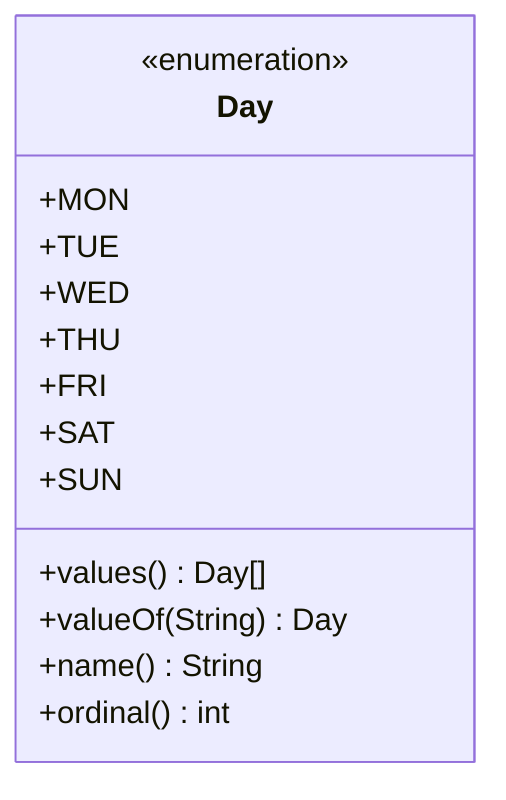

# Java Enums

> [!summary]
> An **enum** (enumeration) is a special class that represents a fixed set of constants — like days of the week, card suits, or HTTP status codes. Unlike using plain integers or strings, enums are type-safe (compiler catches invalid values), self-documenting (the code says `Status.ACTIVE` not `1`), and can have methods and fields. They're the right choice whenever you have a known, fixed set of values.

## Quick Reference

| Feature | Syntax | Example |
|---------|--------|---------|
| Basic enum | `enum Name { A, B, C }` | `enum Day { MON, TUE, WED }` |
| Access constant | `EnumName.CONSTANT` | `Day.MON` |
| All values | `EnumName.values()` | `Day.values()` |
| From string | `EnumName.valueOf("NAME")` | `Day.valueOf("MON")` |
| Ordinal (index) | `constant.ordinal()` | `Day.MON.ordinal()` → 0 |
| Name as string | `constant.name()` | `Day.MON.name()` → "MON" |
| Enum with fields | See examples below | `Status(200, "OK")` |

## Theory

### Why Enums?

```java
// ❌ Using int constants — error-prone
public static final int STATUS_PENDING = 0;
public static final int STATUS_ACTIVE = 1;
public static final int STATUS_CLOSED = 2;

void setStatus(int status) { ... }  // Can pass ANY int!
setStatus(99);  // Compiles but invalid!
setStatus(-1);  // No compile error!

// ✅ Using enum — type-safe
enum Status { PENDING, ACTIVE, CLOSED }

void setStatus(Status status) { ... }  // Only Status values allowed!
setStatus(Status.ACTIVE);  // OK
setStatus(99);  // COMPILE ERROR! Not a Status
```

### Enums Are Classes

Under the hood, each enum constant is a `public static final` instance of the enum class:



## Practical Examples

### Basic Enum

```java
public enum Day {
    MONDAY, TUESDAY, WEDNESDAY, THURSDAY, FRIDAY, SATURDAY, SUNDAY
}

public class Schedule {
    public static void main(String[] args) {
        Day today = Day.WEDNESDAY;

        // Switch on enum (exhaustive — compiler helps catch missing cases)
        switch (today) {
            case MONDAY, TUESDAY, WEDNESDAY, THURSDAY, FRIDAY:
                System.out.println("Weekday");
                break;
            case SATURDAY, SUNDAY:
                System.out.println("Weekend!");
                break;
        }

        // Iterate all values
        for (Day day : Day.values()) {
            System.out.println(day.name() + " is at index " + day.ordinal());
        }
        // MONDAY is at index 0
        // TUESDAY is at index 1
        // ...

        // Parse from string
        Day parsed = Day.valueOf("FRIDAY");  // Day.FRIDAY
        // Day.valueOf("friday");  // IllegalArgumentException (case-sensitive!)

        // Compare enums with == (safe because singleton instances)
        if (today == Day.WEDNESDAY) {
            System.out.println("It's hump day!");
        }
    }
}
```

### Enum with Fields and Constructor

```java
public enum Planet {
    MERCURY(3.303e+23, 2.4397e6),
    VENUS(4.869e+24, 6.0518e6),
    EARTH(5.976e+24, 6.37814e6),
    MARS(6.421e+23, 3.3972e6),
    JUPITER(1.9e+27, 7.1492e7),
    SATURN(5.688e+26, 6.0268e7),
    URANUS(8.686e+25, 2.5559e7),
    NEPTUNE(1.024e+26, 2.4746e7);

    private final double mass;   // in kilograms
    private final double radius; // in meters

    // Constructor is implicitly private
    Planet(double mass, double radius) {
        this.mass = mass;
        this.radius = radius;
    }

    public double getMass() { return mass; }
    public double getRadius() { return radius; }

    // Universal gravitational constant
    private static final double G = 6.67300E-11;

    // Method using the fields
    public double surfaceGravity() {
        return G * mass / (radius * radius);
    }

    public double surfaceWeight(double otherMass) {
        return otherMass * surfaceGravity();
    }
}

// Usage
double earthWeight = 70;  // kg
for (Planet p : Planet.values()) {
    System.out.printf("Weight on %s: %.2f N%n",
        p.name(), p.surfaceWeight(earthWeight));
}
```

### Enum with Methods (Per-Constant Behavior)

```java
public enum Operation {
    ADD("+") {
        @Override
        public double apply(double a, double b) { return a + b; }
    },
    SUBTRACT("-") {
        @Override
        public double apply(double a, double b) { return a - b; }
    },
    MULTIPLY("*") {
        @Override
        public double apply(double a, double b) { return a * b; }
    },
    DIVIDE("/") {
        @Override
        public double apply(double a, double b) { return a / b; }
    };

    private final String symbol;

    Operation(String symbol) {
        this.symbol = symbol;
    }

    public String getSymbol() { return symbol; }

    // Abstract method — each constant must implement
    public abstract double apply(double a, double b);
}

// Usage — each enum constant has different behavior
double result = Operation.ADD.apply(5, 3);      // 8.0
double result2 = Operation.MULTIPLY.apply(5, 3); // 15.0

for (Operation op : Operation.values()) {
    System.out.printf("%.1f %s %.1f = %.1f%n",
        5.0, op.getSymbol(), 3.0, op.apply(5, 3));
}
// 5.0 + 3.0 = 8.0
// 5.0 - 3.0 = 2.0
// 5.0 * 3.0 = 15.0
// 5.0 / 3.0 = 1.7
```

### Enum Implementing Interface

```java
interface Describable {
    String getDescription();
}

public enum HttpStatus implements Describable {
    OK(200, "Request succeeded"),
    CREATED(201, "Resource created"),
    BAD_REQUEST(400, "Invalid request"),
    UNAUTHORIZED(401, "Authentication required"),
    NOT_FOUND(404, "Resource not found"),
    INTERNAL_ERROR(500, "Server error");

    private final int code;
    private final String description;

    HttpStatus(int code, String description) {
        this.code = code;
        this.description = description;
    }

    public int getCode() { return code; }

    @Override
    public String getDescription() { return description; }

    // Static lookup by code
    public static HttpStatus fromCode(int code) {
        for (HttpStatus status : values()) {
            if (status.code == code) {
                return status;
            }
        }
        throw new IllegalArgumentException("Unknown code: " + code);
    }

    public boolean isSuccess() {
        return code >= 200 && code < 300;
    }

    public boolean isError() {
        return code >= 400;
    }
}

// Usage
HttpStatus status = HttpStatus.NOT_FOUND;
System.out.println(status.getCode());        // 404
System.out.println(status.getDescription()); // "Resource not found"
System.out.println(status.isError());        // true

HttpStatus found = HttpStatus.fromCode(200); // HttpStatus.OK
```

### EnumSet and EnumMap

Specialized collections optimized for enums:

```java
import java.util.EnumSet;
import java.util.EnumMap;

public enum Permission {
    READ, WRITE, EXECUTE, DELETE
}

public class PermissionDemo {
    public static void main(String[] args) {
        // EnumSet — highly efficient Set for enums (uses bit vector)
        EnumSet<Permission> userPermissions = EnumSet.of(Permission.READ, Permission.WRITE);
        EnumSet<Permission> adminPermissions = EnumSet.allOf(Permission.class);
        EnumSet<Permission> noPermissions = EnumSet.noneOf(Permission.class);

        // Check permissions
        if (userPermissions.contains(Permission.READ)) {
            System.out.println("Can read");
        }

        // Combine permissions
        EnumSet<Permission> elevated = EnumSet.copyOf(userPermissions);
        elevated.add(Permission.EXECUTE);

        // EnumMap — highly efficient Map with enum keys
        EnumMap<Permission, String> descriptions = new EnumMap<>(Permission.class);
        descriptions.put(Permission.READ, "View content");
        descriptions.put(Permission.WRITE, "Modify content");
        descriptions.put(Permission.EXECUTE, "Run programs");
        descriptions.put(Permission.DELETE, "Remove content");

        // Iterate
        for (Permission p : userPermissions) {
            System.out.println(p + ": " + descriptions.get(p));
        }
    }
}
```

### Singleton Pattern with Enum

The simplest and safest way to implement singleton in Java:

```java
public enum DatabaseConnection {
    INSTANCE;  // Single instance, guaranteed by JVM

    private Connection connection;

    DatabaseConnection() {
        // Initialize on first access
        try {
            connection = DriverManager.getConnection("jdbc:...");
        } catch (SQLException e) {
            throw new RuntimeException(e);
        }
    }

    public Connection getConnection() {
        return connection;
    }

    public void executeQuery(String sql) {
        // Use connection...
    }
}

// Usage
DatabaseConnection.INSTANCE.executeQuery("SELECT * FROM users");
```

## Common Patterns

> [!tip] Use Enums Instead of int/String Constants
> ```java
> // ❌ No type safety, no IDE help, easy to misuse
> public static final int DIRECTION_NORTH = 0;
> public static final int DIRECTION_SOUTH = 1;
>
> // ✅ Type-safe, self-documenting, IDE autocomplete
> public enum Direction { NORTH, SOUTH, EAST, WEST }
> ```

> [!tip] Add Fields for Associated Data
> Don't encode data in the name — use fields:
> ```java
> // ❌ Data encoded in name — hard to use
> enum Size { SMALL_10, MEDIUM_20, LARGE_30 }
>
> // ✅ Data in field — easy to access
> enum Size {
>     SMALL(10), MEDIUM(20), LARGE(30);
>     private final int value;
>     Size(int value) { this.value = value; }
>     public int getValue() { return value; }
> }
> ```

> [!tip] Implement Strategy Pattern with Enums
> Each constant can have different behavior:
> ```java
> enum PaymentMethod {
>     CREDIT_CARD { double getFee(double amount) { return amount * 0.03; } },
>     DEBIT_CARD { double getFee(double amount) { return 0.50; } },
>     CASH { double getFee(double amount) { return 0; } };
>
>     abstract double getFee(double amount);
> }
> ```

> [!warning] Don't Use ordinal() for Logic
> ```java
> // ❌ Fragile — breaks if enum order changes
> if (day.ordinal() < 5) { /* weekday */ }
>
> // ✅ Explicit and safe
> EnumSet<Day> weekdays = EnumSet.range(Day.MONDAY, Day.FRIDAY);
> if (weekdays.contains(day)) { /* weekday */ }
> ```

> [!warning] valueOf() Is Case-Sensitive and Throws
> ```java
> Day.valueOf("MONDAY");   // OK
> Day.valueOf("monday");   // IllegalArgumentException!
> Day.valueOf("Mon");      // IllegalArgumentException!
>
> // Safe parsing
> public static Day safeValueOf(String name) {
>     try {
>         return Day.valueOf(name.toUpperCase());
>     } catch (IllegalArgumentException e) {
>         return null;  // or default value
>     }
> }
> ```

## Edge Cases & Gotchas

- **Enum constructors are private** — You can't write `new Day()`. The constants are the only instances.

- **Enums can't extend classes** — They implicitly extend `java.lang.Enum`. But they can implement interfaces.

- **Serialization is safe** — Enums are serialization-safe and singleton-safe. Use them for singleton pattern.

- **Switch exhaustiveness** — Switch on enum should cover all cases. Some IDEs/linters warn about missing cases.

- **Enum.values() creates new array** — Each call allocates. Cache if calling frequently:
  ```java
  private static final Day[] VALUES = Day.values();
  ```

- **Comparing enums** — Use `==` not `.equals()`. Enums are singletons so reference equality is correct and faster.

## Related Topics

- [[Classes-and-Objects]] — Enums are special classes
- [[Interfaces]] — Enums can implement interfaces
- [[Switch-Expressions]] — Enhanced switch works great with enums *(coming soon)*
- [[Collections-Framework]] — EnumSet and EnumMap for enum collections

## References

- [Oracle Tutorial: Enum Types](https://docs.oracle.com/javase/tutorial/java/javaOO/enum.html)
- [Effective Java, 3rd Ed.](https://www.oreilly.com/library/view/effective-java/9780134686097/) — Items 34-41 on enums
