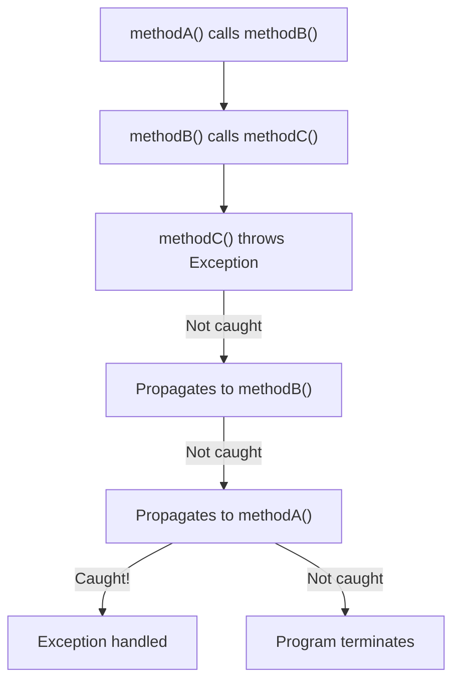

# Java Exception Handling

> [!summary]
> Exceptions are Java's mechanism for handling errors and unexpected conditions. When something goes wrong, code "throws" an exception that propagates up the call stack until it's "caught" and handled. Java uniquely distinguishes between checked exceptions (must be handled) and unchecked exceptions (optional handling), which affects how you design error handling in your code.

## Quick Reference

| Keyword | Purpose | Example |
|---------|---------|---------|
| `try` | Code that might throw | `try { riskyOperation(); }` |
| `catch` | Handle specific exception | `catch (IOException e) { ... }` |
| `finally` | Always executes (cleanup) | `finally { closeResource(); }` |
| `throw` | Throw an exception | `throw new IllegalArgumentException()` |
| `throws` | Declare method might throw | `void read() throws IOException` |
| `try-with-resources` | Auto-close resources | `try (var f = new FileReader(...))` |

**Exception Hierarchy:**
```
Throwable
├── Error (don't catch — JVM problems)
│   ├── OutOfMemoryError
│   └── StackOverflowError
└── Exception
    ├── RuntimeException (unchecked)
    │   ├── NullPointerException
    │   ├── IllegalArgumentException
    │   ├── IndexOutOfBoundsException
    │   └── IllegalStateException
    └── Checked Exceptions (must handle)
        ├── IOException
        ├── SQLException
        └── ClassNotFoundException
```

## Theory

### What Are Exceptions?

An exception is an event that disrupts normal program flow. Instead of returning error codes (like C), Java uses exceptions to separate error handling from normal logic:

```java
// Without exceptions: Error codes get ignored, clutter logic
int result = readFile(path);
if (result == -1) {
    // Handle file not found
} else if (result == -2) {
    // Handle permission denied
} else {
    // Process result
}

// With exceptions: Clean separation
try {
    String content = readFile(path);
    process(content);
} catch (FileNotFoundException e) {
    handleNotFound();
} catch (AccessDeniedException e) {
    handlePermissionDenied();
}
```

### Checked vs Unchecked Exceptions

This is Java's most distinctive (and debated) feature:

| Type | Must Handle? | Indicates | Examples |
|------|-------------|-----------|----------|
| **Checked** | Yes — catch or declare `throws` | Recoverable conditions | `IOException`, `SQLException` |
| **Unchecked** (Runtime) | No — optional | Programming bugs | `NullPointerException`, `IllegalArgumentException` |
| **Error** | No — don't catch | JVM/system failures | `OutOfMemoryError` |

```java
// Checked: Compiler forces you to handle
public void readFile(String path) throws IOException {  // Must declare
    FileReader reader = new FileReader(path);  // Throws checked exception
}

// Unchecked: No compiler enforcement
public void process(String input) {
    if (input == null) {
        throw new IllegalArgumentException("Input cannot be null");  // Unchecked
    }
}
```

### How Exception Propagation Works



Exceptions propagate up the call stack until caught or the program terminates. Each method either handles the exception or declares that it throws it.

## Practical Examples

### Basic Usage — Try-Catch-Finally

```java
import java.io.*;

public class BasicExceptionHandling {
    public static void main(String[] args) {
        // Basic try-catch
        try {
            int result = 10 / 0;  // ArithmeticException
        } catch (ArithmeticException e) {
            System.out.println("Cannot divide by zero!");
            System.out.println("Message: " + e.getMessage());
        }

        // Multiple catch blocks (most specific first!)
        try {
            String[] arr = {"a", "b"};
            System.out.println(arr[5]);  // ArrayIndexOutOfBoundsException
        } catch (ArrayIndexOutOfBoundsException e) {
            System.out.println("Index out of bounds: " + e.getMessage());
        } catch (RuntimeException e) {
            System.out.println("Some runtime exception");
        } catch (Exception e) {
            System.out.println("Some exception");  // Catch-all (use sparingly)
        }

        // Multi-catch (Java 7+) — same handling for different types
        try {
            // Some code
        } catch (IllegalArgumentException | IllegalStateException e) {
            System.out.println("Illegal something: " + e.getMessage());
        }

        // Finally — always executes (cleanup)
        FileReader reader = null;
        try {
            reader = new FileReader("file.txt");
            // Read file...
        } catch (FileNotFoundException e) {
            System.out.println("File not found");
        } finally {
            // This runs whether or not exception occurred
            if (reader != null) {
                try {
                    reader.close();
                } catch (IOException e) {
                    // Closing failed — log it
                }
            }
        }
    }
}
```

### Intermediate Example — Try-With-Resources (Best Practice)

Automatic resource management — no more finally blocks for cleanup:

```java
import java.io.*;
import java.sql.*;

public class TryWithResources {
    public static void main(String[] args) {
        // Old way: Manual resource management
        BufferedReader reader = null;
        try {
            reader = new BufferedReader(new FileReader("file.txt"));
            String line = reader.readLine();
            System.out.println(line);
        } catch (IOException e) {
            e.printStackTrace();
        } finally {
            if (reader != null) {
                try {
                    reader.close();  // Tedious and error-prone!
                } catch (IOException e) {
                    e.printStackTrace();
                }
            }
        }

        // New way: try-with-resources (Java 7+)
        // Resource automatically closed at end of try block
        try (BufferedReader r = new BufferedReader(new FileReader("file.txt"))) {
            String line = r.readLine();
            System.out.println(line);
        } catch (IOException e) {
            e.printStackTrace();
        }
        // r.close() called automatically — even if exception thrown!

        // Multiple resources
        try (
            FileInputStream in = new FileInputStream("input.txt");
            FileOutputStream out = new FileOutputStream("output.txt")
        ) {
            // Copy data...
            int data;
            while ((data = in.read()) != -1) {
                out.write(data);
            }
        } catch (IOException e) {
            e.printStackTrace();
        }
        // Both streams closed in reverse order (out, then in)

        // Works with any AutoCloseable
        try (Connection conn = DriverManager.getConnection("jdbc:...");
             PreparedStatement stmt = conn.prepareStatement("SELECT * FROM users");
             ResultSet rs = stmt.executeQuery()) {

            while (rs.next()) {
                System.out.println(rs.getString("name"));
            }
        } catch (SQLException e) {
            e.printStackTrace();
        }
    }
}
```

### Advanced Usage — Creating and Throwing Exceptions

```java
// Custom checked exception
public class InsufficientFundsException extends Exception {
    private final double amount;
    private final double balance;

    public InsufficientFundsException(double amount, double balance) {
        super(String.format("Cannot withdraw %.2f, balance is %.2f", amount, balance));
        this.amount = amount;
        this.balance = balance;
    }

    public double getAmount() { return amount; }
    public double getBalance() { return balance; }
}

// Custom unchecked exception
public class InvalidUserException extends RuntimeException {
    public InvalidUserException(String message) {
        super(message);
    }

    public InvalidUserException(String message, Throwable cause) {
        super(message, cause);
    }
}

// Using custom exceptions
public class BankAccount {
    private double balance;

    public BankAccount(double initialBalance) {
        if (initialBalance < 0) {
            // Unchecked — programming error
            throw new IllegalArgumentException("Initial balance cannot be negative");
        }
        this.balance = initialBalance;
    }

    // Checked exception — recoverable business condition
    public void withdraw(double amount) throws InsufficientFundsException {
        if (amount <= 0) {
            throw new IllegalArgumentException("Amount must be positive");
        }
        if (amount > balance) {
            throw new InsufficientFundsException(amount, balance);
        }
        balance -= amount;
    }

    // Re-throwing with additional context
    public void transferTo(BankAccount other, double amount)
            throws InsufficientFundsException {
        try {
            this.withdraw(amount);
            other.deposit(amount);
        } catch (InsufficientFundsException e) {
            // Add context and re-throw
            throw new InsufficientFundsException(amount, balance);
        }
    }

    // Wrapping exceptions (exception chaining)
    public void processTransaction(String data) {
        try {
            // Parse and process...
            int value = Integer.parseInt(data);
        } catch (NumberFormatException e) {
            // Wrap low-level exception in domain-specific one
            throw new InvalidUserException("Invalid transaction data: " + data, e);
        }
    }

    public void deposit(double amount) {
        if (amount <= 0) {
            throw new IllegalArgumentException("Amount must be positive");
        }
        balance += amount;
    }
}

// Usage
public class Main {
    public static void main(String[] args) {
        BankAccount account = new BankAccount(100.0);

        try {
            account.withdraw(150.0);
        } catch (InsufficientFundsException e) {
            System.out.println("Withdrawal failed: " + e.getMessage());
            System.out.println("You tried to withdraw: " + e.getAmount());
            System.out.println("Your balance is: " + e.getBalance());
        }
    }
}
```

### Exception Handling Patterns

```java
import java.util.*;
import java.util.logging.*;

public class ExceptionPatterns {
    private static final Logger logger = Logger.getLogger("ExceptionPatterns");

    // Pattern 1: Fail-fast validation
    public void processUser(User user) {
        // Validate early, fail fast
        Objects.requireNonNull(user, "User cannot be null");
        if (user.getName() == null || user.getName().isBlank()) {
            throw new IllegalArgumentException("User name is required");
        }
        if (user.getAge() < 0 || user.getAge() > 150) {
            throw new IllegalArgumentException("Invalid age: " + user.getAge());
        }

        // Now safe to process
        doProcess(user);
    }

    // Pattern 2: Convert checked to unchecked (when appropriate)
    public String readConfig(String path) {
        try {
            return Files.readString(Path.of(path));
        } catch (IOException e) {
            // Config file missing is a fatal startup error, not recoverable
            throw new UncheckedIOException("Config file missing: " + path, e);
        }
    }

    // Pattern 3: Log and rethrow (don't swallow!)
    public void processWithLogging(Data data) throws ProcessingException {
        try {
            process(data);
        } catch (Exception e) {
            logger.log(Level.SEVERE, "Processing failed for: " + data, e);
            throw e;  // Don't swallow — let caller handle
        }
    }

    // Pattern 4: Provide default on failure
    public int parseIntOrDefault(String value, int defaultValue) {
        try {
            return Integer.parseInt(value);
        } catch (NumberFormatException e) {
            logger.warning("Invalid number: " + value + ", using default: " + defaultValue);
            return defaultValue;
        }
    }

    // Pattern 5: Collect all errors, don't fail on first
    public ValidationResult validateAll(Form form) {
        List<String> errors = new ArrayList<>();

        if (form.getName() == null || form.getName().isBlank()) {
            errors.add("Name is required");
        }
        if (form.getEmail() == null || !form.getEmail().contains("@")) {
            errors.add("Valid email is required");
        }
        if (form.getAge() < 18) {
            errors.add("Must be 18 or older");
        }

        return new ValidationResult(errors.isEmpty(), errors);
    }

    // Pattern 6: Supplier with exception for lazy evaluation
    @FunctionalInterface
    interface ThrowingSupplier<T, E extends Exception> {
        T get() throws E;
    }

    public <T> T getOrDefault(ThrowingSupplier<T, Exception> supplier, T defaultValue) {
        try {
            return supplier.get();
        } catch (Exception e) {
            return defaultValue;
        }
    }
}
```

## Common Patterns

> [!tip] Use Try-With-Resources for All Resources
> Any class implementing `AutoCloseable` works with try-with-resources:
> ```java
> // ✅ Automatic cleanup
> try (var conn = getConnection();
>      var stmt = conn.prepareStatement(sql);
>      var rs = stmt.executeQuery()) {
>     // Use resources
> }
> // All closed automatically in reverse order
> ```

> [!tip] Throw Early, Catch Late
> - **Throw early** — Validate inputs at method entry, fail fast
> - **Catch late** — Handle exceptions at the level that has enough context to handle them properly
> ```java
> // Throw early
> public void process(String input) {
>     Objects.requireNonNull(input, "Input required");  // Fail immediately
>     // ... rest of method
> }
>
> // Catch late — at the boundary where you can actually handle it
> public Response handleRequest(Request req) {
>     try {
>         return service.process(req);
>     } catch (ValidationException e) {
>         return Response.badRequest(e.getMessage());
>     } catch (NotFoundException e) {
>         return Response.notFound();
>     }
> }
> ```

> [!tip] Use Specific Exceptions
> ```java
> // ❌ Too generic — caller can't handle specifically
> throw new Exception("Something went wrong");
>
> // ✅ Specific — caller can catch and handle appropriately
> throw new UserNotFoundException(userId);
> throw new InvalidInputException("Email format invalid");
> ```

> [!warning] Never Swallow Exceptions Silently
> ```java
> // ❌ TERRIBLE — hides bugs, impossible to debug
> try {
>     riskyOperation();
> } catch (Exception e) {
>     // Do nothing — silent failure!
> }
>
> // ❌ Also bad — loses stack trace
> catch (Exception e) {
>     System.out.println("Error occurred");
> }
>
> // ✅ At minimum, log it
> catch (Exception e) {
>     logger.error("Operation failed", e);
>     throw e;  // Or handle appropriately
> }
> ```

> [!warning] Don't Use Exceptions for Control Flow
> ```java
> // ❌ Exceptions are expensive, this is abuse
> try {
>     int i = 0;
>     while (true) {
>         array[i++].process();  // Relies on ArrayIndexOutOfBounds to stop
>     }
> } catch (ArrayIndexOutOfBoundsException e) {
>     // Loop ended
> }
>
> // ✅ Use proper control flow
> for (int i = 0; i < array.length; i++) {
>     array[i].process();
> }
> ```

> [!warning] Don't Catch Exception or Throwable (Usually)
> ```java
> // ❌ Catches everything including bugs you want to see
> try {
>     process();
> } catch (Exception e) {  // Catches NullPointerException, bugs!
>     log(e);
> }
>
> // ✅ Catch specific exceptions you expect and can handle
> try {
>     process();
> } catch (IOException e) {
>     handleIOError(e);
> } catch (ValidationException e) {
>     handleValidationError(e);
> }
> ```

## Edge Cases & Gotchas

- **finally overrides return** — If finally block has a return, it overrides any return from try/catch. Avoid returning from finally!

- **Suppressed exceptions** — In try-with-resources, if both the try block and close() throw, the close exception is "suppressed". Access via `e.getSuppressed()`.

- **Checked exceptions in lambdas** — Functional interfaces don't declare throws, so checked exceptions in lambdas are awkward. Wrap in unchecked or use helper methods.

- **Exception constructor cost** — Creating an exception captures the stack trace, which is expensive. For performance-critical code, consider pre-created exceptions or overriding `fillInStackTrace()`.

- **Catch order matters** — More specific exceptions must come before more general ones, or the specific catch is unreachable (compile error).

- **finally and System.exit** — finally doesn't run if JVM is terminated (`System.exit()`, crash, kill -9).

- **NullPointerException in catch** — If your catch block can throw NPE (e.g., logging null values), you can lose the original exception.

## Related Topics

- [[Optional]] — Functional alternative for "might not return a value" cases
- [[Streams-API]] — Exception handling in streams requires wrapping
- [[Logging]] — Proper exception logging practices *(coming soon)*
- [[Assertions]] — For catching programming errors during development *(coming soon)*

## References

- [Oracle Tutorial: Exceptions](https://docs.oracle.com/javase/tutorial/essential/exceptions/)
- [Effective Java, 3rd Ed.](https://www.oreilly.com/library/view/effective-java/9780134686097/) — Items 69-77 on exceptions
- [Java Exception Hierarchy](https://docs.oracle.com/javase/8/docs/api/java/lang/Exception.html)
