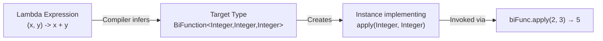

# Functional Interfaces and Lambdas

> [!summary]
> Lambdas are anonymous functions that let you pass behavior as data — instead of writing a whole class to define one method, you write a concise expression. Functional interfaces are interfaces with exactly one abstract method, which lambdas can implement. Together, they transformed Java from verbose OOP into a language that supports functional programming, enabling the Streams API and cleaner, more expressive code.

## Quick Reference

| Interface | Method | Signature | Use Case |
|-----------|--------|-----------|----------|
| `Function<T,R>` | `apply(T)` | `T → R` | Transform data |
| `Predicate<T>` | `test(T)` | `T → boolean` | Filter/test conditions |
| `Consumer<T>` | `accept(T)` | `T → void` | Process without returning |
| `Supplier<T>` | `get()` | `() → T` | Provide/generate values |
| `BiFunction<T,U,R>` | `apply(T,U)` | `(T,U) → R` | Two inputs, one output |
| `UnaryOperator<T>` | `apply(T)` | `T → T` | Transform same type |
| `BinaryOperator<T>` | `apply(T,T)` | `(T,T) → T` | Combine two same types |

**Lambda Syntax:**
```java
(parameters) -> expression           // Single expression
(parameters) -> { statements; }      // Block with statements
x -> x * 2                           // Single param, no parens needed
() -> 42                             // No params
(x, y) -> x + y                      // Multiple params
```

## Theory

### What Are Lambdas?

Before Java 8, passing behavior required anonymous inner classes:

```java
// Pre-Java 8: Verbose anonymous class
button.addActionListener(new ActionListener() {
    @Override
    public void actionPerformed(ActionEvent e) {
        System.out.println("Button clicked!");
    }
});

// Java 8+: Lambda expression
button.addActionListener(e -> System.out.println("Button clicked!"));
```

A **lambda expression** is essentially a compact way to represent an anonymous function — code you can pass around and execute later. The key insight: functions are now first-class citizens in Java.

**Lambdas give you:**
- **Concise syntax** — No boilerplate class/method declarations
- **Readability** — Intent is clearer when behavior is inline
- **Functional style** — Pass behavior as parameters
- **Foundation for Streams** — Enables `filter()`, `map()`, `reduce()`

### What Are Functional Interfaces?

A **functional interface** is an interface with exactly one abstract method (SAM — Single Abstract Method). Lambdas can only implement functional interfaces because the compiler needs to know which method the lambda body represents.

```java
// This IS a functional interface (one abstract method)
@FunctionalInterface
public interface Comparator<T> {
    int compare(T o1, T o2);  // The single abstract method

    // Default and static methods don't count
    default Comparator<T> reversed() { ... }
    static <T> Comparator<T> naturalOrder() { ... }
}

// This is NOT a functional interface (two abstract methods)
public interface NotFunctional {
    void methodOne();
    void methodTwo();  // Can't use lambda — which method would it implement?
}
```

### How It Works

When you write a lambda, the compiler:

1. **Identifies the target type** — What functional interface is expected?
2. **Matches the signature** — Do the lambda's parameters match the abstract method?
3. **Creates an instance** — The lambda becomes an implementation of that interface



The `@FunctionalInterface` annotation is optional but recommended — it causes a compile error if the interface has more than one abstract method, preventing accidental breaking changes.

## Practical Examples

### Basic Usage — Replacing Anonymous Classes

Common scenarios where lambdas shine:

```java
import java.util.*;

public class LambdaBasics {
    public static void main(String[] args) {
        List<String> names = Arrays.asList("Charlie", "Alice", "Bob");

        // Sorting — Comparator is a functional interface
        // Old way: anonymous class
        Collections.sort(names, new Comparator<String>() {
            @Override
            public int compare(String a, String b) {
                return a.compareTo(b);
            }
        });

        // New way: lambda
        Collections.sort(names, (a, b) -> a.compareTo(b));

        // Even cleaner: method reference
        Collections.sort(names, String::compareTo);

        // Iteration with forEach — Consumer functional interface
        names.forEach(name -> System.out.println(name));

        // Method reference version
        names.forEach(System.out::println);

        // Runnable — no parameters, no return
        Runnable task = () -> System.out.println("Running in thread!");
        new Thread(task).start();

        // Inline
        new Thread(() -> System.out.println("Also running!")).start();
    }
}
```

### Intermediate Example — Built-in Functional Interfaces

The `java.util.function` package provides standard interfaces for common patterns:

```java
import java.util.function.*;
import java.util.*;

public class BuiltInFunctionalInterfaces {
    public static void main(String[] args) {

        // FUNCTION: Transform data (T → R)
        Function<String, Integer> length = s -> s.length();
        Function<String, String> upper = s -> s.toUpperCase();

        System.out.println(length.apply("Hello"));  // 5
        System.out.println(upper.apply("hello"));   // HELLO

        // Chain functions with andThen/compose
        Function<String, Integer> upperThenLength = upper.andThen(length);
        System.out.println(upperThenLength.apply("hello"));  // 5

        // PREDICATE: Test conditions (T → boolean)
        Predicate<String> isEmpty = s -> s.isEmpty();
        Predicate<String> isLong = s -> s.length() > 10;

        System.out.println(isEmpty.test(""));       // true
        System.out.println(isLong.test("Hello"));   // false

        // Combine predicates with and/or/negate
        Predicate<String> notEmptyAndShort = isEmpty.negate().and(isLong.negate());
        System.out.println(notEmptyAndShort.test("Hello"));  // true

        // CONSUMER: Process without returning (T → void)
        Consumer<String> printer = s -> System.out.println("Value: " + s);
        Consumer<String> logger = s -> System.out.println("LOG: " + s);

        printer.accept("test");  // Value: test

        // Chain consumers
        Consumer<String> printAndLog = printer.andThen(logger);
        printAndLog.accept("data");  // Value: data, then LOG: data

        // SUPPLIER: Provide values (() → T)
        Supplier<Double> randomSupplier = () -> Math.random();
        Supplier<List<String>> listFactory = () -> new ArrayList<>();

        System.out.println(randomSupplier.get());  // 0.xyz...
        List<String> newList = listFactory.get();  // Fresh ArrayList

        // BIFUNCTION: Two inputs, one output ((T, U) → R)
        BiFunction<String, String, String> concat = (a, b) -> a + b;
        BiFunction<Integer, Integer, Integer> multiply = (a, b) -> a * b;

        System.out.println(concat.apply("Hello, ", "World"));  // Hello, World
        System.out.println(multiply.apply(3, 4));              // 12

        // UNARY/BINARY OPERATORS: Same-type transformations
        UnaryOperator<Integer> square = x -> x * x;
        BinaryOperator<Integer> sum = (a, b) -> a + b;

        System.out.println(square.apply(5));    // 25
        System.out.println(sum.apply(10, 20));  // 30
    }
}
```

### Advanced Usage — Custom Functional Interfaces & Method References

Creating your own functional interfaces and leveraging method references:

```java
import java.util.*;
import java.util.function.*;

// Custom functional interface
@FunctionalInterface
interface TriFunction<A, B, C, R> {
    R apply(A a, B b, C c);
}

// Another custom interface with descriptive name
@FunctionalInterface
interface Validator<T> {
    ValidationResult validate(T item);

    // Default method to chain validators
    default Validator<T> and(Validator<T> other) {
        return item -> {
            ValidationResult result = this.validate(item);
            return result.isValid() ? other.validate(item) : result;
        };
    }
}

record ValidationResult(boolean isValid, String message) {
    static ValidationResult valid() { return new ValidationResult(true, "OK"); }
    static ValidationResult invalid(String msg) { return new ValidationResult(false, msg); }
}

public class AdvancedLambdas {
    public static void main(String[] args) {

        // Custom TriFunction
        TriFunction<Integer, Integer, Integer, Integer> addThree =
            (a, b, c) -> a + b + c;
        System.out.println(addThree.apply(1, 2, 3));  // 6

        // Custom Validator with chaining
        Validator<String> notEmpty = s ->
            s.isEmpty() ? ValidationResult.invalid("Cannot be empty")
                        : ValidationResult.valid();

        Validator<String> notTooLong = s ->
            s.length() > 100 ? ValidationResult.invalid("Too long")
                             : ValidationResult.valid();

        Validator<String> usernameValidator = notEmpty.and(notTooLong);

        System.out.println(usernameValidator.validate("").message());      // Cannot be empty
        System.out.println(usernameValidator.validate("alice").message()); // OK

        // METHOD REFERENCES — Four types
        List<String> names = Arrays.asList("Charlie", "Alice", "Bob");

        // 1. Static method reference: ClassName::staticMethod
        Function<String, Integer> parser = Integer::parseInt;
        System.out.println(parser.apply("42"));  // 42

        // 2. Instance method on specific object: instance::method
        String prefix = "Hello, ";
        Function<String, String> greeter = prefix::concat;
        System.out.println(greeter.apply("World"));  // Hello, World

        // 3. Instance method on arbitrary object: ClassName::instanceMethod
        // The first parameter becomes the receiver
        Function<String, String> upper = String::toUpperCase;
        System.out.println(upper.apply("hello"));  // HELLO

        BiFunction<String, String, Boolean> startsWith = String::startsWith;
        System.out.println(startsWith.apply("Hello", "He"));  // true

        // 4. Constructor reference: ClassName::new
        Supplier<ArrayList<String>> listMaker = ArrayList::new;
        Function<Integer, ArrayList<String>> sizedListMaker = ArrayList::new;

        ArrayList<String> list1 = listMaker.get();           // new ArrayList<>()
        ArrayList<String> list2 = sizedListMaker.apply(100); // new ArrayList<>(100)

        // CLOSURES — Lambdas capture variables from enclosing scope
        int multiplier = 3;  // Effectively final
        Function<Integer, Integer> times = x -> x * multiplier;
        System.out.println(times.apply(5));  // 15

        // multiplier = 4;  // Would cause compile error — must be effectively final
    }
}
```

### Practical Application — Event Handling & Callbacks

Real-world patterns using lambdas:

```java
import java.util.*;
import java.util.function.*;

public class CallbackPatterns {

    // Callback pattern — pass behavior to be executed later
    public static void fetchDataAsync(Consumer<String> onSuccess,
                                       Consumer<Exception> onError) {
        new Thread(() -> {
            try {
                Thread.sleep(100);  // Simulate network delay
                String data = "{ \"user\": \"alice\" }";
                onSuccess.accept(data);
            } catch (Exception e) {
                onError.accept(e);
            }
        }).start();
    }

    // Strategy pattern with lambdas
    public static List<Integer> filterNumbers(List<Integer> numbers,
                                               Predicate<Integer> strategy) {
        List<Integer> result = new ArrayList<>();
        for (Integer n : numbers) {
            if (strategy.test(n)) {
                result.add(n);
            }
        }
        return result;
    }

    // Builder pattern with configuration lambdas
    public static class RequestBuilder {
        private String url;
        private Map<String, String> headers = new HashMap<>();
        private Consumer<String> responseHandler = s -> {};

        public RequestBuilder url(String url) {
            this.url = url;
            return this;
        }

        public RequestBuilder configure(Consumer<Map<String, String>> configurator) {
            configurator.accept(headers);
            return this;
        }

        public RequestBuilder onResponse(Consumer<String> handler) {
            this.responseHandler = handler;
            return this;
        }

        public void execute() {
            // Simulate request
            System.out.println("GET " + url + " with headers: " + headers);
            responseHandler.accept("Response data");
        }
    }

    public static void main(String[] args) {
        // Async callback
        fetchDataAsync(
            data -> System.out.println("Got: " + data),
            error -> System.err.println("Error: " + error.getMessage())
        );

        // Strategy pattern — swap filtering behavior
        List<Integer> numbers = Arrays.asList(1, 2, 3, 4, 5, 6, 7, 8, 9, 10);

        List<Integer> evens = filterNumbers(numbers, n -> n % 2 == 0);
        List<Integer> greaterThan5 = filterNumbers(numbers, n -> n > 5);
        List<Integer> primes = filterNumbers(numbers, n ->
            n > 1 && java.util.stream.IntStream.range(2, n)
                      .noneMatch(i -> n % i == 0));

        System.out.println("Evens: " + evens);           // [2, 4, 6, 8, 10]
        System.out.println("Greater than 5: " + greaterThan5);  // [6, 7, 8, 9, 10]
        System.out.println("Primes: " + primes);         // [2, 3, 5, 7]

        // Builder with lambda configuration
        new RequestBuilder()
            .url("https://api.example.com/users")
            .configure(headers -> {
                headers.put("Authorization", "Bearer token123");
                headers.put("Content-Type", "application/json");
            })
            .onResponse(response -> System.out.println("Received: " + response))
            .execute();
    }
}
```

## Common Patterns

> [!tip] Use Method References When Possible
> Method references (`String::toUpperCase`) are more readable than equivalent lambdas (`s -> s.toUpperCase()`) when the lambda just calls an existing method. They signal "use this existing behavior" rather than "here's custom logic."
> ```java
> // ✅ Prefer method reference
> names.forEach(System.out::println);
> names.sort(String::compareToIgnoreCase);
>
> // ❌ Unnecessary lambda
> names.forEach(name -> System.out.println(name));
> names.sort((a, b) -> a.compareToIgnoreCase(b));
> ```

> [!tip] Choose the Right Built-in Interface
> Don't create custom functional interfaces when `java.util.function` has what you need:
> - Need to transform? → `Function<T,R>`
> - Need to test? → `Predicate<T>`
> - Need to consume? → `Consumer<T>`
> - Need to produce? → `Supplier<T>`
> - Need two inputs? → `BiFunction<T,U,R>`, `BiPredicate<T,U>`, `BiConsumer<T,U>`

> [!tip] Compose Complex Behavior from Simple Parts
> Chain functional interfaces instead of writing complex lambdas:
> ```java
> // ✅ Composable, testable, reusable
> Predicate<User> isActive = User::isActive;
> Predicate<User> isAdmin = u -> u.getRole().equals("ADMIN");
> Predicate<User> canDelete = isActive.and(isAdmin);
>
> // ❌ Monolithic, hard to test
> Predicate<User> canDelete = u -> u.isActive() && u.getRole().equals("ADMIN");
> ```

> [!warning] Avoid Side Effects in Lambdas
> Lambdas work best as pure functions. Modifying external state makes code harder to reason about and breaks parallel streams:
> ```java
> // ❌ Bad: Side effect modifies external list
> List<String> results = new ArrayList<>();
> names.forEach(n -> results.add(n.toUpperCase()));  // Problematic in parallel
>
> // ✅ Good: Pure transformation
> List<String> results = names.stream()
>     .map(String::toUpperCase)
>     .collect(Collectors.toList());
> ```

> [!warning] Variables Captured by Lambdas Must Be Effectively Final
> Lambdas can read variables from enclosing scope, but those variables cannot be reassigned:
> ```java
> int count = 0;
> // list.forEach(item -> count++);  // ❌ Compile error!
>
> // Workaround: use a mutable container (but reconsider design)
> int[] counter = {0};
> list.forEach(item -> counter[0]++);  // Works, but smells
>
> // Better: use Stream reduction
> long count = list.stream().count();
> ```

## Edge Cases & Gotchas

- **Target type inference** — Lambdas have no inherent type; they get it from context. `Object o = () -> {};` won't compile — the compiler doesn't know which functional interface.

- **Overloaded methods** — When methods are overloaded with different functional interfaces, the compiler may not infer correctly. Use explicit casts: `execute((Runnable) () -> doSomething());`

- **Exception handling** — Lambdas don't work well with checked exceptions. Built-in interfaces like `Function` don't declare throws. You must catch inside the lambda or create wrapper interfaces.

- **`this` reference** — Inside a lambda, `this` refers to the enclosing class, not the lambda itself (lambdas aren't objects in the traditional sense). In anonymous classes, `this` refers to the anonymous class instance.

- **Serialization** — Lambdas can be serializable if the target interface extends `Serializable`, but capturing non-serializable variables causes issues at runtime.

- **Performance** — Lambdas don't create new classes per invocation (uses `invokedynamic`). First call has slight overhead; subsequent calls are optimized. Generally as fast as or faster than anonymous classes.

- **Primitive specializations** — Use `IntFunction`, `LongPredicate`, `DoubleSupplier`, etc. to avoid boxing overhead with primitives.

## Related Topics

- [[Generics]] — Functional interfaces are generic; understanding generics helps with `Function<T,R>`
- [[Streams-API]] — Streams use lambdas extensively for `map`, `filter`, `reduce`
- [[Optional]] — Uses lambdas with `ifPresent`, `orElseGet`, `map`
- [[Method-References]] — Shorthand for lambdas that call existing methods *(implicit in this doc)*
- [[Annotations]] — `@FunctionalInterface` annotation

## References

- [Oracle Tutorial: Lambda Expressions](https://docs.oracle.com/javase/tutorial/java/javaOO/lambdaexpressions.html)
- [java.util.function Package](https://docs.oracle.com/javase/8/docs/api/java/util/function/package-summary.html)
- [Effective Java, 3rd Ed.](https://www.oreilly.com/library/view/effective-java/9780134686097/) — Items 42-44 on lambdas
- [Java 8 in Action](https://www.manning.com/books/java-8-in-action) — Deep dive on functional programming in Java
