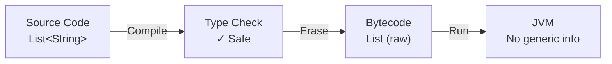

# Java Generics

> [!summary]
> Generics enable types (classes and interfaces) to be parameters when defining classes, interfaces, and methods. They provide compile-time type safety, eliminate casting, and allow you to write reusable code that works with different types. You'll encounter generics everywhere — collections, APIs, utility methods — making them essential for reading and writing Java code.

## Quick Reference

| Syntax | Meaning | Example |
|--------|---------|---------|
| `<T>` | Type parameter | `class Box<T> { T value; }` |
| `<T, U>` | Multiple type parameters | `Map<String, Integer>` |
| `<T extends Foo>` | Upper bound (T must be Foo or subtype) | `<T extends Comparable<T>>` |
| `<? extends T>` | Wildcard upper bound (read-only) | `List<? extends Number>` |
| `<? super T>` | Wildcard lower bound (write-only) | `List<? super Integer>` |
| `<?>` | Unbounded wildcard | `List<?>` |

## Theory

### What Are Generics?

Before generics (Java 4 and earlier), collections stored `Object` types, requiring manual casting:

```java
// Pre-generics: dangerous and verbose
List names = new ArrayList();
names.add("Alice");
names.add(42);  // No compile error! But logically wrong.
String name = (String) names.get(0);  // Must cast
String oops = (String) names.get(1);  // ClassCastException at runtime!
```

Generics solve this by letting you declare *what type* a collection (or class) holds:

```java
// With generics: type-safe and clean
List<String> names = new ArrayList<>();
names.add("Alice");
names.add(42);  // Compile error! Caught immediately.
String name = names.get(0);  // No cast needed
```

**Key benefits:**
- **Compile-time type checking** — Errors caught before runtime
- **No casting** — Compiler knows the type
- **Code reuse** — Write once, use with any type

### How It Works

Generics use **type erasure** — the compiler enforces type safety, then *removes* generic type information in the compiled bytecode. At runtime, `List<String>` and `List<Integer>` are both just `List`.



This means:
- Type safety is a compile-time feature
- You can't check generic types at runtime (`instanceof List<String>` won't work)
- Generic type info isn't available via reflection (mostly)

## Practical Examples

### Basic Usage — Generic Classes

Creating and using a simple generic class:

```java
// Define a generic class with type parameter T
public class Box<T> {
    private T contents;

    public void set(T item) {
        this.contents = item;
    }

    public T get() {
        return contents;
    }

    public boolean isEmpty() {
        return contents == null;
    }
}

// Usage — compiler enforces type safety
Box<String> stringBox = new Box<>();
stringBox.set("Hello");
String message = stringBox.get();  // No cast needed

Box<Integer> intBox = new Box<>();
intBox.set(42);
Integer number = intBox.get();

// Compile error — type mismatch caught immediately
// stringBox.set(123);  // Error: incompatible types
```

### Intermediate Example — Generic Methods

Methods can have their own type parameters, independent of the class:

```java
public class ArrayUtils {

    // Generic method — <T> declares the type parameter
    public static <T> void swap(T[] array, int i, int j) {
        T temp = array[i];
        array[i] = array[j];
        array[j] = temp;
    }

    // Generic method with return type
    public static <T> T getFirst(List<T> list) {
        if (list == null || list.isEmpty()) {
            return null;
        }
        return list.get(0);
    }

    // Multiple type parameters
    public static <K, V> V getOrDefault(Map<K, V> map, K key, V defaultValue) {
        V value = map.get(key);
        return value != null ? value : defaultValue;
    }
}

// Usage — type is inferred from arguments
String[] names = {"Alice", "Bob", "Charlie"};
ArrayUtils.swap(names, 0, 2);  // T inferred as String

List<Integer> numbers = List.of(1, 2, 3);
Integer first = ArrayUtils.getFirst(numbers);  // T inferred as Integer

// Explicit type (rarely needed)
String result = ArrayUtils.<String>getFirst(List.of("a", "b"));
```

### Advanced Usage — Bounded Type Parameters

Restrict what types can be used with `extends`:

```java
// T must be Comparable — enables sorting, min/max operations
public class MathUtils {

    // Upper bound: T must implement Comparable<T>
    public static <T extends Comparable<T>> T findMax(List<T> list) {
        if (list == null || list.isEmpty()) {
            throw new IllegalArgumentException("List cannot be empty");
        }

        T max = list.get(0);
        for (T item : list) {
            if (item.compareTo(max) > 0) {
                max = item;
            }
        }
        return max;
    }

    // Multiple bounds: T must extend Number AND implement Comparable
    public static <T extends Number & Comparable<T>> T clamp(T value, T min, T max) {
        if (value.compareTo(min) < 0) return min;
        if (value.compareTo(max) > 0) return max;
        return value;
    }
}

// Usage
List<Integer> scores = List.of(85, 92, 78, 96, 88);
Integer highest = MathUtils.findMax(scores);  // 96

List<String> words = List.of("apple", "zebra", "mango");
String last = MathUtils.findMax(words);  // "zebra" (alphabetically)

// Won't compile — Object doesn't implement Comparable
// MathUtils.findMax(List.of(new Object()));  // Error!
```

### Wildcards — Flexibility in Method Parameters

Wildcards (`?`) provide flexibility when you don't need to know the exact type:

```java
public class WildcardExamples {

    // Unbounded wildcard — read-only, when type doesn't matter
    public static void printList(List<?> list) {
        for (Object item : list) {
            System.out.println(item);
        }
    }

    // Upper bounded — accepts Number or any subtype (Integer, Double, etc.)
    // PECS: Producer Extends — use extends when you READ from the structure
    public static double sumOfNumbers(List<? extends Number> numbers) {
        double sum = 0.0;
        for (Number n : numbers) {
            sum += n.doubleValue();
        }
        return sum;
    }

    // Lower bounded — accepts Integer or any supertype (Number, Object)
    // PECS: Consumer Super — use super when you WRITE to the structure
    public static void addIntegers(List<? super Integer> list, int count) {
        for (int i = 1; i <= count; i++) {
            list.add(i);
        }
    }
}

// Usage
List<Integer> integers = List.of(1, 2, 3);
List<Double> doubles = List.of(1.5, 2.5, 3.5);

WildcardExamples.printList(integers);  // Works
WildcardExamples.printList(doubles);   // Works

double sum1 = WildcardExamples.sumOfNumbers(integers);  // 6.0
double sum2 = WildcardExamples.sumOfNumbers(doubles);   // 7.5

List<Number> numbers = new ArrayList<>();
WildcardExamples.addIntegers(numbers, 3);  // [1, 2, 3]
```

## Common Patterns

> [!tip] PECS: Producer Extends, Consumer Super
> This is the most important rule for wildcards:
> - **Producer** (you read FROM it) → `<? extends T>`
> - **Consumer** (you write TO it) → `<? super T>`
> - **Both** (read and write) → Use exact type `<T>`, no wildcard
>
> Example: `Collections.copy(List<? super T> dest, List<? extends T> src)` — reads from src (extends), writes to dest (super).

> [!tip] Prefer Generic Methods Over Raw Types
> If you find yourself casting from a collection, you probably need generics:
> ```java
> // ❌ Bad: raw type, requires casting
> List items = getItems();
> String first = (String) items.get(0);
>
> // ✅ Good: generic, type-safe
> List<String> items = getItems();
> String first = items.get(0);
> ```

> [!tip] Use Diamond Operator (<>)
> Java 7+ infers the type from the left side:
> ```java
> // Verbose (pre-Java 7)
> Map<String, List<Integer>> map = new HashMap<String, List<Integer>>();
>
> // Clean (Java 7+)
> Map<String, List<Integer>> map = new HashMap<>();
> ```

> [!warning] Never Use Raw Types in New Code
> Raw types (e.g., `List` instead of `List<String>`) exist only for backwards compatibility. They bypass type safety:
> ```java
> List rawList = new ArrayList();  // Raw type — don't do this!
> rawList.add("string");
> rawList.add(123);  // No compile error, but mixing types is dangerous
> ```

> [!warning] Cannot Create Generic Arrays
> Due to type erasure, you can't create arrays of generic types:
> ```java
> // ❌ Won't compile
> T[] array = new T[10];
> List<String>[] arrayOfLists = new ArrayList<String>[10];
>
> // ✅ Workarounds
> List<T> list = new ArrayList<>();  // Use List instead
> @SuppressWarnings("unchecked")
> T[] array = (T[]) new Object[10];  // Unsafe cast (use carefully)
> ```

## Edge Cases & Gotchas

- **Type erasure breaks instanceof** — You can't do `if (list instanceof List<String>)`. At runtime, it's just `List`. Use `instanceof List<?>` for raw type check only.

- **Generic types are invariant** — `List<Dog>` is NOT a subtype of `List<Animal>`, even though `Dog extends Animal`. This prevents unsafe additions. Use wildcards for flexibility.

- **Primitive types not allowed** — Use wrapper classes: `List<Integer>` not `List<int>`. Autoboxing handles conversion.

- **Static members can't use class type parameters** — `class Foo<T> { static T value; }` won't compile. Static context has no instance to infer T from.

- **Overloading with different generic types fails** — `void process(List<String> list)` and `void process(List<Integer> list)` have the same erasure (`List`), causing a compile error.

- **Bridge methods** — The compiler generates synthetic methods to preserve polymorphism after erasure. You might see these in stack traces.

## Related Topics

- [[Annotations]] — Often used with generics for compile-time checks (e.g., `@SafeVarargs`)
- [[Functional-Interfaces-and-Lambdas]] — Generic functional interfaces like `Function<T, R>`, `Predicate<T>`
- [[Streams-API]] — Heavy use of generics: `Stream<T>`, collectors, method chaining
- [[Collections-Framework]] — All collection interfaces use generics: `List<E>`, `Map<K,V>`, `Set<E>`

## References

- [Oracle Java Tutorials: Generics](https://docs.oracle.com/javase/tutorial/java/generics/)
- [Oracle Extra: Generics](https://docs.oracle.com/javase/tutorial/extra/generics/index.html)
- [Effective Java, 3rd Ed.](https://www.oreilly.com/library/view/effective-java/9780134686097/) — Items 26-33 cover generics best practices
- [Angelika Langer's Generics FAQ](http://www.angelikalanger.com/GenericsFAQ/JavaGenericsFAQ.html) — Deep dive reference
