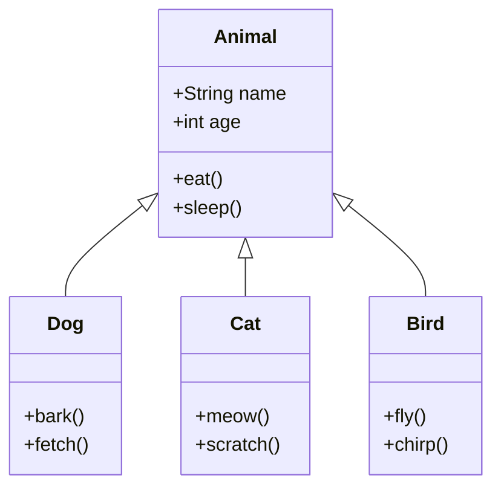

# Inheritance and Polymorphism

> [!summary]
> **Inheritance** lets a class acquire the fields and methods of another class — you create a "is-a" relationship where a `Dog` is an `Animal`. **Polymorphism** means "many forms" — a variable of type `Animal` can hold a `Dog`, `Cat`, or any subclass, and calling `speak()` runs the appropriate version. Together, they enable code reuse and flexible, extensible designs.

## Quick Reference

| Keyword | Purpose | Example |
|---------|---------|---------|
| `extends` | Inherit from a class | `class Dog extends Animal` |
| `super` | Reference parent class | `super.method()`, `super(args)` |
| `@Override` | Mark overridden method | `@Override void speak()` |
| `final` (class) | Prevent inheritance | `final class String` |
| `final` (method) | Prevent overriding | `final void critical()` |
| `abstract` | No implementation, must override | `abstract void draw();` |
| `instanceof` | Check runtime type | `if (animal instanceof Dog)` |

## Theory

### Inheritance: The "Is-A" Relationship



- `Dog` **is an** `Animal` — inherits `name`, `age`, `eat()`, `sleep()`
- `Dog` **adds** its own behavior — `bark()`, `fetch()`
- A `Dog` can do everything an `Animal` can, plus more

### Polymorphism: One Interface, Many Implementations

```java
Animal pet;              // Variable of type Animal

pet = new Dog("Fido");   // Holds a Dog
pet.speak();             // "Woof!" — calls Dog's version

pet = new Cat("Whiskers"); // Now holds a Cat
pet.speak();             // "Meow!" — calls Cat's version

// Same code, different behavior depending on actual object
```

The power: you write code that works with `Animal`, and it automatically works with any current or future subclass.

## Practical Examples

### Basic Inheritance

```java
// Parent class (superclass, base class)
public class Animal {
    protected String name;  // Protected: accessible by subclasses
    protected int age;

    public Animal(String name, int age) {
        this.name = name;
        this.age = age;
    }

    public void eat() {
        System.out.println(name + " is eating");
    }

    public void sleep() {
        System.out.println(name + " is sleeping");
    }

    public String getName() {
        return name;
    }
}

// Child class (subclass, derived class)
public class Dog extends Animal {
    private String breed;

    public Dog(String name, int age, String breed) {
        super(name, age);  // MUST call parent constructor first
        this.breed = breed;
    }

    // Dog-specific method
    public void bark() {
        System.out.println(name + " says Woof!");
    }

    public void fetch() {
        System.out.println(name + " is fetching the ball");
    }

    public String getBreed() {
        return breed;
    }
}

// Usage
Dog fido = new Dog("Fido", 3, "Labrador");
fido.eat();    // Inherited from Animal: "Fido is eating"
fido.sleep();  // Inherited from Animal: "Fido is sleeping"
fido.bark();   // Dog's own method: "Fido says Woof!"

// Dog IS-A Animal, so this works:
Animal pet = fido;
pet.eat();     // Still works — inherited method
// pet.bark(); // ERROR! Animal doesn't have bark()
```

### Method Overriding

Subclass provides its own implementation of a parent method:

```java
public class Animal {
    public void speak() {
        System.out.println("Animal makes a sound");
    }

    public void move() {
        System.out.println("Animal moves");
    }
}

public class Dog extends Animal {
    @Override  // Always use this annotation — catches errors
    public void speak() {
        System.out.println("Dog barks: Woof!");
    }

    @Override
    public void move() {
        System.out.println("Dog runs on four legs");
    }
}

public class Bird extends Animal {
    @Override
    public void speak() {
        System.out.println("Bird chirps: Tweet!");
    }

    @Override
    public void move() {
        System.out.println("Bird flies through the air");
    }
}

public class Fish extends Animal {
    @Override
    public void speak() {
        System.out.println("Fish: ...");  // Fish don't really speak
    }

    @Override
    public void move() {
        System.out.println("Fish swims in water");
    }
}

// Polymorphism in action
Animal[] animals = {
    new Dog(),
    new Bird(),
    new Fish()
};

for (Animal animal : animals) {
    animal.speak();  // Each animal speaks differently!
    animal.move();   // Each animal moves differently!
}
// Output:
// Dog barks: Woof!
// Dog runs on four legs
// Bird chirps: Tweet!
// Bird flies through the air
// Fish: ...
// Fish swims in water
```

### The `super` Keyword

Access parent class members:

```java
public class Vehicle {
    protected String brand;
    protected int speed;

    public Vehicle(String brand) {
        this.brand = brand;
        this.speed = 0;
    }

    public void accelerate(int amount) {
        speed += amount;
        System.out.println(brand + " accelerating to " + speed + " mph");
    }

    public String getInfo() {
        return brand + " at " + speed + " mph";
    }
}

public class Car extends Vehicle {
    private int numDoors;

    public Car(String brand, int numDoors) {
        super(brand);  // Call parent constructor
        this.numDoors = numDoors;
    }

    @Override
    public void accelerate(int amount) {
        System.out.println("Car engine revving...");
        super.accelerate(amount);  // Call parent's accelerate
    }

    @Override
    public String getInfo() {
        // Extend parent's info
        return super.getInfo() + ", " + numDoors + " doors";
    }
}

public class ElectricCar extends Car {
    private int batteryLevel;

    public ElectricCar(String brand, int numDoors, int batteryLevel) {
        super(brand, numDoors);  // Calls Car's constructor
        this.batteryLevel = batteryLevel;
    }

    @Override
    public void accelerate(int amount) {
        if (batteryLevel > 0) {
            System.out.println("Silent electric acceleration...");
            super.accelerate(amount);  // Calls Car's accelerate
            batteryLevel -= 5;
        } else {
            System.out.println("Battery dead!");
        }
    }
}

// Inheritance chain: ElectricCar → Car → Vehicle
ElectricCar tesla = new ElectricCar("Tesla", 4, 100);
tesla.accelerate(30);
// Output:
// Silent electric acceleration...
// Car engine revving...
// Tesla accelerating to 30 mph
```

### Abstract Classes

Can't be instantiated — meant to be extended:

```java
// Abstract class — blueprint for shapes
public abstract class Shape {
    protected String color;

    public Shape(String color) {
        this.color = color;
    }

    // Abstract method — subclasses MUST implement
    public abstract double getArea();
    public abstract double getPerimeter();

    // Concrete method — shared by all shapes
    public void displayColor() {
        System.out.println("Color: " + color);
    }
}

public class Circle extends Shape {
    private double radius;

    public Circle(String color, double radius) {
        super(color);
        this.radius = radius;
    }

    @Override
    public double getArea() {
        return Math.PI * radius * radius;
    }

    @Override
    public double getPerimeter() {
        return 2 * Math.PI * radius;
    }
}

public class Rectangle extends Shape {
    private double width;
    private double height;

    public Rectangle(String color, double width, double height) {
        super(color);
        this.width = width;
        this.height = height;
    }

    @Override
    public double getArea() {
        return width * height;
    }

    @Override
    public double getPerimeter() {
        return 2 * (width + height);
    }
}

// Usage
// Shape s = new Shape("red");  // ERROR! Can't instantiate abstract class

Shape circle = new Circle("red", 5);
Shape rectangle = new Rectangle("blue", 4, 6);

System.out.println("Circle area: " + circle.getArea());        // 78.54
System.out.println("Rectangle area: " + rectangle.getArea());  // 24.0
```

### instanceof and Type Casting

Check and convert types at runtime:

```java
public class TypeCheckingDemo {
    public static void main(String[] args) {
        Animal animal = new Dog("Fido", 3, "Labrador");

        // instanceof checks actual runtime type
        if (animal instanceof Dog) {
            System.out.println("It's a dog!");

            // Downcast to access Dog-specific methods
            Dog dog = (Dog) animal;
            dog.bark();
        }

        // Pattern matching (Java 16+) — cleaner!
        if (animal instanceof Dog dog) {
            // 'dog' is automatically cast and available here
            dog.bark();
            System.out.println("Breed: " + dog.getBreed());
        }

        // Check before casting to avoid ClassCastException
        Animal cat = new Cat("Whiskers", 2);
        // Dog notADog = (Dog) cat;  // ClassCastException at runtime!

        if (cat instanceof Dog) {
            Dog d = (Dog) cat;  // Never executes — safe
        }

        // Polymorphic method that handles different types
        makeSpeak(new Dog("Rex", 5, "German Shepherd"));
        makeSpeak(new Cat("Mittens", 3));
    }

    public static void makeSpeak(Animal animal) {
        animal.speak();  // Polymorphism handles the right version

        // If you need type-specific behavior:
        if (animal instanceof Dog dog) {
            dog.fetch();
        } else if (animal instanceof Cat cat) {
            cat.purr();
        }
    }
}
```

### final — Preventing Inheritance/Overriding

```java
// Final class — cannot be extended
public final class String {
    // No one can create a subclass of String
}

// class MyString extends String { }  // ERROR!

public class Parent {
    // Final method — cannot be overridden
    public final void criticalMethod() {
        // Subclasses cannot change this behavior
    }

    public void normalMethod() {
        // Subclasses can override this
    }
}

public class Child extends Parent {
    // @Override
    // public void criticalMethod() { }  // ERROR! Cannot override final

    @Override
    public void normalMethod() {
        // This is fine
    }
}
```

### Constructor Chaining

```java
public class Person {
    private String name;
    private int age;

    public Person() {
        this("Unknown", 0);  // Calls two-arg constructor
    }

    public Person(String name) {
        this(name, 0);  // Calls two-arg constructor
    }

    public Person(String name, int age) {
        this.name = name;
        this.age = age;
    }
}

public class Employee extends Person {
    private String employeeId;
    private double salary;

    public Employee() {
        this("Unknown", 0, "N/A", 0.0);
    }

    public Employee(String name, int age, String employeeId, double salary) {
        super(name, age);  // MUST be first statement
        this.employeeId = employeeId;
        this.salary = salary;
    }
}

// Constructor call order:
// new Employee() → Employee() → Employee(4 args) → super() → Person(2 args)
```

## Common Patterns

> [!tip] Favor Composition Over Inheritance
> Inheritance creates tight coupling. Often, composition is more flexible:
> ```java
> // ❌ Inheritance: Engine IS-A Vehicle? No...
> class Engine extends Vehicle { }
>
> // ✅ Composition: Car HAS-A Engine
> class Car {
>     private Engine engine;  // Car uses Engine
>     private Wheels wheels;
> }
> ```
> Use inheritance for genuine "is-a" relationships.

> [!tip] Always Use @Override
> Catches typos and signature mismatches at compile time:
> ```java
> // Without @Override — silent bug!
> public void tostring() { }  // Typo: should be toString()
>
> // With @Override — compiler error!
> @Override
> public void tostring() { }  // ERROR: no such method to override
> ```

> [!tip] Call super() in Constructors
> Parent class needs to initialize first:
> ```java
> public Child(String name) {
>     super(name);  // Initialize parent
>     // Then initialize child-specific fields
> }
> ```

> [!warning] Fragile Base Class Problem
> Changes to parent class can break subclasses unexpectedly:
> ```java
> // If parent adds a method with same signature as child's,
> // child's method becomes an override — potentially changing behavior
> ```
> Document which methods are safe to override.

> [!warning] Don't Override Private Methods
> Private methods aren't inherited, so you can't override them:
> ```java
> class Parent {
>     private void secret() { }  // Not visible to children
> }
> class Child extends Parent {
>     private void secret() { }  // This is a NEW method, not override
> }
> ```

## Edge Cases & Gotchas

- **Constructor inheritance** — Constructors are NOT inherited. Each class must define its own, calling `super()` to chain to parent.

- **Multiple inheritance** — Java doesn't support extending multiple classes. Use interfaces for multiple contracts.

- **Object is the root** — Every class implicitly extends `Object`. That's where `toString()`, `equals()`, `hashCode()` come from.

- **Covariant return types** — Override can return a subtype:
  ```java
  class Animal { Animal create() { return new Animal(); } }
  class Dog extends Animal { Dog create() { return new Dog(); } }  // OK!
  ```

- **Static methods aren't overridden** — They're hidden. Calling via parent type uses parent's version:
  ```java
  Parent p = new Child();
  p.staticMethod();  // Calls Parent.staticMethod(), not Child's
  ```

- **Private fields are inherited but not accessible** — Subclass has the memory, but can't see it directly. Use protected or getters.

## Related Topics

- [[Classes-and-Objects]] — Foundation for inheritance
- [[Interfaces]] — Alternative/complement to abstract classes
- [[Methods]] — Method overloading vs overriding
- [[Abstract-Classes]] — When to use abstract vs interface *(coming soon)*

## References

- [Oracle Tutorial: Inheritance](https://docs.oracle.com/javase/tutorial/java/IandI/subclasses.html)
- [Oracle Tutorial: Polymorphism](https://docs.oracle.com/javase/tutorial/java/IandI/polymorphism.html)
- [Effective Java, 3rd Ed.](https://www.oreilly.com/library/view/effective-java/9780134686097/) — Item 18: Favor composition over inheritance
