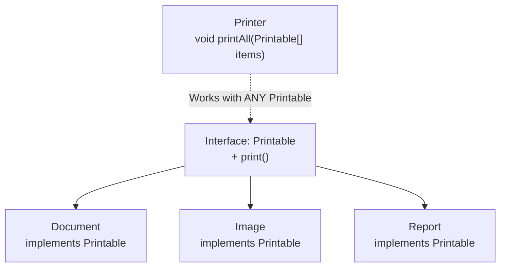

# Java Interfaces

> [!summary]
> An **interface** is a contract that defines what a class can do, without specifying how. It declares method signatures that implementing classes must provide. Interfaces enable polymorphism — you can write code that works with any class that fulfills the contract, regardless of the actual implementation. This is the foundation for dependency injection, testing with mocks, and flexible architecture.

## Quick Reference

| Keyword | Purpose | Example |
|---------|---------|---------|
| `interface` | Declare an interface | `interface Drawable { }` |
| `implements` | Class fulfills contract | `class Circle implements Drawable` |
| `extends` | Interface inherits interface | `interface A extends B` |
| `default` | Method with implementation | `default void log() { }` |
| `static` | Static method in interface | `static void helper() { }` |
| `abstract` | (implicit) Method without body | `void draw();` |

**Key rules:**
- All methods are `public abstract` by default (until Java 8)
- All fields are `public static final` (constants only)
- A class can implement multiple interfaces
- An interface can extend multiple interfaces

## Theory

### Interface as Contract



The interface says "anything Printable has a `print()` method." The Printer doesn't care if it's a Document, Image, or Report — it just calls `print()`.

### Interface vs Class vs Abstract Class

| Feature | Interface | Abstract Class | Class |
|---------|-----------|----------------|-------|
| Methods | Abstract + default + static | Abstract + concrete | Concrete |
| Fields | Constants only (`static final`) | Any fields | Any fields |
| Constructor | ❌ No | ✅ Yes | ✅ Yes |
| Multiple inheritance | ✅ Yes (implements many) | ❌ No (extends one) | ❌ No |
| When to use | Define capability/contract | Share code + enforce contract | Full implementation |

## Practical Examples

### Basic Interface

```java
// Define the contract
public interface Drawable {
    void draw();  // Implicitly public abstract
    int getArea();
}

// Implement the contract
public class Circle implements Drawable {
    private int radius;

    public Circle(int radius) {
        this.radius = radius;
    }

    @Override
    public void draw() {
        System.out.println("Drawing circle with radius " + radius);
    }

    @Override
    public int getArea() {
        return (int) (Math.PI * radius * radius);
    }
}

public class Rectangle implements Drawable {
    private int width, height;

    public Rectangle(int width, int height) {
        this.width = width;
        this.height = height;
    }

    @Override
    public void draw() {
        System.out.println("Drawing rectangle " + width + "x" + height);
    }

    @Override
    public int getArea() {
        return width * height;
    }
}

// Use polymorphically
public class Canvas {
    public void drawAll(Drawable[] shapes) {
        for (Drawable shape : shapes) {
            shape.draw();  // Don't care what type — just that it's Drawable
        }
    }

    public int totalArea(Drawable[] shapes) {
        int total = 0;
        for (Drawable shape : shapes) {
            total += shape.getArea();
        }
        return total;
    }
}

// Usage
Drawable[] shapes = {
    new Circle(5),
    new Rectangle(4, 6),
    new Circle(3)
};
new Canvas().drawAll(shapes);
```

### Multiple Interfaces

A class can implement many interfaces:

```java
interface Flyable {
    void fly();
}

interface Swimmable {
    void swim();
}

interface Walkable {
    void walk();
}

// Duck can do all three!
public class Duck implements Flyable, Swimmable, Walkable {
    @Override
    public void fly() {
        System.out.println("Duck flying");
    }

    @Override
    public void swim() {
        System.out.println("Duck swimming");
    }

    @Override
    public void walk() {
        System.out.println("Duck walking");
    }
}

// Penguin can't fly
public class Penguin implements Swimmable, Walkable {
    @Override
    public void swim() {
        System.out.println("Penguin swimming");
    }

    @Override
    public void walk() {
        System.out.println("Penguin waddling");
    }
}

// Methods accept interface types — work with any implementation
public void makeItFly(Flyable f) {
    f.fly();  // Works with Duck, Airplane, Superman, etc.
}

public void makeItSwim(Swimmable s) {
    s.swim();  // Works with Duck, Penguin, Fish, etc.
}
```

### Default Methods (Java 8+)

Add implementation to interfaces without breaking existing implementations:

```java
public interface Vehicle {
    void start();
    void stop();

    // Default method — has implementation
    default void honk() {
        System.out.println("Beep beep!");
    }

    // Classes can override if needed
    default String getDescription() {
        return "A vehicle";
    }
}

public class Car implements Vehicle {
    @Override
    public void start() {
        System.out.println("Car starting");
    }

    @Override
    public void stop() {
        System.out.println("Car stopping");
    }

    // Uses default honk() — no override needed

    @Override
    public String getDescription() {
        return "A car";  // Override the default
    }
}

public class Bicycle implements Vehicle {
    @Override
    public void start() {
        System.out.println("Pedaling");
    }

    @Override
    public void stop() {
        System.out.println("Braking");
    }

    @Override
    public void honk() {
        System.out.println("Ring ring!");  // Bicycles ring, not honk
    }
}
```

### Static Methods in Interfaces (Java 8+)

Utility methods that belong to the interface:

```java
public interface StringUtils {

    // Static method — called on interface, not instances
    static boolean isNullOrEmpty(String s) {
        return s == null || s.isEmpty();
    }

    static String capitalize(String s) {
        if (isNullOrEmpty(s)) return s;
        return Character.toUpperCase(s.charAt(0)) + s.substring(1);
    }
}

// Usage — call on interface name
if (StringUtils.isNullOrEmpty(input)) {
    // handle empty
}
String name = StringUtils.capitalize("alice");  // "Alice"
```

### Interface Inheritance

Interfaces can extend other interfaces:

```java
interface Animal {
    void eat();
    void sleep();
}

interface Pet extends Animal {
    void play();
    String getName();
}

interface ServiceAnimal extends Pet {
    void performService();
}

// Must implement ALL methods from entire hierarchy
public class GuideDog implements ServiceAnimal {
    private String name;

    @Override
    public void eat() { System.out.println("Dog eating"); }

    @Override
    public void sleep() { System.out.println("Dog sleeping"); }

    @Override
    public void play() { System.out.println("Dog playing"); }

    @Override
    public String getName() { return name; }

    @Override
    public void performService() { System.out.println("Guiding owner"); }
}
```

### Functional Interfaces

Interface with exactly ONE abstract method — can use lambdas:

```java
@FunctionalInterface
public interface Processor {
    String process(String input);

    // Can have default/static methods — doesn't affect functional status
    default String processAndTrim(String input) {
        return process(input).trim();
    }
}

// Traditional implementation
Processor upperProcessor = new Processor() {
    @Override
    public String process(String input) {
        return input.toUpperCase();
    }
};

// Lambda implementation — much cleaner!
Processor upper = input -> input.toUpperCase();
Processor reverse = input -> new StringBuilder(input).reverse().toString();
Processor excited = input -> input + "!!!";

// Usage
System.out.println(upper.process("hello"));    // "HELLO"
System.out.println(reverse.process("hello"));  // "olleh"
System.out.println(excited.process("hello"));  // "hello!!!"
```

### Real-World Example: Repository Pattern

```java
// Interface defines the contract
public interface UserRepository {
    User findById(Long id);
    List<User> findAll();
    User save(User user);
    void delete(Long id);
}

// Database implementation
public class DatabaseUserRepository implements UserRepository {
    private final DataSource dataSource;

    public DatabaseUserRepository(DataSource dataSource) {
        this.dataSource = dataSource;
    }

    @Override
    public User findById(Long id) {
        // SQL query to database
    }

    @Override
    public List<User> findAll() {
        // SQL query
    }

    @Override
    public User save(User user) {
        // INSERT or UPDATE
    }

    @Override
    public void delete(Long id) {
        // DELETE query
    }
}

// In-memory implementation for testing
public class InMemoryUserRepository implements UserRepository {
    private Map<Long, User> users = new HashMap<>();
    private Long nextId = 1L;

    @Override
    public User findById(Long id) {
        return users.get(id);
    }

    @Override
    public List<User> findAll() {
        return new ArrayList<>(users.values());
    }

    @Override
    public User save(User user) {
        if (user.getId() == null) {
            user.setId(nextId++);
        }
        users.put(user.getId(), user);
        return user;
    }

    @Override
    public void delete(Long id) {
        users.remove(id);
    }
}

// Service doesn't care which implementation — depends on interface
public class UserService {
    private final UserRepository repository;  // Interface type!

    public UserService(UserRepository repository) {
        this.repository = repository;  // Inject any implementation
    }

    public User getUser(Long id) {
        return repository.findById(id);
    }
}

// Production: use database
UserService prodService = new UserService(new DatabaseUserRepository(dataSource));

// Testing: use in-memory
UserService testService = new UserService(new InMemoryUserRepository());
```

## Common Patterns

> [!tip] Program to Interfaces, Not Implementations
> ```java
> // ❌ Tied to specific implementation
> ArrayList<String> names = new ArrayList<>();
>
> // ✅ Flexible — can swap implementation
> List<String> names = new ArrayList<>();
> List<String> names = new LinkedList<>();  // Easy to change
> ```

> [!tip] Use Interfaces for Dependencies
> ```java
> // ❌ Hard to test — needs real database
> public class OrderService {
>     private DatabaseOrderRepository repo = new DatabaseOrderRepository();
> }
>
> // ✅ Easy to test — inject mock implementation
> public class OrderService {
>     private final OrderRepository repo;
>     public OrderService(OrderRepository repo) {
>         this.repo = repo;
>     }
> }
> ```

> [!tip] Small, Focused Interfaces (ISP)
> Interface Segregation Principle — don't force classes to implement methods they don't need:
> ```java
> // ❌ Too broad — not everything can do all of these
> interface Worker {
>     void work();
>     void eat();
>     void sleep();
> }
>
> // ✅ Separate concerns
> interface Workable { void work(); }
> interface Eatable { void eat(); }
> interface Sleepable { void sleep(); }
>
> class Human implements Workable, Eatable, Sleepable { ... }
> class Robot implements Workable { ... }  // Robots don't eat or sleep
> ```

> [!warning] Default Method Conflicts
> When two interfaces have the same default method:
> ```java
> interface A { default void foo() { System.out.println("A"); } }
> interface B { default void foo() { System.out.println("B"); } }
>
> class C implements A, B {
>     @Override
>     public void foo() {
>         A.super.foo();  // Must explicitly choose or provide own
>     }
> }
> ```

> [!warning] Interface Fields Are Constants
> ```java
> interface Config {
>     int MAX_SIZE = 100;  // Implicitly: public static final
>     // MAX_SIZE = 200;   // ERROR! Can't reassign final
> }
> ```

## Edge Cases & Gotchas

- **Diamond problem resolved** — If two interfaces have same default method, implementing class MUST override.

- **Cannot instantiate interfaces** — `new Drawable()` is illegal. Use implementing class or anonymous class/lambda.

- **Private methods (Java 9+)** — Interfaces can have private methods to share code between default methods.

- **Interface as marker** — Empty interfaces (like `Serializable`) act as markers/tags. Modern alternative: annotations.

- **`instanceof` works** — `if (obj instanceof Drawable)` checks if object implements the interface.

## Related Topics

- [[Classes-and-Objects]] — Classes implement interfaces
- [[Functional-Interfaces-and-Lambdas]] — Special single-method interfaces for lambdas
- [[Generics]] — Interfaces can be generic: `interface List<E>`
- [[Abstract-Classes]] — Alternative when you need shared state *(coming soon)*

## References

- [Oracle Tutorial: Interfaces](https://docs.oracle.com/javase/tutorial/java/IandI/createinterface.html)
- [Oracle Tutorial: Interface as Type](https://docs.oracle.com/javase/tutorial/java/IandI/interfaceAsType.html)
- [Effective Java, 3rd Ed.](https://www.oreilly.com/library/view/effective-java/9780134686097/) — Item 20: Prefer interfaces to abstract classes
