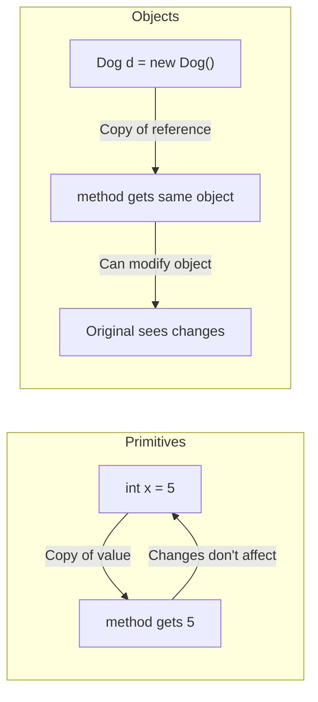

# Java Methods

> [!summary]
> A **method** is a block of code that performs a specific task — it's Java's version of a function. Methods take inputs (parameters), do work, and optionally return a result. They're how you organize code into reusable, testable pieces. Every action in Java happens through method calls, from `System.out.println()` to your own custom logic.

## Quick Reference

| Component | Description | Example |
|-----------|-------------|---------|
| **Return type** | What the method gives back | `int`, `String`, `void` |
| **Method name** | Identifier to call it | `calculateTotal` |
| **Parameters** | Input values | `(int x, int y)` |
| **Method body** | The code that runs | `{ return x + y; }` |
| **Return statement** | Sends value back | `return result;` |
| **Method signature** | Name + parameter types | `add(int, int)` |

**Method declaration syntax:**
```java
accessModifier returnType methodName(parameterList) {
    // method body
    return value;  // if not void
}
```

## Theory

### Anatomy of a Method

```java
//  ┌─ access modifier (who can call this)
//  │      ┌─ return type (what it gives back)
//  │      │      ┌─ method name
//  │      │      │         ┌─ parameters (inputs)
//  ▼      ▼      ▼         ▼
public static int add(int a, int b) {
    int sum = a + b;    // ← method body
    return sum;         // ← return statement
}
```

**Key concepts:**
- **Parameters** — Variables declared in the method signature; receive values when called
- **Arguments** — Actual values passed when calling the method
- **Return type** — The type of value the method produces (`void` if none)
- **Method signature** — Name + parameter types (used for overloading)

### Pass by Value

Java is **always pass by value** — but what's passed depends on the type:



- **Primitives**: Copy of the VALUE is passed. Changes inside method don't affect original.
- **Objects**: Copy of the REFERENCE is passed. Method can modify the object (but can't make the original variable point elsewhere).

## Practical Examples

### Basic Method Types

```java
public class MethodExamples {

    // ============ NO RETURN VALUE (void) ============
    public void sayHello() {
        System.out.println("Hello!");
        // No return statement needed (or use 'return;' to exit early)
    }

    public void greet(String name) {
        if (name == null) {
            return;  // Exit early
        }
        System.out.println("Hello, " + name + "!");
    }

    // ============ WITH RETURN VALUE ============
    public int add(int a, int b) {
        return a + b;
    }

    public String formatName(String first, String last) {
        return last + ", " + first;
    }

    public boolean isEven(int number) {
        return number % 2 == 0;
    }

    // ============ RETURNING OBJECTS ============
    public int[] createArray(int size) {
        return new int[size];
    }

    public List<String> getNames() {
        return Arrays.asList("Alice", "Bob", "Charlie");
    }

    // ============ MULTIPLE RETURNS (early exit) ============
    public String getGrade(int score) {
        if (score >= 90) return "A";
        if (score >= 80) return "B";
        if (score >= 70) return "C";
        if (score >= 60) return "D";
        return "F";
    }
}
```

### Method Overloading

Same name, different parameters — compiler picks the right one:

```java
public class Calculator {

    // Overloaded methods — same name, different signatures
    public int add(int a, int b) {
        return a + b;
    }

    public int add(int a, int b, int c) {
        return a + b + c;
    }

    public double add(double a, double b) {
        return a + b;
    }

    public String add(String a, String b) {
        return a + b;  // Concatenation
    }

    // Note: Return type alone doesn't count!
    // public double add(int a, int b) { }  // ERROR! Same signature as first
}

// Usage — compiler picks based on arguments
Calculator calc = new Calculator();
calc.add(1, 2);           // Calls add(int, int) → 3
calc.add(1, 2, 3);        // Calls add(int, int, int) → 6
calc.add(1.5, 2.5);       // Calls add(double, double) → 4.0
calc.add("Hello", " ");   // Calls add(String, String) → "Hello "
```

### Varargs (Variable Arguments)

Accept any number of arguments of the same type:

```java
public class VarargsExample {

    // Varargs — must be last parameter
    public int sum(int... numbers) {
        int total = 0;
        for (int n : numbers) {
            total += n;
        }
        return total;
    }

    // Can have other params before varargs
    public void printAll(String prefix, String... messages) {
        for (String msg : messages) {
            System.out.println(prefix + msg);
        }
    }

    // Under the hood, varargs is just an array
    public void demonstrate() {
        sum();                    // 0 (empty array)
        sum(1);                   // 1
        sum(1, 2, 3);             // 6
        sum(1, 2, 3, 4, 5);       // 15

        int[] arr = {1, 2, 3};
        sum(arr);                 // Can also pass an array directly

        printAll("[INFO] ", "Starting", "Processing", "Done");
    }
}
```

### Pass by Value Deep Dive

```java
public class PassByValueDemo {

    public static void main(String[] args) {
        // ========== PRIMITIVES ==========
        int x = 10;
        modifyPrimitive(x);
        System.out.println(x);  // Still 10! Copy was modified, not x.

        // ========== OBJECTS ==========
        StringBuilder sb = new StringBuilder("Hello");
        modifyObject(sb);
        System.out.println(sb);  // "Hello World" — object was modified

        // ========== OBJECT REFERENCE ==========
        StringBuilder sb2 = new StringBuilder("Original");
        reassignReference(sb2);
        System.out.println(sb2);  // Still "Original"! Reference copy was reassigned.

        // ========== ARRAYS (are objects) ==========
        int[] arr = {1, 2, 3};
        modifyArray(arr);
        System.out.println(Arrays.toString(arr));  // [99, 2, 3] — modified
    }

    static void modifyPrimitive(int num) {
        num = 99;  // Modifies local copy only
    }

    static void modifyObject(StringBuilder s) {
        s.append(" World");  // Modifies the actual object
    }

    static void reassignReference(StringBuilder s) {
        s = new StringBuilder("New");  // Only reassigns local copy of reference
    }

    static void modifyArray(int[] array) {
        array[0] = 99;  // Modifies actual array
    }
}
```

### Static vs Instance Methods

```java
public class MathUtils {

    private int instanceValue = 10;
    private static int staticValue = 100;

    // ========== STATIC METHOD ==========
    // Belongs to CLASS, not instances
    // Can only access static members directly
    public static int square(int n) {
        // return instanceValue;  // ERROR! Can't access instance field
        return n * n;
    }

    public static int getStaticValue() {
        return staticValue;  // OK — accessing static field
    }

    // ========== INSTANCE METHOD ==========
    // Belongs to OBJECTS (instances)
    // Can access both instance and static members
    public int multiply(int n) {
        return instanceValue * n;  // OK — instance method accessing instance field
    }

    public int addToStatic(int n) {
        return staticValue + n;  // Also OK — instance method can access static
    }
}

// Usage
int squared = MathUtils.square(5);  // Call static without instance

MathUtils utils = new MathUtils();
int result = utils.multiply(3);     // Call instance on object
```

### Method Chaining (Fluent API)

Return `this` to enable chaining:

```java
public class QueryBuilder {
    private String table;
    private String whereClause;
    private String orderBy;
    private int limit;

    public QueryBuilder select(String table) {
        this.table = table;
        return this;  // Return this for chaining
    }

    public QueryBuilder where(String condition) {
        this.whereClause = condition;
        return this;
    }

    public QueryBuilder orderBy(String column) {
        this.orderBy = column;
        return this;
    }

    public QueryBuilder limit(int n) {
        this.limit = n;
        return this;
    }

    public String build() {
        return String.format("SELECT * FROM %s WHERE %s ORDER BY %s LIMIT %d",
            table, whereClause, orderBy, limit);
    }
}

// Fluent usage
String query = new QueryBuilder()
    .select("users")
    .where("age > 18")
    .orderBy("name")
    .limit(10)
    .build();
```

### Recursive Methods

Methods that call themselves:

```java
public class Recursion {

    // Factorial: n! = n * (n-1) * ... * 1
    public static int factorial(int n) {
        if (n <= 1) return 1;           // Base case — stops recursion
        return n * factorial(n - 1);    // Recursive case
    }

    // Fibonacci: 0, 1, 1, 2, 3, 5, 8, 13...
    public static int fibonacci(int n) {
        if (n <= 0) return 0;
        if (n == 1) return 1;
        return fibonacci(n - 1) + fibonacci(n - 2);
    }

    // Sum of array
    public static int sumArray(int[] arr, int index) {
        if (index >= arr.length) return 0;  // Base case
        return arr[index] + sumArray(arr, index + 1);
    }

    public static void main(String[] args) {
        System.out.println(factorial(5));   // 120
        System.out.println(fibonacci(10));  // 55
    }
}
```

## Common Patterns

> [!tip] Method Names Should Be Verbs
> Methods do things — name them accordingly:
> ```java
> // ✅ Good — verbs describe actions
> calculateTotal()
> getUserById()
> isValid()
> hasPermission()
>
> // ❌ Bad — nouns are confusing
> total()
> user()
> valid()
> ```

> [!tip] Keep Methods Short and Focused
> Each method should do ONE thing well:
> ```java
> // ❌ Does too much
> public void processOrder(Order order) {
>     validateOrder(order);
>     calculateTax(order);
>     applyDiscount(order);
>     saveToDatabase(order);
>     sendConfirmationEmail(order);
> }
>
> // ✅ Orchestrates single-purpose methods
> public void processOrder(Order order) {
>     validate(order);
>     Order priced = applyPricing(order);
>     save(priced);
>     notify(priced);
> }
> ```

> [!tip] Use Overloading for Convenience
> Provide multiple ways to call the same operation:
> ```java
> public void log(String message) {
>     log(message, LogLevel.INFO);
> }
>
> public void log(String message, LogLevel level) {
>     // Implementation
> }
> ```

> [!warning] Varargs Gotchas
> ```java
> // Varargs must be LAST parameter
> void bad(String... args, int x) { }   // ERROR!
> void good(int x, String... args) { }  // OK
>
> // Only ONE varargs per method
> void bad(int... a, String... b) { }   // ERROR!
> ```

> [!warning] Beware Mutable Parameters
> ```java
> // Modifying parameter objects affects the original!
> public void addItem(List<String> list) {
>     list.add("new item");  // Original list is modified!
> }
>
> // If you don't want to modify, work with a copy
> public void safeProcess(List<String> list) {
>     List<String> copy = new ArrayList<>(list);
>     copy.add("new item");  // Original unchanged
> }
> ```

## Edge Cases & Gotchas

- **Overloading ambiguity** — `add(1, 2)` with both `add(int, long)` and `add(long, int)` is ambiguous. Compiler error.

- **Autoboxing in overloading** — `void m(Integer i)` and `void m(int i)` can cause confusion. Primitives prefer primitive overloads.

- **Returning null** — Methods returning objects can return `null`. Consider returning `Optional<T>` instead.

- **Recursion stack overflow** — Deep recursion can cause `StackOverflowError`. Use iteration for deep recursion or increase stack size.

- **Shadowing** — Local variables/parameters with same name as fields "shadow" them. Use `this.field` to access the field.

## Related Topics

- [[Classes-and-Objects]] — Methods belong to classes
- [[Interfaces]] — Define method contracts without implementation
- [[Functional-Interfaces-and-Lambdas]] — Methods as first-class values
- [[Exception-Handling]] — Methods can throw exceptions

## References

- [Oracle Tutorial: Defining Methods](https://docs.oracle.com/javase/tutorial/java/javaOO/methods.html)
- [Oracle Tutorial: Passing Information to a Method](https://docs.oracle.com/javase/tutorial/java/javaOO/arguments.html)
