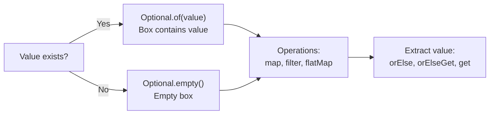

# Java Optional

> [!summary]
> Optional is a container that may or may not hold a value — it forces you to explicitly handle the "no value" case instead of risking NullPointerException. Think of it as a box that's either empty or contains exactly one item. It makes APIs clearer ("this method might not return a result") and enables functional-style chaining of operations that might fail.

## Quick Reference

| Method | Returns | Description |
|--------|---------|-------------|
| `Optional.of(value)` | Optional | Create with non-null value (throws if null) |
| `Optional.ofNullable(value)` | Optional | Create from possibly-null value |
| `Optional.empty()` | Optional | Create empty Optional |
| `isPresent()` | boolean | True if value exists |
| `isEmpty()` | boolean | True if no value (Java 11+) |
| `get()` | T | Get value (throws if empty!) |
| `orElse(default)` | T | Get value or return default |
| `orElseGet(Supplier)` | T | Get value or compute default lazily |
| `orElseThrow()` | T | Get value or throw NoSuchElementException |
| `orElseThrow(Supplier)` | T | Get value or throw custom exception |
| `ifPresent(Consumer)` | void | Execute action if value present |
| `ifPresentOrElse(Consumer, Runnable)` | void | Execute action or alternative (Java 9+) |
| `map(Function)` | Optional | Transform value if present |
| `flatMap(Function)` | Optional | Transform to Optional, flatten |
| `filter(Predicate)` | Optional | Keep value only if it matches |
| `or(Supplier<Optional>)` | Optional | Return this or alternative Optional (Java 9+) |
| `stream()` | Stream | Convert to 0-or-1 element stream (Java 9+) |

## Theory

### What Is Optional?

The billion-dollar mistake in programming is the null reference. In Java, any reference can be null, leading to NullPointerException (NPE) — the most common Java exception.

```java
// The problem: null can appear anywhere
public String getCity(User user) {
    return user.getAddress().getCity();  // NPE if user is null OR address is null!
}

// Defensive programming is verbose and error-prone
public String getCitySafe(User user) {
    if (user != null) {
        Address address = user.getAddress();
        if (address != null) {
            return address.getCity();
        }
    }
    return "Unknown";
}
```

**Optional** makes the possibility of "no value" explicit in the type system:

```java
// Clear contract: this might not return a value
public Optional<String> getCity(User user) {
    return Optional.ofNullable(user)
        .map(User::getAddress)
        .map(Address::getCity);
}

// Caller must handle the empty case
String city = getCity(user).orElse("Unknown");
```

### How It Works



Optional is a **wrapper** — it either contains a reference to an object or contains nothing. The key insight: it makes the "nothing" case impossible to ignore.

**Design philosophy:**
- **Return type** — Use Optional for methods that might not return a result
- **Not for fields** — Don't use Optional as class fields (use null internally)
- **Not for parameters** — Don't use Optional as method parameters (overloading is cleaner)
- **Not for collections** — Return empty collection instead of `Optional<List<T>>`

## Practical Examples

### Basic Usage — Creating and Extracting Values

```java
import java.util.Optional;

public class OptionalBasics {
    public static void main(String[] args) {
        // Creating Optionals
        Optional<String> withValue = Optional.of("Hello");      // Must be non-null
        Optional<String> maybeNull = Optional.ofNullable(null); // Safe with null
        Optional<String> empty = Optional.empty();               // Explicitly empty

        // Optional.of(null);  // Throws NullPointerException!

        // Checking presence
        System.out.println(withValue.isPresent());  // true
        System.out.println(empty.isPresent());      // false
        System.out.println(empty.isEmpty());        // true (Java 11+)

        // Getting values — the WRONG way
        // String value = empty.get();  // NoSuchElementException!

        // Getting values — the RIGHT ways
        String v1 = withValue.orElse("default");           // "Hello"
        String v2 = empty.orElse("default");               // "default"
        String v3 = empty.orElseGet(() -> "computed");     // "computed" (lazy)
        String v4 = withValue.orElseThrow();               // "Hello"
        // String v5 = empty.orElseThrow();                // NoSuchElementException

        // Custom exception
        String v6 = withValue.orElseThrow(
            () -> new IllegalStateException("Value required!")
        );

        // Conditional execution
        withValue.ifPresent(v -> System.out.println("Got: " + v));  // Prints
        empty.ifPresent(v -> System.out.println("Got: " + v));      // No output

        // ifPresentOrElse (Java 9+)
        empty.ifPresentOrElse(
            v -> System.out.println("Got: " + v),
            () -> System.out.println("No value!")  // Prints this
        );
    }
}
```

### Intermediate Example — Transforming with map and flatMap

Chaining operations on values that might not exist:

```java
import java.util.Optional;

record Address(String city, String street) {}
record User(String name, Address address) {}

public class OptionalTransform {
    public static void main(String[] args) {
        User userWithAddress = new User("Alice", new Address("NYC", "5th Ave"));
        User userNoAddress = new User("Bob", null);

        // map: Transform the value if present
        Optional<String> city1 = Optional.ofNullable(userWithAddress)
            .map(User::address)      // Optional<Address>
            .map(Address::city);     // Optional<String>
        System.out.println(city1);   // Optional[NYC]

        Optional<String> city2 = Optional.ofNullable(userNoAddress)
            .map(User::address)      // Optional.empty() — address is null
            .map(Address::city);     // Still empty — map skips empty
        System.out.println(city2);   // Optional.empty

        // Extracting with default
        String result = Optional.ofNullable(userNoAddress)
            .map(User::address)
            .map(Address::city)
            .orElse("Unknown");
        System.out.println(result);  // "Unknown"

        // filter: Keep value only if predicate matches
        Optional<String> longCity = Optional.of("New York City")
            .filter(c -> c.length() > 5);
        System.out.println(longCity);  // Optional[New York City]

        Optional<String> shortCity = Optional.of("NYC")
            .filter(c -> c.length() > 5);
        System.out.println(shortCity);  // Optional.empty

        // flatMap: When the function itself returns Optional
        // Avoids Optional<Optional<T>>
        Optional<Address> address = findUserById(1)
            .flatMap(OptionalTransform::findAddressForUser);
        System.out.println(address);
    }

    static Optional<User> findUserById(int id) {
        // Simulate DB lookup
        return id == 1
            ? Optional.of(new User("Alice", new Address("NYC", "5th Ave")))
            : Optional.empty();
    }

    static Optional<Address> findAddressForUser(User user) {
        return Optional.ofNullable(user.address());
    }
}
```

### Advanced Usage — Combining Optionals and Real-World Patterns

```java
import java.util.*;
import java.util.stream.*;

public class OptionalAdvanced {
    public static void main(String[] args) {

        // Pattern 1: Chaining fallbacks with or() (Java 9+)
        Optional<String> primary = Optional.empty();
        Optional<String> fallback = Optional.of("fallback");

        String result = primary
            .or(() -> fallback)           // Try fallback if primary empty
            .or(() -> Optional.of("last resort"))
            .orElse("default");
        System.out.println(result);  // "fallback"

        // Pattern 2: Stream of Optionals → values only
        List<Optional<String>> optionals = Arrays.asList(
            Optional.of("a"),
            Optional.empty(),
            Optional.of("b"),
            Optional.empty(),
            Optional.of("c")
        );

        // Java 8: filter + map
        List<String> values8 = optionals.stream()
            .filter(Optional::isPresent)
            .map(Optional::get)
            .collect(Collectors.toList());

        // Java 9+: flatMap with stream()
        List<String> values9 = optionals.stream()
            .flatMap(Optional::stream)  // Empty → 0 elements, Present → 1 element
            .collect(Collectors.toList());

        System.out.println(values9);  // [a, b, c]

        // Pattern 3: First non-empty from multiple sources
        Optional<String> fromCache = Optional.empty();
        Optional<String> fromDb = Optional.of("db-value");
        Optional<String> fromApi = Optional.of("api-value");

        String value = Stream.of(fromCache, fromDb, fromApi)
            .flatMap(Optional::stream)
            .findFirst()
            .orElse("not found");
        System.out.println(value);  // "db-value"

        // Pattern 4: Compute only if empty
        Map<String, String> cache = new HashMap<>();
        String cached = Optional.ofNullable(cache.get("key"))
            .orElseGet(() -> {
                String computed = expensiveComputation();
                cache.put("key", computed);
                return computed;
            });

        // Pattern 5: Validation chains
        Optional<String> validInput = Optional.of("  hello world  ")
            .map(String::trim)
            .filter(s -> !s.isEmpty())
            .filter(s -> s.length() >= 3)
            .map(String::toUpperCase);
        System.out.println(validInput);  // Optional[HELLO WORLD]

        Optional<String> invalidInput = Optional.of("  ")
            .map(String::trim)
            .filter(s -> !s.isEmpty());  // Fails here
        System.out.println(invalidInput);  // Optional.empty
    }

    static String expensiveComputation() {
        System.out.println("Computing...");
        return "computed-value";
    }
}
```

### Integration with Streams

```java
import java.util.*;
import java.util.stream.*;

record Product(String name, Double price) {}

public class OptionalWithStreams {
    public static void main(String[] args) {
        List<Product> products = Arrays.asList(
            new Product("Laptop", 999.99),
            new Product("Mouse", 29.99),
            new Product("Keyboard", null),  // Price unknown
            new Product("Monitor", 299.99)
        );

        // findFirst returns Optional
        Optional<Product> firstExpensive = products.stream()
            .filter(p -> p.price() != null && p.price() > 100)
            .findFirst();

        firstExpensive.ifPresent(p ->
            System.out.println("First expensive: " + p.name())
        );

        // max/min return Optional
        Optional<Product> cheapest = products.stream()
            .filter(p -> p.price() != null)
            .min(Comparator.comparing(Product::price));

        String cheapestName = cheapest
            .map(Product::name)
            .orElse("No products");
        System.out.println("Cheapest: " + cheapestName);

        // reduce returns Optional (when no identity provided)
        Optional<Double> totalPrice = products.stream()
            .map(Product::price)
            .filter(Objects::nonNull)
            .reduce(Double::sum);

        totalPrice.ifPresent(t -> System.out.println("Total: $" + t));
    }
}
```

## Common Patterns

> [!tip] Use orElseGet for Expensive Defaults
> ```java
> // ❌ Default is ALWAYS computed, even when not needed
> String value = optional.orElse(expensiveOperation());
>
> // ✅ Default computed only if optional is empty
> String value = optional.orElseGet(() -> expensiveOperation());
> ```

> [!tip] Chain Operations Instead of Nested Ifs
> ```java
> // ❌ Nested null checks
> if (user != null) {
>     Address addr = user.getAddress();
>     if (addr != null) {
>         String city = addr.getCity();
>         if (city != null) {
>             return city.toUpperCase();
>         }
>     }
> }
> return "UNKNOWN";
>
> // ✅ Fluent Optional chain
> return Optional.ofNullable(user)
>     .map(User::getAddress)
>     .map(Address::getCity)
>     .map(String::toUpperCase)
>     .orElse("UNKNOWN");
> ```

> [!tip] Return Optional from Methods That Might Fail
> ```java
> // ✅ Clear contract — caller knows to handle empty case
> public Optional<User> findById(Long id) {
>     return Optional.ofNullable(userMap.get(id));
> }
>
> // Usage is explicit
> findById(123)
>     .ifPresentOrElse(
>         user -> process(user),
>         () -> handleNotFound()
>     );
> ```

> [!warning] Never Use Optional.get() Without Checking
> ```java
> // ❌ Defeats the purpose — just as bad as null!
> String value = optional.get();  // NoSuchElementException if empty
>
> // ✅ Safe alternatives
> String value = optional.orElse("default");
> String value = optional.orElseThrow(() -> new NotFoundException());
> optional.ifPresent(v -> process(v));
> ```

> [!warning] Don't Use Optional for Fields or Parameters
> ```java
> // ❌ Bad: Optional as field
> class User {
>     private Optional<Address> address;  // Wrong!
> }
>
> // ✅ Good: Nullable field, Optional getter
> class User {
>     private Address address;  // Can be null
>
>     public Optional<Address> getAddress() {
>         return Optional.ofNullable(address);
>     }
> }
>
> // ❌ Bad: Optional as parameter
> void process(Optional<String> name) { }  // Wrong!
>
> // ✅ Good: Overload or use @Nullable
> void process(String name) { }
> void process() { process(null); }
> ```

> [!warning] Return Empty Collections, Not Optional<Collection>
> ```java
> // ❌ Unnecessary wrapping
> Optional<List<User>> findUsers() { }
>
> // ✅ Empty list is the "no results" case
> List<User> findUsers() {
>     return results.isEmpty() ? Collections.emptyList() : results;
> }
> ```

## Edge Cases & Gotchas

- **Optional is not Serializable** — Don't use it in classes that need to be serialized (DTOs, entities). Use nullable fields internally.

- **equals and hashCode work correctly** — `Optional.of("a").equals(Optional.of("a"))` is true. Empty optionals are equal.

- **Optional of Optional is a code smell** — If you have `Optional<Optional<T>>`, use `flatMap` instead of `map`.

- **Primitive optionals exist** — `OptionalInt`, `OptionalLong`, `OptionalDouble` avoid boxing overhead but have different API (no `map`, `filter`).

- **Stream integration (Java 9+)** — `optional.stream()` returns 0-or-1 element stream, perfect for `flatMap` in streams.

- **or() is lazy (Java 9+)** — The supplier in `or(Supplier)` is only called if the optional is empty.

## Related Topics

- [[Streams-API]] — Many stream operations return Optional
- [[Functional-Interfaces-and-Lambdas]] — map, flatMap, filter take functional interfaces
- [[Null-Safety]] — Broader null handling strategies *(coming soon)*
- [[Annotations]] — `@Nullable`, `@NonNull` annotations complement Optional

## References

- [Java 8 Optional Documentation](https://docs.oracle.com/javase/8/docs/api/java/util/Optional.html)
- [Oracle: Tired of Null Pointer Exceptions?](https://www.oracle.com/technical-resources/articles/java/java8-optional.html)
- [Effective Java, 3rd Ed.](https://www.oreilly.com/library/view/effective-java/9780134686097/) — Item 55: Return optionals judiciously
