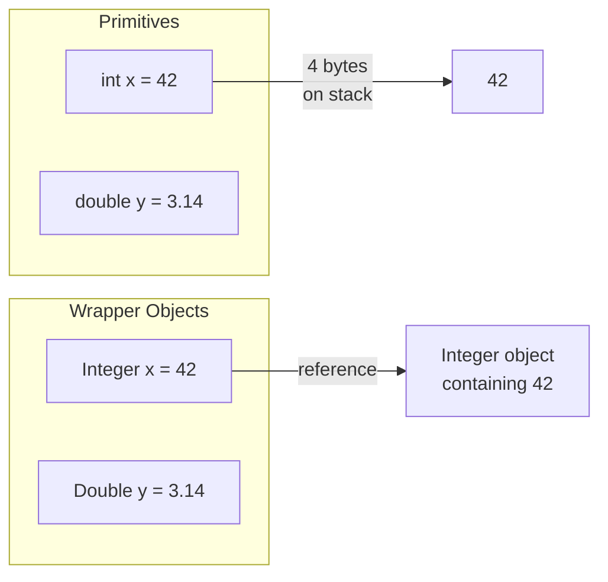

# Primitives and Wrapper Classes

> [!summary]
> Java has **8 primitive types** — simple values stored directly in memory (not objects). Each has a corresponding **wrapper class** (`int` → `Integer`) that wraps the value in an object, enabling use in collections and providing utility methods. Java automatically converts between them (**autoboxing/unboxing**), but understanding when this happens prevents subtle bugs.

## Quick Reference

| Primitive | Size | Default | Range | Wrapper |
|-----------|------|---------|-------|---------|
| `byte` | 8 bits | 0 | -128 to 127 | `Byte` |
| `short` | 16 bits | 0 | -32,768 to 32,767 | `Short` |
| `int` | 32 bits | 0 | -2.1B to 2.1B | `Integer` |
| `long` | 64 bits | 0L | ±9.2 quintillion | `Long` |
| `float` | 32 bits | 0.0f | ±3.4×10³⁸ | `Float` |
| `double` | 64 bits | 0.0d | ±1.7×10³⁰⁸ | `Double` |
| `char` | 16 bits | '\u0000' | 0 to 65,535 | `Character` |
| `boolean` | 1 bit* | false | true/false | `Boolean` |

*JVM implementation dependent

## Theory

### Primitives vs Objects



| Primitives | Objects (Wrappers) |
|------------|-------------------|
| Stored directly on stack | Stored on heap (reference on stack) |
| Cannot be null | Can be null |
| No methods | Have utility methods |
| Can't use in generics | Required for generics/collections |
| More memory efficient | More memory overhead |
| Faster access | Slightly slower (indirection) |

### Autoboxing and Unboxing

Java automatically converts between primitives and wrappers:

```java
// Autoboxing: primitive → wrapper
Integer num = 42;  // Compiler converts to: Integer.valueOf(42)

// Unboxing: wrapper → primitive
int x = num;       // Compiler converts to: num.intValue()

// Works in expressions too
Integer sum = num + 10;  // Unbox, add, autobox result
```

## Practical Examples

### Primitive Declarations and Literals

```java
public class PrimitiveLiterals {
    public static void main(String[] args) {
        // Integer types
        byte b = 127;           // Max byte value
        short s = 32000;
        int i = 2_000_000;      // Underscores for readability (Java 7+)
        long l = 9_000_000_000L;  // L suffix required for long literals

        // Different bases
        int decimal = 255;
        int hex = 0xFF;         // Hexadecimal
        int binary = 0b11111111; // Binary (Java 7+)
        int octal = 0377;       // Octal (rarely used)

        // Floating point
        float f = 3.14f;        // f suffix required
        double d = 3.14159;     // Default for decimals
        double scientific = 1.5e10;  // 1.5 × 10¹⁰

        // Character
        char c1 = 'A';
        char c2 = 65;           // Also 'A' (Unicode code point)
        char c3 = '\u0041';     // Also 'A' (Unicode escape)

        // Boolean
        boolean flag = true;
        boolean check = 10 > 5; // Expressions evaluate to boolean
    }
}
```

### Wrapper Class Methods

```java
public class WrapperMethods {
    public static void main(String[] args) {
        // Parsing strings
        int i = Integer.parseInt("42");
        double d = Double.parseDouble("3.14");
        boolean b = Boolean.parseBoolean("true");

        // Invalid parsing throws NumberFormatException
        // int bad = Integer.parseInt("hello");

        // Converting to strings
        String s1 = Integer.toString(42);      // "42"
        String s2 = Integer.toString(255, 16); // "ff" (hex)
        String s3 = Integer.toBinaryString(10); // "1010"

        // Min/max values
        int maxInt = Integer.MAX_VALUE;    // 2,147,483,647
        int minInt = Integer.MIN_VALUE;    // -2,147,483,648
        double posInf = Double.POSITIVE_INFINITY;
        double nan = Double.NaN;

        // Comparison
        int cmp = Integer.compare(5, 10);  // -1 (5 < 10)
        int max = Integer.max(5, 10);      // 10
        int min = Integer.min(5, 10);      // 5

        // Bit operations (Integer/Long)
        int bits = Integer.bitCount(0b1010101);  // 4 (count 1s)
        int leading = Integer.numberOfLeadingZeros(8);
        int trailing = Integer.numberOfTrailingZeros(8);

        // Unsigned operations (Java 8+)
        int unsigned = Integer.parseUnsignedInt("4294967295");
        String unsignedStr = Integer.toUnsignedString(-1);  // "4294967295"
    }
}
```

### Autoboxing in Action

```java
import java.util.*;

public class AutoboxingExamples {
    public static void main(String[] args) {
        // Collections require objects, not primitives
        List<Integer> numbers = new ArrayList<>();

        // Autoboxing: int → Integer
        numbers.add(1);
        numbers.add(2);
        numbers.add(3);
        // Actually: numbers.add(Integer.valueOf(1));

        // Unboxing: Integer → int
        int first = numbers.get(0);  // Automatically unboxes
        // Actually: numbers.get(0).intValue();

        // Mixed expressions
        Integer a = 10;
        int b = 20;
        Integer sum = a + b;  // Unbox a, add, autobox result

        // Method calls
        printNumber(42);       // Autoboxed to Integer

        // Maps
        Map<String, Integer> scores = new HashMap<>();
        scores.put("Alice", 95);  // int 95 autoboxed
        int aliceScore = scores.get("Alice");  // Unboxed
    }

    static void printNumber(Integer num) {
        System.out.println(num);
    }
}
```

### The Integer Cache Gotcha

```java
public class IntegerCacheDemo {
    public static void main(String[] args) {
        // Java caches Integer values from -128 to 127
        Integer a = 100;
        Integer b = 100;
        System.out.println(a == b);  // true! Same cached object

        Integer c = 200;
        Integer d = 200;
        System.out.println(c == d);  // false! Different objects

        // ALWAYS use .equals() for wrapper comparison!
        System.out.println(c.equals(d));  // true

        // Same applies to: Byte, Short, Long (all -128 to 127)
        // Character caches 0 to 127

        // Using valueOf() uses the cache
        Integer e = Integer.valueOf(100);  // Cached
        Integer f = new Integer(100);      // Always new (deprecated)
    }
}
```

### Null Handling

```java
public class NullWrappers {
    public static void main(String[] args) {
        Integer maybeNull = null;

        // ❌ NullPointerException when unboxing null!
        // int value = maybeNull;  // NPE!
        // int sum = maybeNull + 5;  // NPE!

        // ✅ Check for null first
        if (maybeNull != null) {
            int value = maybeNull;
        }

        // ✅ Provide default
        int value = (maybeNull != null) ? maybeNull : 0;

        // ✅ Java 9+ Optional-like methods
        int value2 = Objects.requireNonNullElse(maybeNull, 0);

        // ✅ Use primitives when null doesn't make sense
        // ❌ Integer count; (can be null — is that valid?)
        // ✅ int count;    (always has a value)

        // Common NPE scenario: Map.get returns null
        Map<String, Integer> scores = new HashMap<>();
        // int score = scores.get("Unknown");  // NPE! get returns null

        // Safe ways:
        Integer score = scores.get("Unknown");
        int scoreOrZero = scores.getOrDefault("Unknown", 0);
    }
}
```

### Type Conversion (Casting)

```java
public class TypeConversion {
    public static void main(String[] args) {
        // Widening (automatic) — no data loss
        int i = 100;
        long l = i;      // int → long
        float f = l;     // long → float
        double d = f;    // float → double

        // Narrowing (manual cast) — potential data loss
        double big = 3.99;
        int small = (int) big;  // 3 (truncated, not rounded!)

        long huge = 10_000_000_000L;
        int overflow = (int) huge;  // Overflow! Wrong value

        // Safe narrowing with range check
        if (huge >= Integer.MIN_VALUE && huge <= Integer.MAX_VALUE) {
            int safe = (int) huge;
        }

        // Math.toIntExact throws on overflow (Java 8+)
        // int exact = Math.toIntExact(huge);  // ArithmeticException

        // Between integer types
        int x = 200;
        byte b = (byte) x;  // -56 (overflow wraps around)

        // char is unsigned, so special handling
        char c = 65000;
        int fromChar = c;    // 65000 (widening, keeps value)
        short s = (short) c; // -536 (reinterpreted as signed)
    }
}
```

### Precision Pitfalls with Floating Point

```java
public class FloatingPointPitfalls {
    public static void main(String[] args) {
        // Floating point is NOT exact
        double sum = 0.1 + 0.2;
        System.out.println(sum);          // 0.30000000000000004
        System.out.println(sum == 0.3);   // false!

        // Compare with tolerance
        double epsilon = 0.00001;
        System.out.println(Math.abs(sum - 0.3) < epsilon);  // true

        // For money, use BigDecimal!
        BigDecimal price = new BigDecimal("19.99");
        BigDecimal tax = new BigDecimal("0.08");
        BigDecimal total = price.multiply(tax.add(BigDecimal.ONE));
        // Exact: 21.5892

        // Special values
        double inf = 1.0 / 0.0;           // Infinity
        double negInf = -1.0 / 0.0;       // -Infinity
        double nan = 0.0 / 0.0;           // NaN

        System.out.println(nan == nan);   // false! NaN != NaN
        System.out.println(Double.isNaN(nan));  // true (correct way)
        System.out.println(Double.isInfinite(inf));  // true
    }
}
```

## Common Patterns

> [!tip] Prefer Primitives When Possible
> ```java
> // ❌ Unnecessary boxing overhead
> Integer count = 0;
> for (...) {
>     count++;  // Unbox, increment, autobox — every iteration!
> }
>
> // ✅ Use primitive
> int count = 0;
> for (...) {
>     count++;  // Simple increment
> }
> ```

> [!tip] Use Wrappers for Nullable Semantics
> ```java
> // When null has meaning:
> public Integer findUserId(String name) {
>     // Return null if not found
>     return userMap.get(name);
> }
>
> // Or better, use Optional:
> public Optional<Integer> findUserId(String name) {
>     return Optional.ofNullable(userMap.get(name));
> }
> ```

> [!tip] Use valueOf(), Not Constructors
> ```java
> // ❌ Always creates new object (deprecated)
> Integer a = new Integer(100);
>
> // ✅ Uses cache when possible
> Integer b = Integer.valueOf(100);
>
> // ✅ Even simpler — autoboxing
> Integer c = 100;
> ```

> [!warning] Watch for Unboxing NPE
> ```java
> // ❌ Hidden NPE
> Integer value = getValueThatMightBeNull();
> int x = value;  // NPE if null!
>
> // ✅ Handle null explicitly
> int x = (value != null) ? value : defaultValue;
> ```

> [!warning] Don't Compare Wrappers with ==
> ```java
> Integer a = 1000;
> Integer b = 1000;
> System.out.println(a == b);  // false! (outside cache)
>
> // ✅ Always use .equals()
> System.out.println(a.equals(b));  // true
>
> // Or unbox first
> System.out.println(a.intValue() == b.intValue());  // true
> ```

## Edge Cases & Gotchas

- **Integer cache range** — Only -128 to 127 are cached by default. Can be extended with `-XX:AutoBoxCacheMax=<size>` JVM flag.

- **Boolean cache** — `Boolean.TRUE` and `Boolean.FALSE` are always cached (only 2 values possible).

- **Float/Double have no cache** — Every autobox creates a new object.

- **Ternary type coercion** — Can cause surprise unboxing:
  ```java
  Integer a = null;
  int b = 5;
  int result = (condition) ? a : b;  // NPE if condition true and a is null!
  ```

- **Overflow silently wraps** — No exception by default:
  ```java
  int max = Integer.MAX_VALUE;
  int overflow = max + 1;  // -2147483648 (wraps to MIN_VALUE)

  // Use Math.xxxExact for overflow detection (Java 8+)
  Math.addExact(max, 1);  // ArithmeticException
  ```

- **Division by zero** — Integers throw `ArithmeticException`; floats return `Infinity` or `NaN`.

## Related Topics

- [[Strings]] — String to primitive conversion
- [[Collections-Framework]] — Wrappers required for collections
- [[Generics]] — Why generics require objects, not primitives
- [[Operators]] — Arithmetic, comparison, bitwise *(coming soon)*

## References

- [Oracle Tutorial: Primitive Data Types](https://docs.oracle.com/javase/tutorial/java/nutsandbolts/datatypes.html)
- [Oracle Tutorial: Autoboxing](https://docs.oracle.com/javase/tutorial/java/data/autoboxing.html)
- [Effective Java, Item 61](https://www.oreilly.com/library/view/effective-java/9780134686097/) — Prefer primitive types to boxed primitives
