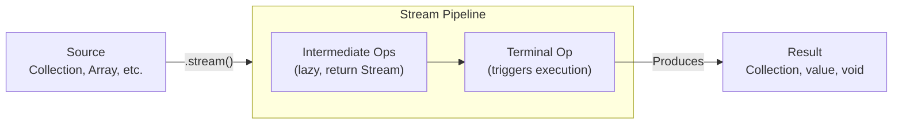

# Java Streams API

> [!summary]
> Streams are pipelines for processing sequences of elements — they let you transform, filter, and aggregate data declaratively. Instead of writing loops that describe *how* to process data step-by-step, you describe *what* transformations you want, and the Stream handles the iteration. This leads to cleaner, more readable code and enables easy parallelization for performance.

## Quick Reference

| Operation | Type | Returns | Example |
|-----------|------|---------|---------|
| `filter(Predicate)` | Intermediate | Stream | `stream.filter(x -> x > 5)` |
| `map(Function)` | Intermediate | Stream | `stream.map(String::toUpperCase)` |
| `flatMap(Function)` | Intermediate | Stream | `stream.flatMap(list -> list.stream())` |
| `distinct()` | Intermediate | Stream | `stream.distinct()` |
| `sorted()` | Intermediate | Stream | `stream.sorted()` |
| `limit(n)` | Intermediate | Stream | `stream.limit(10)` |
| `skip(n)` | Intermediate | Stream | `stream.skip(5)` |
| `peek(Consumer)` | Intermediate | Stream | `stream.peek(System.out::println)` |
| `collect(Collector)` | Terminal | Result | `stream.collect(Collectors.toList())` |
| `forEach(Consumer)` | Terminal | void | `stream.forEach(System.out::println)` |
| `reduce(BinaryOperator)` | Terminal | Optional | `stream.reduce((a,b) -> a + b)` |
| `count()` | Terminal | long | `stream.count()` |
| `anyMatch(Predicate)` | Terminal | boolean | `stream.anyMatch(x -> x > 10)` |
| `allMatch(Predicate)` | Terminal | boolean | `stream.allMatch(x -> x > 0)` |
| `noneMatch(Predicate)` | Terminal | boolean | `stream.noneMatch(x -> x < 0)` |
| `findFirst()` | Terminal | Optional | `stream.findFirst()` |
| `findAny()` | Terminal | Optional | `stream.findAny()` |
| `min(Comparator)` | Terminal | Optional | `stream.min(Comparator.naturalOrder())` |
| `max(Comparator)` | Terminal | Optional | `stream.max(Comparator.naturalOrder())` |

## Theory

### What Are Streams?

A **Stream** is a sequence of elements that supports aggregate operations. Think of it as a pipeline:

```
Source → [Filter] → [Map] → [Sort] → Collect → Result
```

**Streams are NOT:**
- Collections — They don't store data
- Data structures — They're views over data
- Modifying the source — They produce new streams

**Streams ARE:**
- Lazy — Intermediate operations don't run until a terminal operation is called
- Single-use — A stream can only be consumed once
- Potentially infinite — Streams can represent unbounded data (e.g., random numbers)
- Parallelizable — Switch to parallel execution with `.parallel()`

### Imperative vs Declarative

```java
// IMPERATIVE: You tell the computer HOW to do it
List<String> result = new ArrayList<>();
for (Person person : people) {
    if (person.getAge() >= 18) {
        String name = person.getName().toUpperCase();
        result.add(name);
    }
}
Collections.sort(result);

// DECLARATIVE: You tell the computer WHAT you want
List<String> result = people.stream()
    .filter(p -> p.getAge() >= 18)
    .map(p -> p.getName().toUpperCase())
    .sorted()
    .collect(Collectors.toList());
```

The declarative version reads like a description: "filter adults, get uppercase names, sort them, collect to list."

### How It Works



**Key concepts:**

1. **Source** — Where data comes from (Collection, array, I/O, generator)
2. **Intermediate operations** — Transform the stream (filter, map, sort). They're **lazy** — nothing happens until terminal op.
3. **Terminal operation** — Triggers computation and produces a result (collect, forEach, reduce). Stream is consumed.

## Practical Examples

### Basic Usage — Filter, Map, Collect

The bread and butter of stream processing:

```java
import java.util.*;
import java.util.stream.*;

public class StreamBasics {
    public static void main(String[] args) {
        List<String> names = Arrays.asList("Alice", "Bob", "Charlie", "Diana", "Eve");

        // Filter: Keep elements matching a predicate
        List<String> longNames = names.stream()
            .filter(name -> name.length() > 3)
            .collect(Collectors.toList());
        System.out.println(longNames);  // [Alice, Charlie, Diana]

        // Map: Transform each element
        List<Integer> nameLengths = names.stream()
            .map(String::length)
            .collect(Collectors.toList());
        System.out.println(nameLengths);  // [5, 3, 7, 5, 3]

        // Chain operations: filter → map → collect
        List<String> upperLongNames = names.stream()
            .filter(name -> name.length() > 3)
            .map(String::toUpperCase)
            .collect(Collectors.toList());
        System.out.println(upperLongNames);  // [ALICE, CHARLIE, DIANA]

        // Sorting
        List<String> sorted = names.stream()
            .sorted()  // Natural order
            .collect(Collectors.toList());
        System.out.println(sorted);  // [Alice, Bob, Charlie, Diana, Eve]

        List<String> sortedByLength = names.stream()
            .sorted(Comparator.comparingInt(String::length))
            .collect(Collectors.toList());
        System.out.println(sortedByLength);  // [Bob, Eve, Alice, Diana, Charlie]

        // Distinct: Remove duplicates
        List<Integer> numbers = Arrays.asList(1, 2, 2, 3, 3, 3, 4);
        List<Integer> unique = numbers.stream()
            .distinct()
            .collect(Collectors.toList());
        System.out.println(unique);  // [1, 2, 3, 4]

        // Limit and Skip: Pagination
        List<String> firstTwo = names.stream()
            .limit(2)
            .collect(Collectors.toList());
        System.out.println(firstTwo);  // [Alice, Bob]

        List<String> skipTwo = names.stream()
            .skip(2)
            .collect(Collectors.toList());
        System.out.println(skipTwo);  // [Charlie, Diana, Eve]
    }
}
```

### Intermediate Example — Reduce and Aggregation

Combining elements into a single result:

```java
import java.util.*;
import java.util.stream.*;

public class StreamReduce {
    public static void main(String[] args) {
        List<Integer> numbers = Arrays.asList(1, 2, 3, 4, 5);

        // Sum with reduce
        int sum = numbers.stream()
            .reduce(0, (a, b) -> a + b);
        System.out.println("Sum: " + sum);  // 15

        // Cleaner: use method reference or specialized stream
        int sum2 = numbers.stream().reduce(0, Integer::sum);
        int sum3 = numbers.stream().mapToInt(Integer::intValue).sum();

        // Product
        int product = numbers.stream()
            .reduce(1, (a, b) -> a * b);
        System.out.println("Product: " + product);  // 120

        // Max/Min (returns Optional because stream might be empty)
        Optional<Integer> max = numbers.stream().max(Integer::compareTo);
        Optional<Integer> min = numbers.stream().min(Integer::compareTo);
        System.out.println("Max: " + max.orElse(-1));  // 5
        System.out.println("Min: " + min.orElse(-1));  // 1

        // Count
        long count = numbers.stream()
            .filter(n -> n > 2)
            .count();
        System.out.println("Count > 2: " + count);  // 3

        // Matching operations
        boolean anyEven = numbers.stream().anyMatch(n -> n % 2 == 0);
        boolean allPositive = numbers.stream().allMatch(n -> n > 0);
        boolean noneNegative = numbers.stream().noneMatch(n -> n < 0);
        System.out.println("Any even? " + anyEven);        // true
        System.out.println("All positive? " + allPositive); // true
        System.out.println("None negative? " + noneNegative); // true

        // Finding elements
        Optional<Integer> first = numbers.stream()
            .filter(n -> n > 3)
            .findFirst();
        System.out.println("First > 3: " + first.orElse(-1));  // 4

        // Average, sum, statistics with primitive streams
        IntSummaryStatistics stats = numbers.stream()
            .mapToInt(Integer::intValue)
            .summaryStatistics();
        System.out.println("Stats: " + stats);
        // IntSummaryStatistics{count=5, sum=15, min=1, average=3.0, max=5}
    }
}
```

### Advanced Usage — Collectors and Grouping

Powerful aggregation operations:

```java
import java.util.*;
import java.util.stream.*;
import static java.util.stream.Collectors.*;

record Person(String name, int age, String department) {}

public class StreamCollectors {
    public static void main(String[] args) {
        List<Person> people = Arrays.asList(
            new Person("Alice", 30, "Engineering"),
            new Person("Bob", 25, "Engineering"),
            new Person("Charlie", 35, "Marketing"),
            new Person("Diana", 28, "Marketing"),
            new Person("Eve", 32, "Engineering")
        );

        // Collect to different types
        List<String> nameList = people.stream()
            .map(Person::name)
            .collect(toList());

        Set<String> nameSet = people.stream()
            .map(Person::name)
            .collect(toSet());

        // Joining strings
        String allNames = people.stream()
            .map(Person::name)
            .collect(joining(", "));
        System.out.println(allNames);  // Alice, Bob, Charlie, Diana, Eve

        String formatted = people.stream()
            .map(Person::name)
            .collect(joining(", ", "[", "]"));
        System.out.println(formatted);  // [Alice, Bob, Charlie, Diana, Eve]

        // Grouping by a classifier
        Map<String, List<Person>> byDept = people.stream()
            .collect(groupingBy(Person::department));
        System.out.println(byDept);
        // {Engineering=[Alice, Bob, Eve], Marketing=[Charlie, Diana]}

        // Grouping with downstream collector
        Map<String, Long> countByDept = people.stream()
            .collect(groupingBy(Person::department, counting()));
        System.out.println(countByDept);  // {Engineering=3, Marketing=2}

        Map<String, Double> avgAgeByDept = people.stream()
            .collect(groupingBy(Person::department,
                               averagingInt(Person::age)));
        System.out.println(avgAgeByDept);  // {Engineering=29.0, Marketing=31.5}

        Map<String, List<String>> namesByDept = people.stream()
            .collect(groupingBy(Person::department,
                               mapping(Person::name, toList())));
        System.out.println(namesByDept);
        // {Engineering=[Alice, Bob, Eve], Marketing=[Charlie, Diana]}

        // Partitioning (special case: group by boolean)
        Map<Boolean, List<Person>> adults = people.stream()
            .collect(partitioningBy(p -> p.age() >= 30));
        System.out.println("30+: " + adults.get(true));   // [Alice, Charlie, Eve]
        System.out.println("<30: " + adults.get(false));  // [Bob, Diana]

        // Collecting to Map
        Map<String, Integer> nameToAge = people.stream()
            .collect(toMap(Person::name, Person::age));
        System.out.println(nameToAge);  // {Alice=30, Bob=25, ...}

        // Handle duplicate keys with merge function
        Map<String, Integer> deptHeadcount = people.stream()
            .collect(toMap(
                Person::department,
                p -> 1,
                Integer::sum  // Merge function for duplicates
            ));
        System.out.println(deptHeadcount);  // {Engineering=3, Marketing=2}

        // Teeing: Two collectors at once (Java 12+)
        // var result = people.stream()
        //     .collect(teeing(
        //         averagingInt(Person::age),
        //         counting(),
        //         (avg, count) -> "Avg age: " + avg + ", Count: " + count
        //     ));
    }
}
```

### FlatMap — Flattening Nested Structures

When each element maps to multiple elements:

```java
import java.util.*;
import java.util.stream.*;

public class StreamFlatMap {
    public static void main(String[] args) {
        // Problem: List of lists → single flat list
        List<List<Integer>> nested = Arrays.asList(
            Arrays.asList(1, 2, 3),
            Arrays.asList(4, 5),
            Arrays.asList(6, 7, 8, 9)
        );

        // map gives Stream<List<Integer>> — not what we want
        // flatMap flattens to Stream<Integer>
        List<Integer> flat = nested.stream()
            .flatMap(List::stream)  // Each list becomes a stream, then flattened
            .collect(Collectors.toList());
        System.out.println(flat);  // [1, 2, 3, 4, 5, 6, 7, 8, 9]

        // Real-world example: Get all words from sentences
        List<String> sentences = Arrays.asList(
            "Hello world",
            "Java streams are powerful",
            "FlatMap is useful"
        );

        List<String> words = sentences.stream()
            .flatMap(sentence -> Arrays.stream(sentence.split(" ")))
            .collect(Collectors.toList());
        System.out.println(words);
        // [Hello, world, Java, streams, are, powerful, FlatMap, is, useful]

        // Unique words, lowercased, sorted
        List<String> uniqueWords = sentences.stream()
            .flatMap(s -> Arrays.stream(s.split(" ")))
            .map(String::toLowerCase)
            .distinct()
            .sorted()
            .collect(Collectors.toList());
        System.out.println(uniqueWords);
        // [are, flatmap, hello, is, java, powerful, streams, useful, world]

        // Optional flatMap — chain operations that might fail
        Optional<String> name = Optional.of("Alice");
        Optional<Integer> length = name
            .flatMap(n -> n.isEmpty() ? Optional.empty() : Optional.of(n.length()));
        System.out.println(length);  // Optional[5]
    }
}
```

### Creating Streams

Various ways to create streams:

```java
import java.util.*;
import java.util.stream.*;
import java.io.*;
import java.nio.file.*;

public class StreamCreation {
    public static void main(String[] args) throws IOException {
        // From Collection
        List<String> list = Arrays.asList("a", "b", "c");
        Stream<String> fromList = list.stream();

        // From Array
        String[] array = {"a", "b", "c"};
        Stream<String> fromArray = Arrays.stream(array);

        // From values directly
        Stream<String> fromValues = Stream.of("a", "b", "c");

        // Empty stream
        Stream<String> empty = Stream.empty();

        // Infinite streams — must use limit()!
        Stream<Double> randoms = Stream.generate(Math::random).limit(5);
        randoms.forEach(System.out::println);  // 5 random numbers

        Stream<Integer> counting = Stream.iterate(0, n -> n + 1).limit(10);
        counting.forEach(System.out::print);  // 0123456789

        // Iterate with predicate (Java 9+)
        Stream<Integer> bounded = Stream.iterate(0, n -> n < 10, n -> n + 1);

        // IntStream, LongStream, DoubleStream — primitive specializations
        IntStream ints = IntStream.range(1, 5);       // 1, 2, 3, 4
        IntStream intsInc = IntStream.rangeClosed(1, 5);  // 1, 2, 3, 4, 5

        // From String characters
        IntStream chars = "Hello".chars();  // IntStream of char codes

        // From file lines
        // try (Stream<String> lines = Files.lines(Path.of("file.txt"))) {
        //     lines.filter(line -> !line.isEmpty())
        //          .forEach(System.out::println);
        // }

        // Builder pattern
        Stream<String> built = Stream.<String>builder()
            .add("a")
            .add("b")
            .add("c")
            .build();

        // Concatenate streams
        Stream<String> combined = Stream.concat(
            Stream.of("a", "b"),
            Stream.of("c", "d")
        );
    }
}
```

### Parallel Streams

Easy parallelization for performance:

```java
import java.util.*;
import java.util.stream.*;

public class ParallelStreams {
    public static void main(String[] args) {
        List<Integer> numbers = IntStream.rangeClosed(1, 1_000_000)
            .boxed()
            .collect(Collectors.toList());

        // Sequential
        long start = System.currentTimeMillis();
        long sumSeq = numbers.stream()
            .map(n -> n * 2)
            .reduce(0L, Long::sum);
        System.out.println("Sequential: " + (System.currentTimeMillis() - start) + "ms");

        // Parallel — just add .parallel()
        start = System.currentTimeMillis();
        long sumPar = numbers.parallelStream()  // or .stream().parallel()
            .map(n -> n * 2)
            .reduce(0L, Long::sum);
        System.out.println("Parallel: " + (System.currentTimeMillis() - start) + "ms");

        // Results are the same
        System.out.println(sumSeq == sumPar);  // true
    }
}
```

## Common Patterns

> [!tip] Use Primitive Streams for Numbers
> Avoid boxing overhead with `IntStream`, `LongStream`, `DoubleStream`:
> ```java
> // ❌ Boxes every int to Integer
> int sum = numbers.stream().reduce(0, Integer::sum);
>
> // ✅ Uses primitive int throughout
> int sum = numbers.stream().mapToInt(Integer::intValue).sum();
>
> // ✅ Or start with IntStream
> int sum = IntStream.rangeClosed(1, 100).sum();
> ```

> [!tip] Prefer Method References for Readability
> ```java
> // ✅ Clear intent
> .map(Person::getName)
> .filter(Objects::nonNull)
> .forEach(System.out::println)
>
> // ❌ Verbose, no added clarity
> .map(p -> p.getName())
> .filter(n -> n != null)
> .forEach(n -> System.out.println(n))
> ```

> [!tip] Check for Empty Collections First
> ```java
> // ✅ Avoid stream overhead for common case
> if (list.isEmpty()) {
>     return Collections.emptyList();
> }
> return list.stream()
>     .filter(predicate)
>     .collect(toList());
> ```

> [!warning] Streams Are Single-Use
> ```java
> Stream<String> stream = names.stream();
> stream.forEach(System.out::println);  // OK
> stream.forEach(System.out::println);  // IllegalStateException!
>
> // Create a new stream each time
> names.stream().forEach(...);  // OK
> names.stream().forEach(...);  // OK
> ```

> [!warning] Don't Use Parallel Streams Blindly
> Parallel isn't always faster:
> - **Good for:** Large datasets, CPU-intensive operations, independent operations
> - **Bad for:** Small datasets (overhead > gain), I/O operations, shared mutable state
> - **Dangerous with:** `forEach` modifying shared state, `findFirst` (use `findAny`)
>
> Benchmark before assuming parallel is faster!

> [!warning] Avoid Side Effects
> ```java
> // ❌ Dangerous: Modifying external state
> List<String> results = new ArrayList<>();
> stream.forEach(item -> results.add(item));  // Not thread-safe!
>
> // ✅ Safe: Use collect
> List<String> results = stream.collect(toList());
> ```

## Edge Cases & Gotchas

- **Lazy evaluation surprises** — If no terminal operation is called, intermediate operations never execute. `stream.filter(x -> { print("hi"); return true; })` prints nothing without a terminal op.

- **Stream has already been operated upon** — Streams can't be reused. Store the source (list/array), not the stream.

- **NullPointerException in streams** — Streams don't handle null elements well. Filter them out: `.filter(Objects::nonNull)`.

- **Ordering in parallel streams** — `forEach` doesn't preserve order in parallel; use `forEachOrdered` if order matters (but loses some parallelism benefits).

- **Short-circuiting** — `findFirst`, `anyMatch`, `limit` can stop early. In parallel streams, this is non-deterministic.

- **Infinite streams** — Always use `limit()` with `generate()` or `iterate()` to prevent infinite loops.

- **Collector accumulator must be associative** — For parallel streams to work correctly, the combining function must be associative: `(a+b)+c == a+(b+c)`.

## Related Topics

- [[Functional-Interfaces-and-Lambdas]] — Streams use lambdas extensively
- [[Optional]] — Many stream operations return Optional
- [[Generics]] — Stream<T>, Collector<T,A,R> use generics heavily
- [[Collections-Framework]] — Streams are views over collections

## References

- [Oracle Tutorial: Streams](https://docs.oracle.com/javase/tutorial/collections/streams/)
- [java.util.stream Package](https://docs.oracle.com/javase/8/docs/api/java/util/stream/package-summary.html)
- [Collectors Documentation](https://docs.oracle.com/javase/8/docs/api/java/util/stream/Collectors.html)
- [Java 8 in Action](https://www.manning.com/books/java-8-in-action) — Chapters 4-6 deep dive on streams
