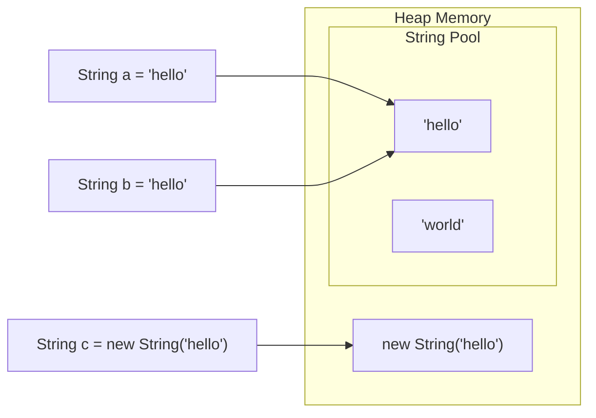

# Java Strings

> [!summary]
> Strings are sequences of characters — the most commonly used data type in Java. Unlike most objects, `String` is **immutable**: once created, it cannot be changed. Every "modification" creates a new String. This design makes strings thread-safe and enables optimization (string pooling), but means you should use `StringBuilder` for heavy concatenation.

## Quick Reference

| Operation | Method | Example |
|-----------|--------|---------|
| Length | `length()` | `"hello".length()` → 5 |
| Get char | `charAt(i)` | `"hello".charAt(1)` → 'e' |
| Substring | `substring(start, end)` | `"hello".substring(1,4)` → "ell" |
| Find | `indexOf(str)` | `"hello".indexOf("ll")` → 2 |
| Contains | `contains(str)` | `"hello".contains("ell")` → true |
| Replace | `replace(old, new)` | `"hello".replace("l","L")` → "heLLo" |
| Split | `split(regex)` | `"a,b,c".split(",")` → ["a","b","c"] |
| Join | `String.join(delim, parts)` | `String.join("-", list)` |
| Upper/Lower | `toUpperCase()` / `toLowerCase()` | `"Hi".toLowerCase()` → "hi" |
| Trim | `trim()` / `strip()` | `" hi ".strip()` → "hi" |
| Starts/Ends | `startsWith()` / `endsWith()` | `"hello".startsWith("he")` → true |
| Equals | `equals()` / `equalsIgnoreCase()` | `"Hi".equalsIgnoreCase("hi")` → true |
| Empty check | `isEmpty()` / `isBlank()` | `"  ".isBlank()` → true (Java 11+) |
| Format | `String.format()` / `formatted()` | `"Hi %s".formatted("Bob")` |

## Theory

### Strings Are Immutable

```java
String s = "hello";
s.toUpperCase();  // Returns "HELLO" but...
System.out.println(s);  // Still "hello"! Original unchanged.

s = s.toUpperCase();  // Must reassign to keep the result
System.out.println(s);  // Now "HELLO"
```

Every string operation returns a **new** string. The original is never modified.

### String Pool (Interning)

Java maintains a pool of string literals to save memory:



```java
String a = "hello";
String b = "hello";
String c = new String("hello");

System.out.println(a == b);  // true — same object in pool
System.out.println(a == c);  // false — c is a new object outside pool
System.out.println(a.equals(c));  // true — same content
```

> [!warning] Always use `.equals()` to compare strings, never `==`

## Practical Examples

### Basic String Operations

```java
public class StringBasics {
    public static void main(String[] args) {
        String greeting = "Hello, World!";

        // Length and characters
        int len = greeting.length();          // 13
        char first = greeting.charAt(0);      // 'H'
        char last = greeting.charAt(len - 1); // '!'

        // Substring (start inclusive, end exclusive)
        String hello = greeting.substring(0, 5);   // "Hello"
        String world = greeting.substring(7, 12);  // "World"
        String fromIndex = greeting.substring(7);  // "World!"

        // Finding content
        int commaPos = greeting.indexOf(',');      // 5
        int lastO = greeting.lastIndexOf('o');     // 8
        boolean hasWorld = greeting.contains("World");  // true
        boolean startsHi = greeting.startsWith("Hello"); // true
        boolean endsExclaim = greeting.endsWith("!");    // true

        // Case conversion
        String upper = greeting.toUpperCase();  // "HELLO, WORLD!"
        String lower = greeting.toLowerCase();  // "hello, world!"

        // Whitespace handling
        String padded = "  hello  ";
        String trimmed = padded.trim();    // "hello" (removes leading/trailing)
        String stripped = padded.strip();  // "hello" (Java 11+, Unicode-aware)

        // Checking content
        String empty = "";
        String blank = "   ";
        System.out.println(empty.isEmpty());  // true
        System.out.println(blank.isEmpty());  // false (has spaces)
        System.out.println(blank.isBlank());  // true (Java 11+ — only whitespace)
    }
}
```

### String Comparison

```java
public class StringComparison {
    public static void main(String[] args) {
        String a = "hello";
        String b = "hello";
        String c = new String("hello");
        String d = "HELLO";

        // Reference comparison (WRONG for content!)
        System.out.println(a == b);  // true (same pool object)
        System.out.println(a == c);  // false (different objects)

        // Content comparison (CORRECT!)
        System.out.println(a.equals(b));  // true
        System.out.println(a.equals(c));  // true
        System.out.println(a.equals(d));  // false (case sensitive)
        System.out.println(a.equalsIgnoreCase(d));  // true

        // Comparison for sorting
        int result = "apple".compareTo("banana");  // negative (apple < banana)
        int result2 = "Apple".compareToIgnoreCase("apple");  // 0 (equal)

        // Null-safe comparison
        String maybeNull = null;
        // maybeNull.equals("test")  // NullPointerException!
        System.out.println("test".equals(maybeNull));  // false, no exception
        System.out.println(Objects.equals(maybeNull, "test"));  // false, null-safe
    }
}
```

### Modifying Strings (Creating New Ones)

```java
public class StringModification {
    public static void main(String[] args) {
        String original = "Hello World";

        // Replace
        String replaced = original.replace("World", "Java");  // "Hello Java"
        String allLs = original.replace('l', 'L');  // "HeLLo WorLd"

        // Regex replace
        String noVowels = original.replaceAll("[aeiouAEIOU]", "*");  // "H*ll* W*rld"
        String noDigits = "abc123".replaceAll("\\d", "");  // "abc"

        // Split
        String csv = "apple,banana,cherry";
        String[] fruits = csv.split(",");  // ["apple", "banana", "cherry"]

        String data = "one  two   three";
        String[] words = data.split("\\s+");  // ["one", "two", "three"] (any whitespace)

        // Join
        String joined = String.join(", ", fruits);  // "apple, banana, cherry"
        String path = String.join("/", "home", "user", "docs");  // "home/user/docs"

        // Repeat (Java 11+)
        String dashes = "-".repeat(20);  // "--------------------"

        // Strip/Trim variants (Java 11+)
        String text = "  hello  ";
        text.stripLeading();   // "hello  "
        text.stripTrailing();  // "  hello"
        text.strip();          // "hello"
    }
}
```

### String Formatting

```java
public class StringFormatting {
    public static void main(String[] args) {
        String name = "Alice";
        int age = 30;
        double salary = 75000.50;

        // String.format()
        String msg1 = String.format("Name: %s, Age: %d", name, age);
        // "Name: Alice, Age: 30"

        // formatted() method (Java 15+)
        String msg2 = "Name: %s, Age: %d".formatted(name, age);

        // Common format specifiers
        String formatted = String.format(
            "%s is %d years old and earns $%,.2f",
            name, age, salary
        );
        // "Alice is 30 years old and earns $75,000.50"

        // Format specifier reference:
        // %s  - String
        // %d  - Integer
        // %f  - Float/double (%.2f = 2 decimal places)
        // %n  - Newline
        // %b  - Boolean
        // %c  - Character
        // %x  - Hex
        // %,d - Integer with thousands separator
        // %10s - Right-padded to 10 chars
        // %-10s - Left-padded to 10 chars

        // Padding examples
        String padded = String.format("|%10s|", "hi");   // "|        hi|"
        String leftPad = String.format("|%-10s|", "hi"); // "|hi        |"
        String zeroPad = String.format("%05d", 42);      // "00042"

        // Text blocks (Java 15+) — multiline strings
        String html = """
            <html>
                <body>
                    <p>Hello, %s!</p>
                </body>
            </html>
            """.formatted(name);
    }
}
```

### StringBuilder — Efficient String Building

```java
public class StringBuilderExample {
    public static void main(String[] args) {
        // ❌ BAD: Creates many intermediate String objects
        String result = "";
        for (int i = 0; i < 1000; i++) {
            result += i + ",";  // Creates new String each iteration!
        }

        // ✅ GOOD: StringBuilder modifies in place
        StringBuilder sb = new StringBuilder();
        for (int i = 0; i < 1000; i++) {
            sb.append(i).append(",");
        }
        String result2 = sb.toString();

        // StringBuilder operations
        StringBuilder builder = new StringBuilder("Hello");

        builder.append(" World");        // "Hello World"
        builder.insert(5, ",");          // "Hello, World"
        builder.replace(0, 5, "Hi");     // "Hi, World"
        builder.delete(2, 4);            // "Hi World"
        builder.reverse();               // "dlroW iH"
        builder.setCharAt(0, 'D');       // "DlroW iH"

        int length = builder.length();
        char ch = builder.charAt(0);

        String finalString = builder.toString();

        // Pre-size for performance
        StringBuilder sized = new StringBuilder(10000);  // Initial capacity

        // StringBuffer is like StringBuilder but thread-safe (slower)
        StringBuffer threadSafe = new StringBuffer();
    }
}
```

### String Conversion

```java
public class StringConversion {
    public static void main(String[] args) {
        // Primitives to String
        String fromInt = String.valueOf(42);          // "42"
        String fromDouble = String.valueOf(3.14);     // "3.14"
        String fromBool = String.valueOf(true);       // "true"
        String fromChar = String.valueOf('A');        // "A"

        // Alternative: concatenation (less explicit)
        String s = "" + 42;  // "42"

        // String to primitives
        int i = Integer.parseInt("42");               // 42
        double d = Double.parseDouble("3.14");        // 3.14
        boolean b = Boolean.parseBoolean("true");     // true

        // NumberFormatException if invalid!
        // int bad = Integer.parseInt("hello");  // Throws!

        // Objects to String
        Object obj = new int[]{1, 2, 3};
        String objStr = obj.toString();               // "[I@..."  (not useful)
        String arrStr = Arrays.toString(new int[]{1, 2, 3});  // "[1, 2, 3]"

        // String to char array
        char[] chars = "hello".toCharArray();         // ['h','e','l','l','o']
        String back = new String(chars);              // "hello"

        // String to bytes
        byte[] bytes = "hello".getBytes();
        byte[] utf8 = "hello".getBytes(StandardCharsets.UTF_8);
        String fromBytes = new String(bytes, StandardCharsets.UTF_8);
    }
}
```

## Common Patterns

> [!tip] Use equals(), Not ==
> ```java
> // ❌ Compares references — often wrong
> if (input == "yes") { }
>
> // ✅ Compares content — correct
> if (input.equals("yes")) { }
>
> // ✅ Even safer — handles null input
> if ("yes".equals(input)) { }
> ```

> [!tip] Use StringBuilder for Loops
> ```java
> // ❌ O(n²) — creates n string objects
> String result = "";
> for (String s : list) {
>     result += s;
> }
>
> // ✅ O(n) — modifies in place
> StringBuilder sb = new StringBuilder();
> for (String s : list) {
>     sb.append(s);
> }
> String result = sb.toString();
>
> // ✅ Even better for simple cases
> String result = String.join("", list);
> ```

> [!tip] Check Empty/Blank Correctly
> ```java
> // Check for null AND empty
> if (str == null || str.isEmpty()) { }
>
> // Check for null AND blank (Java 11+)
> if (str == null || str.isBlank()) { }
>
> // Or use helper
> private boolean isNullOrEmpty(String s) {
>     return s == null || s.isEmpty();
> }
> ```

> [!warning] Beware String in Switch
> Before Java 7, you couldn't switch on Strings. Now you can:
> ```java
> switch (command) {
>     case "start" -> start();
>     case "stop" -> stop();
>     default -> unknown();
> }
> ```
> But watch for null — it throws NullPointerException!

> [!warning] Split with Regex Characters
> ```java
> // ❌ "." is regex for "any character"
> "a.b.c".split(".");  // Empty array!
>
> // ✅ Escape the dot
> "a.b.c".split("\\.");  // ["a", "b", "c"]
>
> // Characters that need escaping: . | * + ? ^ $ \ [ ] { } ( )
> ```

## Edge Cases & Gotchas

- **Empty string vs null** — `""` is a valid String object; `null` is no object. Check both when validating input.

- **substring() shares backing array (pre-Java 7u6)** — Old JVMs had memory issues. Modern Java creates new arrays.

- **Unicode** — Java strings are UTF-16. Some characters (emoji) take 2 chars:
  ```java
  "😀".length()  // 2, not 1!
  "😀".codePointCount(0, "😀".length())  // 1
  ```

- **Locale matters** — `"ı".toUpperCase()` is "I" in English but "İ" in Turkish. Use `toUpperCase(Locale.ENGLISH)` for consistent behavior.

- **Regex performance** — `split()` and `replaceAll()` compile regex each call. For repeated use, precompile with `Pattern`:
  ```java
  Pattern pattern = Pattern.compile("\\s+");
  pattern.split(text);  // Faster for repeated calls
  ```

## Related Topics

- [[Primitives-and-Wrappers]] — Converting between types
- [[Collections-Framework]] — Lists of Strings
- [[Regular-Expressions]] — Pattern matching *(coming soon)*

## References

- [Oracle Tutorial: Strings](https://docs.oracle.com/javase/tutorial/java/data/strings.html)
- [String API](https://docs.oracle.com/javase/8/docs/api/java/lang/String.html)
- [StringBuilder API](https://docs.oracle.com/javase/8/docs/api/java/lang/StringBuilder.html)
