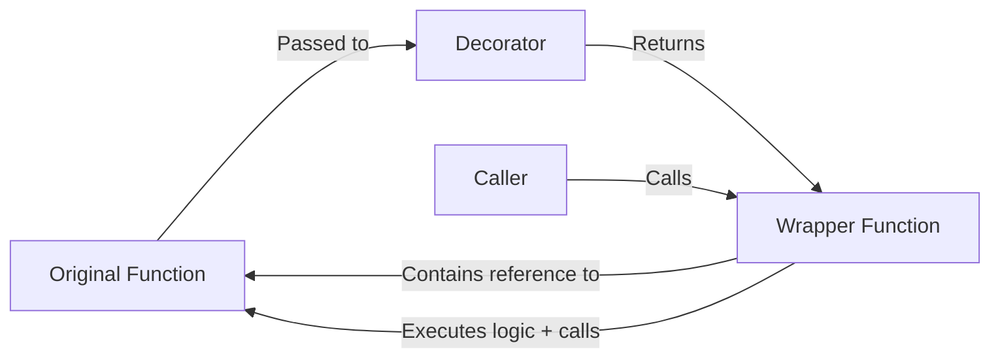

# Python Decorators

> [!summary]
> Decorators are a powerful Python feature that allows you to modify or extend the behavior of functions, methods, or classes without changing their source code. They provide a clean, readable syntax for wrapping functions with additional functionality like logging, authentication, caching, or timing—making code more modular and adhering to the DRY (Don't Repeat Yourself) principle.

## Theory

### What Are Decorators?

A decorator is a function that takes another function as an argument and returns a new function with enhanced functionality. The `@decorator` syntax, introduced in Python 2.4 via [PEP 318](https://peps.python.org/pep-0318/), is syntactic sugar for a function transformation.

**The following two definitions are semantically equivalent:**

```python
# Without decorator syntax
def my_function():
    pass
my_function = decorator(my_function)

# With decorator syntax
@decorator
def my_function():
    pass
```

**Common use cases:**
- **Logging** — Track function calls and arguments
- **Authentication/Authorization** — Check permissions before execution
- **Caching/Memoization** — Store results of expensive computations
- **Timing/Profiling** — Measure execution time
- **Rate limiting** — Control how often a function can be called
- **Retry logic** — Automatically retry failed operations

### How They Work

Decorators leverage Python's first-class functions—functions can be passed as arguments, returned from other functions, and assigned to variables. A decorator creates a **closure** that wraps the original function.



**Key concepts:**
1. **Higher-order functions** — Functions that take functions as arguments or return functions
2. **Closures** — Inner functions that capture variables from enclosing scope
3. **`*args, **kwargs`** — Allow wrappers to accept any arguments
4. **`functools.wraps`** — Preserves original function's metadata (name, docstring)

## Practical Examples

### Basic Usage

A simple logging decorator that tracks when functions are called:

```python
def log_call(func):
    """Decorator that logs function calls."""
    def wrapper(*args, **kwargs):
        print(f"Calling {func.__name__} with args={args}, kwargs={kwargs}")
        result = func(*args, **kwargs)
        print(f"{func.__name__} returned {result}")
        return result
    return wrapper

@log_call
def add(a, b):
    """Add two numbers."""
    return a + b

@log_call
def greet(name, greeting="Hello"):
    """Greet someone."""
    return f"{greeting}, {name}!"

# Usage
add(3, 5)
# Output:
# Calling add with args=(3, 5), kwargs={}
# add returned 8

greet("Alice", greeting="Hi")
# Output:
# Calling greet with args=('Alice',), kwargs={'greeting': 'Hi'}
# greet returned Hi, Alice!
```

### Intermediate Example

A decorator with arguments and proper metadata preservation using `functools.wraps`:

```python
import functools
import time

def retry(max_attempts=3, delay=1.0):
    """Decorator factory that retries a function on failure."""
    def decorator(func):
        @functools.wraps(func)  # Preserves __name__, __doc__, etc.
        def wrapper(*args, **kwargs):
            last_exception = None
            for attempt in range(1, max_attempts + 1):
                try:
                    return func(*args, **kwargs)
                except Exception as e:
                    last_exception = e
                    print(f"Attempt {attempt}/{max_attempts} failed: {e}")
                    if attempt < max_attempts:
                        time.sleep(delay)
            raise last_exception
        return wrapper
    return decorator

@retry(max_attempts=3, delay=0.5)
def fetch_data(url):
    """Fetch data from a URL (simulated with random failures)."""
    import random
    if random.random() < 0.7:  # 70% chance of failure
        raise ConnectionError("Network timeout")
    return {"status": "success", "url": url}

# The decorated function preserves its metadata
print(fetch_data.__name__)  # "fetch_data" (not "wrapper")
print(fetch_data.__doc__)   # "Fetch data from a URL..."

# Usage
try:
    result = fetch_data("https://api.example.com/data")
    print(result)
except ConnectionError as e:
    print(f"All retries failed: {e}")
```

### Advanced Usage

Creating a decorator that works on both functions and methods, with optional arguments:

```python
import functools
import time
from typing import Callable, TypeVar, Any

T = TypeVar('T', bound=Callable[..., Any])

def memoize(_func: T | None = None, *, maxsize: int = 128, ttl: float | None = None) -> T | Callable[[T], T]:
    """
    Memoization decorator with optional max cache size and TTL.

    Can be used with or without arguments:
        @memoize
        def func(): ...

        @memoize(maxsize=256, ttl=60.0)
        def func(): ...
    """
    def decorator(func: T) -> T:
        cache: dict[tuple, tuple[Any, float]] = {}
        hits = misses = 0

        @functools.wraps(func)
        def wrapper(*args, **kwargs):
            nonlocal hits, misses

            # Create hashable cache key
            key = (args, tuple(sorted(kwargs.items())))
            current_time = time.time()

            # Check cache
            if key in cache:
                value, timestamp = cache[key]
                if ttl is None or (current_time - timestamp) < ttl:
                    hits += 1
                    return value
                else:
                    del cache[key]  # TTL expired

            # Cache miss - compute value
            misses += 1
            result = func(*args, **kwargs)

            # Evict oldest entry if at capacity
            if len(cache) >= maxsize:
                oldest_key = next(iter(cache))
                del cache[oldest_key]

            cache[key] = (result, current_time)
            return result

        # Add cache inspection methods
        wrapper.cache_info = lambda: {"hits": hits, "misses": misses, "size": len(cache)}
        wrapper.cache_clear = lambda: cache.clear()

        return wrapper  # type: ignore

    # Handle both @memoize and @memoize(...) syntax
    if _func is not None:
        return decorator(_func)
    return decorator

@memoize(maxsize=100, ttl=30.0)
def expensive_computation(n: int) -> int:
    """Compute fibonacci number (intentionally slow)."""
    if n < 2:
        return n
    return expensive_computation(n - 1) + expensive_computation(n - 2)

# Usage
print(expensive_computation(30))  # First call: computed
print(expensive_computation(30))  # Second call: cached
print(expensive_computation.cache_info())  # {'hits': 28, 'misses': 31, 'size': 31}
```

## Class Decorators

Decorators can also be applied to classes and can be implemented as classes themselves:

```python
import functools
from typing import Callable, Any

class CountCalls:
    """Class-based decorator that counts function calls."""

    def __init__(self, func: Callable):
        functools.update_wrapper(self, func)
        self.func = func
        self.count = 0

    def __call__(self, *args, **kwargs) -> Any:
        self.count += 1
        return self.func(*args, **kwargs)

    def reset(self) -> None:
        self.count = 0

@CountCalls
def say_hello(name: str) -> str:
    return f"Hello, {name}!"

say_hello("Alice")
say_hello("Bob")
print(f"Called {say_hello.count} times")  # Called 2 times
say_hello.reset()


# Decorator that modifies a class
def singleton(cls):
    """Class decorator that ensures only one instance exists."""
    instances = {}

    @functools.wraps(cls)
    def get_instance(*args, **kwargs):
        if cls not in instances:
            instances[cls] = cls(*args, **kwargs)
        return instances[cls]

    return get_instance

@singleton
class DatabaseConnection:
    def __init__(self, host: str = "localhost"):
        self.host = host
        print(f"Connecting to {host}...")

# Both variables reference the same instance
db1 = DatabaseConnection("server1")  # Prints "Connecting to server1..."
db2 = DatabaseConnection("server2")  # No output - returns existing instance
print(db1 is db2)  # True
```

## Common Patterns

> [!tip] Best Practice: Always Use `functools.wraps`
> Without `@functools.wraps`, decorated functions lose their `__name__`, `__doc__`, and other metadata. This breaks introspection, help(), and debugging tools. Always apply it to your wrapper function.

```python
import functools

def my_decorator(func):
    @functools.wraps(func)  # Always include this!
    def wrapper(*args, **kwargs):
        return func(*args, **kwargs)
    return wrapper
```

> [!tip] Best Practice: Support Both `@decorator` and `@decorator()` Syntax
> When creating decorators with optional arguments, handle both cases so users can omit parentheses when using defaults.

> [!warning] Common Mistake: Forgetting to Call the Original Function
> A common bug is forgetting to actually call `func(*args, **kwargs)` inside the wrapper, or forgetting to return its result.

```python
# WRONG - forgets to call the original function
def broken_decorator(func):
    def wrapper(*args, **kwargs):
        print("Before")
        # Missing: func(*args, **kwargs)
        print("After")
    return wrapper

# WRONG - forgets to return the result
def also_broken(func):
    def wrapper(*args, **kwargs):
        print("Before")
        func(*args, **kwargs)  # Result is lost!
        print("After")
    return wrapper

# CORRECT
def working_decorator(func):
    def wrapper(*args, **kwargs):
        print("Before")
        result = func(*args, **kwargs)
        print("After")
        return result
    return wrapper
```

> [!warning] Common Mistake: Decorator Without Wrapper for Parameterized Decorators
> When creating a decorator with arguments, you need three levels of nesting: outer function (takes arguments), decorator function (takes the function), and wrapper function (takes call arguments).

## Edge Cases & Gotchas

- **Decorating methods** — When decorating class methods, `self` is the first positional argument in `*args`. Use `functools.wraps` to handle method binding correctly.

- **Stacking decorators** — Multiple decorators are applied bottom-up, but execute top-down:
  ```python
  @decorator_a  # Applied second, executes first
  @decorator_b  # Applied first, executes second
  def func(): ...
  # Equivalent to: decorator_a(decorator_b(func))
  ```

- **Decorating async functions** — For `async def` functions, your wrapper must also be async:
  ```python
  def async_decorator(func):
      @functools.wraps(func)
      async def wrapper(*args, **kwargs):
          print("Before")
          result = await func(*args, **kwargs)
          print("After")
          return result
      return wrapper
  ```

- **Preserving type hints** — Use `typing.ParamSpec` and `typing.TypeVar` (Python 3.10+) for proper type inference with decorated functions.

- **Class method decorators** — `@staticmethod` and `@classmethod` must be the outermost decorator when combined with others.

- **Debugging decorated functions** — Even with `@functools.wraps`, stack traces show the wrapper. Use `@functools.wraps` combined with `__wrapped__` attribute to access the original.

## Built-in Decorators

Python includes several built-in decorators in the standard library:

| Decorator | Module | Purpose |
|-----------|--------|---------|
| `@property` | built-in | Create managed attributes with getter/setter/deleter |
| `@staticmethod` | built-in | Define methods that don't receive `self` |
| `@classmethod` | built-in | Define methods that receive `cls` instead of `self` |
| `@functools.wraps` | functools | Preserve function metadata in decorators |
| `@functools.lru_cache` | functools | Memoization with LRU eviction |
| `@functools.cache` | functools | Simple unbounded memoization (Python 3.9+) |
| `@functools.cached_property` | functools | Cached property that computes once (Python 3.8+) |
| `@dataclasses.dataclass` | dataclasses | Auto-generate `__init__`, `__repr__`, etc. |
| `@contextlib.contextmanager` | contextlib | Create context managers from generators |
| `@typing.overload` | typing | Declare overloaded function signatures |
| `@abc.abstractmethod` | abc | Mark methods as abstract in ABCs |

## Related Topics

- [[Closures]] — The underlying mechanism that makes decorators work
- [[Higher-Order-Functions]] — Functions that operate on other functions
- [[Context-Managers]] — Often implemented using `@contextmanager` decorator
- [[Metaclasses]] — Class-level metaprogramming (more powerful but complex)
- [[Descriptors]] — The protocol behind `@property` and similar decorators
- [[Functools]] — Standard library module with decorator utilities

## References

- [Python Glossary: Decorator](https://docs.python.org/3/glossary.html#term-decorator)
- [PEP 318 - Decorators for Functions and Methods](https://peps.python.org/pep-0318/)
- [Real Python: Primer on Python Decorators](https://realpython.com/primer-on-python-decorators/)
- [functools Documentation](https://docs.python.org/3/library/functools.html)
