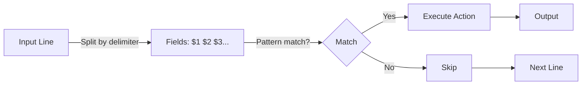

# AWK

> [!summary]
> AWK is a powerful text processing language that operates on columns/fields. It excels at extracting, transforming, and reporting on structured text data. Think of it as a mini programming language optimized for processing line-oriented data where each line contains fields separated by whitespace or a delimiter.

## Theory

### What Is AWK?

AWK processes text line by line, automatically splitting each line into fields. It was created at Bell Labs in 1977 (named after authors Aho, Weinberger, and Kernighan) and remains one of the most useful Unix tools for data extraction and reporting.

**The basic model:**
1. Read a line
2. Split into fields (`$1`, `$2`, `$3`, ...)
3. Execute actions on matching lines
4. Repeat for all lines



### Core Built-in Variables

| Variable        | Meaning                               |
| --------------- | ------------------------------------- |
| `$0`            | Entire current line                   |
| `$1, $2, $3...` | Individual fields (columns)           |
| `NF`            | Number of Fields in current line      |
| `NR`            | Current line Number (Record number)   |
| `FS`            | Field Separator (default: whitespace) |
| `OFS`           | Output Field Separator                |
| `RS`            | Record Separator (default: newline)   |

## Practical Examples

### Basic Field Extraction

```bash
# Print first column
awk '{print $1}' file

# Print first and third column
awk '{print $1, $3}' file

# Print last column
awk '{print $NF}' file

# Print second-to-last column
awk '{print $(NF-1)}' file

# Print line number and first column
awk '{print NR": "$1}' file
```

### Custom Field Separators

```bash
# Colon-separated (e.g., /etc/passwd)
awk -F':' '{print $1}' /etc/passwd

# Tab-separated
awk -F'\t' '{print $1}' file

# Multiple separators
awk -F'[,:]' '{print $1}' file

# Set in BEGIN block
awk 'BEGIN {FS=":"} {print $1}' /etc/passwd
```

### Filtering Lines

```bash
# Lines where column 3 > 100
awk '$3 > 100' file

# Lines containing "error"
awk '/error/' file

# Lines where column 1 equals "admin"
awk '$1 == "admin"' file

# Lines NOT matching pattern
awk '!/error/' file

# Combine filter + action
awk '$1 == "GET" {print $2}' access.log
```

### Math and Aggregation

```bash
# Sum column 3
awk '{sum += $3} END {print sum}' file

# Average of column 3
awk '{sum += $3; count++} END {print sum/count}' file

# Count lines
awk 'END {print NR}' file

# Min/max
awk 'NR==1 || $3 > max {max=$3} END {print max}' file
```

### String Functions

```bash
# Uppercase
awk '{print toupper($1)}' file

# Lowercase
awk '{print tolower($1)}' file

# Length of field
awk '{print length($1)}' file

# Substring (start, length)
awk '{print substr($1, 1, 3)}' file

# Split into array
awk '{split($1, arr, "-"); print arr[1]}' file
```

### BEGIN and END Blocks

```bash
# Header and footer
awk 'BEGIN {print "=== START ==="} {print} END {print "=== END ==="}' file

# Initialize variables and separators
awk 'BEGIN {FS=":"; OFS="\t"} {print $1, $3}' /etc/passwd

# Summary report
awk 'BEGIN {print "User Report"} {users++} END {print "Total:", users}' /etc/passwd
```

### Formatted Output

```bash
# Custom separator in output
awk '{print $1":"$2}' file

# Printf for formatted output
awk '{printf "%-20s %10d\n", $1, $2}' file

# Add text
awk '{print "User: "$1}' file
```

## Real-World Examples

```bash
# Get PIDs from ps
ps aux | awk '{print $2}'

# Get pod names from kubectl (skip header)
kubectl get pods | awk 'NR>1 {print $1}'

# Parse nginx logs - count IPs
awk '{print $1}' /var/log/nginx/access.log | sort | uniq -c | sort -rn

# Sum file sizes from ls -l
ls -l | awk '{sum += $5} END {print sum}'

# Extract field from key=value
echo "name=john" | awk -F'=' '{print $2}'

# Memory usage from free
free -m | awk '/Mem:/ {printf "%.1f%%\n", $3/$2*100}'

# Disk usage warnings
df -h | awk '$5+0 > 80 {print $1" is "$5" full"}'

# CSV to TSV
awk -F',' '{$1=$1; print}' OFS='\t' file.csv
```

## Quick Reference

| Pattern | Meaning |
|---------|---------|
| `$1` | First column |
| `$NF` | Last column |
| `NR` | Line number |
| `NF` | Number of fields |
| `-F':'` | Set delimiter |
| `/pattern/` | Match regex |
| `$1 == "x"` | Exact match |
| `$1 ~ /x/` | Regex match field |
| `BEGIN {}` | Run before processing |
| `END {}` | Run after processing |
| `{print}` | Print current line |
| `{print $0}` | Same as above |

> [!tip]
> AWK is often combined with other tools: `grep` to filter lines first, `sort` to order output, and `uniq` to remove duplicates. The combination `| awk '{print $N}' | sort | uniq -c | sort -rn` is extremely common for frequency analysis.
