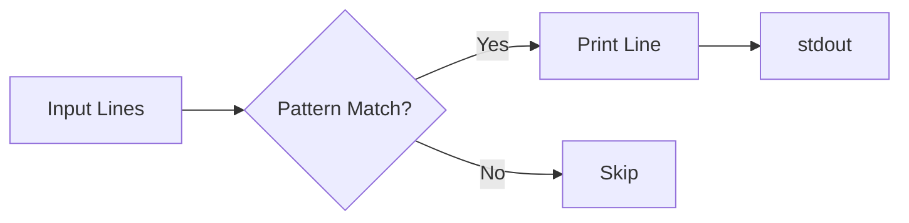

# grep

> [!summary]
> grep (Global Regular Expression Print) searches for patterns in text and prints matching lines. It's the most fundamental Unix search tool—essential for finding needles in haystacks of logs, code, and configuration files. Mastering grep is non-negotiable for effective command-line work.

## Theory

### What Is grep?

grep scans input line by line, testing each against a pattern. Lines that match are printed to stdout. The name comes from the ed editor command `g/re/p` (global / regular expression / print).



**Variants:**
- `grep` — Basic regex
- `egrep` / `grep -E` — Extended regex (more features)
- `fgrep` / `grep -F` — Fixed strings (no regex, faster)
- `rg` (ripgrep) — Modern, faster alternative

### Essential Flags

| Flag | Meaning |
|------|---------|
| `-i` | Case **i**nsensitive |
| `-v` | In**v**ert match (lines NOT matching) |
| `-r` | **R**ecursive (search directories) |
| `-n` | Show line **n**umbers |
| `-c` | **C**ount matches only |
| `-l` | **L**ist filenames only |
| `-o` | **O**nly print matched part |
| `-E` | **E**xtended regex |
| `-w` | **W**hole word match |
| `-A N` | Show N lines **A**fter match |
| `-B N` | Show N lines **B**efore match |
| `-C N` | Show N lines **C**ontext (before+after) |

## Practical Examples

### Basic Searching

```bash
# Simple string search
grep 'error' logfile

# Case insensitive
grep -i 'error' logfile

# Show line numbers
grep -n 'error' logfile

# Whole word only (not "errors" or "error123")
grep -w 'error' logfile
```

### Multiple Patterns

```bash
# OR - match either pattern
grep -E 'error|warning' logfile

# AND - match both (chain greps)
grep 'error' logfile | grep 'critical'

# Match multiple patterns from file
grep -f patterns.txt logfile
```

### Inverting and Excluding

```bash
# Lines WITHOUT "debug"
grep -v 'debug' logfile

# Exclude multiple patterns
grep -v -E 'debug|info|trace' logfile

# Exclude grep itself from ps
ps aux | grep [n]ginx
ps aux | grep nginx | grep -v grep
```

### Recursive Search

```bash
# Search all files in directory
grep -r 'TODO' ./src

# With line numbers
grep -rn 'TODO' ./src

# Only certain file types
grep -r --include='*.py' 'import' ./src
grep -r --include='*.{js,ts}' 'function' ./src

# Exclude directories
grep -r --exclude-dir=node_modules 'require' .
grep -r --exclude-dir={node_modules,.git,dist} 'TODO' .
```

### Context Lines

```bash
# 3 lines after match
grep -A 3 'Exception' logfile

# 3 lines before match
grep -B 3 'Exception' logfile

# 3 lines before and after
grep -C 3 'Exception' logfile
```

### Regex Patterns

```bash
# Start of line
grep '^error' logfile

# End of line
grep 'error$' logfile

# Any single character
grep 'err.r' logfile

# Character class
grep '[0-9]' logfile
grep '[a-zA-Z]' logfile

# Zero or more (extended)
grep -E 'err.*or' logfile

# One or more (extended)
grep -E 'er+or' logfile

# Optional (extended)
grep -E 'colou?r' logfile

# Word boundary
grep '\berror\b' logfile
```

### Extracting Matches

```bash
# Only print the matched text
grep -o 'error[0-9]*' logfile

# Extract IP addresses
grep -oE '[0-9]+\.[0-9]+\.[0-9]+\.[0-9]+' logfile

# Extract emails
grep -oE '[a-zA-Z0-9._%+-]+@[a-zA-Z0-9.-]+\.[a-zA-Z]{2,}' file

# Extract URLs
grep -oE 'https?://[^ ]+' file
```

### Counting and Listing

```bash
# Count matches per file
grep -c 'error' *.log

# Only show filenames with matches
grep -l 'error' *.log

# Only show filenames WITHOUT matches
grep -L 'error' *.log

# Total count across files
grep -r 'TODO' ./src | wc -l
```

## Real-World Examples

```bash
# Find process
ps aux | grep nginx

# Search logs for errors in last hour
grep "$(date '+%H:')" /var/log/syslog | grep -i error

# Find files containing string
grep -rl 'database_url' ./config

# Find TODOs with context
grep -rn -B2 -A2 'TODO' ./src

# Check if pattern exists (silent, use exit code)
grep -q 'error' logfile && echo "Found errors"
if grep -q 'pattern' file; then
    echo "Found"
fi

# Search compressed files
zgrep 'error' logfile.gz

# Find function definitions
grep -E '^(def |function |const .* = \(|class )' *.py *.js

# Count HTTP methods in access log
grep -oE '^[A-Z]+' access.log | sort | uniq -c

# Find config values
grep -E '^[^#]*=' config.ini
```

## grep vs ripgrep (rg)

ripgrep is a modern alternative that's faster and has better defaults:

```bash
# Respects .gitignore by default
rg 'pattern'

# Type filters built in
rg -t py 'import'
rg -t js 'function'

# Smart case (case-insensitive if pattern is lowercase)
rg -S 'pattern'
```

> [!tip]
> Consider installing ripgrep (`rg`) for everyday use—it's significantly faster on large codebases and has sensible defaults. Use grep when you need POSIX compatibility or specific grep features.

## Quick Reference

```bash
grep -i      # case insensitive
grep -v      # invert (NOT matching)
grep -r      # recursive
grep -n      # line numbers
grep -l      # filenames only
grep -c      # count
grep -o      # only matched part
grep -E      # extended regex
grep -w      # whole word
grep -A/B/C  # context lines
grep -q      # quiet (exit code only)
```
