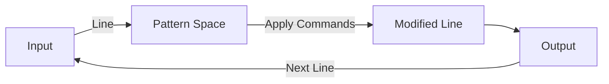

# sed

> [!summary]
> sed (Stream EDitor) is a non-interactive text editor that transforms text line by line. Its primary superpower is find-and-replace operations, but it can also delete lines, insert text, and perform complex transformations. sed is essential for automated text manipulation in scripts and pipelines.

## Theory

### What Is sed?

sed reads input line by line, applies editing commands, and outputs the result. Unlike interactive editors (vim, nano), sed is designed for automated, scriptable text transformations.

**Basic model:**
1. Read line into pattern space
2. Apply commands
3. Output pattern space
4. Repeat



### Command Structure

```bash
sed 'address command' file
sed 's/find/replace/flags' file
```

- **Address**: Which lines to operate on (optional)
- **Command**: What to do (`s` substitute, `d` delete, `p` print, etc.)
- **Flags**: Modifiers (`g` global, `i` case-insensitive, etc.)

## Practical Examples

### Substitute (The Most Common Operation)

```bash
# Replace first occurrence per line
sed 's/old/new/' file

# Replace ALL occurrences per line (global)
sed 's/old/new/g' file

# Case insensitive
sed 's/old/new/gi' file

# Replace Nth occurrence only
sed 's/old/new/2' file

# Only print lines where substitution happened
sed -n 's/old/new/p' file
```

### Edit Files In-Place

```bash
# Modify file directly (CAREFUL!)
sed -i 's/old/new/g' file

# Backup original before editing
sed -i.bak 's/old/new/g' file
# Creates file.bak with original content
```

### Delete Lines

```bash
# Delete line 5
sed '5d' file

# Delete lines 5-10
sed '5,10d' file

# Delete last line
sed '$d' file

# Delete lines matching pattern
sed '/pattern/d' file

# Delete empty lines
sed '/^$/d' file

# Delete lines starting with #
sed '/^#/d' file

# Delete lines NOT matching pattern
sed '/pattern/!d' file
```

### Print Specific Lines

```bash
# Print only line 5 (-n suppresses default output)
sed -n '5p' file

# Print lines 5-10
sed -n '5,10p' file

# Print lines matching pattern
sed -n '/error/p' file

# Print first line (like head -1)
sed -n '1p' file

# Print last line (like tail -1)
sed -n '$p' file
```

### Line Addressing

```bash
# Specific line
sed '5s/old/new/' file

# Range of lines
sed '5,10s/old/new/' file

# From line 5 to end
sed '5,$s/old/new/' file

# Lines matching pattern
sed '/error/s/old/new/' file

# Between two patterns
sed '/START/,/END/s/old/new/' file

# Every 2nd line starting from line 1
sed '1~2s/old/new/' file
```

### Add and Insert Text

```bash
# Add prefix to every line
sed 's/^/PREFIX: /' file

# Add suffix to every line
sed 's/$/ SUFFIX/' file

# Insert line BEFORE pattern
sed '/pattern/i\New line before' file

# Insert line AFTER pattern
sed '/pattern/a\New line after' file

# Insert at line number
sed '5i\New line at position 5' file
```

### Remove and Trim

```bash
# Remove leading whitespace
sed 's/^[ \t]*//' file

# Remove trailing whitespace
sed 's/[ \t]*$//' file

# Remove both (trim)
sed 's/^[ \t]*//;s/[ \t]*$//' file

# Remove blank lines
sed '/^$/d' file

# Remove comment lines
sed '/^#/d' file

# Remove inline comments
sed 's/#.*//' file
```

### Multiple Operations

```bash
# Chain with semicolon
sed 's/foo/bar/; s/baz/qux/' file

# Or use -e for each
sed -e 's/foo/bar/' -e 's/baz/qux/' file

# From a script file
sed -f commands.sed file
```

### Regex and Capture Groups

```bash
# Capture groups with \( \) and reference with \1, \2
sed 's/\(.*\):\(.*\)/\2:\1/' file
# Swaps "a:b" to "b:a"

# Extended regex (-E) for cleaner syntax
sed -E 's/(foo|bar)/baz/g' file

# Capture and reuse
sed -E 's/([0-9]+)/[\1]/g' file
# "test123" becomes "test[123]"
```

### Delimiter Tricks

When pattern contains `/`, use a different delimiter:

```bash
# Instead of escaping slashes
sed 's/\/path\/to\/old/\/path\/to\/new/'

# Use different delimiter (any character works)
sed 's|/path/to/old|/path/to/new|'
sed 's#/path/to/old#/path/to/new#'
sed 's@/path/to/old@/path/to/new@'
```

## Real-World Examples

```bash
# Change config value
sed -i 's/^port=.*/port=9090/' config.ini

# Comment out a line
sed -i 's/^dangerous_option/#dangerous_option/' config

# Uncomment a line
sed -i 's/^#option/option/' config

# Replace in all files
find . -name "*.txt" -exec sed -i 's/old/new/g' {} \;

# Convert DOS line endings to Unix
sed -i 's/\r$//' file

# Remove HTML tags
sed 's/<[^>]*>//g' file.html

# Extract text between delimiters
sed -n 's/.*START\(.*\)END.*/\1/p' file

# Number lines
sed = file | sed 'N;s/\n/\t/'

# Get line N (like awk alternative)
sed -n '5p' file

# Delete everything after pattern (inclusive)
sed '/STOP/q' file

# Double-space a file
sed 'G' file

# Remove duplicate blank lines
sed '/^$/N;/^\n$/d' file
```

## Quick Reference

| Command | Meaning |
|---------|---------|
| `s/old/new/` | Substitute first |
| `s/old/new/g` | Substitute all |
| `s/old/new/i` | Case insensitive |
| `s/old/new/p` | Print if substituted |
| `-i` | Edit in place |
| `-n` | Suppress default output |
| `p` | Print |
| `d` | Delete |
| `i\text` | Insert before |
| `a\text` | Append after |
| `5` | Line 5 |
| `5,10` | Lines 5-10 |
| `$` | Last line |
| `/pat/` | Lines matching pattern |
| `^` | Start of line |
| `$` | End of line |
| `\1` | First capture group |
| `-E` | Extended regex |

> [!warning]
> Always test sed commands without `-i` first! Run `sed 's/old/new/g' file` to preview changes before `sed -i 's/old/new/g' file` to apply them. Or use `-i.bak` to keep a backup.
