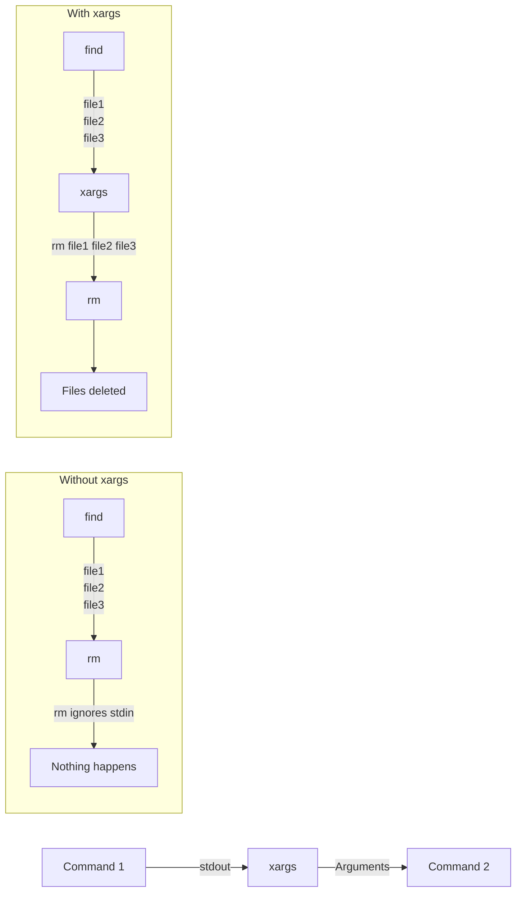

# xargs

> [!summary]
> xargs builds and executes commands from standard input. It bridges a fundamental gap: many commands don't read from stdin, but xargs converts stdin into command-line arguments. This enables powerful pipelines where the output of one command becomes the arguments to another.

## Theory

### Why xargs Exists

Some commands accept stdin (grep, awk, sed), but many don't (rm, cp, mv, mkdir). xargs solves this:

```bash
# This DOESN'T work (rm doesn't read stdin)
find . -name "*.tmp" | rm

# This WORKS
find . -name "*.tmp" | xargs rm
```



### How It Works

xargs reads whitespace-separated items from stdin and appends them as arguments to a command:

```bash
echo "a b c" | xargs touch
# Executes: touch a b c

echo -e "a\nb\nc" | xargs rm
# Executes: rm a b c
```

### Essential Flags

| Flag | Meaning |
|------|---------|
| `-I {}` | Placeholder—put input where `{}` appears |
| `-n N` | Max N arguments per command execution |
| `-P N` | Run N processes in parallel |
| `-0` | Input is null-separated (handles spaces in names) |
| `-p` | Prompt before each execution |
| `-t` | Print command before executing (trace) |
| `-r` | Don't run if input is empty |

## Practical Examples

### Basic Usage

```bash
# Delete files found by find
find . -name "*.log" | xargs rm
# Executes: rm file1.log file2.log file3.log ...

# Create directories from list
cat dirs.txt | xargs mkdir -p

# Touch multiple files
echo "a b c" | xargs touch
```

### Using Placeholders (-I)

The `-I` flag lets you control where input goes:

```bash
# -I {} means "put each item where {} appears"
echo "world" | xargs -I {} echo "hello {}"
# Output: hello world

# Rename files (add .bak extension)
ls *.txt | xargs -I {} mv {} {}.bak

# Copy files to directory
find . -name "*.conf" | xargs -I {} cp {} /backup/

# More complex placement
cat hosts.txt | xargs -I {} ssh {} "uptime"
```

### Handling Spaces in Filenames

Filenames with spaces break default xargs. Use null-separation:

```bash
# -print0 outputs null-separated, -0 reads null-separated
find . -name "*.mp3" -print0 | xargs -0 rm

# Or quote with -I
find . -name "*.mp3" | xargs -I {} rm "{}"
```

### Limiting Arguments (-n)

Control how many arguments per command execution:

```bash
# One file at a time
cat urls.txt | xargs -n 1 curl

# Three at a time
find . -name "*.tmp" | xargs -n 3 rm
# Runs: rm a.tmp b.tmp c.tmp
# Then: rm d.tmp e.tmp f.tmp
# ...
```

### Parallel Execution (-P)

Run multiple processes simultaneously:

```bash
# 4 parallel processes
find . -name "*.jpg" | xargs -P 4 -I {} convert {} {}.png

# Download 10 URLs in parallel
cat urls.txt | xargs -P 10 -n 1 wget

# Parallel with placeholder
cat servers.txt | xargs -P 5 -I {} ssh {} "apt update"
```

### Confirmation and Debugging

```bash
# Ask before each command (-p)
find . -name "*.bak" | xargs -p rm
# Prompts: rm file1.bak file2.bak ?...

# Show command before running (-t)
find . -name "*.bak" | xargs -t rm
# Prints: rm file1.bak file2.bak
# Then executes it

# Don't run if empty (-r)
echo "" | xargs -r rm  # Does nothing
```

## Real-World Examples

### File Operations

```bash
# Delete all node_modules directories
find . -name "node_modules" -type d | xargs rm -rf

# Change permissions on shell scripts
find . -name "*.sh" | xargs chmod +x

# Grep in found files
find . -name "*.py" | xargs grep "import os"

# Count lines in all source files
find . -name "*.js" | xargs wc -l
```

### Git Operations

```bash
# Add all modified files
git status --short | awk '{print $2}' | xargs git add

# Delete merged branches
git branch --merged | grep -v main | xargs git branch -d

# Checkout files from another branch
echo "file1 file2 file3" | xargs git checkout other-branch --
```

### Process Management

```bash
# Kill processes by name
pgrep -f "python script" | xargs kill

# Kill with signal
pgrep zombie | xargs kill -9

# Kill all matching processes
ps aux | grep '[p]ython' | awk '{print $2}' | xargs kill
```

### Docker Operations

```bash
# Remove stopped containers
docker ps -aq --filter status=exited | xargs docker rm

# Remove dangling images
docker images -q --filter dangling=true | xargs docker rmi

# Stop all running containers
docker ps -q | xargs docker stop
```

### Kubernetes Operations

```bash
# Delete pods in CrashLoopBackOff
kubectl get pods | grep CrashLoopBackOff | awk '{print $1}' | xargs kubectl delete pod

# Restart all deployments
kubectl get deploy -o name | xargs -n 1 kubectl rollout restart

# Describe all failing pods
kubectl get pods --field-selector=status.phase=Failed -o name | xargs kubectl describe
```

### Batch Processing

```bash
# Run command on each server
cat servers.txt | xargs -I {} ssh {} "df -h"

# Compress multiple files
find . -name "*.log" | xargs -I {} gzip {}

# Convert images
find . -name "*.png" | xargs -P 4 -I {} convert {} -resize 50% small-{}
```

## xargs vs find -exec

Both accomplish similar goals with `find`:

```bash
# -exec: runs command once PER FILE (slower)
find . -name "*.log" -exec rm {} \;

# xargs: batches files into fewer commands (faster)
find . -name "*.log" | xargs rm

# -exec with +: batches like xargs
find . -name "*.log" -exec rm {} +
```

> [!tip]
> For large file lists, xargs is typically faster because it batches arguments. Use `find -exec {} +` for similar performance without piping.

## The Power Pattern

The universal pattern for "find stuff, do something with it":

```bash
find . -name "pattern" -print0 | xargs -0 -I {} command {}
```

- `find` locates files
- `-print0` null-separates (handles spaces)
- `xargs -0` reads null-separated input
- `-I {}` places each item where needed
- `command {}` does the work

## Quick Reference

```bash
# Basic
cmd | xargs other_cmd

# Placeholder
cmd | xargs -I {} other_cmd {} more_args

# Handle spaces in filenames
find -print0 | xargs -0 cmd

# Limit arguments per execution
cmd | xargs -n 1 other_cmd

# Parallel execution
cmd | xargs -P 4 other_cmd

# Confirm before running
cmd | xargs -p other_cmd

# Show commands (trace)
cmd | xargs -t other_cmd

# Skip if empty
cmd | xargs -r other_cmd
```
